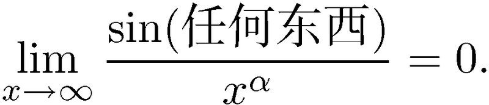
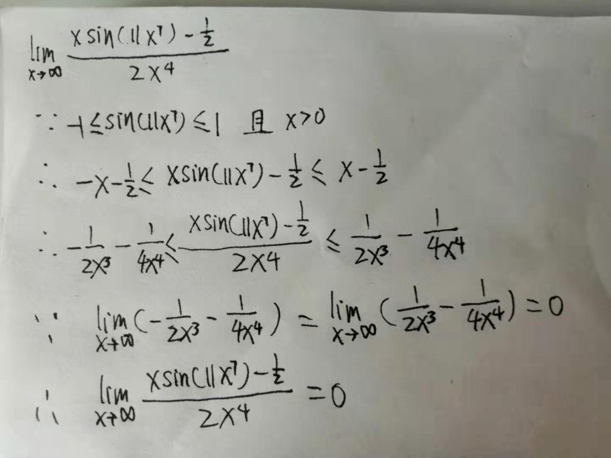

# 三角函数的极限

## 小数的情况
### 几个推导极限时用到的结论
1. $\lim\limits_{x\rightarrow\\0}\frac{sin(x)}{x}=1$。这个可以想象出来，因为在0哪里正好是两条相反弧线的交界。
2. 由第一条可以推导出：$\lim\limits_{x\rightarrow\\0}\frac{tan(x)}{x}=1$。从图像其实也可以看出来，同上。
3. $cos$的情况，$\lim\limits_{x\rightarrow\\0}\frac{cos(x)}{x}$，0两侧的极限分别是正无穷和负无穷，所以在0处极限不存在。
4. $\lim\limits_{x\rightarrow\\0}\frac{1-cos(x)}{x}=0$

### 说当 $x$ 非常小时, $sin(x)$ 表现得就像 $x$, 这只有在乘积或商的语境中才成立
1. $\lim\limits_{x\rightarrow\\0}\frac{1-sin(x)}{x^3}$，不能说 $x-sin(x)$ 表现得像0.
2. 因为虽然 $x$ 和 $sin(x)$ 都是趋向于0，但因为是动态趋向于0，所以它们趋向于0的速度可能不一样，所以它们的差值并不一定也是趋于0.
3. 事实上, 除了常数函数 0 本身, 没有函数表现得像 0！
4. 为了求解以上极限, 需要洛必达法则或麦克劳林级数。
5. 再看这个 $\lim\limits_{x\rightarrow\\0}\frac{1-cos^2(x)}{x^2}$
6. 如果没有分母，那可以说极限是0。因为单纯看分子，极限确实是趋于0的。
7. 但是因为分母也是同步趋于0的，那么分子分母趋于0的速度暂时是不知道的，所以不能断定它们的比值是什么。
8. 当然这个例子是很容易求解的，因为分子可以转换为 $sin^2(x)$

## 大数的情况
### 一个结论
对于任意的正指数 α，

#### 例1
1. 求解 $\lim\limits_{x\rightarrow\\∞}\frac{sin(x)}{x}$。
2. 因为 $-1 \leqslant sin(x) \leqslant 1$ 且 $x>0$，所以 $\frac{-1}{x} \leqslant \frac{sin(x)}{x} \leqslant \frac{1}{x}$ 
3. 根据夹逼法则，可以证得。

#### 例2

可以看到，这种有明确范围的情况，很适合使用夹逼法则

## $\lim\limits_{x\rightarrow\\0}\frac{sin(x)}{x}=1$ 的证明
TODO

## References
* [《普林斯顿微积分读本 (修订版)》](https://book.douban.com/subject/26899701/) 第7章