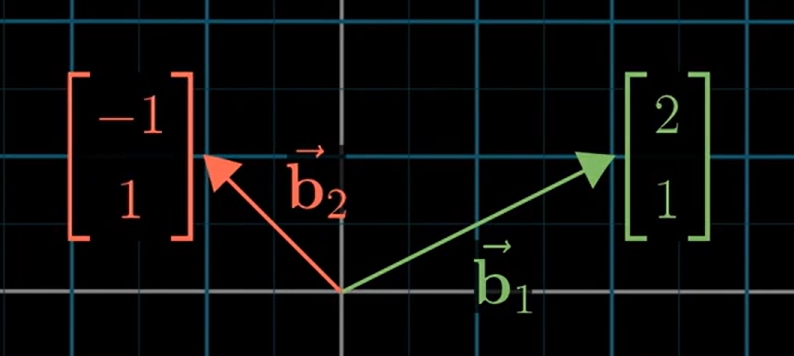
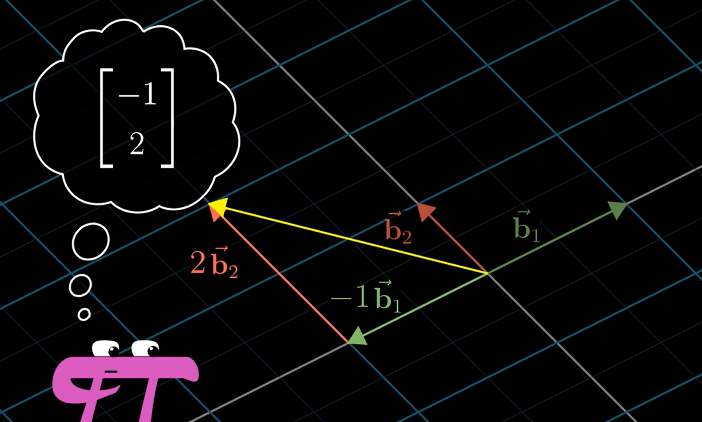
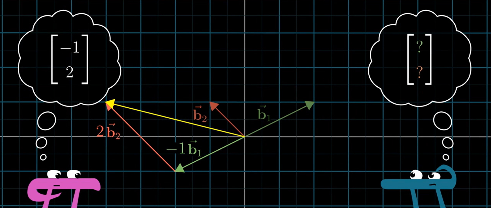
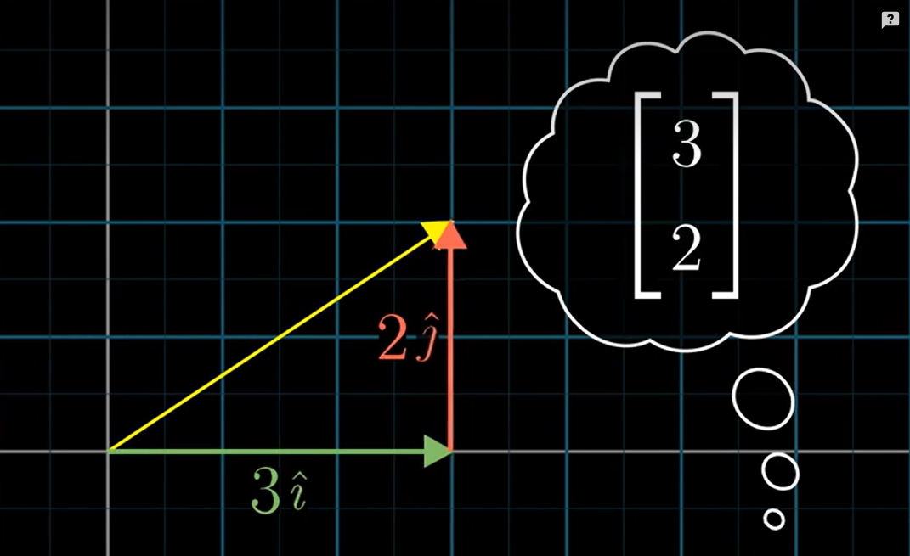
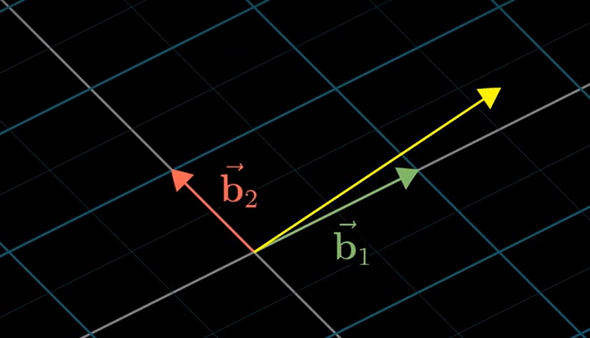
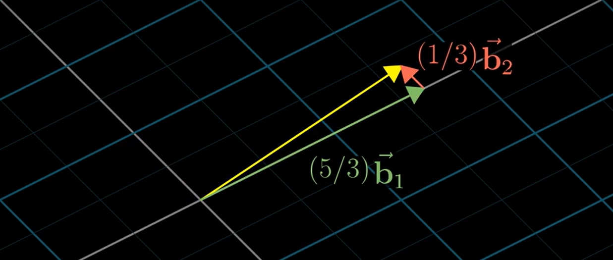
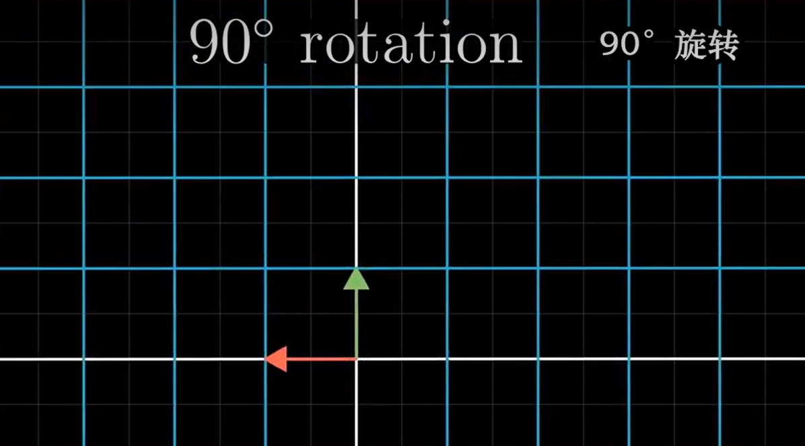
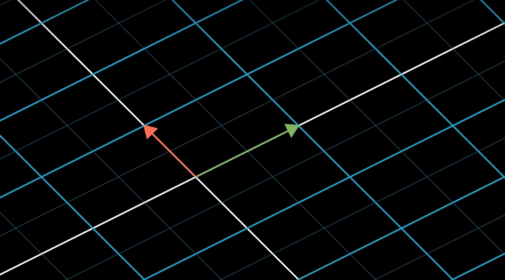
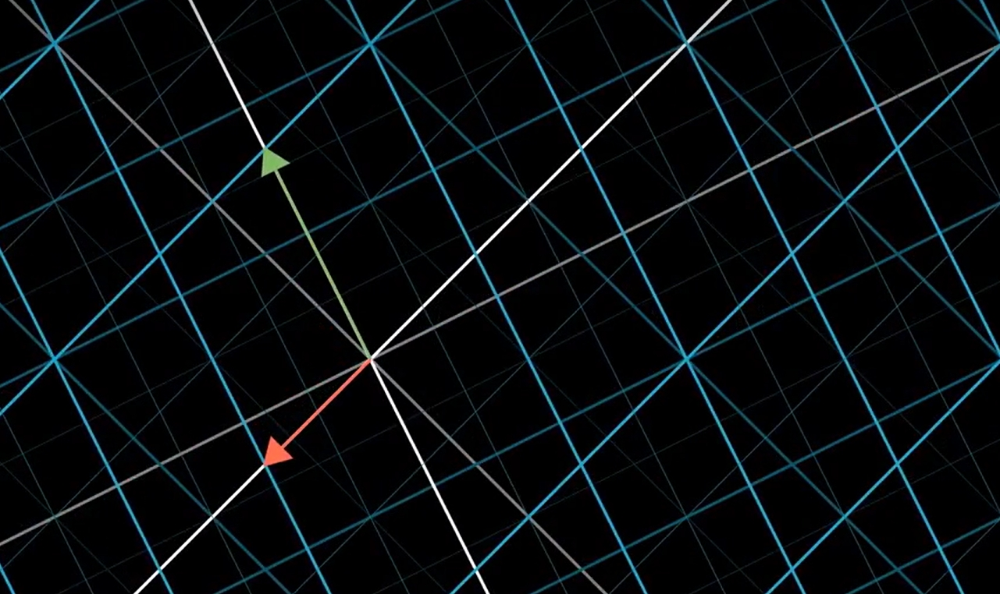

# Change of basis

## 用当前坐标系的基向量表示其他坐标系的向量
1. 因为不管在哪个坐标系中，向量的本质都是标量系数乘以基向量。所以我们真正需要转换的其实只是基向量。
2. 所以这里我们只需要用当前坐标系的基向量表示其他坐标系的基向量，然后再用转换后的基向量乘以系数即可。
3. 通常情况下，因为此时的坐标系就是当前坐标系，所以其他坐标系的基向量就已经是用当前坐标系的基向量表示了。所以这在计算上很直观，就是用表示其他坐标系基向量的那个矩阵乘以当前坐标系的向量就行了。
4. 例如其他坐标系的基向量用当前坐标系来表示是 $\begin{bmatrix} 2 & -1 \\ 1 & 1 \end{bmatrix}$
    
5. 它坐标系之下的一个向量是 $\begin{bmatrix} -1 \\ 2 \end{bmatrix}$
    
6. 如果我们要用当前坐标系的基向量表示它的坐标系的 $\begin{bmatrix} -1 \\ 2 \end{bmatrix}$ 的那个向量
    
7. 只需要 $\begin{bmatrix} 2 & -1 \\ 1 & 1 \end{bmatrix} \begin{bmatrix} -1 \\ 2 \end{bmatrix} = -1\begin{bmatrix} 2 \\ 1 \end{bmatrix} + 2\begin{bmatrix} -1 \\ 1 \end{bmatrix} = \begin{bmatrix} -4 \\ 1 \end{bmatrix}$。

## 用其他坐标系的基向量表示当前坐标系的向量
1. 和上面的情况相反，这里需要用其他坐标系的基向量表示当前坐标系的基向量。
2. 此时我们已经有了一个矩阵，它的列是其他矩阵的基向量，它表示把当前坐标系的基向量转换为其他坐标系的基向量的线性变换矩阵。那它的逆矩阵表示的线性变换就是把其他坐标系的基向量转换为当前坐标系的基向量，而这个逆矩阵的列就是用其他坐标系的基向量表示当前坐标系的基向量的值。
3. 然后再用这个逆矩阵乘以当前坐标系向量的标量值，就是用其他向量的基向量表示当前坐标系某个向量的标量值了。
4. 例如当前坐标系中有一个向量 $\begin{bmatrix} 3 \\ 2 \end{bmatrix}$，我们想要知道在上例中的那个其他坐标系中，这个向量的两个标量值是多少
    
5. 先来直接说结果，然后再看计算过程。结果是 $\begin{bmatrix} 5/3 \\ 1/3 \end{bmatrix}$
    
    
6. 因为 $\begin{bmatrix} 2 & -1 \\ 1 & 1 \end{bmatrix}$ 是从当前坐标系变换为其他坐标系的矩阵，所以它的逆矩阵 $\begin{bmatrix} 1/3 & 1/3 \\ -1/3 & 2/3 \end{bmatrix}$ 就是从其他坐标系变换到当前坐标系的矩阵。
7. 接下来求向量的方法就和前面一样了：$\begin{bmatrix} 1/3 & 1/3 \\ -1/3 & 2/3 \end{bmatrix} \begin{bmatrix} 3 \\ 2 \end{bmatrix} = \begin{bmatrix} 5/3 \\ 1/3 \end{bmatrix}$。

## 用其他坐标系的基向量描述当前坐标系的线性变换
1. 例如有一个对空间逆时针旋转 90° 的线性变换
    
2. 使用当前坐标系来描述当然就是 $\begin{bmatrix} 0 & -1 \\ 1 & 0 \end{bmatrix}$。
3. 但是对于上例中的那个其他坐标系，$\begin{bmatrix} 0 & -1 \\ 1 & 0 \end{bmatrix}$ 描述的并不是空间逆时针旋转 90°。因为你这个矩阵的作用是把 $\vec{i}$ 移到 $\vec{j}$ 的位置，并把 $\vec{j}$ 移到 $-\vec{i}$ 的位置。这种移动对于当前坐标系来说是空间逆时针旋转 90°，但对那个其他空间，因为两个基向量的夹角并不是 90°，所以这种基向量的位置变换导致的空间移动也是 90° 的。下图绿色向量移动到红色向量的位置显然旋转超过了 90°
    
4. 实际上旋转 90° 的话，其他坐标系的基向量应该如下变换
    
5. 所以我们需要把当前坐标系中描述逆时针旋转 90° 的矩阵 $\begin{bmatrix} 0 & -1 \\ 1 & 0 \end{bmatrix}$ 转换成使用其他坐标系基向量来描述空间逆时针旋转 90° 的矩阵。
6. 那么，我们要做的首先就是找到其他坐标系的基向量，也就是 $\begin{bmatrix} 2 & -1 \\ 1 & 1 \end{bmatrix}$，这是用当前坐标系的基向量描述其他坐标系的基向量；然后再让这两个其他坐标系的基向量旋转 90°，$\begin{bmatrix} 0 & -1 \\ 1 & 0 \end{bmatrix} \begin{bmatrix} 2 & -1 \\ 1 & 1 \end{bmatrix}$，现在我们的道德是用当前坐标系的基向量描述其他坐标系的基向量旋转 90° 后的新的基向量。现在，这两个其他坐标系的基向量已经转成如下效果了
    
7. 但现在我们还是用当前坐标系的基向量来描述的，还要再转为使用其他坐标系的基向量来描述。所以需要再乘逆矩阵
    $ {\begin{bmatrix} 2 & -1 \\ 1 & 1 \end{bmatrix}}^{-1} \begin{bmatrix} 0 & -1 \\ 1 & 0 \end{bmatrix} \begin{bmatrix} 2 & -1 \\ 1 & 1 \end{bmatrix} = \begin{bmatrix} 1/3 & -2/3 \\ 5/3 & -1/3 \end{bmatrix}$
    
    
8. 一般来说，当你看到一个类似于 $\boldsymbol{A^{-1}MA}$ 的表达式，它意味着把一个变换从当前坐标系的表示转换为其他坐标系的表示。

##  2. References
* [线性代数的本质（Essence of linear algebra）](https://www.bilibili.com/video/BV1ys411472E/)