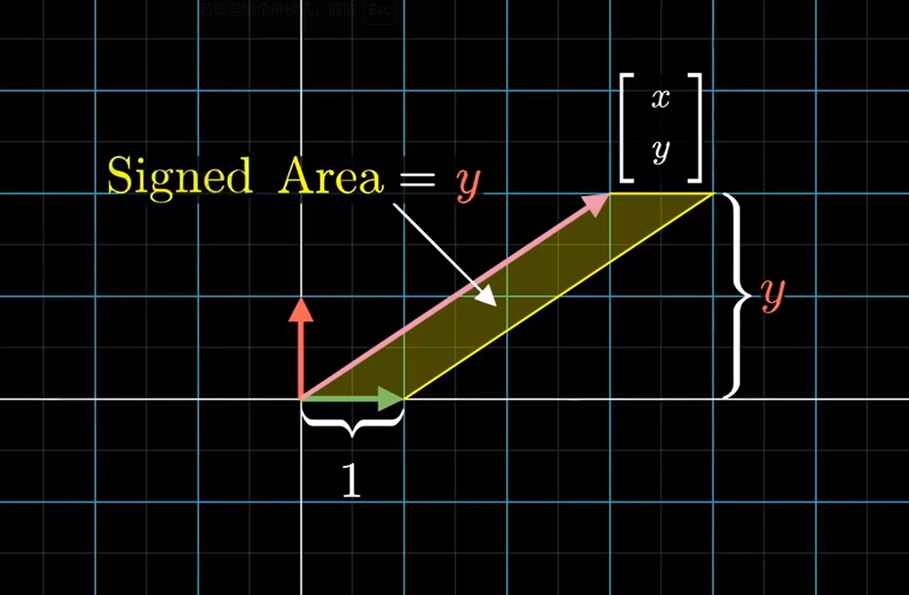
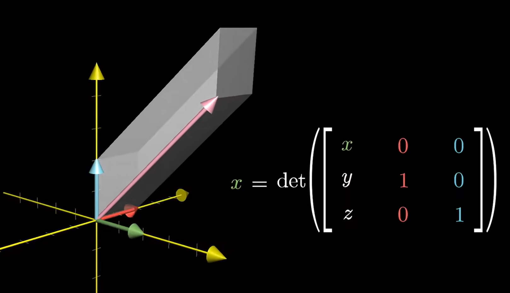
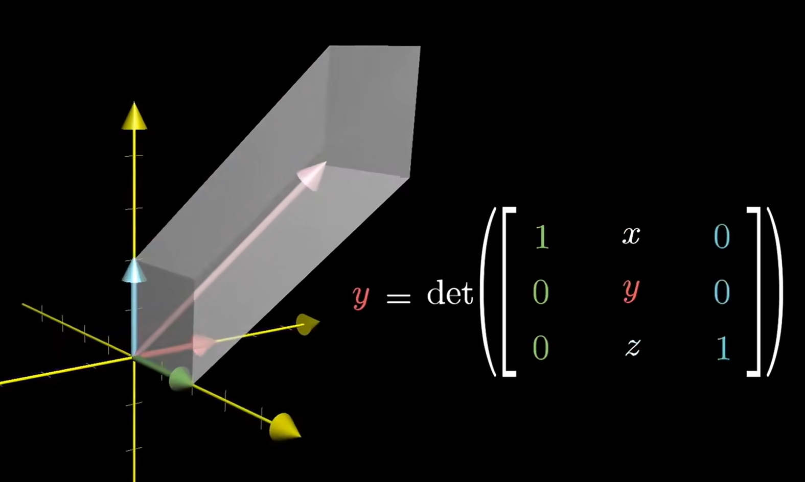
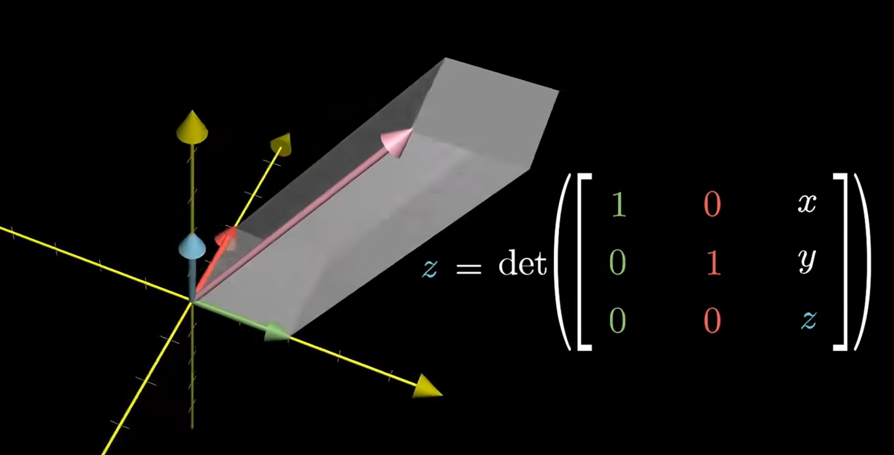

# Cramer's rule

## 几何解释
1. 对于求解未知数个数和方程个数一样的方程组时，可以使用克莱姆法则。这里以下面的为例（直接表示为线性变换的形式）
    $\begin{bmatrix} 2 & -1 \\ 0 & 1 \end{bmatrix} \begin{bmatrix} x \\ y \end{bmatrix} = \begin{bmatrix} 4 \\ 2 \end{bmatrix}$
2. 我们假设变换前的向量，也就是 $\begin{bmatrix} x \\ y \end{bmatrix}$ 是下图中粉色的那个
    
3. 如图中所标识的，粉色向量和基向量 $\begin{bmatrix} 1 \\ 0 \end{bmatrix}$ 围成了一个平行四边形，而这个平行四边形的有向面积就是 $y$。
4. 在经过变换只是，这个平行四边形的两条边会变成 $\begin{bmatrix} 2 \\ 0 \end{bmatrix}$ 和 $\begin{bmatrix} 4 \\ 2 \end{bmatrix}$，所以它的面积也变为 $det\left(\begin{bmatrix} 2 & 4 \\ 0 & 2 \end{bmatrix}\right)$。那这个新的面积和原来的面积 $y$ 是什么关系呢？是它的 $det\left(\begin{bmatrix} 2 & -1 \\ 0 & 1 \end{bmatrix}\right)$ 倍。
5. $\begin{bmatrix} 2 & -1 \\ 0 & 1 \end{bmatrix}$ 是本次线性变换对应的矩阵，那么 $det\left(\begin{bmatrix} 2 & -1 \\ 0 & 1 \end{bmatrix}\right)$ 就是本次线性变换人任意面积增大或减小的倍数（线性变换对单位正方形和对任何形状的面积改变是相同比例的）。
6. 所以，$\frac{det\left(\begin{bmatrix} 2 & 4 \\ 0 & 2 \end{bmatrix}\right)}{y} = det\left(\begin{bmatrix} 2 & -1 \\ 0 & 1 \end{bmatrix}\right)$，即 $y = \frac{det\left(\begin{bmatrix} 2 & 4 \\ 0 & 2 \end{bmatrix}\right)}{det\left(\begin{bmatrix} 2 & -1 \\ 0 & 1 \end{bmatrix}\right)}$。
7. 同理，$\frac{det\left(\begin{bmatrix} 4 & -1 \\ 2 & 1 \end{bmatrix}\right)}{x} = det\left(\begin{bmatrix} 2 & -1 \\ 0 & 1 \end{bmatrix}\right)$，即 $x = \frac{det\left(\begin{bmatrix} 4 & -1 \\ 2 & 1 \end{bmatrix}\right)}{det\left(\begin{bmatrix} 2 & -1 \\ 0 & 1 \end{bmatrix}\right)}$。

### 三维的情况
1. 下图中，绿红蓝分别是 xyz 三个方向的基向量，粉色依然是线性变换前的向量
    
2. 现在，粉红蓝围成了一个平行六面体，而它的体积就是粉色 $x$ 坐标值。
3. 同理，绿粉蓝围成的平行六面体的体积是粉色的 $y$ 坐标，绿红粉围成的平行六面体的体积是粉色的 $z$ 坐标
    
    
4. 所以我们在求解方程时，只要把线性变换矩阵中某个未知数相应的列替换成变换后的向量，然后计算它的行列式和原矩阵的行列式，就是该未知数的值。

##  2. References
* [线性代数的本质（Essence of linear algebra）](https://www.bilibili.com/video/BV1ys411472E/)