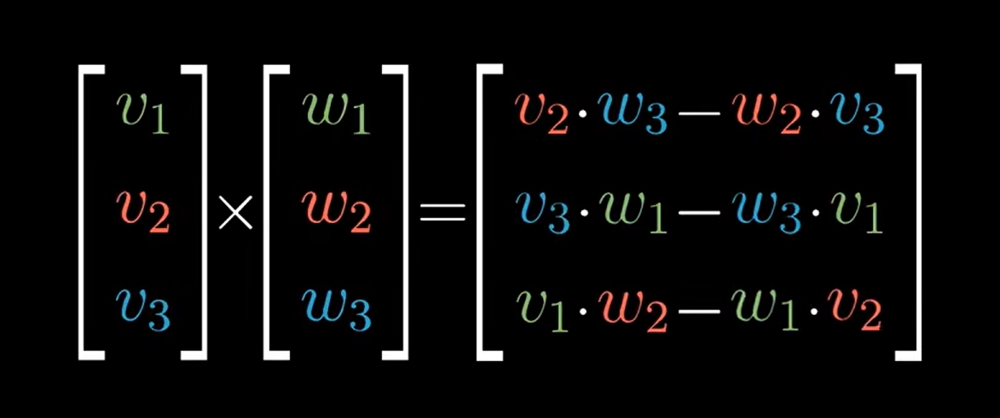

# Cross products

<!-- vscode-markdown-toc -->
* 1. [数学思想](#)
* 2. [References](#References)

<!-- vscode-markdown-toc-config
	numbering=true
	autoSave=true
	/vscode-markdown-toc-config -->
<!-- /vscode-markdown-toc -->

##  1. 数学思想
### 右手法则成立的前提
1. 因为满足下面三点
	* 左右手的镜像对称的。
	* 食指和中指分开的角度永远不会超过 180°。
	* 拇指只能指着指向拇指这个方向而不能指向小指那个方向。
2. 后两点其实只是保证了三个手指的相互位置关系是固定的。
3. 因为满足以上三点，就无法用左手模拟出右手的情况。也就是说，如果在当前空间中三个向量符合右手，那就一定不符合左手，除非空间发生反转。

## 从二维说起
1. 叉积是三维的概念，但我们这里先从二维的相似情况来看看。
2. 假设二维空间里有两个向量 $\vec{\boldsymbol{V}}$ 和 $\vec{\boldsymbol{W}}$，我们这里定义它们的叉积（注意叉积是三维的概念，我们这里定义的叉积只是在二维的模拟）的值是这两个向量围成的平行四边形的面积或面积的相反数
	
3. 叉积是正还是负，取决于两个向量的顺序关系：$\vec{\boldsymbol{V}}$ 逆时针旋转到 $\vec{\boldsymbol{W}}$ 的过程发生在平行四边形内部，那它们的叉积就是正的；如果 $\vec{\boldsymbol{V}}$ 逆时针旋转到 $\vec{\boldsymbol{W}}$ 的过程发生在平行四边形外部，那它们的叉积就是负的。
4. 而这个平行四边形的面积，就是这两个向量的行列式。二维空间的行列式表示的是两个单位向量围成的四边形在线性变换后面积的变化倍数，这里如果单位向量是 $\begin{bmatrix} 1 & 0 \\ 0 & 1 \end{bmatrix}$ 的话，那这两个向量的叉积就是它们的行列式。

## 真正的叉积
1. **叉积**（cross product）又称 **外积**（external product）或 **向量积**（vector product），是对三维空间中的两个向量的二元运算，它的运算结果是向量。
2. 对于线性无关的两个向量 $\vec{\boldsymbol{V}}$ 和 $\vec{\boldsymbol{W}}$，它们的叉积写作 $\vec{\boldsymbol{V}} \times \vec{\boldsymbol{W}}$，是 $\vec{\boldsymbol{V}}$ 和 $\vec{\boldsymbol{W}}$ 所在平面的法线向量，与 $\vec{\boldsymbol{V}}$ 和 $\vec{\boldsymbol{W}}$ 都垂直。
3. 叉积的模长和以这两个向量为边的平行四边形的面积相等。

## 计算
1. 叉积的计算公式如下
	
2. 但它还有一个更容易记的形式
	
3. 注意，第二种形式是在计算行列式，得到的是一个标量。而叉积是一个三维向量，两者根本不是一个东西。但注意到，这个矩阵的第一列并不是一组数，而是当前三维空间的基向量，所以这其实并不是行列式。但我们仍然你可以按照行列式的计算方法计算，算出来的形式如下
	
4. 可以看到，计算出的结果是三个向量相加，而加出的结果向量正好就是叉积计算公式所得出的向量。
5. 第二种计算叉积的形式很奇怪，但又是正确的。那它和根据叉积定义进行计算形式有什么内在联系呢？

##  2. References
* [线性代数的本质（Essence of linear algebra）](https://www.bilibili.com/video/BV1ys411472E/)