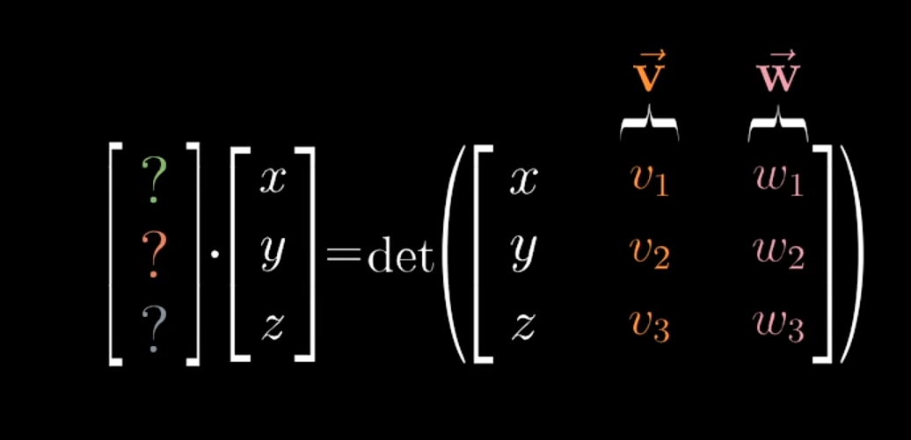

# Cross products

<!-- vscode-markdown-toc -->
* 1. [数学思想](#)
* 2. [References](#References)

<!-- vscode-markdown-toc-config
	numbering=true
	autoSave=true
	/vscode-markdown-toc-config -->
<!-- /vscode-markdown-toc -->

##  1. 数学思想
### 右手法则成立的前提
1. 因为满足下面三点
	* 左右手的镜像对称的。
	* 食指和中指分开的角度永远不会超过 180°。
	* 拇指只能指着指向拇指这个方向而不能指向小指那个方向。
2. 后两点其实只是保证了三个手指的相互位置关系是固定的。
3. 因为满足以上三点，就无法用左手模拟出右手的情况。也就是说，如果在当前空间中三个向量符合右手，那就一定不符合左手，除非空间发生反转。

## 从二维说起
1. 叉积是三维的概念，但我们这里先从二维的相似情况来看看。
2. 假设二维空间里有两个向量 $\vec{\boldsymbol{V}}$ 和 $\vec{\boldsymbol{W}}$，我们这里定义它们的叉积（注意叉积是三维的概念，我们这里定义的叉积只是在二维的模拟）的值是这两个向量围成的平行四边形的面积或面积的相反数
	
3. 叉积是正还是负，取决于两个向量的顺序关系：$\vec{\boldsymbol{V}}$ 逆时针旋转到 $\vec{\boldsymbol{W}}$ 的过程发生在平行四边形内部，那它们的叉积就是正的；如果 $\vec{\boldsymbol{V}}$ 逆时针旋转到 $\vec{\boldsymbol{W}}$ 的过程发生在平行四边形外部，那它们的叉积就是负的。
4. 而这个平行四边形的面积，就是这两个向量的行列式。二维空间的行列式表示的是两个单位向量围成的四边形在线性变换后面积的变化倍数，这里如果单位向量是 $\begin{bmatrix} 1 & 0 \\ 0 & 1 \end{bmatrix}$ 的话，那这两个向量的叉积就是它们的行列式。

## 真正的叉积
1. **叉积**（cross product）又称 **外积**（external product）或 **向量积**（vector product），是对三维空间中的两个向量的二元运算，它的运算结果是向量。
2. 对于线性无关的两个向量 $\vec{\boldsymbol{V}}$ 和 $\vec{\boldsymbol{W}}$，它们的叉积写作 $\vec{\boldsymbol{V}} \times \vec{\boldsymbol{W}}$，是 $\vec{\boldsymbol{V}}$ 和 $\vec{\boldsymbol{W}}$ 所在平面的法线向量，与 $\vec{\boldsymbol{V}}$ 和 $\vec{\boldsymbol{W}}$ 都垂直。
3. 叉积的模长和以这两个向量为边的平行四边形的面积相等。

## 计算
1. 叉积的计算公式如下
	
2. 但它还有一个更容易记的形式
	
3. 注意，第二种形式是在计算行列式，得到的是一个标量。而叉积是一个三维向量，两者根本不是一个东西。但注意到，这个矩阵的第一列并不是一组数，而是当前三维空间的基向量，所以这其实并不是行列式。但我们仍然可以按照行列式的计算方法计算，算出来的形式如下
	
4. 可以看到，计算出的结果是三个向量相加，而加出的结果向量正好就是叉积计算公式所得出的向量。
5. 第二种计算叉积的形式很奇怪，但又是正确的。那它和根据叉积定义进行计算形式有什么内在联系呢？

## 降至一维和对偶向量
1. 再介绍点积的部分，两个二维向量的点积是一个一维的数。而如果我们把第一向量转置，就变成了对第二个向量进行线性变换，得到也是一个一维向量，值就是点积的计算结果。
2. 也就是说，对于一个二维向量，如果对它进行线性变换的矩阵是一个一行两列矩阵，那这个二维向量就会将位置一维向量。并且这个一维向量，正好位于那个一行两列矩阵转置成向量后所在的直线上。
3. 所以，当你看到一个二维向量经过线性变换变成一维向量时，那就意味着存在着一个一行两列向量正好是本次线性变换矩阵的转置。
4. 三维的情况也是一样。当发生了一个三维向量将至一维的时候，我们就知道对它进行线性变换的矩阵是一个一行三列的矩阵，而这个矩阵也可以转置为当前三维空间的一个向量。
5. 也就是说，在一个向量空间里，某个向量 $\vec{w}$ 降至一维的操作，对应着该空间里的一个向量 $\vec{v}$。这个向量 $\vec{v}$ 的转置正好就是对 $\vec{w}$ 降维线性变换的矩阵。并且，对 $\vec{w}$ 点乘 $\vec{w}$ 的操作和使用 $\vec{v}$ 的转置对 $\vec{w}$ 线性变换的操作等价。
6. 这个向量 $\vec{v}$ 就称为这个线性变换的 **对偶向量（dual vector）**。

## 叉积行列式计算方法的几何意义

1. 叉积的计算虽然不是三个向量的行列式，但它和这个关系密切。先看一下三个向量的行列式，它计算的结果是这三个向量围成的平行六面体的体积
	
2. 实际上叉积计算的输入是两个向量，这里我们就定为 $\vec{v}$ 和 $\vec{w}$，也就是上面三列矩阵右边的两列。而让最左边的一列表示一个未知矩阵
	
3. 现在，随着位置矩阵的变化，它们围成的平行六面体的体积（行列式）也随之变化。因此，我们定义了一个从三维到一维的降维线性变换：我们输入一个三维向量，得到个一维的值
	
4. 既然是从三维到一维的线性变换，那它就也可以写成对输入向量线性变换的形式
	
5. 当然也可以写成输入向量和该线性变换的对偶向量点乘的形式
	
6. 我们把这个对偶向量设为 $\vec{p}$
	
7. 现在，我们分别按照点积和行列式的计算方法分别是等式两边进行计算
	
8. 然后就可以变形为
	
9. 等号右边就是叉积计算公式得出的向量的三个值。怎么会这样？
10. 再看这个等式
	
11. 现在我们可以说，等式右边是叉积运算的两个向量和一个位置向量围成的平行六面体的体积，等式的左边是该未知向量和叉积运算结果向量点乘。
12. $\vec{p}$ 既然是叉积运算结果，那它就是和 $\vec{v}$、$\vec{w}$ 垂直并且长度值为 $\vec{v}$ 和 $\vec{w}$ 围成的平行四边形的面积的值。
13. 而等式左边表示未知向量投影到 $\vec{p}$ 之上的长度再乘以 $\vec{p}$ 的长度，也就是投影长度乘以 $\vec{v}$ 和 $\vec{w}$ 围成的平行四边形的面积，而这个结果又等于平行六面体的体积。所以，投影的长度就是平行六面体的高。
14. 但这好像没啥好说的，因为 $\vec{v}$、$\vec{w}$ 是平行六面体的两个底边，而为之向量是第三个变，那它投影到和底边垂直的方向上，长度当然是平行六面体的高。
15. 不过这倒是从几何角度解释了为什么上面的等式是成立的。等号左边是未知向量投影到 $\vec{p}$ 之上，并且投影长度乘以 $\vec{p}$ 长度；等号右边是未知向量和 $\vec{v}$、$\vec{w}$ 围成的平行四边形组成的平行六面体的体积。左边是未知向量投影后乘以 $\vec{p}$ 的长度，右边是未知向量投影后乘以平行四边形面积。并且上面已经推导出了 $\vec{p}$ 的绝对值就是平行四边形的面积值。所以未知向量的投影就是平行六面体的高，未知向量也就是平行六面体的另一条边。

##  2. References
* [线性代数的本质（Essence of linear algebra）](https://www.bilibili.com/video/BV1ys411472E/)