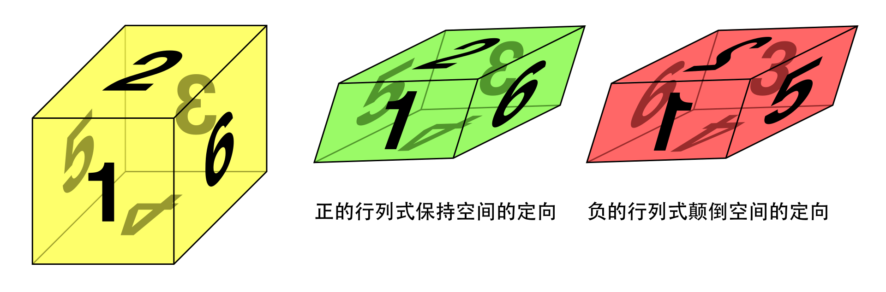

# Determinant

<!-- vscode-markdown-toc -->
* 1. [数学思想](#)
	* 1.1. [负数的意义](#-1)
* 2. [从面积的角度来理解二维向量空间线性变换](#-1)
* 3. [负值行列式](#-1)
	* 3.1. [二维行列式正负值的一个例子](#-1)
	* 3.2. [三维行列式正负值的一个例子](#-1)
* 4. [References](#References)

<!-- vscode-markdown-toc-config
	numbering=true
	autoSave=true
	/vscode-markdown-toc-config -->
<!-- /vscode-markdown-toc -->

##  1. 数学思想
###  1.1. 负数的意义
1. 严格的负数，在实际生活中通常是没有意义的，因为没有就已经是最少的了。
2. 但我们通常可以用负数表示一种方向的改变。比如我给你 10 块如果是正的，那你给我 10 块就可以算是一种负的；或者往前如果是正的，那往后就是负的。

##  2. 从面积的角度来理解二维向量空间线性变换
1. 看下面这个线性变换矩阵对应的图
    
    
2. $a$ 代表 $\^{i}$ 在 x 方向上的位置（伸缩的倍数），$c$ 代表 $\^{i}$ 在 y 方向上的位置（伸缩的倍数），$b$ 代表 $\^{j}$ 在 x 方向上的位置（伸缩的倍数），$d$ 代表 $\^{j}$ 在 y 方向上的位置（伸缩的倍数）。
3. 最初的单位向量是 $\begin{bmatrix} 1 & 0 \\ 0 & 1 \end{bmatrix}$，以这两个单位向量为边的四边形是一个正方形。经过线性变换后，本来的正方形可能就会变成上面的 $\begin{bmatrix} a & b \\ c & d \end{bmatrix}$ 平行四边形。
4. 这个平行四边形的一个顶点还是原点；中间两个顶点的位置由 $abcd$ 决定，最终决定四边形的位置和大小。
5. 从图上标注的尺寸，可以算出平行四边形的面积是 $ad - bc$。这个值就是经过线性变换后的四边形和初始正方形的面积倍数。

##  3. 负值行列式
1. 如果一个转换改变了向量空间的 **定向**（orientation），那么这个变换对应的行列式就是负值。
2. 但是，这个改变定向该如何理解呢？
3. 如果以二维向量空间为例，变成负的情况，用到了把二维平面翻一面的比喻。但感觉怪怪的，因为其实这个平面并没有翻转，只是单位坐标变了而已。如果二维向量空间的情况理解为翻转，那三维向量空间该如何理解呢？怎么理解三维空间翻转这件事呢？TODO
4. 如果以逆时针方向为正向的话，有向面积的意义是：平行四边形面积为正当且仅当以原点为不动点将 $\^{i}$ 逆时针 “转到” $\^{j}$ 处时，扫过的地方在平行四边形里。否则的话面积就是负的。

###  3.1. 二维行列式正负值的一个例子
1. 下图中的变换
    
    
2. 如果我们不动两个基向量，只是对第一张图的平面从任意角度进行任意程度的拉伸和压缩，都无法达到第二张图的效果。因为你不管怎么拉伸和压缩，$\^{j}$ 永远在 $\^{i}$ 的逆时针方向。
3. 想要通过拉伸和压缩达到第二张的效果，必须要对第一张图的平面进行镜像翻转才行。

###  3.2. 三维行列式正负值的一个例子
1. 以下图的变换为例
    

    <a style="font-size: 12px;" href="//commons.wikimedia.org/wiki/File:Determinant_and_orientation.jpg" title="File:Determinant and orientation.jpg">File:Determinant_and_orientation.jpg 作者 User:Irrons</a>，<a style="font-size: 12px;" href="https://creativecommons.org/licenses/by-sa/3.0" title="Creative Commons Attribution-Share Alike 3.0">CC BY-SA 3.0</a>，<a style="font-size: 12px;" href="https://commons.wikimedia.org/w/index.php?curid=10741957">链接</a>
2. 初始的立方体是黄色的，在经过了线性变换后变成中间绿色的平行六面体，这时行列式为正，两者是同定向的，可以通过旋转和拉伸从一个变成另一个。
3. 而黄色立方体和右边的红色平行六面体之间也是通过线性变换得到的，但是无论怎样旋转和拉伸，都无法使一个变成另一个，一定要通过镜面反射才行。这时两者之间的线性变换的行列式是负的。

##  4. References
* [线性代数的本质（Essence of linear algebra）](https://www.bilibili.com/video/BV1ys411472E/)
* [维基百科-行列式](https://zh.wikipedia.org/wiki/%E8%A1%8C%E5%88%97%E5%BC%8F)