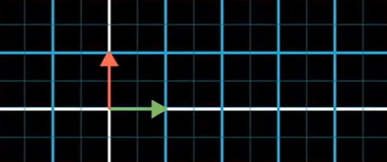
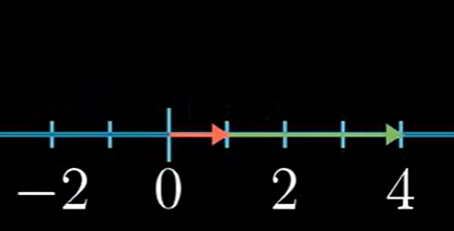
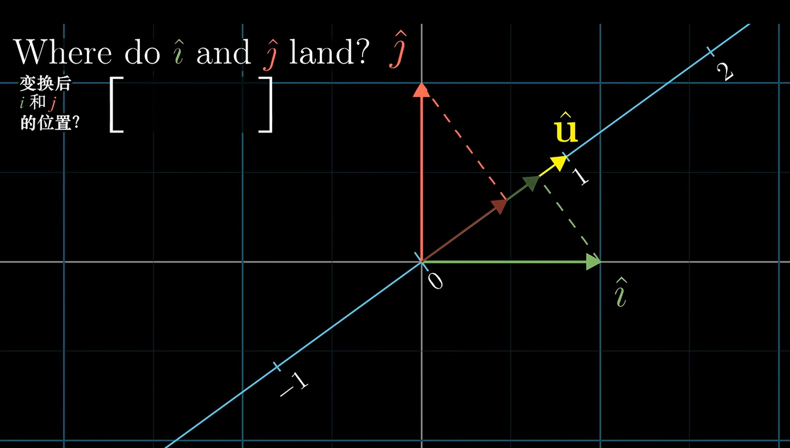
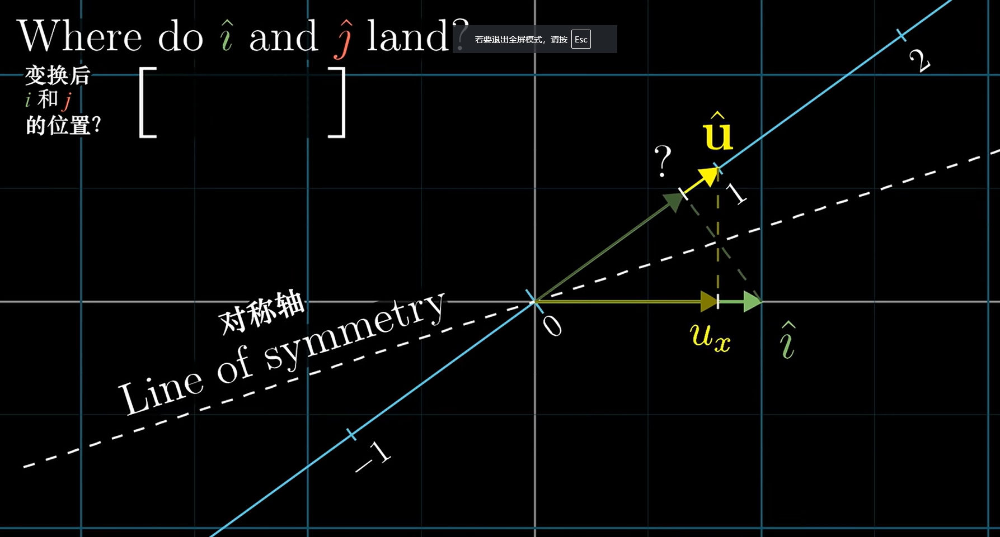

# Dot products

<!-- vscode-markdown-toc -->
* 1. [数学思想](#)
* 2. [References](#References)

<!-- vscode-markdown-toc-config
	numbering=true
	autoSave=true
	/vscode-markdown-toc-config -->
<!-- /vscode-markdown-toc -->

##  1. 数学思想

1. 假设对一个二维向量进行线性变换，而该线性变换对应的矩阵是单行的，那也就意味着，这个变换把二维向量变换为一维向量。
2. 这个二维向量本来有两个坐标，但变换成一维之后，就只有一个坐标了（或者说另一个坐标是 0），所以我们就可以不用向量的形式而用一个单独的数字来表示了。
3. 而这个变化你的计算过程，和向量点积的计算过程是一样的。下面分别是线性变换的计算过程和向量点积的计算过程
	
4. 上面的线性变换过程，是把一个二维向量降维到一维基向量所在的一维直线上；而上面点积计算的几何意义，是把一个二维向量正交投影到另一个二维限量所在的直线上，然后再让这两个向量的长度相乘。
5. 线性变换的过程是用系数向量去乘以单位向量；而投影再相乘的过程也是以 A 向量的长度为单位长度然后乘以 B 向量的长度，此时这 B向量的长度值就相当于以 A 向量为单位长度的系数。（乘法本身就可以看做是把一个数作为单位值把另一个值看做系数）

## 点积的几何投影解释
1. 点积怎样定义，要看怎样定义有用。没有定义成 $\begin{bmatrix} 4 \\ 1 \end{bmatrix} ⋅ \begin{bmatrix} 2 \\ -1 \end{bmatrix} = \begin{bmatrix} 8 \\ -1 \end{bmatrix}$，因为这个在现实中没有什么用处。
2. 之所以按照现在的定义，就是这个定义可以反映两个向量的方向以及它们长度的某种信息。
3. 那现在就要问，为什么这种定义下，$\vec{v} ⋅ \vec{w}$ 的计算结果，正好就是 $\vec{w}$ 在 $\vec{v}$ 上的投影长度乘以 $\vec{v}$ 的长度并且正负号还能表示方向呢？
4. 注意到，向量点积 $\begin{bmatrix} 4 \\ 1 \end{bmatrix} ⋅ \begin{bmatrix} 2 \\ -1 \end{bmatrix}$ 和矩阵乘以向量 $\begin{bmatrix} 4 & 1 \end{bmatrix} \begin{bmatrix} 2 \\ -1 \end{bmatrix}$（也就是对向量 $\begin{bmatrix} 2 \\ -1 \end{bmatrix}$ 以矩阵 $\begin{bmatrix} 4 & 1 \end{bmatrix}$ 为基进行线性变换）的计算很相似。那我们来看看这个线性变换是怎样的过程。
5. $\begin{bmatrix} 2 \\ -1 \end{bmatrix}$ 是一个二维向量，而 $\begin{bmatrix} 4 & 1 \end{bmatrix}$ 是两个一维的基向量。所以，这个变换的效果就是把二维向量变到一维空间上了。也就是基向量发生了下面的变换
	
	
6. 当然这个矩阵也可以写成 $\begin{bmatrix} 4 & 1 \\ 0 & 0 \end{bmatrix}$，来显示它们本来是处在二维空间里的。但这并不影响计算结果。
7. 在这个变换之下，本来的二维向量 $\begin{bmatrix} 2 \\ -1 \end{bmatrix}$ 也被压缩到新的基向量所在直线上，变成了 $\begin{bmatrix} 4 & 1 \\ 0 & 0 \end{bmatrix} \begin{bmatrix} 2 \\ -1 \end{bmatrix} = \begin{bmatrix} 7 \\ 0 \end{bmatrix}$，或者也可以写成 $\begin{bmatrix} 7 \end{bmatrix}$。
8. 现在，这个经过变换后的一维向量的坐标值，就是线性变换对应的点积的计算结果。但目前还没什么特别之处，我们完全可以说我们就是把点积运算定义成把其中一个向量视为矩阵之后的线性变换。
9. 特殊之处在于，点积运算不只反映了线性变换，还反映了一个向量投影长度和另一个向量的长度相乘的运算。它为什么能反映出这个运算？它为什么能同时反映出这两个运算？这两个运算之间有什么关系？

### 两种运算的对偶性
1. $\begin{bmatrix} 4 \\ 1 \end{bmatrix}$ 和 $\begin{bmatrix} 2 \\ -1 \end{bmatrix}$，如果它们以 $\begin{bmatrix} 4 \\ 1 \end{bmatrix} ⋅ \begin{bmatrix} 2 \\ -1 \end{bmatrix}$ 的形式出现，我们如果把它视为投影的那个操作的话，它的结果是 $7$；如果它们以 $\begin{bmatrix} 4 & 1 \end{bmatrix} \begin{bmatrix} 2 \\ -1 \end{bmatrix}$ 的形式出现，它是线性变化的操作，结果是 $\begin{bmatrix} 7 \end{bmatrix}$，此时因为它已经是一维的了，所以它和 $7$ 是等价的。
2. 也就是说，对于两个向量，它们投影并相乘的运算，和它们的线性变换运算，存在着某种内在对等的关系，或者说，存在对偶性。为什么存在这种对偶性呢？
3. $\vec{v} ⋅ \vec{w}$ 会把 $\vec{w}$ 投影到 $\vec{v}$ 上。我们先假设 $\vec{w}$ 是二维空间里的单位向量，看看把它投影到默认向量 $\vec{v}$ 上是什么效果。
4. 假设 $\vec{w}$ 先后分别是是基向量 $\begin{bmatrix} 1 \\ 0 \end{bmatrix}$ 和 $\begin{bmatrix} 0 \\ 1 \end{bmatrix}$，分别考虑它们投影到某个向量 $\vec{v}$ 上之后的长度是多少
	
5. 注意上图中的向量 $\vec{u}$，它表示的是 $\vec{v}$ 上一个单位长度的向量。因为这里我们并没有涉及线性变换，所以 $\vec{u}$ 的长度就是 1，它和 $\vec{i}$、$\vec{j}$ 的长度是相同的。
6. 因此，我们要知道 $\vec{i}$ 和 $\vec{j}$ 投影到 $\vec{v}$ 上的长度，就是要看投影上去之后和 $\vec{u}$ 的长度比值就行了。
7. 从图中可以看出，$\vec{i}$ 投影到 $\vec{v}$ 上的长度，就等于 $\vec{u}$ 投影到 x 轴上的长度。同样，$\vec{j}$ 投影到 $\vec{v}$ 上的长度，也等于 $\vec{u}$ 投影到 y 轴上的长度。也就是说，表示向量 $\vec{u}$ 的两个坐标值 $u_x$ 和 $u_y$，正好就是 $\vec{i}$ 和 $\vec{j}$ 投影到 $\vec{v}$ 上的长度值。
8. 现在看看最简单的情况：我们的被投影向量 $\vec{v}$ 就是 $\vec{u}$，投影向量就是基向量 $\vec{i}$。
9. 那么 $\vec{i}$ 投影上去的长度是 $u_x$，乘以 $\vec{u}$ 的长度 1 得出 $u_x$。而 $\vec{u}$ 和 $\vec{i}$ 的点积运算 $\begin{bmatrix} u_x \\ u_y \end{bmatrix} ⋅ \begin{bmatrix} 1 \\ 0 \end{bmatrix}$ 的结果也是 $u_x$。 同理 $\vec{j}$ 投影上去的长度是 $u_y$，乘以 $\vec{u}$ 的长度 1 得出 $u_y$。而 $\vec{u}$ 和 $\vec{j}$ 的点积运算 $\begin{bmatrix} u_x \\ u_y \end{bmatrix} ⋅ \begin{bmatrix} 0 \\ 1 \end{bmatrix}$ 的结果也是 $u_y$。
10. 仅就单位向量来说，点积运算的结果确实等于头像长度乘以被投影向量长度。
11. 如果 $\vec{v}$ 不一定是单位长度的向量，比如它是任意向量 $b\vec{u}$，那么把基向量 $\vec{i}$ 投影到它上面时，投影运算的结果仍然和点击运算结果相同，都是 $bu_x$。
12. 而如果 $\vec{w}$ 不是单位向量，而是单位向量的倍数 $m\vec{i}$，显然上面两种运算结果也是相同的，都是 $mbu_x$。
13. 那如果投影的向量不是某个基向量的倍数，而是任意向量 $\begin{bmatrix} m \\ n \end{bmatrix}$ 呢？这个向量是由两个基向量的倍数向量 $\begin{bmatrix} m \\ 0 \end{bmatrix}$ 和 $\begin{bmatrix} 0 \\ n \end{bmatrix}$ 相加而得的。
14. $\begin{bmatrix} m \\ 0 \end{bmatrix}$ 投影到 $b\vec{u}$ 之上的长度是 $bmu_x$，$\begin{bmatrix} 0 \\ n \end{bmatrix}$ 投影到 $b\vec{u}$ 之上的长度是 $bnu_y$。所以 $\begin{bmatrix} m \\ n \end{bmatrix}$ 投影的长度就是 $bmu_x + bnu_y$。
15. 而这两个向量的点积运算 $\begin{bmatrix} bu_x \\ bu_y \end{bmatrix} ⋅ \begin{bmatrix} m \\ n \end{bmatrix}$ 的结果也是 $bmu_x + bnu_y$。
16. 现在我们已经验证的两种运算的相等性，但使得它们相等的关键步骤是哪里呢？基向量投影到单位长度的 $\vec{u}$ 那里，因为之后的拓展都是乘以它们各自的倍数。
17. 再看看 $\begin{bmatrix} u_x \\ u_y \end{bmatrix} ⋅ \begin{bmatrix} 1 \\ 0 \end{bmatrix}$ 和 $\begin{bmatrix} u_x \\ u_y \end{bmatrix} ⋅ \begin{bmatrix} 0 \\ 1 \end{bmatrix}$：如果把长度为 1 的任意向量坐标设为 $(u_x, u_y)$，那长度为 1 的两个基向量投影到它之上的长度就是 $u_x$ 和 $u_y$。某种对称性出现了 
	
18. 为什么会出现这种对称性呢？因为其实坐标本身就是一种投影计算的结果。如果一个点的坐标是 $(u_x, u_y)$，其实就是说，把这个点投影到 X 轴上的值是 $u_x$、投影到 Y 轴上的值是 $u_y$。
19. 而从某个第三条轴 V 轴投影到 X 轴，和从 X 轴投影到 V 轴的操作是对称的。也就是说，V 轴上坐标值为 $n$ 的点，投影到 X 轴之上后坐标值是 $x$ 的话，那 X 轴上坐标值为 $n$ 的点，投影到 V 轴之上后，坐标值也是 $x$。
20. 所以，把 X 轴上长度为 1 的基向量 $\vec{i}$ 投影到 V 轴上的坐标，就是 V 轴上长度为 1 的向量 $\vec{u}$ 投影到 X 轴上的坐标。
21. 所以，对于 $\begin{bmatrix} u_x \\ u_y \end{bmatrix}$ 和 $\begin{bmatrix} 1 \\ 0 \end{bmatrix}$ 这两个向量，因为它们的长度都是 1，所以它们相互的投影的长度就是相等的。$\begin{bmatrix} u_x \\ u_y \end{bmatrix}$ 投影到 X 轴的值是 $u_x$，就是 $\begin{bmatrix} u_x \\ u_y \end{bmatrix}$ 的横坐标；$\begin{bmatrix} 1 \\ 0 \end{bmatrix}$ 投影到 $\begin{bmatrix} u_x \\ u_y \end{bmatrix}$ 所在轴的值也是 $u_x$。它们的投影操作是 $u_x ⋅ 1$，点积运算是 $1 ⋅ u_x$
22. 而这种对称性也解释了，为什么向量的点积运算满足交换律。

##  2. References
* [线性代数的本质（Essence of linear algebra）](https://www.bilibili.com/video/BV1ys411472E/)