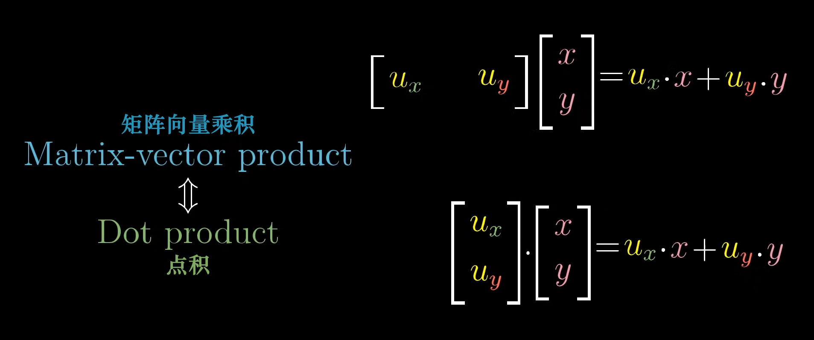
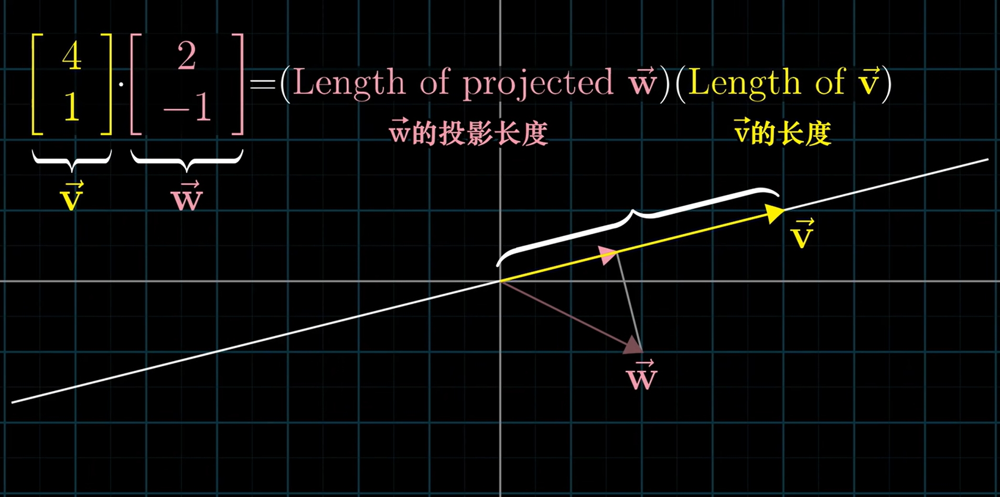

# Dot products

<!-- vscode-markdown-toc -->
* 1. [数学思想](#)
* 2. [References](#References)

<!-- vscode-markdown-toc-config
	numbering=true
	autoSave=true
	/vscode-markdown-toc-config -->
<!-- /vscode-markdown-toc -->

##  1. 数学思想

1. 假设对一个二维向量进行线性变换，而该线性变换对应的矩阵是单行的，那也就意味着，这个变换把二维向量变换为一维向量。
2. 这个二维向量本来有两个坐标，但变换成一维之后，就只有一个坐标了，所以我们就可以不用向量的形式而用一个单独的数字来表示了。
3. 而这个变化你的计算过程，和向量点积的计算过程是一样的。下面分别是线性变换的计算过程和向量点积的计算过程
	
4. 上面的线性变换过程，是把一个二维向量降维到一维基向量所在的一维直线上；而上面点积计算的几何意义，是把一个二维向量正交投影到另一个二维限量所在的直线上，然后再让这两个向量的长度相乘。
5. 线性变换的过程是用系数向量去乘以单位向量；而投影再相乘的过程也是以 A 向量的长度为单位长度然后乘以 B 向量的长度，此时这 B向量的长度值就相当于以 A 向量为单位长度的系数。（乘法本身就可以看做是把一个数作为单位值把另一个值看做系数）

## 点积的几何投影解释
1. 两个数相乘的本质是什么？以其中一个数作为单位数值，另一个是作为该单位数值下的倍数，计算出在该单位数值下的值。
2. 例如 $2 \times 3$ 的本质，就是把 $2$ 作为单位数值（而非初始的 $1$），然后把 $3$ 作为倍数，计算出单位数值的 3 倍是多少。
3. 在这个过程中，我们其实就相当于把 $3$ 投影到以 $2$ 为单位的那个数轴之上了。在这里我们姑且把这种投影称为代数投影用以区分。
4. 再看两个二维向量点积的几何投影解释
	
5. 上面 $2 \times 3$ 的例子，可以理解为两个一维向量的点积，那这里的二维向量点积就是对两个维度分别进行投影。
6. 所以对于上图的例子中，两个投影的计算就分别是 $4 \times 2$ 和 $1 \times -1$，投影出向量就是 $\begin{bmatrix} 8 \\ -1 \end{bmatrix}$。
7. 到这里，其实投影已经完成了。但是点积运算不只是投影，它还要把投影后的值相加。但是，投影后的值相加，为什么对应到几何解释中，就是相乘了呢？
8. 想象一下那两个线段的相乘。假设投影长度是 2，那乘出来的值就是黄色线段的两倍。而这个新线段对应的向量的坐标就是 $\begin{bmatrix} 8 \\ 2 \end{bmatrix}$。可以看到，这个相乘的过程，其实就对对两个维度的数分别进行了代数投影。而之所以两个维度的投影结果成了一个维度的数，是因为我们这里结果向量所在的直线是确定的，就是黄色线段所在的线，所以只需要一个数就可以在这条直线上确定一个唯一的二维向量。
9. TODO 两种投影更明确的对应关系。
10. 从点积的代数计算过程看，很明显是满足交换律的。那从几何解释上来说，以哪个向量为单位，其实并没有区别，反正最后计算结果向量的坐标还是用最初的 $\begin{bmatrix} 1 \\ 1 \end{bmatrix}$ 向量作为单位向量。

##  2. References
* [线性代数的本质（Essence of linear algebra）](https://www.bilibili.com/video/BV1ys411472E/)