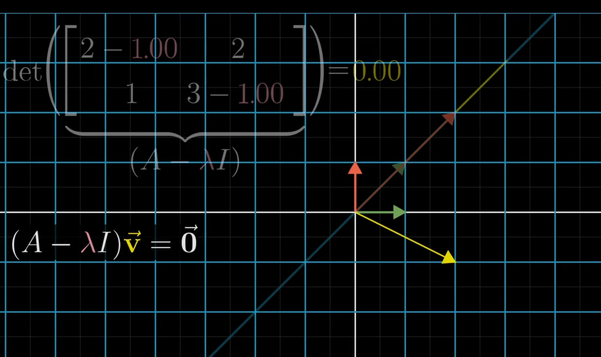
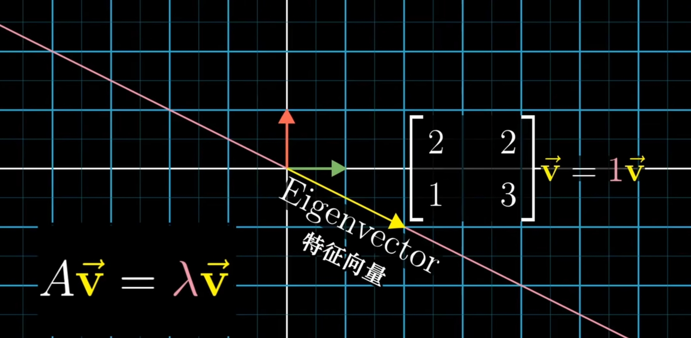
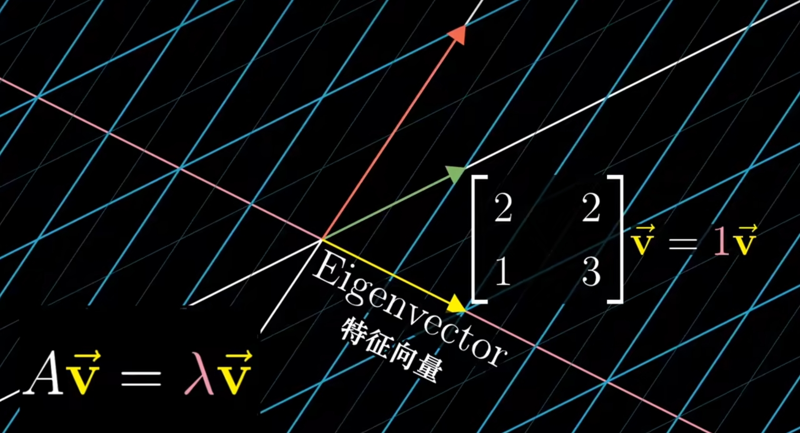
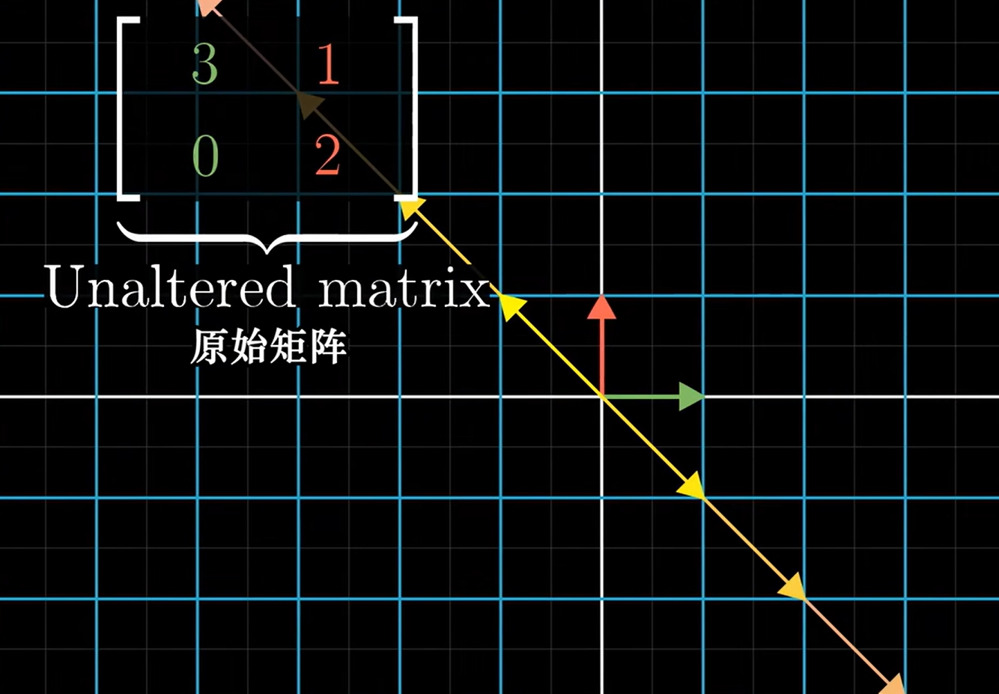
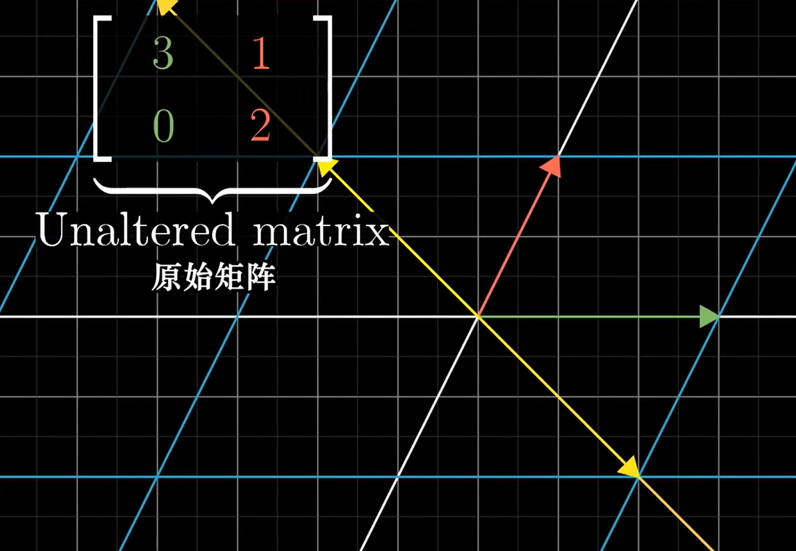
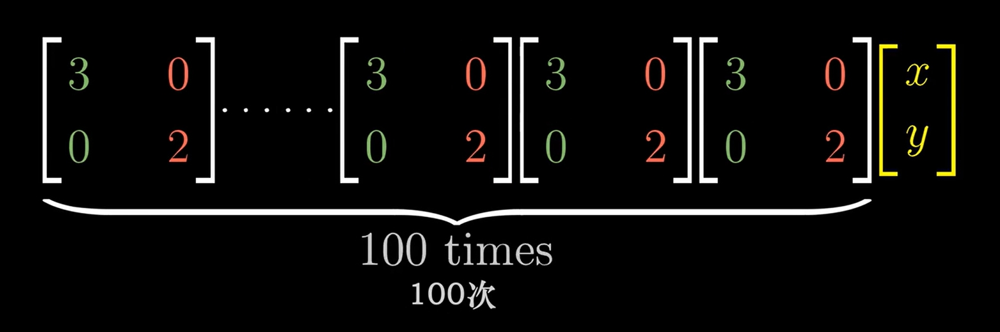
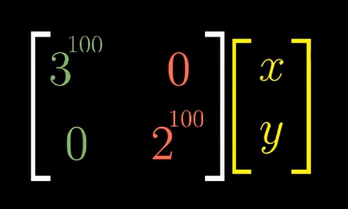
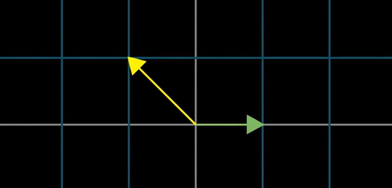
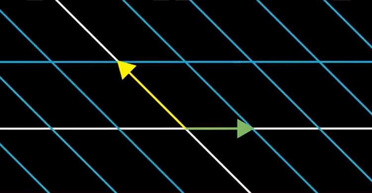

# Eigenvectors and eigenvalues

## 求解特征向量和特征值
1. 特征向量和特征值的符号定义如下
    $\boldsymbol{A}\vec{V} = λ\vec{V}$
2. 这个等式的左边是矩阵乘向量，右边是标量乘向量。为了计算，我们将右边也变成矩阵乘向量的形式。
3. 因为向量乘单位矩阵 $\boldsymbol{I}$ 还是它本身，所以右边可以如下转换 $λ\vec{V} = λ\boldsymbol{I}\vec{V} = (λ\boldsymbol{I})\vec{V}$。
4. 假设是三维空间中，那 $λ\boldsymbol{I}$ 就是 $\begin{bmatrix} λ & 0 & 0 \\ 0 & λ & 0 \\ 0 & 0 & λ \end{bmatrix}$。
5. 然后，等式就变成 $\boldsymbol{A}\vec{V} = (λ\boldsymbol{I})\vec{V}$。现在两边都是矩阵乘以向量的形式了。
6. 等式两边的计算结果都是同一个向量，所以我们对这个等式进一步转换为 $\boldsymbol{A}\vec{V} - (λ\boldsymbol{I})\vec{V} = \vec{0}$。
7. 再提取公共的 $\vec{V}$，变为 $(\boldsymbol{A} - λ\boldsymbol{I})\vec{V} = \vec{0}$。TODO，为什么满足分配律。
8. 现在，左侧括号里是一个新矩阵，它乘以特征向量 $\vec{V}$，结果为零向量。
9. 也就是说，特征向量 $\vec{V}$ 在经过 $(\boldsymbol{A} - λ\boldsymbol{I})$ 表示的线性变换之后，会变成零向量。
10. 想要把一个非零向量变为零向量，线性变换并不需要把向量空间降至零维，只需要降低一个维度，然后保证降维的方向正好和该非零向量垂直即可。
11. 而降维，就意味着代表线性变换的矩阵的行列式为 0。$\boldsymbol{A}$ 是已知的，所以我们就需要找到一个 $λ$，使得 $det(\boldsymbol{A} - λ\boldsymbol{I}) = 0$。
12. 例如如果 $\boldsymbol{A}$ 是 $\begin{bmatrix} 2 & 2 \\ 1 & 3 \end{bmatrix}$，那就是要求使得 $det(\boldsymbol{A} - λ\boldsymbol{I}) = det\begin{bmatrix} 2 - λ & 2 \\ 1 & 3 - λ \end{bmatrix} = 0$ 成立时的 $λ$。在这个例子中，$λ = 1$，也就是说特征向量 $\vec{V}$ 在 $\begin{bmatrix} 2 & 2 \\ 1 & 3 \end{bmatrix}$ 表示的线性变换中，不仅没有离开它的所在直线，而且连长度也不发生改变。
13. 那特征向量 $\vec{V}$ 具体是什么呢？我们将 $λ$ 的值 1 带入 $\boldsymbol{A} - λ\boldsymbol{I}$ 中，也就是 $\begin{bmatrix} 1 & 2 \\ 1 & 2 \end{bmatrix}$，这个矩阵代表的线性变换会导致 $\vec{V}$ 变成零向量，所以满足 $\begin{bmatrix} 1 & 2 \\ 1 & 2 \end{bmatrix} \vec{V} = \boldsymbol{0}$。那也就是求解 $\begin{bmatrix} 1 & 2 \\ 1 & 2 \end{bmatrix} \begin{bmatrix} x \\ y \end{bmatrix} = \begin{bmatrix} x \\ 0 \end{bmatrix} + \begin{bmatrix} 2y \\ 0 \end{bmatrix} = \begin{bmatrix} x + 2y \\ 0 \end{bmatrix} = \boldsymbol{0}$。因此所有坐标满足 $x = -2y$ 的 $\vec{V}$ 都是 $\boldsymbol{A} = \begin{bmatrix} 2 & 2 \\ 1 & 3 \end{bmatrix}$ 对应的变换的特征向量，且特征值为 1
    
14. 注意上图中，$\begin{bmatrix} 1 & 2 \\ 1 & 2 \end{bmatrix}$ 是 $\boldsymbol{A} - λ\boldsymbol{I}$，它对应的变换会导致特征向量变成零向量；而最初的向量 $\boldsymbol{A} = \begin{bmatrix} 2 & 2 \\ 1 & 3 \end{bmatrix}$ 才是导致 $\vec{V}$ 是解特征向量的变换
    
    
15. 当然，特征向量不止一种情况。例如对于 $\begin{bmatrix} 3 & 1 \\ 0 & 2 \end{bmatrix}$ 的线性变换矩阵，$det(\boldsymbol{A} - λ\boldsymbol{I}) = det\begin{bmatrix} 3-λ & 1 \\ 0 & 2-λ \end{bmatrix} = (λ-2)(λ-3) = 0$。
16. 此时，$λ=2$ 或 $λ=3$ 时都成立，这两个特征值对应了两个特征向量。把它们分别带入 $(\boldsymbol{A} - λ\boldsymbol{I})\vec{V} = \vec{0}$：
    * $\begin{bmatrix} 3-2 & 1 \\ 0 & 2-2 \end{bmatrix}\vec{V} = \begin{bmatrix} 1 & 1 \\ 0 & 0 \end{bmatrix}\vec{V} = \vec{0} => X_v + Y_v = 0$
    * $\begin{bmatrix} 3-3 & 1 \\ 0 & 2-3 \end{bmatrix}\vec{V} = \begin{bmatrix} 0 & 1 \\ 0 & -1 \end{bmatrix}\vec{V} = \vec{0} => Y_v = 0$
17. 对应下面的变换。第一种特征向量位于黄线上，第二种特征向量位于 X 轴
    
    
18. 还可能会出现只有一个特征值但不止一个特征向量的情况。例如线性变换 $\begin{bmatrix} 2 & 0 \\ 0 & 2 \end{bmatrix}$，它会将任意方向的向量都拉伸为原来的二倍。

## 特征基（eigenbasis）
1. 如果一次变换中，基向量都是特征向量，那么本次变换的矩阵是一个对角矩阵。也就特征值都位于左上右下的对角线上，并且对角线以外的元素都是 0。
2. 对角矩阵在很多方面都很方便计算，其中一个是它和自身多次相乘
    
    等于
    
3. 但是基向量都是特征向量的情况并不常见，不过一些变换可以通过变基来转换成基向量都是特征向量的情况。
4. 具体来说，如果一次变换中的特征向量中有可以张成整个空间的若干个特征向量，那么我们就可以通过变基把这些特征向量变成新的基向量（也就是用另一个坐标系的基向量描述当前的线性变换，$\boldsymbol{A^{-1}MA}$），然后，新的基向量就都是特征向量了，它对应的矩阵也就是对角矩阵了。我们用这个对角矩阵进行运算，之后再把结果变基转回为之前的坐标系。
5. 例如，$\begin{bmatrix} 3 & 1 \\ 0 & 2 \end{bmatrix}$ 这个变换矩阵并不是对角矩阵，但它的两组特征向量却是线性无关的，可以张成整个空间，分别取两组中的 $\begin{bmatrix} 1 \\ 0 \end{bmatrix}$ 和 $\begin{bmatrix} -1 \\ 1 \end{bmatrix}$ 这两个向量作为变基的目标向量。
6. 变基计算如下，最后得到了一个对角矩阵
    $\boldsymbol{A^{-1}MA} = {\begin{bmatrix} 1 & -1 \\ 0 & 1 \end{bmatrix}}^{-1} \begin{bmatrix} 3 & 1 \\ 0 & 2 \end{bmatrix} \begin{bmatrix} 1 & -1 \\ 0 & 1 \end{bmatrix} = \begin{bmatrix} 3 & 0 \\ 0 & 2 \end{bmatrix}$
7. 变基效果如下
    
    
8. 如果一组基向量都是特征向量，那这组基向量就被成为特征基。

##  2. References
* [线性代数的本质（Essence of linear algebra）](https://www.bilibili.com/video/BV1ys411472E/)