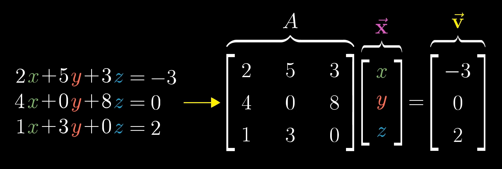

# Inverse matrices

<!-- vscode-markdown-toc -->
* 1. [数学思想](#)
	* 1.1. [公理](#-1)
* 2. [线性方程组和线性变换](#-1)
* 3. [逆矩阵](#-1)
* 4. [References](#References)

<!-- vscode-markdown-toc-config
	numbering=true
	autoSave=true
	/vscode-markdown-toc-config -->
<!-- /vscode-markdown-toc -->

##  1. 数学思想
###  1.1. 公理
1. 线性方程组是线性变换的抽象，所以你可以用线性方程组去计算线性变换的相关属性。但是，为什么也可以用线性变换去计算线性方程组呢？
2. 感觉上，从更抽象的推导更具体的没问题，但从具体的推导抽象的就感觉不够严谨。就好像只使用例子来得出一个理论一样。比如你现在从几个例子得出一个理论，但感觉你还是要从理论上证明这个理论是正确的，而不能只使用举例法，除非你穷举所有的例子。
3. 但是话说回来，理论其实也是基于现实的例子的，我们不是先验的得出一个理论的，而都是从现实总结的。就像休谟的怀疑论，你可以很多次的看到炭会燃烧，然后你得出炭会燃烧的理论，但这里理论的得出不正是基于很多次的举例的吗？你觉得你的理论是正确的，只是当前还没出现反例而已。
4. 当然还有另一种理论的推导，就是基于其他理论推导出来的，这个虽然并不是基于举例，但那另一个理论是否是基于举例呢？哪怕你的整个体系中绝大多数的理论都不是通过举例而是通过其他理论推导出的，但你这个推导链条，不断往上追溯，它总有起点理论，这个起点理论是没法从其他理论推导过来的，它只能基于举例。这些起点理论，就是科学中的公理。
5. 公理并不是真理，只是尚未发现反例。

##  2. 线性方程组和线性变换
1. 从下图可以看出，线性方程组（linear system of equations）和向量空间线性变换具有相同的形式
    
    * 方程组的参数对应线性变换的基向量矩阵 $\boldsymbol{A}$
    * 方程组的未知数对应向量空间中的一个未知的系数向量 $\vec{\boldsymbol{X}}$
    * 方程组的常数对应该未知系数向量经过线性变换后的向量 $\vec{\boldsymbol{V}}$
2. 我们把上述计算简写为 $\boldsymbol{A} \vec{\boldsymbol{X}} = \vec{\boldsymbol{V}}$。解方程组的计算对应到矩阵变换上，意味着我们要做的是：去寻找一个向量 $\vec{\boldsymbol{X}}$，使得它在经历了 $\boldsymbol{A}$ 所指定的线性变换后，正好和向量 $\vec{\boldsymbol{V}}$ 重合。
3. 为什么这两者具有相同的形式呢？因为我们在用数字描述空间。
4. 上图中的线性变换，是一个三维向量在三维空间中的变换。而因为向量的起点是原点，所以我们也可以说是三维空间里的一个点在变换位置。这个点在变换前的坐标就是 $\begin{bmatrix} x \\ y \\ z \end{bmatrix}$，变换的方法由矩阵的 9 个值决定，变换后的坐标是 $\begin{bmatrix} -3 \\ 0 \\ 2 \end{bmatrix}$。
5. 再看上图左边的方程组，那也是一种变换，也就是函数。函数的参数就是 $(x, y, z)$，变换的方法由 9 个系数决定，参数的 $(x, y, z)$ 经过变换后成为 $(-3, 0, 2)$。
6. 因为我们把空间的位置建模为数字表示的坐标，所以就可以用线性方程组的函数变换来描述空间的线性变化。
7. 其实线性方程组是比空间线性变换更抽象一层的，它并不局限于描述空间坐标的变换，任何从一组数线性的映射为另一组数的形式都可以使用线性方程组来计算。
8. 所以其实我们不能说线性方程组的本质是空间线性变换。甚至也不能说线性方程组的几何意义是空间线性变换，因为它本身只是一个无关空间的抽象。
9. 那能否颠倒过来说空间线性变换的本质是线性方程组的函数映射呢？其实也不能，空间变换就是空间变换，一个点的位置移动就是位置移动，这就是它的本质。你可以用线性方程组来描述空间的变换和位置的移动，那只能说明线性方程组是一种描述的工具而已，并不能说是本质。

##  3. 逆矩阵
1. 矩阵 $\boldsymbol{A}$ 的逆矩阵 $\boldsymbol{A^{-1}}$ 满足下面的等式
    $\boldsymbol{A^{-1}}\boldsymbol{A} = \begin{bmatrix} 1 & 0 \\ 0 & 1 \end{bmatrix}$
2. $\begin{bmatrix} 1 & 0 \\ 0 & 1 \end{bmatrix}$ 对应的变换是恒等变换（identity transformation），也就是相当于没变换。那么，逆矩阵 $\boldsymbol{A^{-1}}$ 也就是相当于先进行 $\boldsymbol{A}$ 变换之后再原路返回变换回来。
3. 那么对一个线性变换来说，如果你知道用来线性变换的基向量矩阵 $\boldsymbol{A}$，还知道变换后的向量 $\vec{\boldsymbol{V}}$，想要知道变换前的向量 $\vec{\boldsymbol{X}}$ 的话，只需要计算 $\vec{\boldsymbol{V}}\boldsymbol{A^{-1}}$，这样就可以让 $\vec{\boldsymbol{V}}$ 返回到本次变换之前的位置，也就是 $\vec{\boldsymbol{X}}$ 的位置。
4. 要求解原向量 $\vec{\boldsymbol{X}}$ 就要找到 $\boldsymbol{A}$ 的逆矩阵。那同样，要求解线性方程组的解，就要找到系数矩阵的逆矩阵。

## 秩和列空间
1. 矩阵的 **列空间**（column space）是以该矩阵的列为基向量所张成的空间。
2. 矩阵的 **秩**（rank）是矩阵列空间的维数。
3. 如果矩阵对应的列所张成的空间没有损失维度，也就是说矩阵的每个列所对应的向量是线性无关的，那此时的秩就和该矩阵的列数一样多，没有减少，这时我们称这个矩阵是 **满秩**（full rank） 的。
4. 注意，上面说的满秩时秩和列数相等，而不是说和行数。那比如说一个三行二列的矩阵，它代表着三维空间里的两个向量，这两个向量张成的空间最多也只是二维，而达不到其所在空间的三维。那此时只要这两个向量张成二维的，就已经是没有损失维度了，也就已经是满秩了，毕竟这时它两个向量所能达到的最大空间了。
5. 对于一个满秩变换来讲，唯一能在变换后落在原点的向量就是零向量；而对于一个非满秩变换，则有多个（实际上是无数个）向量变成零向量。想象二维转成一维时，经过原点并且和剩下那一维垂直的那条线上的所有非零向量都会被压缩为零向量；而如果将三维转成一维时，经过原点并且和剩下那一维垂直的那个平面上的所有非零向量都会被压缩为零向量。
6. 变换后落在原点的向量的集合，称为矩阵的 **零空间**（null space）或 **核**（kernal）。对线性方程组 $\boldsymbol{A}\vec{x} = \vec{0}$ 来说，$\boldsymbol{A}$ 的零空间就是该方程组的解集。

##  4. References
* [线性代数的本质（Essence of linear algebra）](https://www.bilibili.com/video/BV1ys411472E/)