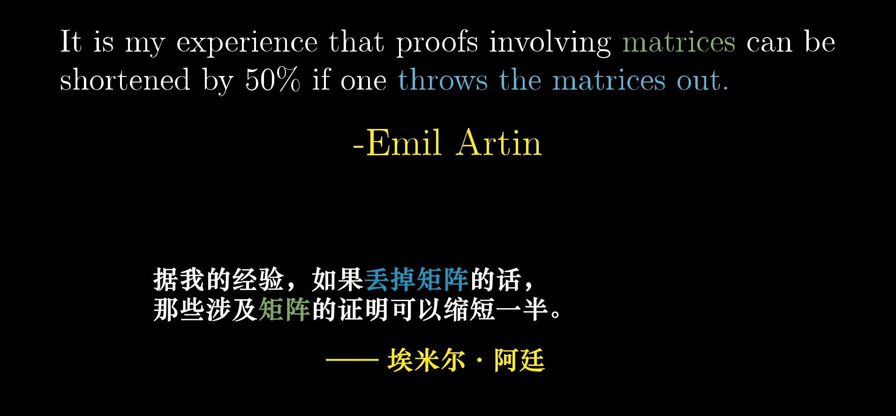
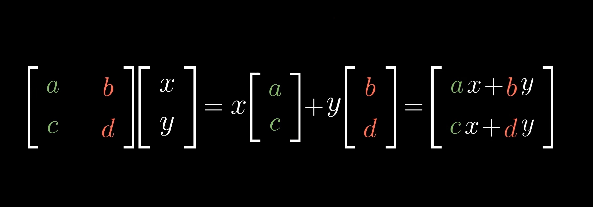
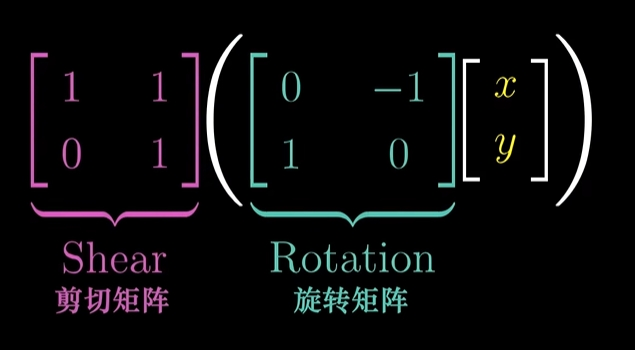
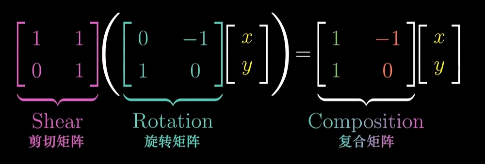
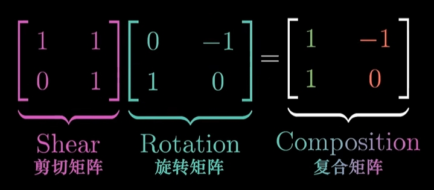
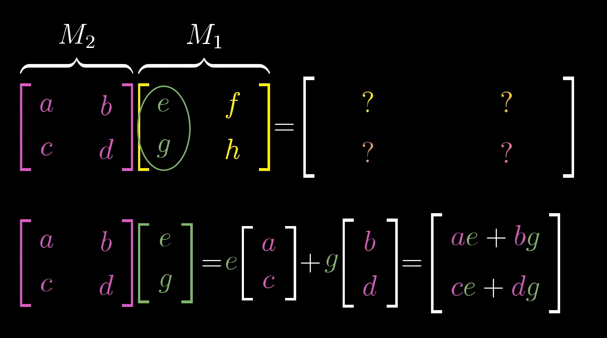
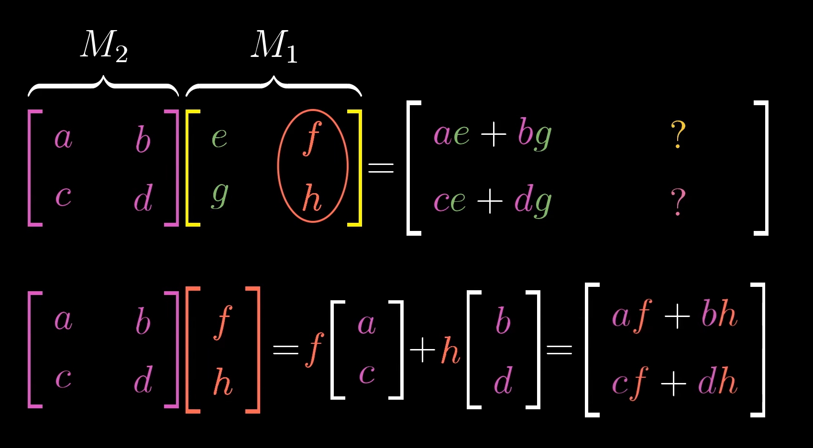
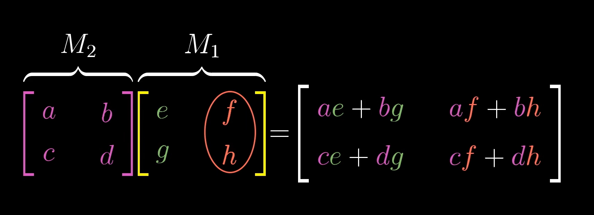

# Matrix

<!-- vscode-markdown-toc -->
* 1. [数学思想](#)
	* 1.1. [变换的相对和绝对](#-1)
	* 1.2. [矩阵的出现](#-1)
	* 1.3. [模型是为了方便的，不是用来理解的](#-1)
* 2. [从线性变换说起](#-1)
* 3. [从其他角度理解线性变换](#-1)
	* 3.1. [一段运动的角度](#-1)
	* 3.2. [一组数值的角度](#-1)
* 4. [从线性变换到矩阵](#-1)
* 5. [从线性变换到空间变换再到矩阵乘法](#-1)
	* 5.1. [交换律](#-1)
	* 5.2. [结合律](#-1)
* 6. [References](#References)

<!-- vscode-markdown-toc-config
	numbering=true
	autoSave=true
	/vscode-markdown-toc-config -->
<!-- /vscode-markdown-toc -->

##  1. 数学思想
###  1.1. 变换的相对和绝对
1. 一个坐标系的单位长度相对于坐标系外部发生了改变，在外部看来里面的元素长度发生了改变。
2. 但是对于坐标系内部的元素来说，它衡量长度还是基于坐标系的单位长度的，它的长度并不是绝对的，而只是坐标系单位长度的倍数，所以对它来说，它的长度还是和以前一样。

###  1.2. 矩阵的出现
1. 最初，矩阵只是两个基向量写法的改变，只是形式上的改变。
2. 然后，我们为了让基向量在矩阵这种形式上可以方便的计算出一个向量，就定义了矩阵的乘法。
3. 至少在矩阵的这个用法里，它只是向量计算的一个表面形式转换而已。这种新的形式简化了书写的形式，因为它把所有的基向量都提取出来放到一起，而不是每个基向量数乘系数然后再相加。而且这种简化的形式，让线性变换也更简单，因为线性变换就只是修改基向量，那我们把基向量单独提出来，替换它的过程就更简单了。
4. 至此，矩阵还只是简化了向量的计算。   

###  1.3. 模型是为了方便的，不是用来理解的

1. 矩阵是个好模型，它简化了向量的计算，简化了线性变换和空间转换的表达形式和计算方法。
2. 但它本身并不是向量计算、线性变换和空间转换。
3. 所以，如果你要理解矩阵，那最好的方法还是去理解这个抽象模型之下更本质的内容是什么；要理解矩阵的计算，那最好的方法是去理解这个抽象模型计算背后的所涉及的更本质的空间变换是什么。
4. 如果迷失在模型的形式之中而忘掉了它所代表的更本质的东西，不仅不能深刻的理解模型的运行规律，还可能逐渐脱离真实而只是在模型的系统之内寻找自洽性。
5. 就像托勒密的地心说，它只是对自然现象进行解释的模型，但如果把这个模型当做真理而不是把真实的自然现象当做真理，那为了追求模型的自洽，就不得不引入复杂的本轮均轮系统。
6. 但如果可以跳出既有模型，抛掉成见，勇敢的舍弃一直以来紧抓不放的观念，从更本质的角度看待问题，也许就会得到更好的结果。

##  2. 从线性变换说起
1. 在一个向量空间，其中的任何一个向量都可以理解为这个空间的基向量乘以系数再相加。
2. 有了这种理解，那就可以考虑，可以在一个向量空间中把基向量定义为不同的值。例如在直角坐标系中，我们可以把基向量定义为随便什么值，比如 $(1, 3)$ 和 $(-2, 1)$。
3. 如果选择这一对作为基向量，那此时的向量 $(3, -2)$ 就和选择 $(1, 0)$ 和 $(0, 1)$ 作为基向量时的向量 $(3, -2)$ 不是同一个向量了。因为这里 3 和 -2 都只是系数，它两次乘的基向量并不相同。
4. 选定不同的基向量，就是对向量空间进行了变换，向量空间里之前的向量也因为基向量的改变而发生了改变。对向量空间的变换有不同的种类，在线性代数里，我们讨论的变换方式是 **线性变换**（Linear transformation）。
5. 从几何的角度，线性渐变需要满足以下两点：
    * 变换前后，坐标系的原点位置不变。如果原点位置改变，例如只是单纯的把基向量向右平移一个单位，那新的基向量就不是以原点作为起点了，那就要用两个点的坐标来表示一个向量了，这个整个体系的约定都不同了。
    * 坐标系里的任意一条直线，在变换后仍然是直线。如果变成曲线，那也就不是线性代数的研究范畴了。
6. TODO，从其他角度怎么理解这两点呢？
7. 假如我们给坐标系画上任意条平行且等距的网格线，那在经历了线性变换之后，这些网格线只是角度发生了变化，但仍然保持平行且等距。但网格线不等距了会怎样呢？比如一条线的长度是两个网格，那它不管是在网格线密度大的地方还是密度小的地方，它的长度都是两个网格。网格中的元素就是以网格为参考系的，所以网格的疏密对它来说是无法感知到的。这种疏密感觉只有从外部的对象来看才能看出区别。怎么感觉有点空间压缩和光速不变的感觉了。
8. 假如一个向量变化前表示为 $系数1 \times 基向量1 + 系数2 \times 基向量2$，那在基向量变为 $基向量1'$ 和 $基向量2'$ 之后，这个向量可以表示为 $系数1 \times 基向量1' + 系数2 \times 基向量2'$。
9. 这很符合直觉，直角坐标系中改变了单位长度，理所当然就应该这样转换。
10. 这种转换的计算，需要以网格保持等距为前提吗？假设基向量的变换是绕着原点转了 360 度，所以其实基向量没变，但是转的过程中，y 轴方向 [0, 2] 这个范围的网格线变为原来的两倍，那本来一个 (0, 4) 在变换后它的长度还是 4 个单位，只不过从坐标系外部的观察者看来，它的长度变为了原来 3/2，因为它的下半部分网格宽度变成了原来的两倍。

##  3. 从其他角度理解线性变换
以下面的向量转换为例：基向量本来是 $(1, 0)$ 和 $(0, 1)$，一个向量是 $(2, 3)$。基向量变换为 $(0, 1)$ 和 $(-1, 0)$，转变后的向量是 $(-3, 2)$。

###  3.1. 一段运动的角度
1. $(2, 3)$ 是向前运动 2，向上运动 3。但现在向前运动的空间轴变成向上运动了，向上运动的空间轴变成向后运动了，所以就是向上运动了 2，向后运动了 3。
2. 向后运动 3 表示为向前运动 -3。所以水平方向上运动了 -3，竖直方向上运动了 2。
3. 这个对象还是按照以前的方式运动，但它所在的空间变了。

###  3.2. 一组数值的角度
1. 第一个维度（水平维度）的数是 2，第二个维度（竖直维度）的数是 3。转换的过程是，第一个维度的值要作为第二个维度的值了，所以第二个维度的值变为 2；第二个维度的值要变成了第一个维度值的相反数了，所以第一个维度的值变为 -3。
2. 但这个理解还是借助了坐标轴才知道两个维度是如何变化的。如何只通过基向量的变化看出来呢？
3. 基向量在几何意义上代表着单位长度，那在代数意义上呢？很难从纯代数的角度上来看，因为向量作为一组数值的这个模型，本来就是要把这一组数作为空间里向量终点的坐标的。

##  4. 从线性变换到矩阵
1. 以二维为例，我们可以把基向量写成矩阵的形式。例如一对基向量 $(1, -2)$ 和 $(3, 0)$，先把它们写成竖着的形式 $\begin{bmatrix} 1 \\ -2 \end{bmatrix}$ 和 $\begin{bmatrix} 3 \\ 0 \end{bmatrix}$，然后再合起来写成矩阵形式 $\begin{bmatrix}1&3\\-2&0\end{bmatrix}$。第一列是第一个基向量，第二列是第二个基向量。
2. 也就是说，一个 N 维的矩阵可以用来表示一个 N 维向量空间的基向量，它可以描述了这个向量空间进行了怎样的线性变换。
3. 而我们的系数向量，也可以写成竖着的形式，或者说是单列的矩阵。然后，线性变换的过程就是矩阵相乘的过程了
    
4. 上图中，$\begin{bmatrix}a&b\\c&d\end{bmatrix}$ 是基向量，$\begin{bmatrix} x \\ y \end{bmatrix}$ 是系数向量。右边等式就是用两个基向量和两个系数表示一个矩阵的计算过程。而从左侧直接到右侧的过程，就是矩阵乘法的过程。
5. $\begin{bmatrix}a&b\\c&d\end{bmatrix} \begin{bmatrix} x \\ y \end{bmatrix}$ 这个算式应该怎么算完全是靠我们定义的，但如果我们把它的计算方法定义为 $\begin{bmatrix} ax + by \\ cx + dy \end{bmatrix}$，那这个计算就可以用来表示向量了。而只要更改前面的那个矩阵，也就是在进行线性变换了。

##  5. 从线性变换到空间变换再到矩阵乘法
1. 矩阵表示了向量空间的基向量，那更换矩阵中的值，也就是在对向量空间进行线性变换。
2. 矩阵乘以一组系数向量，表示当前基向量下的该向量空间里的一个向量。如果这个矩阵不是该向量空间初始的矩阵，那就意味着对向量空间进行了一次线性变换。
3. 其实这个矩阵是初始矩阵也可以理解为进行了一次线性变换，只不过变换前后的结果一样。
4. 现在，如果我们把矩阵乘以一组系数向量理解为一次线性变换，那再用一组矩阵去乘以线性变换的结果，其实就是又进行了一次线性变换。下图示意了对向量先进行旋转变换再进行剪切变换的矩阵表达形式
    
5. 我们先不讨论上面的形式应该如何计算，我们直接从几何的角度来看，可以知道最初默认的基向量矩阵在这两次连续变换之后的基向量矩阵是什么（下图中的复合矩阵），然后上图形式计算后的矩阵应该是和这个复合矩阵是相等的
    
    
6. 现在我们看看，两次线性变化到底发生了什么，然后就可以知道两个矩阵放在一起应该如何计算。
7. 最初，有一组基向量 $\begin{bmatrix} 0& -1 \\ 1 & 0 \end{bmatrix}$。现在，我们对这个向量空间进行变换，变换的方式是 $\begin{bmatrix} 1 & 1 \\ 0 & 1 \end{bmatrix}$。
8. 我们知道，线性变化的方法就是用当前向量空间的一组系数向量去乘要变换为的基向量矩阵。而基向量本身其实也是一个系数向量，它的系数是 1。
9. 所以，$\begin{bmatrix}1&1\\0&1\end{bmatrix} \begin{bmatrix}0&-1\\1&0\end{bmatrix}$，其实就是在对 $\begin{bmatrix} 0 \\ 1 \end{bmatrix}$ 和 $\begin{bmatrix} -1 \\ 0 \end{bmatrix}$ 这两个（基）向量进行变换。
10. 那么我们分别对这两个进行变换，也就是 $\begin{bmatrix} 1 & 1 \\ 0 & 1 \end{bmatrix} \begin{bmatrix} 0 \\ 1 \end{bmatrix}$ 和 $\begin{bmatrix} 1 & 1 \\ 0 & 1 \end{bmatrix} \begin{bmatrix} -1 \\0 \end{bmatrix}$。
11. 它们的结果分别是 $\begin{bmatrix} 1 \\ 1 \end{bmatrix}$ 和 $\begin{bmatrix} -1 \\ 0 \end{bmatrix}$，把他们写成矩阵的形式就是 $\begin{bmatrix} 1 & -1 \\ 1 & 0\end{bmatrix}$，正好就是上图等号右边。
12. 这个计算过程写成公式就是 
    
    
    
13. 我们把这个计算过程命名为矩阵乘法。因此，反过来说，矩阵乘法的实际意义就是，对一个向量空间的连续线性变换。

###  5.1. 交换律
很容易找到反例来证明矩阵乘法不满足交换律。但原理上为什么不行呢？TODO

###  5.2. 结合律
1. $(\boldsymbol{A} \boldsymbol{B}) \boldsymbol{C}$ 和 $\boldsymbol{A} (\boldsymbol{B} \boldsymbol{C})$。
2. 矩阵乘法的意义是对向量空间进行多次的转换，而计算过程是从右往左的，也就是先进行右边的转换。
3. 那么，看上两种计算方法，其实是没有区别的：都是先进行 $\boldsymbol{C}$ 转换，再进行 $\boldsymbol{B}$ 转换，最后是 $\boldsymbol{A}$ 转换。
4. 那如果我们把矩阵乘法的数学表达顺序颠倒一下，让它从左往右计算：$(\boldsymbol{C} \boldsymbol{B}) \boldsymbol{A}$ 和 $\boldsymbol{C} (\boldsymbol{B} \boldsymbol{A})$，结合律还是成立的。
5. 满足结合律的运算的共同本质特征是什么呢，不懂？

## 非方阵
1. 一个三行两列的矩阵对应的基向量或者线性变换，表示为几何形式的话，就是三维空间里的两个向量，那么这两个向量的列空间（它们可以组成的所有的向量张成的空间）就是在三维空间里过原点的一个平面。
2. 这个矩阵虽然在更高的维度里空间里，但是它本身是更低的维度。
3. 看起来这种数学形式可以用来表达一个多维数据体系里面只取其中的若干个维度。比如如果我们记录一组的人时使用 $(姓名, 年龄, 身高)$ 这三个维度，但如果现在某个场景是让他们去干体力活，所以我们不关心姓名，只关心他们的年龄和身高，那就在这三个维度里只抽取 $(年龄, 身高)$ 的二维数据来考察。

##  6. References
* [线性代数的本质（Essence of linear algebra）](https://www.bilibili.com/video/BV1ys411472E/)