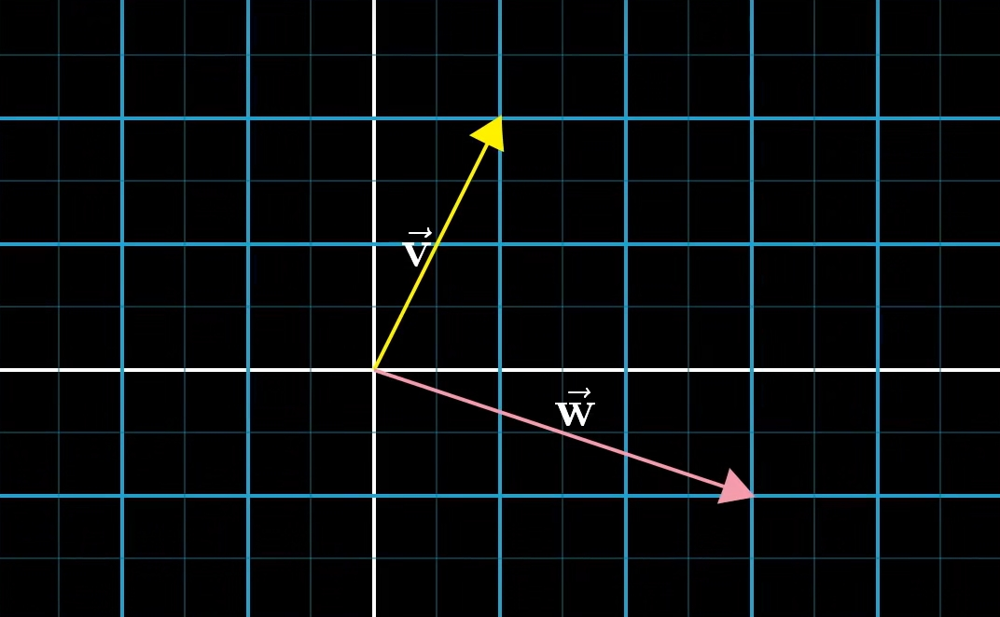
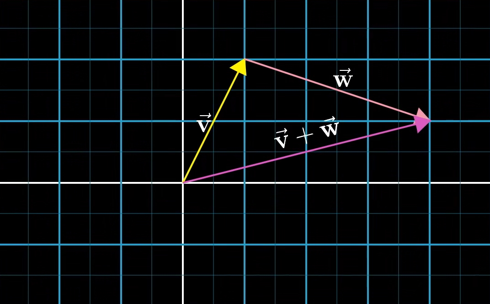
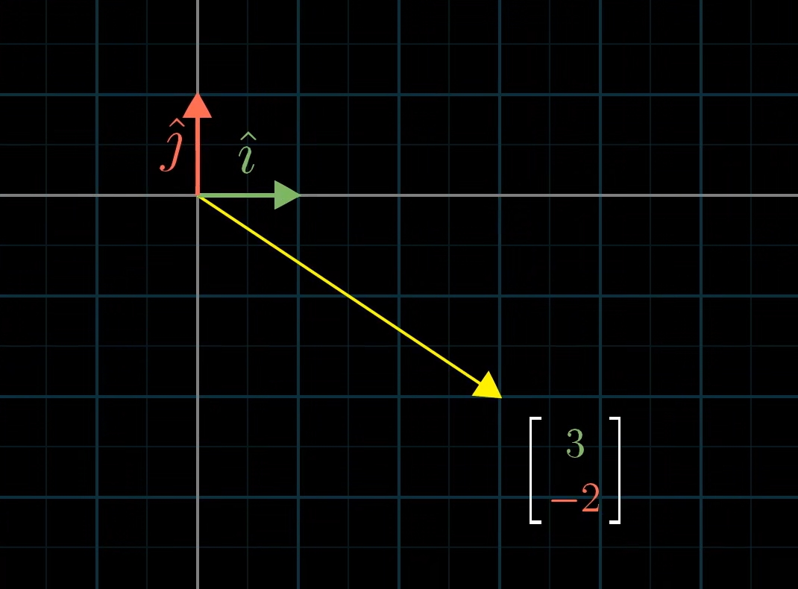
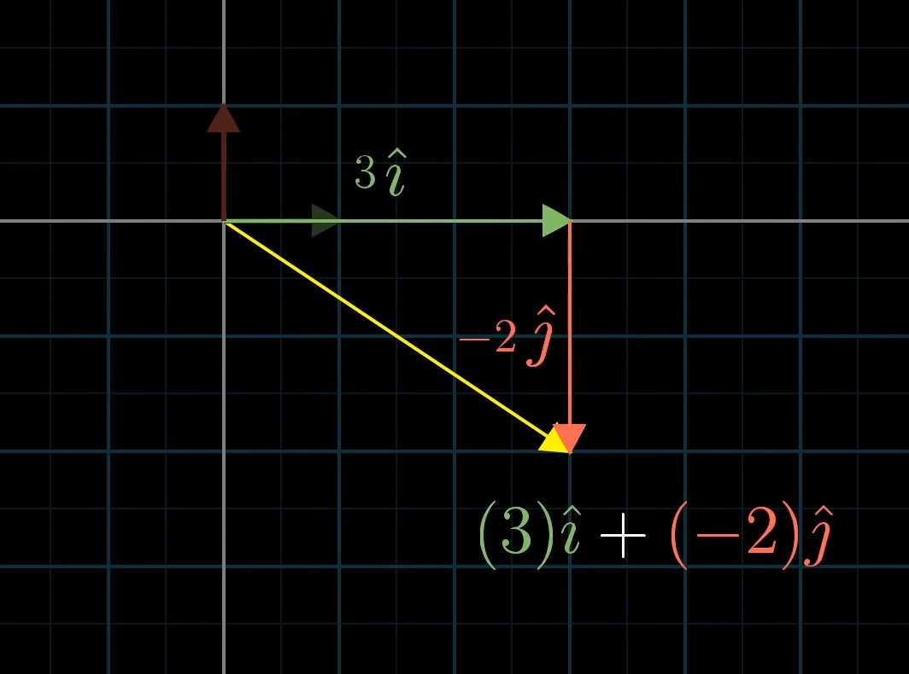
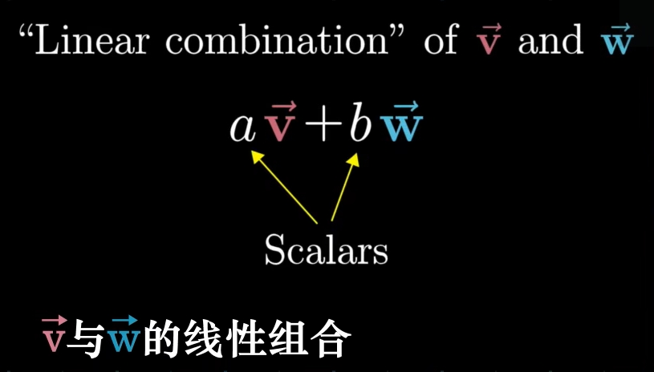

# Vector

<!-- vscode-markdown-toc -->
* 1. [数学思想](#)
	* 1.1. [模型转换/模型叠加](#-1)
	* 1.2. [长度和方向为什么可以转换为一组坐标](#-1)
* 2. [三种看待向量的方式](#-1)
	* 2.1. [物理学的角度](#-1)
	* 2.2. [计算机科学的角度](#-1)
	* 2.3. [数学的角度](#-1)
* 3. [向量加法](#-1)
* 4. [向量数乘](#-1)
* 5. [References](#References)

<!-- vscode-markdown-toc-config
	numbering=true
	autoSave=true
	/vscode-markdown-toc-config -->
<!-- /vscode-markdown-toc -->

##  1. 数学思想
###  1.1. 模型转换/模型叠加
1. 根据需要，你可以把向量理解为不同的模型，然后进行需要的计算。可以理解为：
    * 有向线段
    * 一组数值
    * 一段运动
    * 一组坐标
2. 数学本身并不是要向其他科学那样给出向量一个确定意义的模型，它只需要确保在这些模型中向量涉及的运算都是统一且正确的。
3. 我们可以根据需要或者兴趣创造出各种各样的现实抽象/现实模型（所谓的现实其中也是某个模型），如果这个现实模型可以套用向量的某个向量模型，那就可以使用向量计算。
4. 当然数学也不需要去兼容人们创造出的所有现实模型，那只要保证数学自己的这几个向量模型可以正确计算即可。其他学科如果要使用向量，就需要让自己的现实模型符合（或者经过转换后符合）向量模型中的一种。
5. 当现实模型中有某个问题无法套用现有数学模型，并且也无法转换为某个现有数学模型，那就需要数学家再创造或转换出一种新的数学模型，使得显示模型可以和这个新的数学模型相符，进而对显示模型进行计算。
6. 这里说的现实模型，比如把世界理解为三维空间的模型；而数学模型，就是类似于立体几何。那么这个三维空间的现实模型，就可以套用数学的立体集合模型进行计算。
7. 向量之所以可以作为一个广泛使用的数学工具，就是因为它自己的几个模型和众多的显示模型可以很好的相符。

### 数值和几何两种模型
1. 可以看到，向量的模型可以分类为数值和几何两种。
2. 数值问题可以使用向量计算，也可以转换为几何形式直观的展示。这种情况中，我们先把现实抽象为现实模型，然后找到其中符合向量数值模型的地方，使用向量模型进行计算，展示时还可以转换为向量的几何模型。
3. 而几何问题（空间问题）也可以转换为数值形式以使用向量进行计算。这种情况种，我们先把显示抽象为空间模型，然后再找到把空间模型中的符合向量数值模型的数值维度，使用向量进行计算。
4. 为什么数值和几何（空间）可以相互转换呢？

5. 还没有第三种模型呢？

###  1.2. 长度和方向为什么可以转换为一组坐标
1. 一个有方向的长度可以理解为一个点在空间中沿着某个方向运动一段距离到达另一个点。
2. 给这个空间添加坐标系之后，这个运动过程就是从一组坐标移动到另一组坐标。
3. 而我们把起点规定为坐标原点后，起点坐标就可以省略了。
4. 这个过程，把长度和方向转换为空间位置的改变，经历了一次模型转换。

##  2. 三种看待向量的方式
###  2.1. 物理学的角度
1. 一个向量是空间中具体特定长度和方向的有向线段。
2. 但这个线段处于空间中的哪个位置并不重要，这里只关心它的长度和方向。
3. 这里说的空间可以是二维的，也可以是三维的甚至更高维的。

###  2.2. 计算机科学的角度
1. 向量是一组有顺序的数值列表。例如可以把人的身高体重这两个值组成一个有两个数值的二维（因为有两个数值所以被叫做二维）向量，例如 $\begin{bmatrix} 180 \\ 80 \end{bmatrix}$。
2. 注意这里说的有顺序，这个身高体重的向量必须永远保持要么先身高再体重，要么先体重再身高。顺序乱变的话就没法使用了。

###  2.3. 数学的角度
1. 数学的角度并不关心一个向量具体代表着什么，它只关心向量的两种运算有意义即可：
    * 两个向量相加
    * 一个标量乘以一个向量（向量数乘）
2. 向量的一种几何表达很有趣的结合了物理学和计算机科学对向量的解释。这里我们把向量仍然解释为具有特定长度和方向的有向线段，但是并不是随意处在空间的任何位置，而是它的起点位于坐标系的原点。
3. 那么，以二位直角坐标系为例，对于一个具有确定的长度和方向的向量，它的终点也是确定的对应于直角坐标系中的一点，也就是 x 和 y 一对坐标值。
4. 通过这个几何表达，就把物理学的有向线段向量和计算机科学的有顺序数值列表的向量结合到一起了。

##  3. 向量加法
1. 理论上，我们当然可以随意定义向量加法，因为这本来就是个不存在的行为。但实际上，我们定义出的向量加法要尽可能的实用才行。
2. 还是以二维平面为例，一个 $(x, y)$ 对应一个唯一的向量，那我们就可以忽略掉向量的长度和方向这两个属性，而只用一对坐标来定义向量。
3. 如果我们把一个向量理解为坐标 $(x, y)$，那就可以进一步把它理解为从原点出发，沿着水平方向和竖直方向分别运动了 x 和 y。
4. 基于这种理解，向量的加法就可以有了一个很实用的定义。假设两个向量 $(x, y)$ 和 $(m, n)$，那它俩相加就可以理解为：从原点出发，沿着水平方向和竖直方向分别运动了 x 和 y，再沿着水平方向和竖直方向分别运动了 m 和 n。
5. 进一步的，可以理解为：从原点出发，沿着水平方向和竖直方向分别运动了 x+m 和 y+n。
6. 于是，在这种理解下定义出的向量加法就是：$(x, y) + (m, n) = (x+m, y+n)$。
7. 那么现在，向量加法的集合表达也就有了
    
    
8. 也就是把第二个向量的起点连接到第一个向量的终点，走完第一个向量接着走第二个向量，最终的结果等效于直接从原点走到移动后的第二个向量的终点。
9. 回看一下我们为了定义向量加法的建模过程：先把有向线段理解为终点坐标，再把终点坐标理解为运动距离。经过两次的建模或者说模型转换/模型叠加，我们才得以定义出现在的向量加法。而如果不进行这两次转换，其实是定义不出向量加法的。

##  4. 向量数乘
1. 我们要基于哪种向量模型定义向量数乘呢？
    * 如果使用有向线段的模型，那有向线段乘以一个数，可以定义为乘以线段的长度。当然也可以定义为乘以线段的角度，但好像还是前者更实用。
    * 如果使用一组数值的模型，那可以把数乘定义为标量乘以向量中的每个数，这个看起来很顺理成章。
    * 如果使用一段运动的模型，也可以定义为运动距离的倍数。
    * 如果使用一组坐标的模型，也可以是分别乘以每个坐标值。
2. 其中第二个定义和第四个定义很直观的可以完美兼容的，都是用标量乘以向量中的每个数。
3. 对于第一个定义，如果把有向线段起点放到原点，乘以线段长度的话，线段的方向还是不变的，只是线段的终点变了，这就和坐标的模型兼容了，因为这相当于斜率不变的直线上不同的点。而如果定义为乘以线段角度的话，就没法兼容了。
4. 对于第三个定义，同样把运动起点放到原点的话，也可以兼容了。
5. 和向量加法一样，向量数乘本身也是没有意义的，只是我们定义一个意义，让它可以符合所有的向量模型。

## 基向量（basis vectors）
1. 也就是单位向量。例如，如果把一个二维向量空间中的两个基向量定义为 $(1, 0)$ 和 $(0, 1)$，那比如向量 $(3, -2)$ 就可以理解为 $3\times(1, 0) + -2\times(0, 1) = (3, 0) + (0, -2) = (3, -2)$ 
    
    
2. 使用向量是一段运动的模型，很容易理解这种转换。或者使用一组坐标的模型，也就是分别给两个单位坐标乘以不同的倍数。
3. 这里，我们把向量里面的数值理解为系数，它们和基向量相乘相加组成最终的向量。现在，一个向量就可以表示为 $系数1\times基向量1 + 系数2\times基向量2$ 的形式了。
4. 一旦把向量里的数值理解为系数，那向量也就可以理解为使用不同的系数对基向量的缩放。选择不同的系数，就可以缩放出不同的向量。

## 线性组合
1. 接着前面使用基向量的向量表示方法，我们把两个数乘向量的和称为这两个向量的 **线性组合**（linear combination）。所以，$系数1\times基向量1 + 系数2\times基向量2$ 也就是 基向量1 和 基向量2 的线性组合
    
2. 之所以称为线性，因为如果让其中一个系数固定，而让另一个系数随意变化的话，那生成的所有的向量的终点都在一条直线上。
3. 因为，假如 系数1 随意变化，那么 $系数1\times基向量1$ 这个向量永远是在自身所在的直线上缩放的，也就是说它的终点永远在这条直线上。而 $系数2\times基向量2$ 作为加数，它的起点也就永远在这条直线上，而它的长度和方向都是固定的，所以它的终点也永远是在另一条平行的直线上。

## 张成的空间
1. 我们继续用线性组合的方式表示向量，但此时我们让两个系数都随意变化，那么，形成的每一条向量的终点，在平面坐标系上如何分布呢？
2. 对于大多数情况下，所有向量的终点就组成整个平面；而如果两个分向量共线，那所有的终点就是这条线。最特殊的，如果这两个分向量都是零向量，那终点就只有原点。
3. 对于给定线性组合，取它们所有可能得系数组合，最终形成的所有的向量的集合，称为给定向量 **张成的空间**（span）。
4. 所以，对于二维向量，它张成的空间在大多数情况下是整个所在平面；分向量共线的话，张成的空间空间就是那条线；否则就是原点一个点。
5. 可以看出来，就几何意义来说，“所有的向量的集合” 指的是向量终点的集合，或者说是使用一组坐标的向量模型的坐标集合。
6. 上面的两个分向量，我们一直是把它们理解为一个和向量的两个分向量。但我们也可以就把它们理解为两个独立的向量，这两个独立的在进行数乘和加法运算。
7. 相应的，张成的空间也就可以理解为任意两个向量通过数乘和加法运算的所有可能结果。
8. 所谓的分向量还是独立向量，其实本质上并没有区别，只不过是在某个局部结构中的不同关系而已。

### 三维的情况
1. 在三维坐标系中，任意选择两个基向量（注意在坐标系的情况中，向量的起点都是在原点的，所以这里的任意只是方向和距离），它们张成的空间是什么呢？当然也是和二维的情况一样，只要这两个基向量不是共线或者零向量，那就是一整个平面，也就是三维空间里的一个二维平面。
2. 此时如果再加一个基向量呢？此时它们的线性组合就成为了 $系数1\times基向量1 + 系数2\times基向量2 + 系数3\times基向量3$，三个向量在三维空间里依次首尾相连。它们形成的和向量的终点张成的空间是怎样的呢？
3. 如果新加的这个基向量正好位于前两个向量张成的平面上，那这个线性组合张成的空间仍然是这个平面。而如果不共面的话，那张成的空间就是三维的了，并且是整个三维空间。

### 线性相关和线性独立
1. 前面三维情况中第三个向量共面的情况下，即使移除这个向量而变为二维的，最终该线性组合张成的空间也没有任何变化，还是那个平面。
2. 我们定义，在一个线性组合中，如果移除某一个向量，并不影响该整个线性组合张成的空间，我们称这个向量和其他向量是 **线性相关**（linearly dependent）的。因为这个向量可以表示为其他向量的线性组合，因为它就在其他向量张成的空间内。
3. 相反的，如果一个向量为其他向量张成的空间又增加了新的维度，也就是扩展了其他向量张成的空间，也就是无法用其他向量的线性组合表示出这个新的向量，那这个新的向量就是和其他向量 **线性独立**（linearly independent）的。

##  5. References
* [线性代数的本质（Essence of linear algebra）](https://www.bilibili.com/video/BV1ys411472E/)