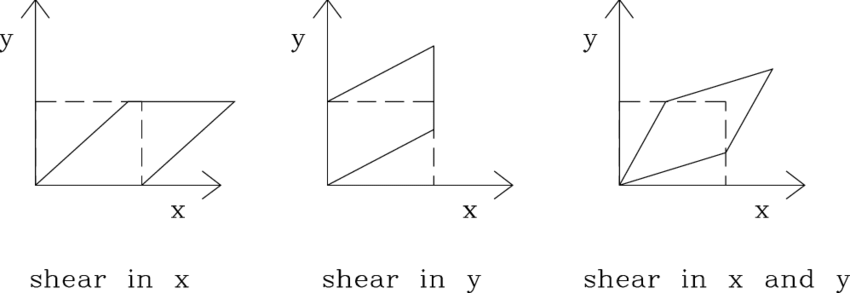

# System of linear equations

<!-- vscode-markdown-toc -->
* 1. [数学思想](#)
	* 1.1. [所谓的几何解释](#-1)
* 2. [线性方程组](#-1)
	* 2.1. [线性方程组的几何解释](#-1)
	* 2.2. [方程组的本质](#-1)
	* 2.3. [初等行变换解方程组的本质](#-1)
	* 2.4. [在方程组的几何解释中思考方程组本质](#-1)
* 3. [行化简与阶梯型矩阵](#-1)
	* 3.1. [阶梯型和简化阶梯型](#-1)
	* 3.2. [主元位置](#-1)
	* 3.3. [线性方程组的解](#-1)
	* 3.4. [存在性与唯一性](#-1)
		* 3.4.1. [存在性](#-1)
		* 3.4.2. [唯一性](#-1)
* 4. [向量方程](#-1)
	* 4.1. [向量方程和线性方程组的关系](#-1)
	* 4.2. [Span 几何解释](#Span)
* 5. [矩阵方程](#-1)
	* 5.1. [从向量方程到矩阵方程](#-1)
	* 5.2. [矩阵和向量乘法的本质](#-1)
	* 5.3. [几何解释](#-1)
	* 5.4. [分配律和结合律](#-1)
* 6. [References](#References)

<!-- vscode-markdown-toc-config
	numbering=true
	autoSave=true
	/vscode-markdown-toc-config -->
<!-- /vscode-markdown-toc -->

##  1. 数学思想
###  1.1. 所谓的几何解释
1. 几条线是更现实的东西，是感知到的；而线性方程组是抽象的符号，是纯思维的东西。
2. 所以，与其说几条直线的关系是线性方程组的几何解释，不如说是线性方程组是描述几条线关系的一种语言。
3. 但如果数学完全脱离现实，那它本身不仅没有用处，甚至也不可能存在了。比如最简单的 1+1=2，这都不是纯思维的东西，它还是通过观察现实得来的，甚至连 1 和 2 这样的概念都是从现实抽象而来的。
4. 再比如向量加法，如果不考虑现实，你可以任意定义向量的加法，但为什么要使用现在的定义呢，就是因为它是抽象自坐标系中的有方向的量的合成，这么定义就是为了给它的几何解释服务的。

### 空间/几何也只是模型，以及什么是现实？
1. 矩阵向量乘法的规则是直接定义出来的，为什么要那样定义，最初也许就是为了解决空间里向量变换的问题。
2. 数学最初是基于我们的三维世界模型的，所以就是为三维世界模型服务的，所以这样定义矩阵向量乘法合情合理。
3. 但三维空间只是我们用来解释世界而创建的三个维度的系统。同样，我们也可以定义三个维度来描述一个人，比如 身高、体重、年龄。
4. 所以说，空间或者几何依然不是最本质的东西，虽然我们可能是从它这里得出的矩阵向量乘法。
5. 更本质的是什么？信息？毕竟任何可以解释为三个维度信息的系统，都可以用三维矩阵和向量来描述。
6. 那何为现实呢？

### 数学不是认识世界的工具，而是认识世界的方式。
你给世界建立怎样的数学模型，你就是用这种模型去认识世界。

##  2. 线性方程组
###  2.1. 线性方程组的几何解释
1. 为什么二元线性方程可以解释为平面中的一条直线？
2. 因为两个未知数正好可以解释为平面中的一个坐标，除了特殊情况外，平面中有无数个点的坐标都可以让这个方程成立。
3. 但为什么这些点会连成一条直线？在同一条直线上的点有什么特征？
4. 如果学过线性方程，那可能会说特征就是：一条直线上的任意一点的坐标 $(x, y)$ 都满足 $y = ax + b$，其中 $a$ 和 $b$ 都是常数。但这其实只是线性方程标准形式的变形而已，所以这个解释就相当于说：坐标满足线性方程的点就在一条直线上。还是没有从本质上回答问题。以及，三元线性方程为什么代表着三维空间里的一个平面？TODO
5. 二元线性方程组就是平面中的两条直线，其中每一个方程的解的坐标对应某条直线上的所有点，那同时满足这两个方程的解所对应的点就必须同时在这两个直线上，也就是这两个直线的交点。
6. 当然，这里的几何解释只是线性方程组的解释之一，甚至只是它的几何解释之一。线性方程组本身是一个脱离实际的抽象概念，这里的几何解释只是说，正好可以用这个抽象概念来描述一种具象的几何现象。而这里所谓的几何解释其实也并不是解释，更准确的说，它只是意味着这个抽象的线性方程组可以描述两条线的一些性质。

###  2.2. 方程组的本质
1. 方程式代表着一种因果映射。未知数代表着要探求的因，系数代表着环境，而等号右边是因和环境相结合产生作用之后的果。
2. 对于每个方程来说，环境是固定的，结果也是固定的，我们要求的位置数就是在当前环境下会到这给定结果的原因。
3. 对于只有一个未知数的方程来说，原因只由这一个未知数决定。在这种情况下，大多数时候，决定给定结果的原因是唯一的。但也可能环境比较极端，导致不管原因怎样都会导致唯一的结果，比如 $x \times 0 + 2 = 2$。
4. 对于有两个未知数的方程来说，就是两个原因共同决定一个结果。那这两个原因的组合就不一定是唯一的，比如两个人要一起凑十块钱，就有很多种凑法。
5. 那对于二元方程组呢？它其实是在探讨两个事件。第一个事件由两个原因造成，第二个事件也由两个原因造成，然后求解的过程，就是问：有没有可能存在同样的一对原因，可以同时造成这两个事件？

###  2.3. 初等行变换解方程组的本质
1. 方程组消去一个未知数的本质是什么？对于二元方程组来说，为什么两个原因就变成一个原因了？
2. 当然，这里强行变成了一个原因后，这个原因并不一定会导致合并后的结果了。如果不会导致，那方程组就是无解。
3. 消元之后：两件事变成了一件事，少了一个原因，环境不同了，结果也不同了。为什么会这样？发生了什么？
4. 我们想要消元解方程组，就是想看看这两个原因是否可以在加诸两种给定的环境后分别导致预期的两种结果。如果这真的可以发生，那我们就可以认为：存在两个原因，当它作用域这两个环境之上时，造成了那两个结果。两个环境是给定的，两个结果也是给定的，那我们就可以认为这两个环境其实是一个整体的环境，那两个结果也是一个整体的结果。这样就把两个事件合并为一个事件了。
5. 例如，太阳磁暴爆发和地球位置正好被爆发击中这两个原因，作用在大气层上造成了极光的结果，作用在通信设备环境上造成了故障的结果。这是相同的一组原因作用于两个不同的环境造成各自对应的结果，这就相当于二元方程组有解了：这两个原因在第一个事件的环境里造成了第一个事件的预期结果；同样在第二个事件的环境里造成了第二个事件的预期结果。
6. 那么，我们就可以把这两个事件合并为一个事件：
    * 整体事件的原因是太阳磁暴爆发和地球位置正好被爆发击中这两个一组的事件；
    * 整体事件的环境是大气层和通信设备这两个的组合；
    * 整体的结果是极光和设备故障这两个的组合。
7. 本质上来说，并没有真正独立的环境或者结果，每个环境都可以再分为不同的环境，结果也是一样。所以说这种合并也是合理的。
8. 那合并过程中消去一个未知数的本质是什么呢？TODO

###  2.4. 在方程组的几何解释中思考方程组本质
TODO

##  3. 行化简与阶梯型矩阵
###  3.1. 阶梯型和简化阶梯型
* **非零行**：矩阵中至少包含一个非零元素的行。
* **先导元素**：非零行中最左边的非零元素。
* **阶梯型矩阵**：
    * 所有非零行都在零行之上；
    * 每一行的先导元素所在的列都位于前一行先导元素的右边；
    * 先导元素所在列下方的元素都是零。（上一条的推论）
* **简化阶梯型矩阵** 是满足以下两点的阶梯型矩阵：
    * 非零行的先到元素是 1；
    * 先导元素 1 是该元素所在列的唯一非零元素。
* 任何非零矩阵都可以 **行化简**（初等行变换）为阶梯型矩阵，但用不同的方法可化为不同的阶梯型矩阵。
* 一个矩阵只能化为唯一的简化阶梯型矩阵。

###  3.2. 主元位置
1. 从阶梯型矩阵转化为简化阶梯型时，先导元素的位置不会改变。TODO，为什么
2. 而一个矩阵的阶梯型不唯一，但它的简化阶梯型时唯一的，所以说一个矩阵的任意阶梯型的先导元素都在相同的位置。这些先导元素对应于简化阶梯型中的先导元素 1。
3. 定义矩阵的 **主元位置**：该矩阵的简化阶梯型中先导元素 1 的位置。
4. 定义矩阵的 **主元列**：矩阵中含有主元位置的列。
5. 一个矩阵变化为阶梯型之后可以确定主元位置。
6. **主元** 是主元位置上的元素。但是，虽然一个矩阵的主元位置是固定的，但矩阵可以进行任意行变换，所以它在主元位置上的元素不是固定的。从书上的说明（《线性代数及其应用（原书第6版）》1.2 例2）来看，这里的主元定义，取的是矩阵变为阶梯型之后，主元位置上的元素。但一个矩阵的阶梯型也不是唯一的，难道主元只是针对当前阶梯型来说的？不懂

###  3.3. 线性方程组的解
1. 对应于主元列的变量（未知数）称为 **基本变量**（也被称为先导变量，因为它们对应于包含先到元素的主元列），其他变量称为 **自由变量**。
2. 自由变量可以取任意值，然后计算出对应的基本变量的值。
3. 那也就是说，如果存在自由变量，方程组的解就不唯一。或者说，解不唯一的方程组会包含自由变量。
4. 对于有唯一解的方程组来说，化简到最后一定会至少有一个变量是一个确定的值，而且也一定能从确定值的变量推导出其他变量的值。如果有变量是无法通过确定值的变量推导出来，那它就是自由变量。

###  3.4. 存在性与唯一性
####  3.4.1. 存在性
1. 线性方程组相容的充要条件是增广矩阵的最右列不是主元列。
2. 如果最右列是主元，这个主元所在的行对应的方程式就是 $0 = b \quad (b \neq  0)$，显然导致方程组无解。
3. 这是没问题的，但为什么如果没有这种情况就一定有解呢？
4. 因为没有这种情况时，每个方程至少包含一个基本变量。这个基本变量要么可以直接表示为一个确定的值，要么可以用其他自由变量表示。
5. 如果所有基本变量都可以表示为一个确定的值，那方程组无疑具有唯一的解；如果有一个基本变量只能表示为自由变量， 那方程组无疑具有无数个解；但如果有两个基本变量都只能表示为自由变量，这两个方程之间是否会有冲突而导致整个方程组无解呢？
6. 看上去这种可能性并不存在。因为对于两个包含自由变量的解集的参数表示，它们的自由变量都在等号右边，而基本变量都在等号左边。不管自由变量有几个，它们都是可以随意取值的，在取值时至少不会冲突。取完值之后就能计算出左边的自由变量，而不同的自由变量不会出现在同一方程里，所以也不存在冲突的可能。

####  3.4.2. 唯一性
如果相容，它的解集分为两种情况：
* 没有自由变量，有唯一解；
* 有自由变量，有无穷多解。

##  4. 向量方程
###  4.1. 向量方程和线性方程组的关系
1. 向量方程中的向量是一组确定的值，权是需要求出的未知数；线性方程组的一列系数（增广矩阵的一列）是一组确定的值，一列系数也对应一个未知数。
2. 所以，向量方程和线性方程组在代数意义上可以说是一样的。在它们拥有相同的权/系数和相同未知数的情况下，两者具有相同的解集。
3. 这种联系其实就是给出了线性方程组的几何解释。线性方程组是代数的，向量很多时候在表达某种几何意义，而线性方程组的增广矩阵就相当于是向量方程的若干个向量。
4. 在这个几何意义下，我们用线性方程组的每一列系数代表线性组合转换前的一个向量，用线性方程组等号右边的列代表经过线性组合变换后的结果向量，用每一个未知数代表转换时给每一个转换前的向量乘以的倍数值。
5. 而线性方程组的解集每一个解带入到向量方程中，都会生成一个结果向量。也就是说线性方程组的一个解可以映射到向量方程的一个结果向量。那线性方程组解集所有的解映射到的所有的结果向量，就是当前向量空间的一个子集。
6. 这就是向量方程和线性方程组的关系，并不能说两者是两个东西，应该说是后者是前者的一个抽象代数表示，前者是后者的一个具象体现。

###  4.2. Span 几何解释
1. 一个 N 维向量可以解释为 N 维度空间里一个点的坐标；或者用更向量的说法，从原点到这个点的有向线段。
2. 那么 $Span\{v\}$ 就是这个有向线段乘以所有常数所得到的有向线段的集合。这个集合中的所有有向线段都落在 ${\vec{v}}$ 所在的直线上。
3. 如果用点来描述向量，那 $Span\{v\}$ 就是 ${\vec{v}}$ 所在直线上的所有的点。
4. 那对于 $Span\{u, v\}$ 的情况，就是空间里两条直线上的任意两个向量相加的集合。这个集合里所有的向量都和 ${\vec{u}}$、${\vec{v}}$ 在一个平面上，而且它们终点的点铺满了这个平面。
5. $Span\{u, v\}$ 转换成代数形式，就是一个二元方程组等号左侧所有两个式子的计算结果的集合。那么，这个二元方程组有解的情况，也就是所有两侧相等的情况，就是右侧的两个值正好是这个集合的一项。
6. 再转回几何形式，等号左侧是两个向量张成的平面，等号右侧是一个向量，它们相等的情况，就是右侧的向量位于左侧的平面中。或者说右侧向量的终点位于 $Span\{u, v\}$ 的平面上。

 
##  5. 矩阵方程
###  5.1. 从向量方程到矩阵方程
1. 只要把向量方程的若干个系数向量合并到一起写成一个矩阵，并且把作为未知数的若干个权写到一起作为一个向量，那么向量方程就可以写成矩阵方程。
2. 例如，线性方程组 
    $
    \begin{alignedat}{3}
    x_1 & +{} & 2x_2 & -{} & x_3 = 4 \\
    & -{} & 5x_2 & +{} & 3x_3 = 1
    \end{alignedat}
    $ 
    对应的向量方程是
    $
    x_1 \begin{bmatrix} 1 \\ 0 \end{bmatrix} + 
    x_2 \begin{bmatrix} 2 \\ -5 \end{bmatrix} + 
    x_3 \begin{bmatrix} -1 \\ 3 \end{bmatrix} 
    = \begin{bmatrix} 4 \\ 1 \end{bmatrix}
    $
    对应的矩阵方程是
    $
    \begin{bmatrix} 1 & 2 & -1 \\ 0 & -5 & 3 \end{bmatrix} 
    \begin{bmatrix} x_1 \\ x_2 \\ x_3 \end{bmatrix} 
    = \begin{bmatrix} 4 \\ 1 \end{bmatrix}
    $

###  5.2. 矩阵和向量乘法的本质
1. 因为这里是直接定义了它要这么相乘，所以我们就要问，为什么要这样定义？
2. 目前来看，这么定义就是为了处理空间里向量的线性变换。
3. 所以从目前来看，它本身并没有什么抽象本质或者代数本质，它就是用来计算空间线性变换的。
4. 不过话说回来，所谓的空间也不是真实的，它也只是一个物理模型。
5. 那我们现在就可以抽象出纯代数的空间，也就是由若干个维度共同组成的一个系统，这个空间的坐标就是每个维度的值。
6. 那现在，矩阵和向量的乘法就不仅可以描述向量在空间里的线性变化，它可以描述任何有若干维度的系统里的一个值的变换过程。

###  5.3. 几何解释
在 `./Matrix.md` 我们已经分析了，矩阵方程的向量代表着当前向量空间里的一个向量，而矩阵对应着对该向量进行线性变换的值，等号右边就是线性变换之后的结果向量。

###  5.4. 分配律和结合律
1. 分配律： $\boldsymbol{A} (\vec{\boldsymbol{u}} + \vec{\boldsymbol{v}}) = \boldsymbol{A} \vec{\boldsymbol{u}} + \boldsymbol{A} \vec{\boldsymbol{v}}$。
2. 左边是先对两个向量相加然后线性变换，右边是先分别对两个向量进行线性变换再相加。
3. 结合律：$\boldsymbol{A} (c \vec{\boldsymbol{u}}) = c ( \boldsymbol{A} \vec{\boldsymbol{u}})$
4. 左边是先对向量伸缩然后再线性变换，右边是先对向量线性变换然后再伸缩。

## 线性方程组的解集
### 自由变量数量和解集的几何解释
1. 只有一个自由变量时，解集是过原点的直线。
2. 解集中的每个解都是一个向量，而只要确定自由变量所对应的唯一的一个维度的值，就可以确定这个向量在空间中的位置，那这个向量必须是固定在一条直线上的。对于给定直线，你只要一个值就能和直线上的一个点一一映射；而对于给定平面，你需要两个值才能映射到平面上的一个点。

### 齐次和非齐次线性方程组解的区别
1. 齐次的解的参数向量形式是若干个参数乘以向量的形式。
2. 而非齐次因为等号右边不是零向量，而是一个和未知数无关的非零向量，那其实就相当于再零向量的基础上还要再加上一个具体的非零向量。所以它解的参数向量形式就是在齐次的形式上再加上一个没有未知数的非零向量。
3. 那么它的结合就是，以三维为例。比如不加那个非零向量时解集是一个平面，并且是过原点的。现在再加上这个向量，就是这个平面和这个向量做一个平行四边形合成，也就是平原沿着这个向量从原点移动到向量的终点。

## 向量的线性相关性
如果一个向量在其他向量的基础上创建了新的维度，那它就是和其他向量线性无关的。

## 线性变换简介
### 剪切变换
1. 水平剪切是把基向量 $\begin{bmatrix} 1 & 0 \\ 0 & 1 \end{bmatrix}$ 变成 $\begin{bmatrix} 1 & n \\ 0 & 1 \end{bmatrix}$，其中 $n \neq 0$。
2. 可以看到，水平基向量并没有发生改变，空间里的水平距离单位距离还是保持不变，而且空间也没有发生竖直方向上的移动。
3. 竖直基向量的 y 值还是之前的 1，但是 x 值不是 0 了，所以说竖直基向量的终点发生了平移，也就相当于单位正方形的上边发生了平移，从正方形变成了高度不变平行四边形，两条竖向的边不再竖直了。
4. 而如果是竖直剪切，那就是基向量变成了 $\begin{bmatrix} 1 & 0 \\ n & 1 \end{bmatrix}$。现在竖直基向量没变，但水平基向量的 y 不再是 0 了，水平基向量的终点发生了竖直移动。单位正方形变成了宽度不变的平行四边形，，两条水平的边不再水平了
	

## 线性变换的矩阵
没仔细看，那 4 个表挺直观。这些矩阵在直观的几何意义上来说是对平面的坐标进行变换，但够抽象一层就是对任何二维数据进行变换。当然也可以扩展到更高的维数。

## 商业、科学和工程中的线性模型
* 线性差分方程
* 迁移矩阵

##  6. References
* [线性代数及其应用（原书第6版）](https://book.douban.com/subject/36351050/)