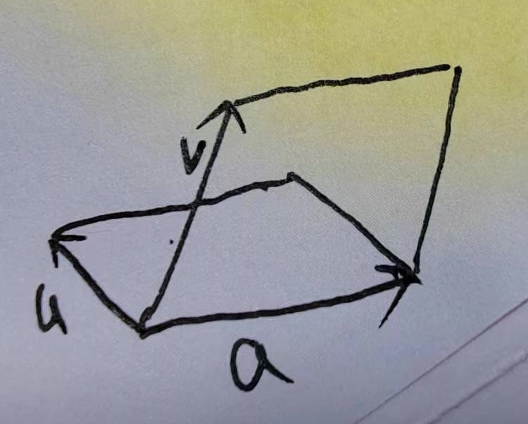
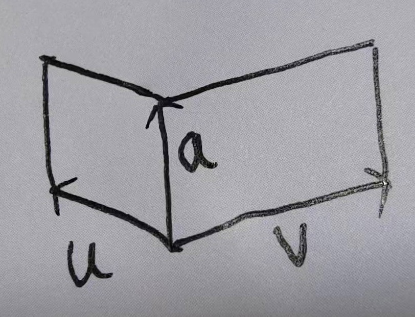

# 行列式

## 行列式简介
基本都是代数计算，没看。

## 行列式的性质
### 定理
#### 倍加
1. $\begin{bmatrix} a & b \\ c+na & d+nb \end{bmatrix}$，行列式为 $a(d+nb) - b(c+na) = ad - bc$。
2. 几何意义应该要通过平行四边的相关计算求得。

#### 置换
1. $\begin{bmatrix} c & d \\ a & b \end{bmatrix}$，行列式为 $cb - da$。
2. 对于二维方阵来说，几何意义是把每个向量的 x 和 y 值互换。也就是分别以 $x=y$ 为轴进行镜像反转。一翻转，两个向量的逆时针顺序就变了，所以正负号就翻转了；但它们的夹角并没有变，所以面积还是一样的。

#### 数乘
1. $\begin{bmatrix} a & b \\ nc & nd \end{bmatrix}$，行列式为 $nad - nbc = n(ad - bc)$。
2. 对于二维方阵来说，几何意义是把两个向量的同一个维度的坐标值都变成了原来的 n 倍，也要通过平行四边形的计算求解。

#### 定理4
行列式不为零就没有降维，没有降维就可以再逆转回来。

#### 定理5
对于二维矩阵来说，转置之后行列式的不变。

#### 定理6
1. 第一次线性变换后得到的向量作为新的基向量，它此时的 1 并不是最初的 1，而是变换的倍数 n 乘以 1；
2. 第二次线性变换以上述新的基向量为单位向量，又对它进行线性变换，假设变换为 m 倍。
3. 那第二次变换之后的值相对于最初的单位向量，实际上就是最初的 $m \times n$ 倍。
4. 最初的单位面积是 1，第一次变换后新的单位面积是 n，第二次再变换，面积就是 $m \times n$ 了。
5. 也就相当于第一次变换后的行列式再乘以第二次变换后的行列式。
6. 只对于乘法成立，对于加法不成立。看上去也要通过平行四边形的相关计算来理解。

#### 行列式函数的一个线性性质
1. $T(c\vec{x}) = cT(\vec{x})$。对于二维方阵来说，相当于让平行四边形一个边变成原来的 c 倍，那面积肯定也变成原来的 c 倍；对于三维方阵来说，相当于让平行六边形一个边变成原来的 c 倍，那体积肯定也变成原来的 c 倍。
2. $T(\vec{u} + \vec{v}) = T(\vec{u}) + T(\vec{v})$。对于二维方阵来说，相当于有两个平行四边形，它们的一个边是相同的，另一个边分别是 $\vec{u}$ 和 $\vec{v}$，那这两个平行四边形的面积之和，就等于下面这个平行四边形的和：它其中一个边是上述两个平行四边形相同的那个边，另一个边式 $\vec{u}$ 和 $\vec{v}$ 相加得到的向量所作为的边。
3. 注意，这里说这两个平行四边形相同的那个边，必须是相同的顺序，也就是说这个变在矩阵中对应的列，要么都是第一列要么都是第二列，因为函数 T 的那个未知列式固定的。体现在图形上，这个边是两个平行四边形共用的一个边，这个边必须是要么都是这两个平行四边形左边的边，要么都是右边的边。不能是左边平行四边形右边的边且是右边平行四边形左边的边。例如：下面第一张图，共用的边 $\vec{a}$ 对于两个平行四边形来说都是右边的边，这就可以；而第二张图，它是左平行四边形的右边，却是右平行四边形的左边，这个就不行
    
    
4. 可以画图看一下大概得样子，应该也可以通过平行四边形的相关计算来求得。

## 克拉默法则、体积和线性变换
* 使用克拉默法则求解线性方程组
* 使用克拉默法则求解逆矩阵
* 行列式在线性变换中对面积和体积变化的表示

##  6. References
* [线性代数及其应用（原书第6版）](https://book.douban.com/subject/36351050/)