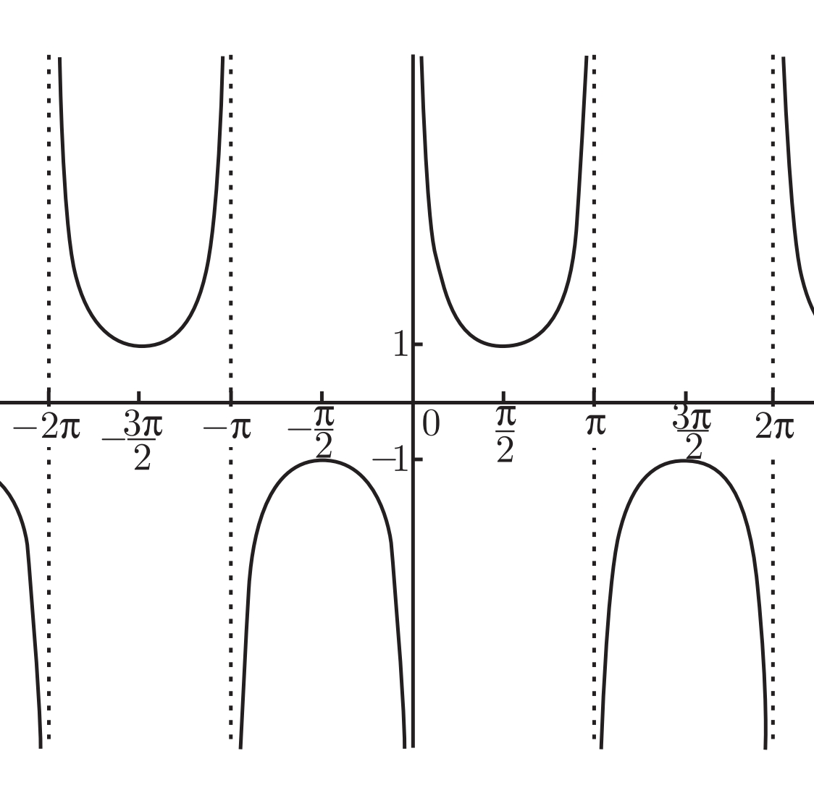
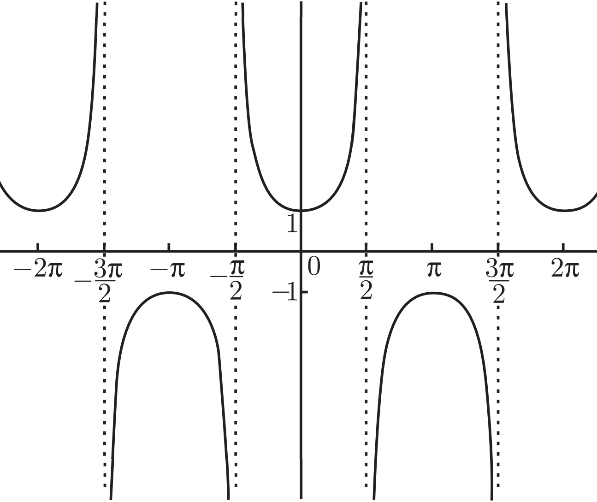

# Basic

## Misc
### 为什么参考角都是相对于 X 轴
1. 显然，如果只用三角形定义，那三角函数角度只能适用于直角三角形（比如等边三角形显然不适用三角函数），它的角度范围也只能是 0-180。
2. 但如果扩展到使用直角坐标系来定义，就可以对任何角度值求三角函数了。这时三角函数的比值就不是使用三角形的三个边，而是坐标中某个点的 x/y 坐标和 r。
3. 但即使如此，一个象限里的某个点，仍然你可能有两个参考角。想象一下，不管把参考角作为 x 轴还是 y 轴，都可以围出一个三个边为 x/y/r 的直角三角形，形成的两个参考角之和是 90°。
4. 此时，如果以靠近 x 轴的角为参考角，那它的正弦就是 $\frac{y}{r}$；如果以靠近 y 轴的角为参考角，那它的正弦就是 $\frac{x}{r}$。此时这两种定义好像都没问题。
5. 但是，想象一下以靠近 y 轴的角为参考角时，它的函数图像是怎样的。就不是那种连续的波形了。显然那种连续的波形是更常见的，所以我们要如此定义参考角。

### 正切函数的周期为什么是 π
1. r 是固定的，x、y 的周期是 2π，所以正弦余弦的周期是 2π。
2. 而正切是 $\frac{y}{x}$，两个值在一个周期的里的变化：
    y/x | 0 | π/2 | π | 3π/2 | 2π
    --|--|--|--|--|--
    **y** | 0 | 1 | 0  | -1 | 0
    **x** | 1 | 0 | -1 | 0  | 1
3. 可以看到，(0 ~ π/2) 和 (π ~ 3π/2) 这两个区间里，$\frac{y}{x}$ 是一样的值，(π/2 ~ π) 和 (3π/2 ~ 2π) 这两个区间里，$\frac{y}{x}$ 也是一样的值。

### 余割、正割和余切的图像为什么是那个样子
1. $csc(x) = \frac{1}{sin(x)}$，正弦函数和余割函数图像如下
    
    
2. $sec(x) = \frac{1}{cos(x)}$，余弦函数和正割函数图像如下
    
    
3. $cot(x) = \frac{1}{tan(x)}$，正切函数和余切函数图像如下
    
    
    