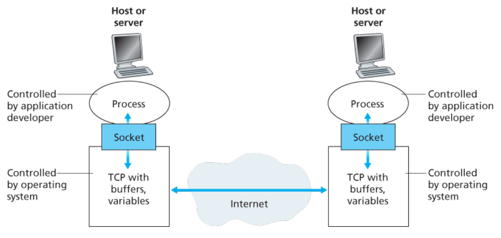

# Principles of Network Applications

<!-- TOC -->

- [Principles of Network Applications](#principles-of-network-applications)
    - [网络应用程序架构](#网络应用程序架构)
        - [Client-server architecture](#client-server-architecture)
        - [P2P architecture](#p2p-architecture)
            - [self-scalability](#self-scalability)
    - [Processes Communicating](#processes-communicating)
        - [进程与网络之间的接口](#进程与网络之间的接口)
        - [进程寻址（Addressing Processes）](#进程寻址addressing-processes)
    - [互联网提供的传输层服务](#互联网提供的传输层服务)
        - [TCP 服务](#tcp-服务)
            - [面向连接服务](#面向连接服务)
            - [可靠数据传输服务](#可靠数据传输服务)
            - [拥塞控制](#拥塞控制)
        - [UDP 服务](#udp-服务)
        - [TCP 安全性](#tcp-安全性)
    - [References](#references)

<!-- /TOC -->

## 网络应用程序架构
选择应用程序架构时，程序员可能会利用现代网络应用的两大主流架构模式之一：客户端-服务器（client-server）架构或者 P2P（peer-to-peer）架构。

### Client-server architecture
1. In a client-server architecture, there is an always-on host, called the *server*, which services requests from many other hosts, called *clients*.
2. Note that with the client-server architecture, clients do not directly communicate with each other; for example, in the Web application, two browsers do not directly communicate. 
3. Another characteristic of the client-server architecture is that the server has a fixed, well-known address, called an IP address. 
4. Because the server has a fixed, well-known address, and because the server is always on, a client can always contact the server by sending a packet to the server’s IP address.
5. Often in a client-server application, a single-server host is incapable of keeping up with all the requests from clients. For this reason, a **data center**, housing a large number of hosts, is often used to create a powerful virtual server. 
6. The most popular Internet services employ one or more data centers. A data center can have hundreds of thousands of servers, which must be powered and maintained. 
7. Additionally, the service providers must pay recurring interconnection and bandwidth costs for sending data from their data centers.

### P2P architecture
1. In a P2P architecture, there is minimal (or no) reliance on dedicated servers in data centers. Instead the application exploits direct communication between pairs of intermittently connected hosts, called **peers**. 
2. The peers are not owned by the service provider, but are instead desktops and laptops controlled
by users, with most of the peers residing in homes, universities, and offices.
3. Because the peers communicate without passing through a dedicated server, the architecture is called peer-to-peer. 
4. We mention that some applications have hybrid architectures, combining both client-server and P2P elements. For example, for many instant messaging applications, servers are used to track the IP addresses of users, but user-touser messages are sent directly between user hosts (without passing through intermediate servers).

#### self-scalability
1. One of the most compelling features of P2P architectures is their **self-scalability**. 
2. For example, in a P2P file-sharing application, although each peer generates workload by requesting files, each peer also adds service capacity to the system by distributing files to other peers. 
3. P2P architectures are also cost effective, since they normally don’t require significant server infrastructure and server bandwidth (in contrast with clients-server designs with data centers). 
4. However, P2P applications face challenges of security, performance, and reliability due to their highly decentralized structure.

## Processes Communicating
1. Before building your network application, you also need a basic understanding of how the programs, running in multiple end systems, communicate with each other. 
2. In the jargon of operating systems, it is not actually programs but processes that communicate. A process can be thought of as a program that is running within an end system. 
3. Processes on two different end systems communicate with each other by exchanging **messages** across the computer network. 
4. A sending process creates and sends messages into the network; a receiving process receives these messages and possibly responds by sending messages back. 

### 进程与网络之间的接口
1. 应用层的应用程序进程发送报文和接收报文都需要通过协议栈下层的网络，进程和下层网络的接口，是被称为 **socket** 的软件。
2. 当一个进程要发送报文时，它把报文传递给 socket，就不需要管了，因为接下来是传输层和更底层的事情，与应用层的程序无关；等报文到达目的端系统时，该端系统的传输层也是通过 socket 把报文传递给它上层的应用层里需要接收该报文的进程
    
3. socket 也被称为应用程序和网络之间的 **应用程序编程接口**（Application Programming Interface, API），因为网络应用程序就是通过 socket 来编程使用网络功能的。

### 进程寻址（Addressing Processes）
1. 为了把一个主机中某个进程的包发送到另一个主机的某个进程，发送端进程即需要知道目的端主机的地址，也需要知道是该主机的哪个进程（严格来说，是哪个 socket）。
2. 主机地址是通过 IP 地址来表示，而 **端口号**（port number）是用来标识某个主机上的某个进程的 socket 的。也就是说发送端需要知道目的地的 IP 和端口号。

## 互联网提供的传输层服务
1. The Internet (and, more generally, TCP/IP networks) makes two transport protocols available to
applications, UDP and TCP. 
2. When you (as an application developer) create a new network application for the Internet, one of the first decisions you have to make is whether to use UDP or TCP. 
3. Each of these protocols offers a different set of services to the invoking applications.

### TCP 服务
1. The TCP service model includes a connection-oriented service and a reliable data transfer service.
2. When an application invokes TCP as its transport protocol, the application receives both of these
services from TCP.

#### 面向连接服务
1. 在应用层报文开始流动之前，TCP 会让客户端和服务端交换传输层控制信息。这一过程被称为 **握手**（handshaking），它提醒客户端和服务器，让它们为即将到来的大量包做好准备。
2. 握手之后，一个 TCP 连接就在两个进程的 socket 之间建立好了。这是一个全双工连接，两个进程可以同时通过这个连接给对方发送报文。
3. 当应用程序发送报文结束后，还需要在销毁这个连接。

#### 可靠数据传输服务
1. 通信进程可以依靠 TCP 进行没有错误和顺序正常的数据发送。
2. 当一端的应用程序把字节流传递给 socket 之后，它可以信赖 TCP 把同样的字节流传送给接收端的 socket。

#### 拥塞控制
1. TCP 也有拥塞控制机制，但是这一机制并不会直接为通信进程带来好处，而是为互联网本身带来好处。
2. 当发送端和接收端之间的网络发生拥塞时，这个机制会限制发送进程。

### UDP 服务
1. UDP 是一种仅提供必要服务的情良好传输层协议。
2. UDP 是无连接的，因此在进程通信之前不会有握手。
3. UDP 提供不可靠的数据传输服务，不能保证报文一定会送到，也不能保证送到的顺序正确。
4. UDP 也没有拥塞控制机制，所以发送端的 UDP 可以以任意速率想网络层注入数据。（当然）

### TCP 安全性
1. TCP 和 UDP 都没有提供加密，报文在发送进程和接收进程之间明文传输，因此在中间的若干链路中就可能被嗅探和看到。
2. 为了更安全的传输，开发出了 TCP 的加强安全功能，就是 **安全套接字层**（Secure Sockets Layer, SSL）。
3. 使用 SSL 加强的 TCP 不仅可以实现和基础的 TCP 一样的功能，在此基础上还提供了关键的进程到进程的安全服务。包括加密、数据完整性（data integrity）和端点认证（end-point authentication）。
4. SSL 并不是传输层协议，它只是 TCP 的一个加强功能，并且是是现在应用层里的。
5. 应用程序想使用 SSL 服务时，要在客户端和服务器都添加 SSL 代码。SSL 有它自己的 socket API，和基础的 TCP socket API 类似。
6. 应用程序使用 SSL 时，发送进程把明文数据传递给 SSL socket，SSL 对数据进行加密，然后把密文发送给 TCP socket；
7. 加密数据经过网络传输到达接收方的 TCP socket 后，TCP socket 把密文传递给接收端的 SSL，SSL 对其进行解密，然后 SSL 的 socket 把明文传递给接收方进程。

## References
* [Computer Networking](https://book.douban.com/subject/10573157/)