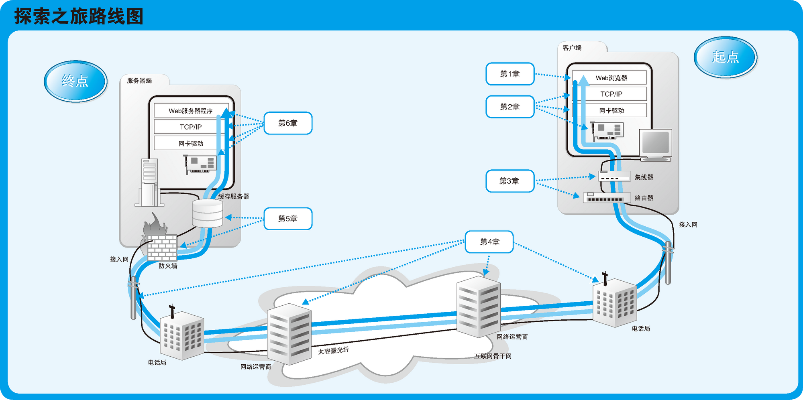
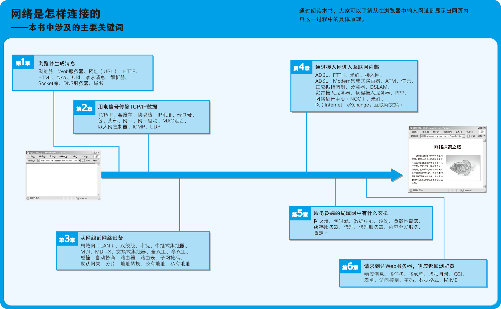

# Summary






<!-- TOC -->

- [Summary](#summary)
    - [第 1 章　Web浏览器](#第-1-章　web浏览器)
    - [第 2 章　协议栈、网卡](#第-2-章　协议栈网卡)
    - [第 3 章　集线器、交换机、路由器](#第-3-章　集线器交换机路由器)
    - [第 4 章　接入网、网络运营商](#第-4-章　接入网网络运营商)
    - [第 5 章　防火墙、缓存服务器](#第-5-章　防火墙缓存服务器)
    - [第 6 章　Web服务器](#第-6-章　web服务器)
    - [References](#references)

<!-- /TOC -->


## 第 1 章　Web浏览器
1. 我们将首先探索浏览器的工作方式。
2. 大家可以认为我们的探索之旅是从在浏览器中输入网址（URL）开始的。例如，当我们输入下面这样的网址时，浏览器就会按照一定的规则去分析这个网址的含义，然后根据其含义生成请求消息。
    ```
    http://www.lab.glasscom.com/sample1.html
    ```
3. 在上面这个例子中，浏览器生成的请求消息表示 “请给我 sample1.html 这一文件中储存的网页数据”，接着浏览器会将请求消息发送给 Web 服务器。
4. 当然，浏览器并不会亲自负责数据的传送。传送消息是搬运数字信息的机制负责的工作，因此浏览器会委托它将数据发送出去。
5. 具体来说，就是委托操作系统中的网络控制软件将消息发送给服务器。第 1 章中，我们会探索到浏览器将数据委托出去为止。


## 第 2 章　协议栈、网卡
1. 第 2 章我们将探索搬运数据的机制。
2. 其中最先出场的是协议栈（网络控制软件叫作 **协议栈**）。这个软件会将从浏览器接收到的消息打包，然后加上目的地址等控制信息。
3. 这个软件还有其他一些功能，例如当发生通信错误时重新发送包，或者调节数据发送的速率等。
4. 接下来，协议栈会将包交给 **网卡**（负责以太网或无线网络通信的硬件）。然后，网卡会将包转换为电信号并通过网线发送出去。这样一来，包就进入到网络之中了。


## 第 3 章　集线器、交换机、路由器
1. 接下来出场的物品会根据接入互联网的形式不同而不同。客户端计算机可以通过家庭或公司的局域网接入互联网，也可以单独直接接入互联网。
2. 我们的探索之旅无法涵盖所有这些可能性，因此只能以现在最典型的场景为例，假设客户端计算机是连接到家庭或公司的局域网中，然后再通过 ADSL 和光纤到户（FTTH）等宽带线路接入互联网。
3. 在这样的场景中，网卡发送的包会经过交换机等设备，到达用来接入互联网的路由器。
4. 路由器的后面就是互联网，网络运营商会负责将包送到目的地。


## 第 4 章　接入网、网络运营商
1. 接下来，数据从用来接入互联网的路由器出发，进入了互联网的内部。
2. 互联网的入口线路称为 **接入网**。一般来说，我们可以用电话线、ISDN、 ADSL、有线电视、光线、专线等多种通信线路来接入互联网，这些通信线路统称为接入网。
3. 接入网连接到签约的网络运营商，并接入被称为 **接入点**（Point of Presence，PoP）的设备。
4. 接入点的实体是一台专为运营商设计的路由器，网络包首先通过接入网被发送到接入点，然后再从这里被发送到全国甚至全世界。
5. 接入点的后面就是互联网的骨干部分了。在骨干网中存在很多运营商和大量的路由器，这些路由器相互连接，组成一张巨大的网，而我们的网络包就在其中经过若干路由器的接力，最终被发送到目标 Web 服务器上。
6. 运营商使用的路由器跟我们家用的小型路由器不一样，它是一种可以连接几十根网线的高速大型路由器。在互联网的骨干部分，存在着大量的这种路由器，它们之间以复杂的形式连接起来，而网络包就在这些路由器之间穿行。


## 第 5 章　防火墙、缓存服务器
1. 通过骨干网之后，网络包最终到达了 Web 服务器所在的局域网中。
2. 接着，它会遇到防火墙，防火墙会对进入的包进行检查。它会检查所有进入的包，看看有没有危险的包混在里面。
3. 检查完之后，网络包接下来可能还会遇到缓存服务器。网页数据中有一部分是可以重复利用的，这些可以重复利用的数据就被保存在缓存服务器中。如果要访问的网页数据正好在缓存服务器中能够找到，那么就可以不用劳烦 Web 服务器，直接从缓存服务器读出数据。
4. 此外，在大型网站中，可能还会配备将消息分布到多台 Web 服务器上的负载均衡器，还有可能会使用通过分布在整个互联网中的缓存服务器来分发内容的服务。
5. 经过这些机制之后，网络包才会到达 Web 服务器。


## 第 6 章　Web服务器
1. 当网络包到达 Web 服务器后，数据会被解包并还原为原始的请求消息，然后交给 Web 服务器程序。
2. 和客户端一样，这个操作也是由操作系统中的协议栈（网络控制软件）来完成的。
3. 接下来，Web 服务器程序分析请求消息的含义，并按照其中的指示将数据装入响应消息中，然后发回给客户端。响应消息回到客户端的过程和之前我们介绍的过程正好相反。
4. 当响应到达客户端之后，浏览器会从中读取出网页的数据并在屏幕上显示出来。
5. 到这里，访问 Web 服务器的一系列操作就全部完成了，我们的探索之旅也到达了终点。


## References
* [网络是怎样连接的](https://book.douban.com/subject/26941639/)