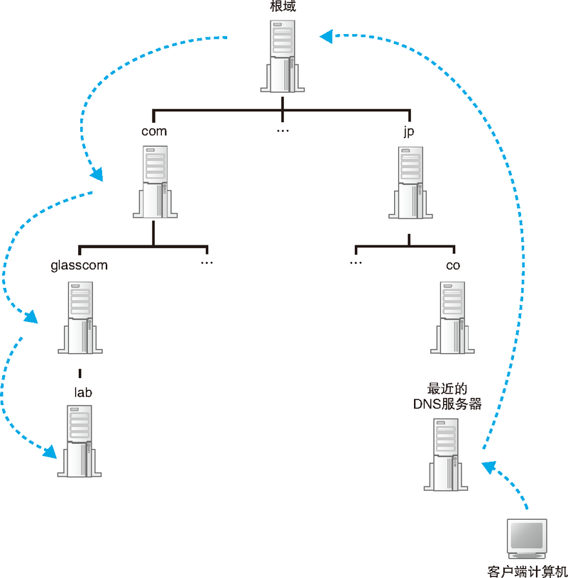
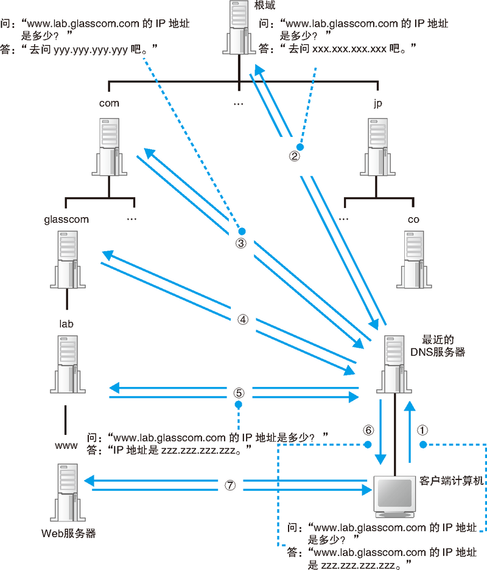
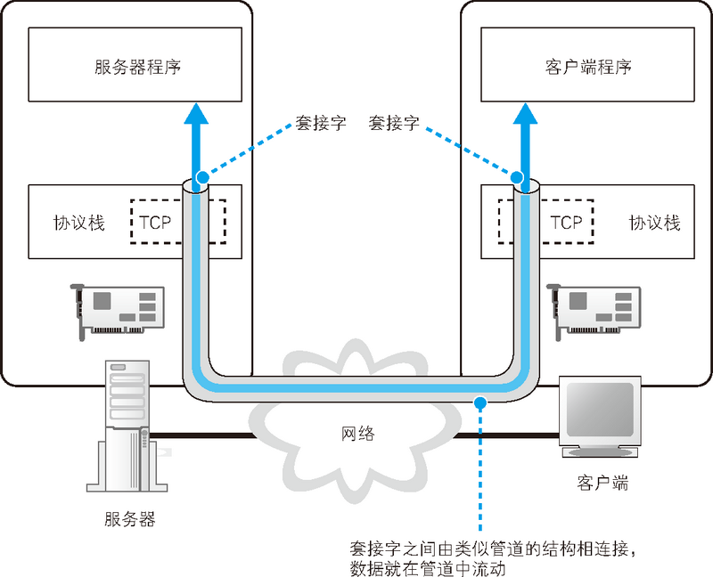
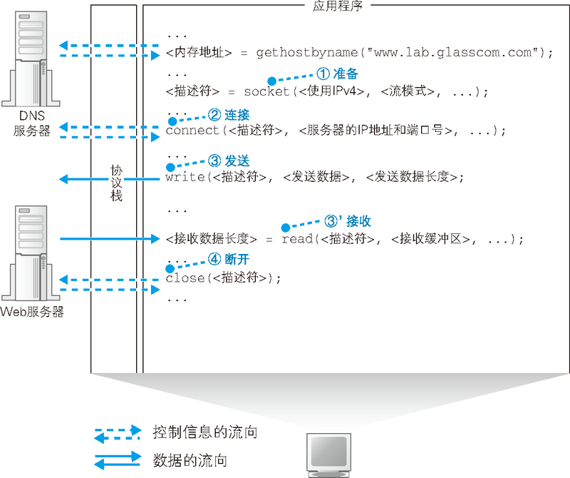

# 第 1 章　浏览器生成消息——探索浏览器内部

<!-- TOC -->

- [第 1 章　浏览器生成消息——探索浏览器内部](#第-1-章　浏览器生成消息探索浏览器内部)
    - [生成 HTTP 请求消息](#生成-http-请求消息)
        - [URL 的类型](#url-的类型)
        - [浏览器解析 URL](#浏览器解析-url)
        - [生成 HTTP 请求消息](#生成-http-请求消息-1)
    - [向 DNS 服务器查询 Web 服务器的 IP 地址](#向-dns-服务器查询-web-服务器的-ip-地址)
        - [IP 地址的基本知识](#ip-地址的基本知识)
            - [TCP/IP 的基本思路](#tcpip-的基本思路)
            - [IP 地址的组成](#ip-地址的组成)
        - [Socket 库提供查询 IP 地址的功能](#socket-库提供查询-ip-地址的功能)
            - [解析器的内部原理](#解析器的内部原理)
    - [全世界 DNS 服务器的大接力](#全世界-dns-服务器的大接力)
        - [DNS 服务器的基本工作](#dns-服务器的基本工作)
        - [域名的层次结构](#域名的层次结构)
        - [寻找相应的 DNS 服务器并获取 IP 地址](#寻找相应的-dns-服务器并获取-ip-地址)
        - [通过缓存加快 DNS 服务器的响应](#通过缓存加快-dns-服务器的响应)
    - [委托协议栈发送消息](#委托协议栈发送消息)
        - [数据收发操作概览](#数据收发操作概览)
        - [创建套接字阶段](#创建套接字阶段)
        - [连接阶段：把管道接上去](#连接阶段把管道接上去)
        - [通信阶段：传递消息](#通信阶段传递消息)
        - [断开阶段：收发数据结束](#断开阶段收发数据结束)
    - [References](#references)

<!-- /TOC -->

## 生成 HTTP 请求消息
### URL 的类型
1. 之所以有各种各样的 URL，是因为尽管我们通常是使用浏览器来访问 Web 服务器的，但实际上浏览器并不只有这一个功能，它也可以用来在 FTP 服务器上下载和上传文件，同时也具备电子邮件客户端的功能。
2. 可以说，浏览器是一个具备多种客户端功能的综合性客户端软件，因此它需要一些东西来判断应该使用其中哪种功能来访问相应的数据，而各种不同的 URL 就是用来干这个的。
3. 下图列举了现在互联网中常见的几种 URL，根据访问目标的不同，URL 的写法也会不同
    

### 浏览器解析 URL
1. 浏览器要做的第一步工作就是对 URL 进行解析，从而生成发送给 Web 服务器的请求消息。刚才我们已经讲过，URL 的格式会随着协议的不同而不同，因此下面我们以访问 Web 服务器的情况为例来进行讲解
    
2. 根据 HTTP 的规格，URL 包含上图（a）中的这几种元素。当对 URL 进行解析时，首先需要按照上图（a）的格式将其中的各个元素拆分出来。
3. 例如上图（b）中的 URL 会拆分成（c）的样子。然后，通过拆分出来的这些元素，我们就能够明白 URL 代表的含义。

### 生成 HTTP 请求消息
1. 对 URL 进行解析之后，浏览器确定了 Web 服务器和文件名，接下来就是根据这些信息来生成 HTTP 请求消息了。
2. 实际上，HTTP 消息在格式上是有严格规定的，因此浏览器会按照规定的格式来生成请求消息
    

## 向 DNS 服务器查询 Web 服务器的 IP 地址
### IP 地址的基本知识
1. 生成 HTTP 消息之后，接下来我们需要委托操作系统将消息发送给 Web 服务器。
2. 尽管浏览器能够解析网址并生成 HTTP 消息，但它本身并不具备将消息发送到网络中的功能，因此这一功能需要委托操作系统来实现。发送消息的功能对于所有的应用程序来说都是通用的，因此让操作系统来实现这一功能，其他应用程序委托操作系统来进行操作，这是一个比较合理的做法。
3. 在进行这一操作时，我们还有一个工作需要完成，那就是查询网址中服务器域名对应的 IP 地址。在委托操作系统发送消息时，必须要提供的不是通信对象的域名，而是它的 IP 地址。
4. 因此，在生成 HTTP 消息之后，下一个步骤就是根据域名查询 IP 地址。

#### TCP/IP 的基本思路
1. 互联网和公司内部的局域网都是基于 TCP/IP 的思路来设计的，所以我们先来了解 TCP/IP 的基本思路。
2. TCP/IP 的结构如下图所示，就是由一些小的子网，通过路由器连接起来组成一个大的网络
    
3. 这里的子网可以理解为用集线器连接起来的几台计算机，我们将它看作一个单位，称为 **子网**。当计算机数量较少时，可以用一台集线器连接起来；当计算机数量较多时，一台集线器可能无法连接这么多计算机，可以增加集线器数量并将集线器相互连接起来，这时，凡是通过集线器连接起来的所有设备都属于同一个子网。
4. 将子网通过路由器连接起来，就形成了一个网络（一些家用路由器中已经内置了集线器功能，因此大家可以理解为这种路由器内部同时包含路由器和集线器两种设备，它们在里面已经连接起来了）。
5. 在网络中，所有的设备都会被分配一个 IP 地址，由 **网络号** 和 **主机号** 两部分组成。网络号是分配个整个子网的，而主机号是分配给子网中的计算机的。通过 IP 地址我们可以判断出访问对象服务器的位置，从而将消息发送到服务器。
6. 发送者发出的消息首先经过子网中的集线器，转发到距离发送者最近的路由器上（上图 ①）。接下来，路由器会根据消息的目的地判断下一个路由器的位置，然后将消息发送到下一个路由器，即消息再次经过子网内的集线器被转发到下一个路由器（上图 ②）。这个过程不断重复，最终消息就被传送到了目的地。

#### IP 地址的组成
1. 如下图所示，实际的 IP 地址是一串 32 比特的数字，按照 8 比特（1 字节）为一组分成 4 组，分别用十进制表示然后再用圆点隔开
    
2. 这就是我们平常经常见到的 IP 地址格式，但仅凭这一串数字我们无法区分哪部分是网络号，哪部分是主机号。在 IP 地址的规则中，网络号和主机号连起来总共是 32 比特，但这两部分的具体结构是不固定的。在组建网络时，用户可以自行决定它们之间的分配关系，因此，我们还需要另外的附加信息来表示 IP 地址的内部结构。
3. 这一附加信息称为 **子网掩码**，是一串与 IP 地址长度相同的 32 比特数字，其左边部分都是 1，右边部分都是 0。其中，子网掩码为 1 的部分对应 IP 地址中的网络号，子网掩码为 0 的部分对应 IP 地址中的主机号
    
4. 将子网掩码按照和 IP 地址一样的方式以每 8 比特为单位用圆点分组后写在 IP 地址的右侧，这就是上上图（b）的方法。这种写法太长，我们也可以把 1 的部分的比特数用十进制表示并写在 IP 地址的右侧，如上上图（c） 所示。这两种方式只是写法上的区别，含义是完全一样的。
5. 子网掩码表示网络号与主机号之间的边界。在本例中，这个边界与字节的边界是正好吻合的，也就是正好划分在句点的位置上，实际上也可以划分在字节的中间位置。
6. 顺带一提，主机号部分的比特全部为 0 或者全部为 1 时代表两种特殊的含义。主机号部分全部为 0 代表整个子网而不是子网中的某台设备（上上图（d））。此外，主机号部分全部为 1 代表向子网上所有设备发送包，即广播（上上图（e））。

### Socket 库提供查询 IP 地址的功能
1. 向 DNS 服务器发出查询，也就是向 DNS 服务器发送查询消息，并接收服务器返回的响应消息。换句话说，对于 DNS 服务器，我们的计算机上一定有相应的 DNS 客户端。
2. 相当于 DNS 客户端的部分称为 **DNS 解析器**，或者简称解析器。通过 DNS 查询 IP 地址的操作称为 **域名解析**，因此负责执行解析（resolution）这一操作的就叫解析器（resolver）了。
3. 解析器实际上是一段程序，它包含在操作系统的 **Socket 库** 中，其中包含的程序组件可以让其他的应用程序调用操作系统的网络功能，而解析器就是这个库中的其中一种程序组件。
4. 解析器的用法非常简单。Socket 库中的程序都是标准组件，只要从应用程序中进行调用就可以了。具体来说，在编写浏览器等应用程序的时候，只要像下图这样写上解析器的程序名称 “gethostbyname” 以及 Web 服务器的域名 “www.lab.glasscom.com” 就可以了，这样就完成了对解析器的调用
    
5. 调用解析器后，解析器会向 DNS 服务器发送查询消息，然后 DNS 服务器会返回响应消息。响应消息中包含查询到的 IP 地址，解析器会取出 IP 地址，并将其写入浏览器指定的内存地址中。
6. 接下来，浏览器在向 Web 服务器发送消息时，只要从该内存地址取出 IP 地址，并将它与 HTTP 请求消息一起交给操作系统就可以了。

#### 解析器的内部原理
1. 下面来看一看当应用程序调用解析器时，解析器内部是怎样工作的。网络应用程序（在我们的场景中就是指浏览器）调用解析器时，程序的控制流程就会转移到解析器的内部
    
2. 一般来说，应用程序编写的操作内容是从上往下按顺序执行的，当到达需要调用解析器的部分时，对应的那一行程序就会被执行，应用程序本身的工作就会暂停（上图 ①）。然后，Socket 库中的解析器开始运行（上图 ②），完成应用程序委托的操作。
3. 当控制流程转移到解析器后，解析器会生成要发送给 DNS 服务器的查询消息。这个过程与浏览器生成要发送给 Web 服务器的 HTTP 请求消息的过程类似，解析器会根据 DNS 的规格，生成一条表示 “请告诉我 www.lab.glasscom.com 的 IP 地址” 的数据，准备将它发送给 DNS 服务器。
4. 发送消息这个操作并不是由解析器自身来执行，而是要委托给操作系统内部的协议栈来执行（上图 ③）。这是因为和浏览器一样，解析器本身也不具备使用网络收发数据的功能。
5. 协议栈是操作系统内部的网络控制软件，也叫 “协议驱动”、“TCP/IP 驱动” 等。解析器调用协议栈后，控制流程会再次转移，协议栈会执行发送消息的操作，然后通过网卡将消息发送给 DNS 服务器（上图 ④⑤）。
6. 当 DNS 服务器收到查询消息后，它会根据消息中的查询内容进行查询。如果要访问的 Web 服务器已经在 DNS 服务器上注册，那么这条记录就能够被找到，然后其 IP 地址会被写入响应消息并返回给客户端（上图 ⑥）。
7. 接下来，消息经过网络到达客户端，再经过协议栈被传递给解析器（上图 ⑦⑧），然后解析器读取出消息取出 IP 地址，写入应用程序指定的内存地址中（上图 ⑨）。
8. 到这里，解析器的工作就完成了，控制流程重新回到应用程序（浏览器），现在应用程序已经能够从内存中取出 IP 地址了。
9. 顺带一提，向 DNS 服务器发送消息时，我们当然也需要知道 DNS 服务器的 IP 地址。只不过这个 IP 地址是作为 TCP/IP 的一个设置项目事先设置好的，不需要再去查询了。

## 全世界 DNS 服务器的大接力
### DNS 服务器的基本工作
1. 前文介绍了解析器与 DNS 服务器之间的交互过程，下面来了解一下 DNS 服务器的工作。DNS 服务器的基本工作就是接收来自客户端的查询消息，然后根据消息的内容返回响应。
2. 其中，来自客户端的查询消息包含以下 3 种信息。
    * **域名**。服务器、邮件服务器（邮件地址中 `@` 后面的部分）的名称。
    * **Class**。在最早设计 DNS 方案时，DNS 在互联网以外的其他网络中的应用也被考虑到了，而 Class 就是用来识别网络的信息。不过，如今除了互联网并没有其他的网络了，因此 Class 的值永远是代表互联网的 IN。
    * **记录类型**。表示域名对应何种类型的记录。例如，当类型为 A 时，表示域名对应的是 IP 地址；当类型为 MX 时，表示域名对应的是邮件服务器。对于不同的记录类型，服务器向客户端返回的信息也会不同。
3. DNS 服务器上事先保存有前面这 3 种信息对应的记录数据，DNS 服务器就是根据这些记录查找符合查询请求的内容并对客户端作出响应的
    
4. 例如，如果要查询 www.lab.glasscom.com 这个域名对应的 IP 地址，客户端会向 DNS 服务器发送包含以下信息的查询消息
    * 域名 = www.lab.glasscom.com
    * Class = IN
    * 记录类型 = A

### 域名的层次结构
1. 在前面的讲解中，我们假设要查询的信息已经保存在 DNS 服务器内部的记录中了。如果是在像公司内部网络这样 Web 和邮件服务器数量有限的环境中，所有的信息都可以保存在一台 DNS 服务器中，其工作方式也就完全符合我们前面讲解的内容。
2. 然而，互联网中存在着不计其数的服务器，将这些服务器的信息全部保存在一台 DNS 服务器中是不可能的，因此一定会出现在 DNS 服务器中找不到要查询的信息的情况。下面来看一看此时 DNS 服务器是如何工作的。
3. 我们先来看一看信息是如何在 DNS 服务器上注册并保存的。
4. 首先，DNS 服务器中的所有信息都是按照域名以分层次的结构来保存的。DNS 中的域名都是用句点来分隔的，比如 www.lab.glasscom.com，这里的句点代表了不同层次之间的界限。
5. 相当于一个层级的部分称为 **域**。因此，com 域的下一层是 glasscom 域，再下一层是 lab 域，再下面才是 www 这个名字。
6. 这种具有层次结构的域名信息会注册到 DNS 服务器中，而每个域都是作为一个整体来处理的。换句话说就是，一个域的信息是作为一个整体存放在 DNS 服务器中的，不能将一个域拆开来存放在多台 DNS 服务器中。
7. 不过，DNS 服务器和域之间的关系也并不总是一对一的，一台 DNS 服务器中也可以存放多个域的信息。为了避免把事情搞得太复杂，这里先假设一台 DNS 服务器中只存放一个域的信息，后面的讲解也是基于这个前提来进行的。
8. 于是，DNS 服务器也具有了像域名一样的层次结构，每个域的信息都存放在相应层级的 DNS 服务器中。

### 寻找相应的 DNS 服务器并获取 IP 地址
1. 下面再来看一看如何找到 DNS 服务器中存放的信息。这里的关键在于如何找到我们要访问的 Web 服务器的信息归哪一台 DNS 服务器管。
2. 我们可以采用下面的办法：首先，将负责管理下级域的 DNS 服务器的 IP 地址注册到它们的上级 DNS 服务器中，然后上级 DNS 服务器的 IP 地址再注册到更上一级的 DNS 服务器中，以此类推。
3. 也就是说，负责管理 lab.glasscom.com 这个域的 DNS 服务器的 IP 地址需要注册到 glasscom.com 域的 DNS 服务器中，而 glasscom.com 域的 DNS 服务器的 IP 地址又需要注册到 com 域的 DNS 服务器中。
4. 这样，我们就可以通过上级 DNS 服务器查询出下级 DNS 服务器的 IP 地址，也就可以向下级 DNS 服务器发送查询请求了。
5. 在互联网中，com 和 jp 的上面还有一级域，称为 **根域**。根域不像 com、jp 那样有自己的名字，因此在一般书写域名时经常被省略，如果要明确表示根域，应该像 www.lab.glasscom.com. 这样在域名的最后再加上一个句点，而这个最后的句点就代表根域。
6. 根域的 DNS 服务器中保存着 **顶级域**（Top-Level Domain, TLD）的映射，也就是 com、jp 这一级的。由于上级 DNS 服务器保管着所有下级 DNS 服务器的信息，所以我们可以从根域开始一路往下顺藤摸瓜找到任意一个域的 DNS 服务器。
7. 除此之外还需要完成另一项工作，那就是将根域的 DNS 服务器信息保存在互联网中所有的 DNS 服务器中。这样一来，任何 DNS 服务器就都可以找到并访问根域 DNS 服务器了。因此，客户端只要能够找到任意一台 DNS 服务器，就可以通过它找到根域 DNS 服务器，然后再一路顺藤摸瓜找到位于下层的某台目标 DNS 服务器
    
8. 分配给根域 DNS 服务器的 IP 地址在全世界仅有 13 个，而且这些地址几乎不发生变化，因此将这些地址保存在所有的 DNS 服务器中也并不是一件难事。实际上，根域 DNS 服务器的相关信息已经包含在 DNS 服务器程序的配置文件中了，因此只要安装了 DNS 服务器程序，这些信息也就被自动配置好了。
9. 实际请求时，请求并不是直接的按照根域名服务器、顶级域名服务器……的次序转发的，而是每次都要回到最开始发起请求的域名服务器，让它每次都自己去请求下一级的域名服务器
    

### 通过缓存加快 DNS 服务器的响应
1. 上图展示的是基本原理，与真实互联网中的工作方式还是有一些区别的。在真实的互联网中，一台 DNS 服务器可以管理多个域的信息，因此并不是每个域都有一台自己的 DNS 服务器，上级域和下级域有可能共享同一台 DNS 服务器。
2. 此外，有时候并不需要从最上级的根域开始查找，因为 DNS 服务器有一个缓存功能，可以记住之前查询过的域名。如果要查询的域名和相关信息已经在缓存中，那么就可以直接返回响应，接下来的查询可以从缓存的位置开始向下进行。相比每次都从根域找起来说，缓存可以减少查询所需的时间。并且，当要查询的域名不存在时，“不存在” 这一响应结果也会被缓存。这样，当下次查询这个不存在的域名时，也可以快速响应。
3. 这个缓存机制中有一点需要注意，那就是信息被缓存后，原本的注册信息可能会发生改变，这时缓存中的信息就有可能是不正确的。因此，DNS 服务器中保存的信息都设置有一个有效期，当缓存中的信息超过有效期后，数据就会从缓存中删除。而且，在对查询进行响应时，DNS 服务器也会告知客户端这一响应的结果是来自缓存中还是来自负责管理该域名的 DNS 服务器。

## 委托协议栈发送消息
### 数据收发操作概览
1. 知道了 IP 地址之后，就可以委托操作系统内部的协议栈向这个目标 IP 地址，也就是我们要访问的 Web 服务器发送消息了。
2. 和向 DNS 服务器查询 IP 地址的操作一样，向操作系统内部的协议栈发出委托时，也需要按照指定的顺序来调用 Socket 库中的程序组件。不过，查询 IP 地址只需要调用一个程序组件就可以了，而这里需要按照指定的顺序调用多个程序组件。我们先来介绍一下收发数据操作的整体思路。
3. 使用 Socket 库来收发数据的操作过程如下图所示
    
    简单来说，收发数据的两台计算机之间连接了一条数据通道，数据沿着这条通道流动，最终到达目的地。
4. 在进行收发数据操作之前，双方需要先建立起这条管道才行。建立管道的关键在于管道两端的数据出入口，这些出入口称为 **套接字**。我们需要先创建套接字，然后再将套接字连接起来形成管道。
5. 实际的过程中，服务器一方先创建套接字，然后等待客户端向该套接字连接管道。服务器程序一般会在启动后就创建好套接字并等待客户端连接管道。
6. 客户端也会先创建一个套接字，然后从该套接字延伸出管道，最后管道连接到服务器端的套接字上。当双方的套接字连接起来之后，通信准备就完成了。接下来，只要将数据送入套接字就可以收发数据了。
7. 当数据全部发送完毕之后，连接的管道将会被断开。管道在连接时是由客户端发起的，但在断开时可以由客户端或服务器任意一方发起，具体的顺序是根据应用程序的规则来决定的。其中一方断开后，另一方也会随之断开，当管道断开后，套接字也会被删除。到此为止，通信操作就结束了。
8. 综上所述，收发数据的操作可以大致总结为以下 4 个阶段
    1. 创建套接字（创建套接字阶段）
    2. 将管道连接到服务器端的套接字上（连接阶段）
    3. 收发数据（通信阶段）
    4. 断开管道并删除套接字（断开阶段）
9. 这 4 个操作都是由操作系统中的协议栈来执行的，浏览器等应用程序并不会自己去做连接管道、放入数据这些工作，而是委托协议栈来代劳。这些委托的操作都是通过调用 Socket 库中的程序组件来执行的，这些程序组件其实仅仅充当了一个桥梁的角色，并不执行任何实质性的操作，应用程序的委托内容最终会被原原本本地传递给协议栈。

### 创建套接字阶段
1. 下面我们就来探索一下应用程序（浏览器）委托收发数据的过程。这个过程的关键点就是像对 DNS 服务器发送查询一样，调用 Socket 库中的特定程序组件。
2. 访问 DNS 服务器时我们调用的是一个叫作 gethostbyname 的程序组件（也就是解析器），而这一次则需要按照一定的顺序调用若干个程序组件，其过程如下图所示
    
3. 首先是套接字创建阶段。客户端创建套接字的操作非常简单，只要调用 Socket 库中的 socket 程序组件就可以了。（这里出现了 Socket、socket、套接字（英文也是 socket）等看起来非常容易混淆的词，其中小写的 socket 表示程序组件的名称，大写字母开头的 Socket 表示库，而汉字的 “套接字” 则表示管道两端的接口。）
4. 和调用解析器一样，调用 socket 之后，控制流程会转移到 socket 内部并执行创建套接字的操作，完成之后控制流程又会被移交回应用程序。
5. 套接字创建完成后，协议栈会返回一个描述符，应用程序会将收到的描述符存放在内存中。描述符是用来识别不同的套接字的，因为计算机中会同时进行多个数据的通信操作，有多个数据收发操作在同时进行，也就需要创建两个不同的套接字。在这样的情况下，我们就需要一种方法来识别出某个特定的套接字，这种方法就是描述符。

### 连接阶段：把管道接上去
1. 接下来，我们需要委托协议栈将客户端创建的套接字与服务器那边的套接字连接起来。
2. 应用程序通过调用 Socket 库中的名为 connect 的程序组件来完成这一操作。这里的要点是当调用 connect 时，需要指定描述符、服务器 IP 地址和端口号这 3 个参数。
3. 第 1 个参数，即描述符，就是在创建套接字的时候由协议栈返回的那个描述符。connect 会将应用程序指定的描述符告知协议栈，然后协议栈根据这个描述符来判断到底使用哪一个套接字去和服务器端的套接字进行连接，并执行连接的操作。
4. 第 2 个参数，即服务器 IP 地址，就是通过 DNS 服务器查询得到的我们要访问的服务器的 IP 地址。
5. 第 3 个参数，即端口号。仅仅知道 IP 地址是不够的的，IP 地址是为了区分网络中的各个计算机而分配的数值。（准确地说，IP 地址不是分配给每一台设备的，而是分配给设备中安装的网络硬件的。因此，如果一台设备中安装了多个网络硬件，那么就会有多个 IP 地址。）因此，知道了 IP 地址，我们可以识别出网络上的某台计算机。但是，连接操作的对象是某个具体的套接字，因此必须要识别到具体的套接字才行，而仅凭 IP 地址是无法做到这一点的。当同时指定 IP 地址和端口号时，就可以明确识别出某台具体的计算机上的某个具体的套接字。
6. 可能大家还有一个疑问，既然确定连接对象的套接字需要使用端口号，那么服务器也得知道客户端套接字的端口号才行吧，这个问题是怎么解决的呢？事情是这样的，首先，客户端在创建套接字时，协议栈会为这个套接字随便分配一个端口号。接下来，当协议栈执行连接操作时，会将这个随便分配的端口号通知给服务器。

### 通信阶段：传递消息
1. 当套接字连接起来之后，剩下的事情就简单了。只要将数据送入套接字，数据就会被发送到对方的套接字中。
2. 当然，应用程序无法直接控制套接字，因此还是要通过 Socket 库委托协议栈来完成这个操作。这个操作需要使用 write 这个程序组件，具体过程如下。
3. 首先，应用程序需要在内存中准备好要发送的数据。根据用户输入的网址生成的 HTTP 请求消息就是我们要发送的数据。
4. 接下来，当调用 write 时，需要指定描述符和发送数据，然后协议栈就会将数据发送到服务器。由于套接字中已经保存了已连接的通信对象的相关信息，所以只要通过描述符指定套接字，就可以识别出通信对象，并向其发送数据。
5. 接着，发送数据会通过网络到达我们要访问的服务器。
6. 接下来，服务器执行接收操作，解析收到的数据内容并执行相应的操作，向客户端返回响应消息。
7. 当消息返回后，需要执行的是接收消息的操作。接收消息的操作是通过 Socket 库中的 read 程序组件委托协议栈来完成的。
8. 调用 read 时需要指定用于存放接收到的响应消息的内存地址，这一内存地址称为 **接收缓冲区**。于是，当服务器返回响应消息时，read 就会负责将接收到的响应消息存放到接收缓冲区中。由于接收缓冲区是一块位于应用程序内部的内存空间，因此当消息被存放到接收缓冲区中时，就相当于已经转交给了应用程序。

### 断开阶段：收发数据结束
1. 当浏览器收到数据之后，收发数据的过程就结束了。接下来，我们需要调用 Socket 库的 close 程序组件进入断开阶段。最终，连接在套接字之间的管道会被断开，套接字本身也会被删除。断开的过程如下。
2. Web 使用的 HTTP 协议规定，当 Web 服务器发送完响应消息之后，应该主动执行断开操作，因此 Web 服务器会首先调用 close 来断开连接。（根据应用种类不同，客户端和服务器哪一方先执行 close 都有可能。有些应用中是客户端先执行 close，而另外一些应用中则是服务器先执行 close。）
3. 断开操作传达到客户端之后，客户端的套接字也会进入断开阶段。
4. 接下来，当浏览器调用 read 执行接收数据操作时，read 会告知浏览器收发数据操作已结束，连接已经断开。浏览器得知后，也会调用 close 进入断开阶段。
5. 每获取一次数据，就要执行一次连接、发送请求消息、接收响应消息、断开的过程。对于同一台服务器来说，重复连接和断开显然是效率很低的，因此后来人们又设计出了能够在一次连接中收发多个请求和响应的方法。在 HTTP 版本 1.1 中就可以使用这种方法，在这种情况下，当所有数据都请求完成后，浏览器会主动触发断开连接的操作。

## References
* [网络是怎样连接的](https://book.douban.com/subject/26941639/)