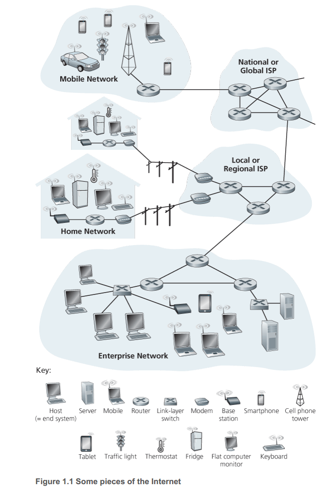

# 什么是互联网

<!-- TOC -->

- [什么是互联网](#什么是互联网)
    - [结构性描述](#结构性描述)
        - [通信链路](#通信链路)
        - [分组交换机](#分组交换机)
        - [ISP](#isp)
        - [协议](#协议)

<!-- /TOC -->

## 结构性描述 
1. 互联网是连接大量计算设备的网络
    
2. 这些设备被称为 **主机**（hosts） 或者 **端系统**（end systems）。
3. 端系统通过 **通信链路**（communication link） 和 **分组交换机**（packet switch） 连接起来。
4. 端系统通过 ISP 接入互联网，在通过通信链路和分组交换机发送和接收信息时，要遵守一定的协议。

### 通信链路
1. 通信链路有很多种类型，由不同的物理介质构成，例如同轴电缆、光线、无线电波等。
2. 不同的链路有不同的 **传输速率**（transmission rate），可以通过比特每秒（bit/s, bps）为单位来衡量。
3. 当一个端系统要给另一个端系统发送数据时，发送端会将数据分段，然后给每一段都加上首部字节（header bytes）。每一个分段的数据再加上首部字节合起来称为一个 **分组**（packet）。
4. 这些分组通过网络发送到目的地端系统后，再组装为原始的信息。

### 分组交换机
1. 分组交换机通过它的入链路接收分组，然后再通过它的出链路转发分组。
2. 分组交换机有多种类型，但最主要的是 **路由器**（router） 和 **链路层交换机**（link-layer switch）。链路层交换机主要用于接入网，而路由器主要用于网络核心。
3. 一个分组从发送端到接收端所经历的一些列的通信链路和分组交换机，被称为通过该网络的 **路径**（route or path）。

### ISP
1. 端系统通过 **网络服务提供商** (Internet Service Provider, ISP) 接入互联网。每个 ISP 自身也是若干个分组交换机和若干个通信链路组成的网络。
2. 为了使所有的端系统可以连接，ISP 也必须要实现互联。低层的 ISP 通过国家或国际的高层 ISP 互联，高层的 ISP 使用高速路由器和高速光线链路互联。
3. 不管是底层还是高层的 ISP 都是独立管理的，运行 IP 协议，并遵守一定的命名和地址惯例。

### 协议
1. 不管是端系统、分组交换机还是互联网的其他部分，都运行着一些列的协议，这些协议控制着信息在互联网中的发送和接收。
2. TCP（Transmission Control Protocol，传输控制协议）和 IP（Internet Protocol，网际协议）是互联网中最重要的两个协议。IP 协议指定了在路由器和端系统间发送的分组的格式。