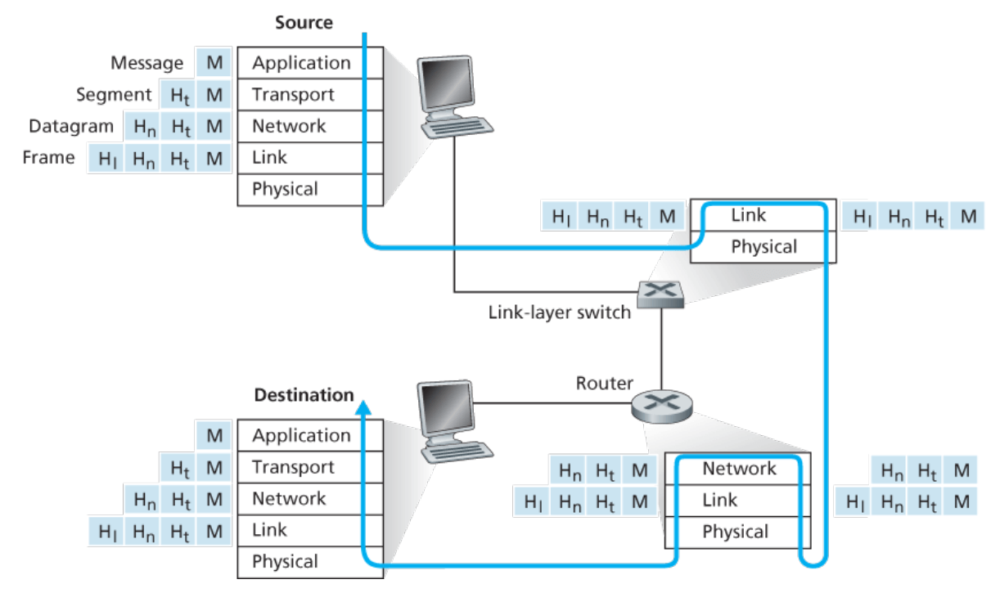

# Protocol Layers and Their Service Models

<!-- TOC -->

- [Protocol Layers and Their Service Models](#protocol-layers-and-their-service-models)
    - [分层结构](#分层结构)
        - [设计思想](#设计思想)
        - [协议分层](#协议分层)
    - [协议栈](#协议栈)
        - [应用层](#应用层)
        - [传输层](#传输层)
        - [网络层](#网络层)
        - [链路层](#链路层)
        - [物理层](#物理层)
    - [封装](#封装)
        - [对数据的封装](#对数据的封装)
    - [References](#references)

<!-- /TOC -->

## 分层结构
### 设计思想
1. 根据 SRP 的思想，根据不同的功能将复杂的互联网设计为分层架构，可以让我们更清晰的理解其中不同的部分，并且更好的设计每个部分。
2. SRP 之后，就可以实现功能与实现的分离，也就是对不同的功能分层进行封装。这就使得修改其中某层的内部实现时更加简单。只要该层向上层提供的服务不变，并且仍然使用下层提供的服务，那么修改当前层的实现就不会对系统的其它层产生影响。
3. 对于不断变化的复杂系统，这样的设计是的理解和更新都变得更简单。

### 协议分层
1. 网络设计者通过 **分层**（layer）的形式，组织网络的葛总协议，同时也组织实现这些协议的网路硬件和软件。
2. 每一层利用下层所提供的的 **服务**（service），加上本层的一些功能，再向它的上层提供服务。每层提供的服务称为该层的 **服务模型**（service model）。 
3. 一个协议层可以说通过软件、硬件或两者结合的方式来实现。比如说应用层和传输层的协议都是通过端系统的软件来实现；物理层和数据链路层处理指定链路中的传输，它们的协议是在网络接口卡中实现；而网络层协议通常是硬件和软件结合来实现。

## 协议栈
1. 各个协议分层组合到一起形成栈式的逻辑结构，称为 **协议栈**（protocol stack）。
2. 互联网协议栈包含五层，从上到下分别是：应用（application）层、传输（transport）层、网络（network）层、链路（link）层和物理（physical）层。

### 应用层
1. 应用层包括网络应用程序和它们的应用层协议。
2. 应用层协议分布存在于多个端系统，一个端系统上的应用程序根据协议与另一个端系统上的应用程序交换信息包。
3. 我们把应用层的信息包称为 **报文**（message）。

### 传输层
1. 传输层在应用程序端点之间传输应用层的报文。
2. 有两种传输层协议，TCP 和 UDP，两者都能够传输应用层报文。
3. TCP 提供面向连接的（connection-oriented）服务。这种服务包括确保应用层报文成功传输到目的地，以及对传输过程的流量控制（flow control，匹配发送和接收速率）。
4. TCP 还会把长的报文分为短的分段（segment）进行传输；并提供拥塞控制（congestion-control）机制，这样在网络拥塞的时候，源主机可以控制自己的传输速率。
5. UDP 向应用程序提供无连接（connectionless）的服务，只提供很必要的功能。UDP 没有可靠性保障，没有流量控制，也没有拥塞控制。
6. 传输层的包称为 **报文段**（segment）。

### 网络层
1. 网络层的包称为 **数据报**（datagram）。网络层就是负责把数据报从一个主机发送到另一个主机。
2. 源主机的传输层的协议把要发送的报文段和目的地地址发给网络层，网络层负责把数据报传送到目的主机的传输层。
3. 网络层协议包括著名的 IP 协议。IP 协议定义了数据报的各字段，以及端系统和路由器怎么处理这些字段。
4. 网络层中负责该功能的只有 IP 协议，所有包含网络层协议的组件都会运行 IP 协议。
5. 网络层还包含路由协议，路由协议负责确定数据报在源主机和目的主机之间的传输路径。
6. 与 IP 协议不同，负责路由的协议有很多。互联网是网络的网络，在一个网络内，管理者可以随意选择自己想要的路由协议。

### 链路层
1. 网络层在源和目的地之间通过一系列的路由器路由数据报。为了将包从路径上的一个节点（主机或者路由器）发送到下一个节点，网络层需要依赖链路层提供的服务。
2. 具体来说，在每个节点，网络层把数据报向下传递给链路层，链路层会把数据报传递给下一个节点。下一个节点在接收到链路层发来的数据报后，再向上传递给网络层。
3. 链路层的服务依赖于部署于链路上的链路层协议。比如某些链路层协议提供了可靠的传输，从发送节点发出，通过链路，到达接收节点。注意这里说的可靠传输和传输层 TCP 的可靠传输不同，前者节点到节点的，而后者是端系统到端系统的。
4. 链路层的协议包括以太网协议、WiFi 协议、DOCSIS 协议等。数据报通常都需要经过多个链路才能到达目的地的，所以数据报可能会被路径上不同链路上的不同链路层协议处理。
5. 我们把链路层的包称为 **帧**（frame）。

### 物理层
1. 链路层的工作室把数据帧从一个节点传送到下一个节点，而物理层的工作就是具体的移动帧中的每个比特。
2. 物理层的协议适合具体的链路相关联的，并且依赖于链路的具体传输介质。例如，以太网有多种物理层协议：有用于双绞铜线的，有用于同轴电缆的，还有用于光纤的等等。
3. 对于不同介质的不同协议，一个比特都会以不同的方式在链路中移动。

## 封装
1. 下图展示了一条物理路径：数据从发送端系统的协议栈的应用层开始下行，在中介的链路层交换机和路由器的协议栈中上上下下，然后到达接收端系统，并在其协议栈中上行到达应用层
    
2. 路由器和链路层交换机都是包交换机，也都把各自的网络硬件和软件组织成了分层结构。但是从图中可以看到，两种都没有实现完整的协议栈层级，它们通常都只实现下面的几层。
3. 主机实现了完整的五层协议栈，这也说明了互联网架构把它的复杂性更多的放在了网络边缘。

### 对数据的封装
1. 在发送端，一个应用层报文 $M$ 被传递给传输层。在最简单的情况下，传输层给这个报文添加上额外的首部信息 $H_t$，该首部信息会被接收端的传输层使用，例如错误校验位。传输层给报文添加的首部信息后，封装为一个整体，也就是传输层报文段。
2. 传输层把报文段传递给下层的网络层，网络层也会添加上自己的首部 $H_n$，其中包括发送端和接收端的地址等信息。封装为一个整体后成为网络层数据报。
3. 数据报同样会被向下传递给链路层，同样在链路层也会添加首部信息并封装为链路层帧。

## References
* [Computer Networking](https://book.douban.com/subject/10573157/)