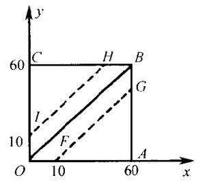

# Probability

<!-- TOC -->

- [Probability](#probability)
    - [0. 思想](#0-思想)
        - [几何概率的思想](#几何概率的思想)
    - [1. 概率是什么](#1-概率是什么)
        - [1.1 主观概率](#11-主观概率)
            - [1.1.1 主观概率准确性比较低的原因](#111-主观概率准确性比较低的原因)
                - [做出主观概率判断时，掌握的信息少](#做出主观概率判断时掌握的信息少)
                - [做出主观概率判断时还有可能收到感情的影响](#做出主观概率判断时还有可能收到感情的影响)
            - [1.1.2 主观概率的意义](#112-主观概率的意义)
                - [没那么 “科学”，但也是有理性基础的](#没那么-科学但也是有理性基础的)
                - [错误的信息，也是信息](#错误的信息也是信息)
        - [1.2 试验与事件](#12-试验与事件)
            - [1.2.1 “事件” 的含义](#121-事件-的含义)
                - [“试验” 和 “观察”](#试验-和-观察)
                - [事件是试验的某种结果陈述](#事件是试验的某种结果陈述)
                - [基本事件](#基本事件)
                - [随机事件、必然事件和不可能事件](#随机事件必然事件和不可能事件)
        - [1.3 古典概率](#13-古典概率)
            - [1.3.1 等可能试验](#131-等可能试验)
            - [1.3.2 古典概率的定义](#132-古典概率的定义)
            - [1.3.3 分赌本问题](#133-分赌本问题)
            - [1.3.4 几何概率](#134-几何概率)
        - [1.4 概率的统计定义](#14-概率的统计定义)
        - [1.5 概率的公理化定义](#15-概率的公理化定义)
    - [2. 古典概率的计算](#2-古典概率的计算)
        - [2.1 排列组合的几个简单公式](#21-排列组合的几个简单公式)
            - [2.1.1 排列的计算公式](#211-排列的计算公式)
            - [2.1.2 组合的计算公式](#212-组合的计算公式)
            - [2.1.3 与二项式展开的关系](#213-与二项式展开的关系)
                - [为什么每一项的指数之和都是 $n$](#为什么每一项的指数之和都是-n)
                - [为什么是 $\Big(_i^n\Big)$](#为什么是-\big_i^n\big)
                - [二项式展开公式推导出其他几个公式](#二项式展开公式推导出其他几个公式)
    - [References](#references)

<!-- /TOC -->

## 0. 思想
### 几何概率的思想
为什么可以用几何来表示问题的？

## 1. 概率是什么
### 1.1 主观概率
#### 1.1.1 主观概率准确性比较低的原因
##### 做出主观概率判断时，掌握的信息少
1. 如果你只掌握了一点信息，就让你下结论，那肯定算是主观概率。
2. 但随着你掌握的信息越来越多，你给出的概率就越来越准确，也就越来越客观。
3. 从这个角度来说，主观客观并没有明显的界限，只是给出概率时掌握信息多少的区别。
4. 而且，掌握信息的多少，这个标准都不一定客观。
5. 人们常常对于某事以为掌握了够多了，给出的判断却与事实大相径庭，结果一分析，要么就是漏掉了重要的信息，要么就是掌握了错误的信息。

##### 做出主观概率判断时还有可能收到感情的影响
1. 这种例子不胜枚举，比如说 “我不相信我的宝贝儿子会做出那样的事情”，哈哈哈。
2. 不过话说回来，做出这种判断的人，不也是常常认为自己挺客观吗。
3. 情感、欲望之类的，也常常会在潜意识的层次里影响我们的理性，这也不是什么新鲜的事情了。
4. 甚至，不是说肠道细菌都会左右人类的理性和情感吗。

#### 1.1.2 主观概率的意义
##### 没那么 “科学”，但也是有理性基础的
尝试、经验帮助我们做出的判断，虽然谈不上很科学，但也常常是有事实基础的。

##### 错误的信息，也是信息
1. 如果你知道这个人做的主观概率判断，虽然你不会信他，但你却可以了解到他的某些心智情况。
2. 推广到群体，群里的盲目或者非理性，也是很有研究价值的，也可以反映出集体共同的心理特征，甚至对事情的结果产生重要影响。

### 1.2 试验与事件
#### 1.2.1 “事件” 的含义
##### “试验” 和 “观察”
1. 事件属于一个明确界定的试验或者观察。
2. “试验” 一词一般认为有认为主动的意思，而 “观察” 一词则倾向于非人为的行为。这里暂不区分，统称试验。

##### 事件是试验的某种结果陈述
1. 这个试验的可能结果是在试验前就明确的，比如掷骰子，在掷之前就知道值只可能有 6 中。可以把这个试验简记为 $(1, 2, …, 6)$。
2. 在不少情况下，我们不能确切知道一个试验的全部可能结果，但可以知道它不超过某个范围。
3. 我们有一个明确的陈述，这个陈述界定了试验全部可能结果中某一确定的部分。这个陈述，或者说这一确定的部分，就叫做一个事件。
4. 在掷骰子的试验中，我们可以定义许多事件，例如
    * $E_1 = \{掷出偶数点\} = (2, 4, 6)$
    * $E_2 = \{掷出素数点\} = (2, 3, 4)$
    * $E_3 = \{掷出 3 的倍数\} = (3, 6)$  

    它们分别明确界定了全部试验结果集合 $(1, 2, …, 6)$ 中的一个相应部分
5. 如果我们先把做一次试验，当投掷的结果为 2 或者 4 或者 6 时，我们说事件 $E_1$ “发生了”，不然就说事件 $E_1$ “不发生”。
6. 因此，我们可以说：事件是与试验结果有关的一个命题，其正确与否取决于试验结果如何。

##### 基本事件
1. 在概率论上，有时把单一的试验结果称为一个 “基本事件”。
2. 这样，一个或一些基本事件并在一起，就构成了一个事件，而基本事件本身也是事件。
3. 在掷骰子的例子中， 有 1, 2, …, 6 等 6 个基本事件。而事件 $E_2$ 则是由 2, 3, 5 这三个基本事件并成。

##### 随机事件、必然事件和不可能事件
1. 在概率论中，常称事件为 “随机事件” 或 “偶然事件”。
2. 随机事件的极端情况有 “必然事件” 和 “不可能事件”。虽然这两种情况不再随机，但为了方便计，不妨把它们视为随机事件的特例，即概率为 1 和 0 的随机事件。

### 1.3 古典概率
#### 1.3.1 等可能试验
假定某个试验有有限个可能的结果，且从该试验的条件和实施方法上分析，我们找不到任何理由认为其中某一结果比任一其他结果更有可能发生，那么我们常把这样的试验结果称为 “等可能的”。

#### 1.3.2 古典概率的定义
设一个试验有 $N$ 个等可能的结果，而事件 $E$ 包含其中的 $M$ 个结果，则事件 $E$ 的概率记为 $P(E)$，定义为

$$P(E) = M/N$$

#### 1.3.3 分赌本问题
1. 甲乙两人毒技相同，即每局的胜负为等可能事件。各出赌注 500 元。约定：谁先胜三局，则谁拿走全部 1000 元。
2. 现已赌了三局，甲二胜一负。
3. 现在因故要中止赌博，问这 1000 元要如何分才公平？
4. 一种直观的分发是按已胜局数分，即甲拿 2/3，乙拿 1/3，但实际并不合理。因为在当前的局数下，甲乙最终获胜的概率比并不是 2:1。
5. 假设继续赌两局，则结果无非是以下四种情况之一：
    * 甲胜 甲胜
    * 甲胜 乙胜
    * 乙胜 甲胜
    * 乙胜 乙胜
6. 可以看出来，前三种结果都会导致甲的最终胜利；而只有第四种结果乙才会最终胜利。
7. 我们已经假定每局结果为等可能事件，因此在中止比赛时的局数下，甲乙最终获胜的可能性之比为 3:1。
8. 我在看到上面推理的时候，觉得有些奇怪，因为想法是：再来一局甲就可能最终胜利，为什么要直接计算两局的？
9. 不过即使这样想，也可以推出相同的结论：再来一局，50% 的可能甲最终胜利，50% 的可能拖到最后一局；最后一局又会平分后 50% 的概率。最终甲获胜的概率还是 75%。不知道这样的想法有没有问题。

#### 1.3.4 几何概率
1. 古典概率的局限性很显然：它只能用于全部试验结果为有限个，且等可能性成立的情况。
2. 但在某些情况下，这个概念可稍稍引申到试验结果有无限多的情况，这就是所谓的 “几何概率”。
3. 举例问题：甲乙二人约定 1 点到 2 点之间在某处碰头，约定先到者等候 10 分钟即离去。设想二人各自随意在 1-2 点之间选一个时刻到达，问 “甲乙二人能碰上” 这事件 $E$ 的概率是多少？
4. 以 1 点钟作为原点，一分为单位，把甲乙各自到达的时间 $x, y$ 构成的点标在直角坐标系上。
    
5. 要求等待不超过 10 分钟，其实也就是要求某一点的 $x$ 坐标和 $y$ 坐标相差不超过 10。
6. 对角线 $OB$ 上的点代表两人同时到达，从该对角线出发沿着水平或数值方向平移 10 个单位所在的点就是正好差 10 分钟。
7. 因此只有在点 $(x, y)$ 落在多边形 $OFGBHI$ 内时，事件 $E$ 才发生。通过计算面积，可以算出事件 $E$ 的概率 $P(E) = 11/36$。
8. 本例中因为以分钟为单位长度，所以正方形中有有限的 3600 个点，所以其实用古典概率的代数方法也是可解的。
9. 但如果我们不以分钟来计到达时间，而是以任意一个时刻，也就是说到的时间可能是 “1点12分3.54565443秒”。至少从数学上来说，这个正方形就可以包含无限个点。在这种情况下，古典概率定义就无法使用了，但依然可以使用面积来计算。
10. 就本例而言，重要之点在于把等可能性解释或引申为 “等面积”。其他一些可用几何概率处理的问题，都需要做类似的引申。

### 1.4 概率的统计定义
1. 从实用的角度看，概率的统计定义无非是一种通过实验去 **估计** 事件概率的方法。
2. 统计出的某事件发生的频率只是概率的估计而非概率本身。
3. 形式上，可以用下面的说法来解脱这个困难：
    >把事件 $E$ 的概率定义为具有如下性质的一个数 $p$：当把试验重复时，$E$ 的频率在 $p$ 的附近摆动，且当重复次数增大时，这摆动越来越小。更准确的说：概率就是当试验次数无限增大时频率的极限。
4. 要这样做，就必须回答下述问题：你怎样证明具有上述性质的数 $p$ 存在，抑或 $p$ 的存在只是一种假定？
5. “概率的统计定义” 的重要性，不在于它提供了一种定义概率的方法，它实际上并没有提供这种方法，因为你永远不可能依据这个定义确切定出任何一件事情的概率。
6. 其重要性在于两点：
    * 提供了一种估计概率的方法。即通过大量抽样来估计某个事件的概率。
    * 提供了一种检验理论正确与否的准则。如果根据一个理论推算出某事件的概率，则我们可以通过大量重复的试验来验证概率，从而判断该理论是否正确。

### 1.5 概率的公理化定义

## 2. 古典概率的计算
### 2.1 排列组合的几个简单公式
#### 2.1.1 排列的计算公式
1. 排列的计算公式比较好理解，$P_n^r = n(n-1)(n-2)…(n-r+1)$。
2. 可以用阶乘来表示：$P_n^r = \frac{n!}{(n-r)!}$。
3. 当 $r=n$ 时，也就是对 $n$ 个数进行排列，如果用上面第一个公式容易理解，就是 $n!$；如果用第二个分数的公式，则分母会是 $0!$，这看起来很奇怪。
4. 不过我们约定 $0!$ 等于 1，而且从实际的计算结果来看，确实也应该这么约定。

#### 2.1.2 组合的计算公式
1. $C_n^r$ 可以看做是排列 $P_n^r$ 的一个子集，因为 $P_n^r$ 不仅包括了每一种组合，还包括了每种组合不同的顺序。
2. 例如 $abc$、$acb$、$bac$、$bca$、$cab$、$cba$ 是这三个字母的六种排列情况，但如果考虑组合的话，其实这六个都是同一个组合。
3. 所以，组合的计算可以在排列的基础上筛选掉重复的排列即可。
4. 筛选的原理：
    1. 从 $n$ 个物件里挑选 $r$ 个进行组合，有 $C_n^r$ 个组合；
    2. 而这里面的每个组合又分别有 $r!$ 种排列方式；
    3. 所以 $C_n^r * r! = P_n^r$，即 $C_n^r = \frac{P_n^r}{r!}$
5. 所以组合的计算公式就是
    $C_n^r = \frac{n!}{r!(n-r)!}$

#### 2.1.3 与二项式展开的关系
$(a+b)^n=\sum_{i=1}^n \Big(_i^n\Big)a^ib^{n-i}$

##### 为什么每一项的指数之和都是 $n$
1. 因为 $(a+b)^n = (a+b)(a+b)...(a+b)$.
2. 我们先按照排列的方式展开，也就是说不考虑乘法交换律，不合并同类项。比如说 $(a+b)^2$ 展开为 $a^2 + ba + ab + b^2$。
3. 可以看到，每一个 $(a+b)$ 中的 $a$ 和 $b$ 都会分别和前面的每一项相乘，然后项数就会翻倍。
4. 如果 $n=3$，那就会有第三个 $(a+b)$，里面的 $a$ 和 $b$ 也会分别和它前面结果（$a^2 + ba + ab + b^2$）里的每一项相乘，结果就会得到 8 项。
5. 因为是 3 个 $(a+b)$ 相乘，且每次都是后面的 $a$ 和 $b$ 分别和前面的每一个都相乘，所以 8 项的每一项的 $a$ 和 $b$ 的总和个数都是三个。
6. 同理推广到 $n$ 个 $(a+b)$ 相乘的情况是，最后结果的每一项中 $a$ 和 $b$ 的总和个数就是 $n$ 个。

##### 为什么是 $\Big(_i^n\Big)$
1. 上面讨论的是排列的情况，因此展开后每一项的系数都是 1，因为在不考虑乘法交换律的情况下，每一项都是不一样的。
2. 现在考虑组合的情况，合并诸如 $ab$ 和 $ba$ 这样的项。考虑 $(a+b)^5$ 展开后 $a^3b^2$ 这样的项，有多少个？
3. 其实就是问，在一个长度为 5 的空位里，放进去 3 个 $a$，有几种放法。有几种放法，就证明有几个同类项，也就是该同类项前面的系数是几。
4. 因为 3 个 $a$ 没有区别，所以这是一个组合问题而不是排列问题。即 $aaabb$ 的放法，和把前两个 $a$ 颠倒之后的 $aaabb$ 的放法是一样的。所以系数就是 $C_5^3$，即 $\Big(_3^5\Big)$，或者可以写成 $\Big(_2^5\Big)$，值都是一样的。
5. 推广到一般情况，就是 $\Big(_i^n\Big)$。另外，也可以写成 $\Big(_{n-i}^n\Big)$，

##### 二项式展开公式推导出其他几个公式
1. 写公式太麻烦，直接看书。
2. 注意第三个公式的推导中就用到了 $\Big(_{n-i}^n\Big)$ 的形式。

## References
* [概率论与数理统计](https://book.douban.com/subject/2201479/)