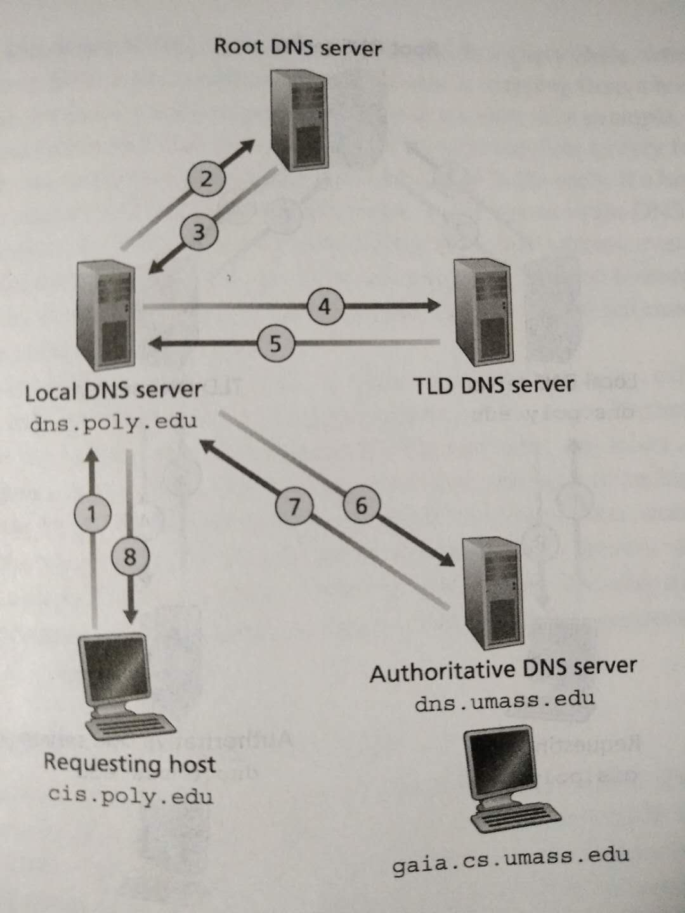

## Basic

## What is Domain Name System
1. The DNS is a distributed database implemented in a hierarchy of DNS servers
and an application-layer protocol that allows hosts to query the distributed
database.
2. The DNS servers are often UNIX machines running the Berkeley Internet Name
Domain (BIND) software [BIND 2009].
3. The DNS protocol runs over UDP and uses port 53.
4. DNS is commonly employed by other application-layer protocols -- including
HTTP, SMTP, and FTP -- to translate user-supplied hostnames to IP addresses.

## Other services
DNS provides a few other important services in addition to translating hotsnames
to IP addresses:
#### Host aliasing
一个主机会有一个复杂的 canonical hostname，同时也可以有若干个便于记忆的别名。DNS 可以
从应用程序提供的别名获得对应的 canonical hostname。

#### Main server aliasing
同上

#### Load distribution
1. Busy sites, such as `cnn.com`, are replicated over multiple servers, with
each server running on a different end system and each having a different IP
address.
2. Fro replicated Web servers, a set of IP addresses is thus associated with one
canonical hostname. The DNS database contains this set of IP addresses.
3. When clients make a DNS query for a name mapped to a set of addresses, the
server responds with the entire set of IP addresses, but rotates the ordering of
the address within each replay. Because a client typically sents its HTTP
request message to the IP address that is listed first in the set, DNS rotation
distributes the traffic among the replicated servers.
4. DNS rotation is also used for e-mail so that multiple mail servers can
have the same alias name.
5. **DNS rotation**：比如一个域名对应3个IP，DNS 数据库里存储为 `[IP1, IP2, IP3]`。所
谓 rotation，就是每次响应查询时，都会循环改变返回的IP名单的顺序。例如第一次响应
`[IP1, IP2, IP3]`，第二次响应 `[IP2, IP3, IP1]`，第二次响应 `[IP3, IP1, IP2]`，第四
次响应 `[IP1, IP2, IP3]`。因为客户端都是读取列表中的第一个，所以保证了每次访问的服务器
都是不同的，实现了负载均衡。这种机制的另一个名字叫做
[Round-robin DNS](https://en.wikipedia.org/wiki/Round-robin_DNS)。

## A Distributed, Hierarchical Database
In fact, the DNS is a wonderful example of how a distributed database can be
implemented in the Internet.

### Three classes of DNS servers
#### 1. Root DNS servers
截至2016年2月，全世界一共有13个根服务器（域名），每个根服务器（域名）由很多台服务器共同
组成。这些机器分布在全世界，方便就近查询。

#### 2. Top-level DNS servers (TLD)
These servers are responsible for top-level domains such as `com`, `org`, and
all of the country top-level domains such as `uk`, `fr`.

#### 3. Authoritative DNS servers

### ISP local DNS server
1. The root, TLD, and authoritative DNS servers all belong to the hierarchy of
DNS servers. There is another important type of DNS server call the local DNS
server.
2. A local DNS server dose not strictly belong to the hierarchy of servers but
is nevertheless central to the DNS architecture.
3.  Each ISP -- such as a university, an academic department, an employee's
company, or a residential ISP -- has a local DNS server (also called a default
name Server). When a host connects to an ISP, the ISP provides the host with the
IP addresses of one or more of its local DNS servers. 这是自动获取，也可以手动设定
指定的本地 DNS 服务器地址。
4. A host's local DNS server is typically "close to" the host. For an
institutional ISP the local DNS server may be on the same LAN as the host; for a
residential ISP, it is typically separated from the host by no more than a few
routers.
5. When a host makes a DNS query, the query is sent to the local DNS server,
which acts a proxy, forwarding the query into the DNS server hierarchy.

## 一次无缓存的 DNS 解析过程
假设 `cis.poly.edu` 想获取 `gaia.cs.umass.edu` 的 IP 地址：
1. The host `cis.poly.edu` first sends a DNS query message to its local DNS
server, `dns.poly.edu`. The query message contains the hostname to be translated
, namely, `gaia.cs.umass.edu`.
2. The local DNS server forwards the query message to a root DNS server.
3. The root DNS server takes note of the `edu` suffix and returns to the local
DNS server a list of IP addresses for TLD servers responsible for `edu`.
4. The local DNS server then resends the query message to one of these TLD
servers.
5. The TLD server takes note of the `umass.edu` suffix and responds with the IP
address of the authoritative DNS server for the University of Massachusetts,
namely, `dns.umass.edu`.
6. Finally, the local DNS server resends the query message directly to
`dns.umass.edu`, which responds with the IP address of `gaia.cs.umass.edu`.  

  

* 主机向本地域名服务器的查询一般采用递归查询（recursive query），即提交请求后，本地域名
服务器在返回之前还要进行其他的查询请求。
* 本地域名服务器向其他域名服务器的查询一般采用迭代查询（iterative query），即每次请求
提交后都会先得到返回，然后再进行下一次针对其他域名服务器的请求。

### 更多的层级
1. 实际情况中，大部分情况下，上面的 `dns.umass.edu` 并不是最终的权限域名服务器，而只是
一个中间层。
2. 假设 UMASS 每个院系都有自己的 DNS 服务器，这个服务器才是院系内每个主机的权限域名服务
器。
3. In this case, when the intermediate DNS server, `dns.umass.edu`, receives a
query for a host with a hostname ending with `cs.umass.edu`, it returns to
`dns.poly.edu` the IP address of `dns.cs.umass.edu`, which is authoritative for
all hostnames ending with `cs.umass.edu`.
4. The local DNS server `dns.poly.edu` then sends the query to the authoritative
DNS server, which returns the desired mapping to the local DNS server, which in
turn returns the mapping to the requesting host.

## DNS Caching
1. Our discussion thus far has ignored DNS caching, a critically important
feature of the DNS system.
2. In truth, DNS extensively exploits DNS caching in order to improve the delay
performance and to reduce the number of DNS messages ricocheting around the
Internet.
3. 除了各级服务器的缓存，主机在本地也会建立自己的缓存。最近使用过的域名可以不发送请求即
获得 IP 地址。

## References
* [计算机网络：自顶向下方法（第5版 影印版）](https://book.douban.com/subject/26910203/)
* [计算机网络（第7版）](https://book.douban.com/subject/26960678/)
