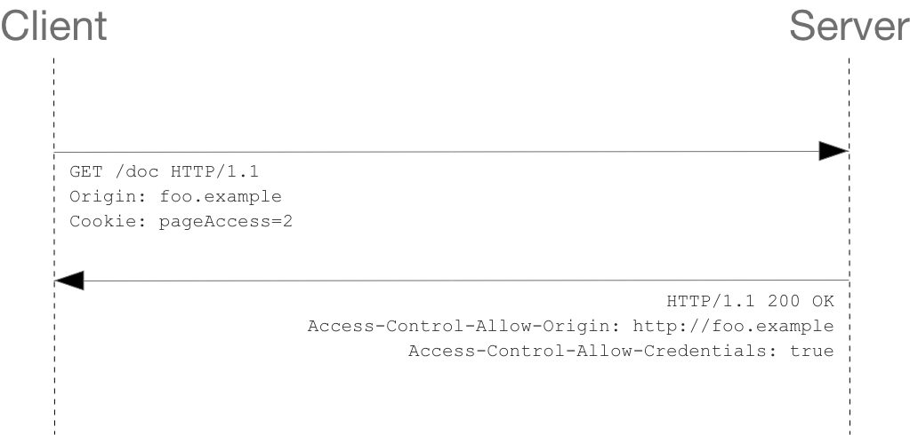

# CORS Access Control


<!-- TOC -->

- [CORS Access Control](#cors-access-control)
    - [概述](#概述)
    - [什么情况下需要 CORS](#什么情况下需要-cors)
    - [功能概述](#功能概述)
    - [简单 CORS 请求](#简单-cors-请求)
    - [带预检的 CORS 请求](#带预检的-cors-请求)
        - [一些特殊情况](#一些特殊情况)
    - [附带身份凭证的请求](#附带身份凭证的请求)
        - [通配符的使用限制](#通配符的使用限制)
    - [`Access-Control-Expose-Headers`](#access-control-expose-headers)
    - [CORS 涉及的首部](#cors-涉及的首部)
        - [Request](#request)
        - [Response](#response)
    - [Chrome 中跨域 POST 请求 localhost 时的问题](#chrome-中跨域-post-请求-localhost-时的问题)
        - [问题情况](#问题情况)
        - [原因及解决方法](#原因及解决方法)
    - [References](#references)

<!-- /TOC -->


## 概述
1. 出于安全考虑（防止 CSRF），web 会根据同源政策（same-origin policy）限制跨源的请求响应。
2. 正是出于这个原因，对于 `XMLHttpRequest` 和 Fetch API，一个应用程序调用这两类接口时，在默认状态下只能请求当前源的资源。如果对其他源发起请求，则无法成功得到响应。
3. 但是，服务端可以进行一些设置，也就是添加一些 CORS 响应首部，使得其他源的访问也可以得到响应。
4. CORS（Cross-Origin Resource Sharing）是一种基于 HTTP 首部的机制，它允许服务器指定一些其他的 “白名单” 源，从这些源里可以向本源发起的请求，可以在受限制的情况下得到响应。


## 什么情况下需要 CORS 
This cross-origin sharing standard can enable cross-site HTTP requests for:
* 通过 `XMLHttpRequest` 或 Fetch API 发情跨源请求。
* CSS 中通过 `@font-face` 使用跨源字体。发布字体的网站可以禁止未经允许的源跨域使用字体。
* [WebGL textures](https://developer.mozilla.org/en-US/docs/Web/API/WebGL_API/Tutorial/Using_textures_in_WebGL).
* Images/video frames drawn to a canvas using `drawImage()`.
* [CSS Shapes from images](https://developer.mozilla.org/en-US/docs/Web/CSS/CSS_Shapes/Shapes_From_Images).


## 功能概述
1. CORS 标准通过添加的一些 HTTP 首部来描述允许哪些源进行跨源访问。
2. 如果 CORS 请求不是下面所说的简单请求，在发起实际请求前还要先进行预检请求（"preflight" the request），确定服务器是否支持所需的非简单需求，例如某些请求方法、请求首部等。
3. 这些非简单请求，按照 [规范](https://fetch.spec.whatwg.org/#general) 上的描述是 “For requests that are more involved than what is possible with HTML’s form element”。
4. 预检请求使用 `OPTIONS` 方法，通过特定的首部告知服务器之后的正式请求会使用什么方法以及哪些特殊的首部，服务器会响应支持的方法和首部都有哪些。只有服务器支持该实际的请求方法和特殊首部，才能进行实际的请求方法。
5. 在预检请求的响应中，服务器也会说明后序的跨域请求是否需要需要包含凭证，比如 cookies 和 HTTP Authentication。
6. 也就是说，服务器要先控制哪些源可以访问，然后再控制这些源可以进行怎样的访问。
7. 出于安全原因，CORS 失败导致的错误并不会在 JavaScript 中看到，只能通过浏览器控制台看到。


## 简单 CORS 请求
1. 不触发 preflight 的跨域请求被称为简单请求（simple request）。简单请求必须要满足下面所有的条件：
    * 请求方法必须是下面三种之一：
        * `GET`
        * `HEAD`
        * `POST`
    * 手动设置的请求首部自能是 [CORS-safelisted request-header](https://fetch.spec.whatwg.org/#cors-safelisted-request-header)。包括以下四个：
        * `Accept`
        * `Accept-Language`
        * `Content-Language`
        * `Content-Type`（而且对这个首部设置的值还有限制）
    * `Content-Type` 只能设置为下面三种值之一：
        * `application/x-www-form-urlencoded`
        * `multipart/form-data`
        * `text/plain`
    * 如果是用 `XMLHttpRequest` 发起请求，假设对象实例的 `xhr`，则不能为 `xhr.upload` 添加事件监听，也就是不能调用 `xhr.upload.addEventListener()` 来监听上传进度；
    * 请求没有使用 `ReadableStream` 对象。
2. 使用请求首部 `Origin` 和响应首部 `Access-Control-Allow-Origin` 可以实现最简单 CORS 控制。
3. 例如，`https://foo.example` 的页面想访问 `https://bar.other` 域的内容。`foo.example` 中部署了如下代码
    ```js
    const xhr = new XMLHttpRequest();
    const url = 'https://bar.other/resources/public-data/';

    xhr.open('GET', url);
    xhr.onreadystatechange = someHandler;
    xhr.send();
    ```
4. 请求报文中会带有首部 `Origin: https://foo.example`，如果响应首部带有 `Access-Control-Allow-Origin: https://foo.example` 首部，则可以实现跨域访问。
5. 如果 `https://bar.other` 允许所有的源进行跨域访问，则可以设置 `Access-Control-Allow-Origin: *`。虽然这样是不安全的。
6. 如果请求是带有身份凭证的，例如会发送 cookies，那么响应不能设置 `Access-Control-Allow-Origin` 不能设置为通配符，而必须设置具体的源。例如请求的 Ajax 如下设置时
    ```js
    xhr.withCredentials = true;
    ```
7. 因为如果带了凭证还能设置通配符，也就不能阻止 CSRF 了，随便一个站点都能发起跨域请求并带上身份信息。
8. 如果没有使用通配符，那还应该加上响应首部 `Vary: Origin`，表明响应会根据请求的源的不同而不同。下面例子中有。


## 带预检的 CORS 请求
1. 一个跨域请求如果不是上面说的简单请求，那就是带预检的（preflighted）跨域请求。这样的请求在发送实际请求前先要通过 `OPTIONS` 向服务器确认之后的实际请求能否发送。
2. 之所以需要预检，是因为这里的跨域请求与简单请求不同，他们可能对用户数据产生影响。
3. 下面这个 Ajax 请求会进行预检
    ```js
    const xhr = new XMLHttpRequest();
    xhr.open('POST', 'https://bar.other/resources/post-here/');
    xhr.setRequestHeader('X-PINGOTHER', 'pingpong');
    xhr.setRequestHeader('Content-Type', 'application/xml');
    xhr.onreadystatechange = handler;
    xhr.send('<person><name>Arun</name></person>');
    ```
4. 下面是预检请求和实际请求的跨域相关首部信息
    
5. 预检请求中的 `Access-Control-Request-Method` 首部告知服务器之后的实际请求会使用到的方法，`Access-Control-Request-Headers` 首部告知服务器之后的实际请求会有哪些非简单的首部设置。服务器可以根据这两个首部来判断是否允许后序的实际请求。
6. 对于 `OPTIONS` 请求，服务器会响应状态码 204，因为不需要响应实体。重点是后面的四个 CORS 首部，规定了对之后实际访问的要求，必须满足这是个要求才能进行实际的跨源访问：
    * `Access-Control-Allow-Origin`：访问的源必须是 `https://foo.example`；
    * `Access-Control-Allow-Methods`：请求方法必须是 `POST`、`GET` 或者 `OPTIONS` 之一；
    * `Access-Control-Allow-Headers`：可以使用自定义首部 `X-PINGOTHER`，可以对 `Content-Type` 首部设置非简单的值；
    * `Access-Control-Max-Age`：预检授权结果可以缓存的时间。也就是说 86400 秒之内如果发起和本次实际请求相同的跨源请求，则不需要再次发起预检请求。这个首部的默认值是 5 秒；而且浏览器也会设置一个允许的最大值。
7. 预检请求之后会进行实际的请求。响应中除了注意 `Access-Control-Allow-Origin` 以为还有 `Vary` 首部，其中的 `Origin` 表明对于这个请求会根据 `Origin` 的不同而不同，比如其他的源就不会得到该响应。

### 一些特殊情况
1. Chrome 中测试发现，如果 `Access-Control-Request-Method` 是非简单请求的方法，而 `Access-Control-Request-Headers` 是简单请求的 header，则不会发送 `Access-Control-Request-Headers`；如果 `Access-Control-Request-Headers` 是非简单请求的，而 `Access-Control-Request-Method` 是简单请求的，仍然会发送 `Access-Control-Request-Method`。
    ```js
    // 请求
    let xhr = new XMLHttpRequest();

    xhr.addEventListener('readystatechange', function(){
        if (xhr.readyState === 4 ){
            if ((xhr.status>=200 && xhr.status<300) || xhr.status === 304){
                console.log(xhr.responseText);
            }
        }
    });

    xhr.open('INPUT', 'http://localhost:3000?name=33&age=22', true); // 非简单请求 method
    xhr.setRequestHeader("From", "https://github.com/samoyi"); // 非简单请求 header
    xhr.send();
    ```
    OPTIONS 请求相关 header
    ```
    OPTIONS /?name=33&age=22 HTTP/1.1
    Access-Control-Request-Method: INPUT
    Access-Control-Request-Headers: from
    ```
2. 看起来似乎是只有有非简单的内容，则一定会发送 `Access-Control-Request-Method`。
3. 如果响应只设置了 `Access-Control-Allow-Origin`，则首先会报错：`Method INPUT is not allowed by Access-Control-Allow-Methods in preflight response.`
4. 如果 method 改为比如 `GET`，则报错是：`Request header field From is not allowed by Access-Control-Allow-Headers in preflight response.`
5. 如果实际请求的方法是 `GET`、`HEAD` 或 `POST`，即使因为其他原因触发了 preflight，服务器端所设置的 `Access-Control-Allow-Methods` 也不会对这三个安全的方法进行限制。也就是说 `Access-Control-Allow-Methods` 设置的是：不安全的方法中，哪些是被允许的。


## 附带身份凭证的请求
1. 当发出跨源请求时，第三方 cookie 策略仍将适用。
2. 默认情况下，使用 `XMLHttpRequest` or `Fetch` 发起的跨源请求时，浏览器并不会发送身份凭证。如果需要发送，需要在 `XMLHttpRequest` 实例对象或者 `Request` 构造函数中设置一个标志位来表明会发送身份凭证。
3. 下面的跨源请求中给 `XMLHttpRequest` 实例对象的 `withCredentials` 属性设置为 `true`，请求中就会带上 cookies
    ```js
    const invocation = new XMLHttpRequest();
    const url = 'https://bar.other/resources/credentialed-content/';

    function callOtherDomain() {
    if (invocation) {
        invocation.open('GET', url, true);
        invocation.withCredentials = true;
        invocation.onreadystatechange = handler;
        invocation.send();
    }
    }
    ```
4. 但是客户端发送了 cookies，并不代表服务端就要响应这个带身份凭证的请求。如果需要正常响应，服务端的响应中必须要有 ` Access-Control-Allow-Credentials` 首部且值为 `true`
    
5. 上面是简单请求带身份凭证的情况，如果是带预检的请求，情况有所不同。
6. 预检请求并不会携带凭证，而是要等到预检通过后的实际请求才会携带。但是为了能够在之后的实际请求中携带凭证，预检请求的响应中就必须携带 `Access-Control-Allow-Credentials: true`，而不是要等到实际请求的响应时才设置。

### 通配符的使用限制
1. 前面说到过，如果跨源请求带凭证，则 `Access-Control-Allow-Origin` 不能设置通配符。
2. 除此之外，`Access-Control-Allow-Headers`、`Access-Control-Allow-Methods` 和 `Access-Control-Expose-Headers` 在带凭证的跨源请求中也不能设置为通配符。
3. 另外，如果响应想要设置 cookies，也就是带有 `Set_Cookie` 首部，那么 `Access-Control-Allow-Origin` 也不能设置为通配符。


## `Access-Control-Expose-Headers`
1. 客户端脚本可以访问到响应首部，例如通过 XHR 的 `getResponseHeader()` 方法。
2. 在跨域请求中，访问某些响应首部存在安全隐患。所以 CORS 标准只允许在默认情况把少数响应首部暴露给客户端脚本访问。这些首部被称为 CORS-safelisted response headers，包括以下几个：
    * `Cache-Control`
    * `Content-Language`
    * `Content-Length`
    * `Content-Type`
    * `Expires`
    * `Last-Modified`
    * `Pragma`
3. 例如我在 AJAX 中试图通过 `xhr.getResponseHeader('Etag')` 读取响应的 ETag 时，如果服务器没有设置相应的 `Access-Control-Expose-Headers`，Chrome 报错：`Refused to get unsafe header "Etag"`
4. 如果服务端希望对某些源的客户端暴露其他的响应首部，则需要通过 `Access-Control-Expose-Headers` 指定这些首部。例如
    ```
    Access-Control-Expose-Headers: X-Custom-Header, Content-Encoding
    ```
5. 当然，如果请求不带身份凭证，这个首部的值也可以设置为通配符。但是通配符不能通配到 `Authorization` 首部，所以要实现真正的统配，还要再加上这个首部
    ```
    Access-Control-Expose-Headers: *, Authorization
    ```


## CORS 涉及的首部
### Request
* `Origin`
* `Access-Control-Request-Method`
* `Access-Control-Request-Headers`

### Response
* `Access-Control-Allow-Origin`
* `Access-Control-Expose-Headers`
* `Access-Control-Max-Age`
* `Access-Control-Allow-Credentials`
* `Access-Control-Allow-Methods`
* `Access-Control-Allow-Headers`


## Chrome 中跨域 POST 请求 localhost 时的问题
### 问题情况
1. 我从 `localhost:8080` 发送 `POST` 请求到 `localhost`, `Content-Type` 为 `application/json`
2. 如果我只设置 `Access-Control-Allow-Origin`，提示我没有设置 `Access-Control-Allow-Headers`，这很正常。
3. 但当我也设置了 `Access-Control-Allow-Headers` 之后，又告诉我没有设置 `Access-Control-Allow-Origin`。
4. 在 Firefox 则可以正常请求。

### 原因及解决方法
1. 没有看到很明确的问题描述，但找到了 chromium 的一个 issue:
[Access-Control-Allow-Origin: * doesn't match localhost](https://bugs.chromium.org/p/chromium/issues/detail?id=67743)
2. 没有找到从代码上解决的方法，但上面的 issue 中提到 Chrome [跨域插件](https://chrome.google.com/webstore/detail/allow-control-allow-origi/nlfbmbojpeacfghkpbjhddihlkkiljbi) 可以在开发时避免该问题的出现。
3. 因为不能从代码上解决，所以在应用上线时不要跨域请求 localhost。（127.0.0.1也一样）


## References
* [MDN 中文](https://developer.mozilla.org/zh-CN/docs/Web/HTTP/Access_control_CORS)
* [MDN 英文](https://developer.mozilla.org/en-US/docs/Web/HTTP/CORS)
* [CORS-safelisted request-header](https://fetch.spec.whatwg.org/#cors-safelisted-request-header)
* [Simple response header](https://developer.mozilla.org/en-US/docs/Glossary/Simple_response_header)
* [Access-Control-Expose-Headers](https://developer.mozilla.org/en-US/docs/Web/HTTP/Headers/Access-Control-Expose-Headers)
