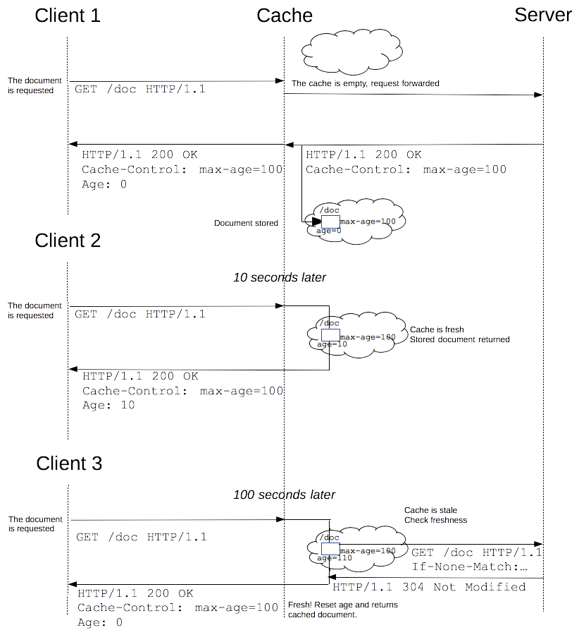

# Cache

<!-- TOC -->

- [Cache](#cache)
    - [强缓存和协商缓存](#%E5%BC%BA%E7%BC%93%E5%AD%98%E5%92%8C%E5%8D%8F%E5%95%86%E7%BC%93%E5%AD%98)
    - [强缓存首部](#%E5%BC%BA%E7%BC%93%E5%AD%98%E9%A6%96%E9%83%A8)
        - [Cache-Control 首部（响应中的）](#cache-control-%E9%A6%96%E9%83%A8%E5%93%8D%E5%BA%94%E4%B8%AD%E7%9A%84)
            - [优先级](#%E4%BC%98%E5%85%88%E7%BA%A7)
            - [Cache-Control: no-store](#cache-control-no-store)
            - [Cache-Control: no-cache](#cache-control-no-cache)
            - [Cache-Control: must-revalidate](#cache-control-must-revalidate)
            - [Cache-Control: max-age 和 Cache-Control: s-maxage](#cache-control-max-age-%E5%92%8C-cache-control-s-maxage)
            - [Cache-Control: no-transform](#cache-control-no-transform)
            - [Cache-Control: public](#cache-control-public)
            - [Cache-Control: private](#cache-control-private)
            - [Cache-Control: proxy-revalidate](#cache-control-proxy-revalidate)
        - [Expires](#expires)
    - [协商缓存首部](#%E5%8D%8F%E5%95%86%E7%BC%93%E5%AD%98%E9%A6%96%E9%83%A8)
        - [Etag](#etag)
        - [Last-modified](#last-modified)
        - [Last-modified 和 Etag 的区别（优先使用 Etag 的原因）](#last-modified-%E5%92%8C-etag-%E7%9A%84%E5%8C%BA%E5%88%AB%E4%BC%98%E5%85%88%E4%BD%BF%E7%94%A8-etag-%E7%9A%84%E5%8E%9F%E5%9B%A0)
    - [请求中的 Cache-Control 首部](#%E8%AF%B7%E6%B1%82%E4%B8%AD%E7%9A%84-cache-control-%E9%A6%96%E9%83%A8)
    - [Defining optimal Cache-Control policy](#defining-optimal-cache-control-policy)
    - [Invalidating and updating cached responses](#invalidating-and-updating-cached-responses)
    - [Caching checklist](#caching-checklist)
    - [Chrome 相关](#chrome-%E7%9B%B8%E5%85%B3)
        - [Chrome 的 memory cache 和 disk cache](#chrome-%E7%9A%84-memory-cache-%E5%92%8C-disk-cache)
        - [Chrome 在不同场景下的 cache 使用](#chrome-%E5%9C%A8%E4%B8%8D%E5%90%8C%E5%9C%BA%E6%99%AF%E4%B8%8B%E7%9A%84-cache-%E4%BD%BF%E7%94%A8)
    - [References](#references)

<!-- /TOC -->

## 强缓存和协商缓存
1. 源服务器响应中的 `Cache-Control` 首部（HTTP 1.0 使用 `Expires` 首部）设定了缓存资源有效期规则，缓存服务器会记录这一规则。
2. 客户端发起请求时，如果缓存服务器发现资源还有效，则不需要请求源服务器，所以直接将缓存的副本返回给客户端。这样的缓存机制称为 **强缓存**。
3. 如果没有命中强缓存，也就是说资源已经过期了。但如果此时源服务器上的资源并没有变化，那就可以继续使用缓存的资源。
4. 源服务器响应中的 `Etag` 首部（HTTP 1.0 使用 `Last-modified` 首部）用来确认源服务器中的资源是否修改，缓存服务器会记录这个首部的值。
5. 没有命中强缓存时，缓存服务器会向源服务器发送确认请求（协商），看看资源是否发生了变化。
6. 请求会通过 `If-None-Match` 首部带上之前保存的 `Etag` 首部（HTTP 1.0 通过 `If-Modified-Since` 首部带上之前保存的 `Last-modified` 的值），如果发现源服务器中的资源没有变化，就可以继续向客户端返回缓存的资源。这样的缓存机制称为 **协商缓存**。
7. 完整的缓存使用流程
    
8. 一个具体的例子
    

## 强缓存首部
### `Cache-Control` 首部（响应中的）
#### 优先级
1. Attach a `Cache-Control: no-store` header to the response.
2. Attach a `Cache-Control: no-cache` header to the response.
3. Attach a `Cache-Control: must-revalidate` header to the response.
4. Attach a `Cache-Control: max-age` header to the response.
5. Attach an `Expires` date header to the response.

#### `Cache-Control: no-store`
详见 `../HTTPArchitecture/Caching/KeepingCopiesFresh.md` 和 `../HTTPArchitecture/Caching/ControllingCachability.md`。

#### `Cache-Control: no-cache`
详见 `../HTTPArchitecture/Caching/KeepingCopiesFresh.md` 和 `../HTTPArchitecture/Caching/ControllingCachability.md`。

#### `Cache-Control: must-revalidate`
详见 `../HTTPArchitecture/Caching/KeepingCopiesFresh.md` 和 `../HTTPArchitecture/Caching/ControllingCachability.md`。

#### `Cache-Control: max-age` 和 `Cache-Control: s-maxage`
详见 `../HTTPArchitecture/Caching/KeepingCopiesFresh.md` 和 `../HTTPArchitecture/Caching/ControllingCachability.md`。

#### `Cache-Control: no-transform`
1. An intermediate cache or proxy cannot edit the response body, `Content-Encoding`, `Content-Range`, or `Content-Type`. 
2. It therefore forbids a proxy or browser feature, such as Google’s Web Light, from converting images to minimize data for a cache store or slow connection.

#### `Cache-Control: public`
The `public` response directive indicates that any cache *may* store the response, even if the response would normally be non-cacheable or cacheable only within a private cache.

#### `Cache-Control: private`
1. The `private` response directive indicates that the response message is intended for a single user and MUST NOT be stored by a shared cache. 
2. A private cache（例如浏览器缓存） *may* store the response and reuse it for later requests, even if the response would normally be non-cacheable.
3. [后续说明](https://tools.ietf.org/html/rfc7234#section-5.2.2.6) 没看懂

#### `Cache-Control: proxy-revalidate`
The `proxy-revalidate` response directive has the same meaning as the `must-revalidate` response directive, except that it does not apply to private caches.

### `Expires`
能用 `Cache-Control` 就不要用 `Expires`，`HTTP/1.0` 的标准。

## 协商缓存首部
缓存的资源到期了，并不意味着资源内容发生了改变，如果和服务器上的资源没有差异，实际上没有必要再次请求。客户端和服务器端通过某种验证机制验证（协商）当前请求资源是否可以使用缓存。

### `Etag`
1. 如果没有命中强缓存，则必须要联系源服务器进行协商验证。
2. 缓存服务器会把上次响应的 `Etag` 首部的值作为 `If-None-Match` 首部的值发送给源服务器，源服务器检查和当前资源的 `Etag` 是否一致，如果一致就表明所请求的数据一致没有变，则会返回 `304` 告知可以继续使用缓存的数据。
3. 详见 `../HTTPArchitecture/Caching/KeepingCopiesFresh.md` 和 `../HTTPArchitecture/Caching/ControllingCachability.md`。

### `Last-modified`
1. 第一次请求一个资源时，响应中设置 `Last-modified` 注明资源最后修改时间。
2. 向源服务器协商时，请求头部带上 `If-Modified-Since` 注明之前收到的 `Last-modified` 的值。
3. 源服务器端收到带 `If-Modified-Since` 的请求后会去和资源的最后修改时间对比。若修改过就返回最新资源，若没有修改过则返 `304`。  
4. 如果响应头中有 `Last-modified` 而没有 `Expire` 或 `Cache-Control` 时，浏览器会有自己的算法来推算出一个时间缓存该文件多久，不同浏览器得出的时间不一样，所以 `Last-modified` 要配合 `Expires`/`Cache-Control` 使用。

### `Last-modified` 和 `Etag` 的区别（优先使用 `Etag` 的原因）
* 某些服务器不能精确得到资源的最后修改时间。
* `Last-modified` 只能精确到秒，资源一秒内的多次变化无法识别。
* 对于一些虽然重新生成但是内容不变的资源，使用 `Last-modified` 就会弃用缓存。
* 有些文档可能被修改了，但是修改并不重要（例如对拼写或注释的修改），不需要更新缓存。
* 服务器会优先验证 ETag。

## 请求中的 `Cache-Control` 首部
1. 除了服务器设置的缓存规则外，客户端也可以通过 `Cache-Control` 首部对资源的缓存规则进行改变，例如浏览器的强制刷新以确保使用了最新的资源，或者要求可以使用过期资源以节省流量。
2. 详见 `../HTTPArchitecture/Caching/ControllingCachability.md`。

## Defining optimal Cache-Control policy

## Invalidating and updating cached responses
1. All HTTP requests that the browser makes are first routed to the browser
cache to check whether there is a valid cached response that can be used to
fulfill the request.
2. If there's a match, the response is read from the cache, which eliminates
both the network latency and the data costs that the transfer incurs.
3. If you want to update or invalidate a cached response, you change the URL of
the resource and force the user to download the new response whenever its
content changes.
4. Typically, you do this by embedding a fingerprint of the file, or a version
number, in its filename.

## Caching checklist
Some tips and techniques to keep in mind as you work on caching strategy:
* **Use consistent URLs:** if you serve the same content on different URLs, then that content will be fetched and stored multiple times. Tip: **note that URLs are case sensitive**.
* **Ensure that the server provides a validation token (ETag):** validation tokens eliminate the need to transfer the same bytes when a resource has not changed on the server.
* **Identify which resources can be cached by intermediaries:** those with responses that are identical for all users are great candidates to be cached by a CDN and other intermediaries.
* **Determine the optimal cache lifetime for each resource:** different resources may have different freshness requirements. Audit and determine the appropriate `max-age` for each one.
* **Determine the best cache hierarchy for your site:** the combination of resource URLs with content fingerprints and short or no-cache lifetimes for HTML documents allows you to control how quickly the client picks up updates.
* **Minimize churn:** some resources are updated more frequently than others. If there is a particular part of a resource (for example, a JavaScript function or a set of CSS styles) that is often updated, consider delivering that code as a separate file. Doing so allows the remainder of the content (for example, library code that doesn't change very often), to be fetched from cache and minimizes the amount of downloaded content whenever an update is fetched.

## Chrome 相关
### Chrome 的 memory cache 和 disk cache
以一张几十 KB 的图片为例：
* 从 memory cache 中下载图片，下载时间是 μs 级别的。
* 从 disk cache 中下载图片，下载时间是 ms 级别的。

### Chrome 在不同场景下的 cache 使用
在有缓存的情况下：
* F5 或 ctrl+F5 刷新当前页面，都可能是 memory cache 也可能是 disk cache，目前没有发现规律。
* 重新打开一个标签页加载，使用 disk cache。Chrome每个标签页使用独立的内存。

## References
* [Google Developers - HTTP Caching](https://developers.google.com/web/fundamentals/performance/optimizing-content-efficiency/http-caching)
* [HTTP 缓存机制一二三](https://zhuanlan.zhihu.com/p/29750583)
* [*HTTP: the definitive guide*](https://book.douban.com/subject/1440226/)
* [官方文档](https://tools.ietf.org/html/rfc7234)