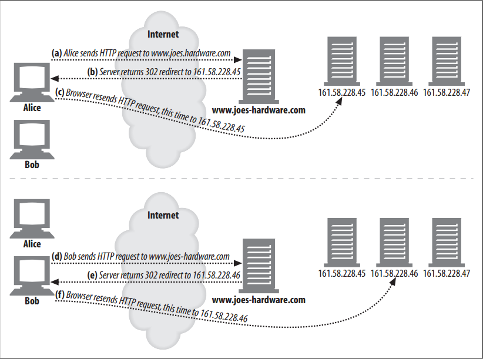
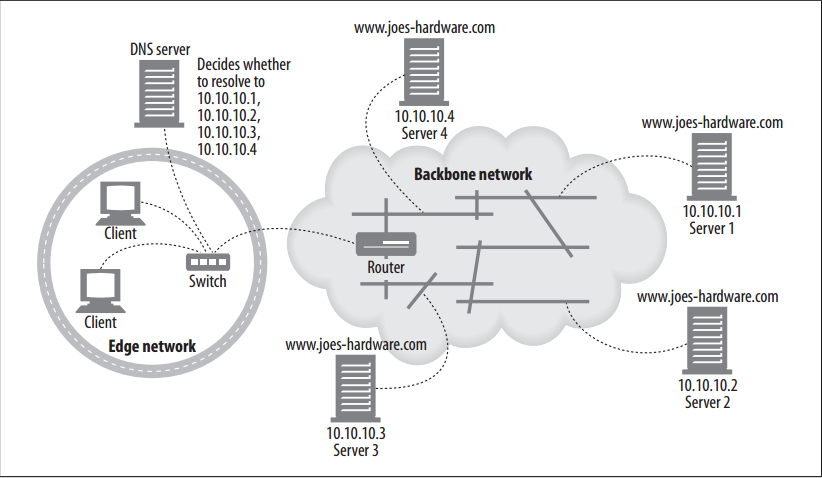
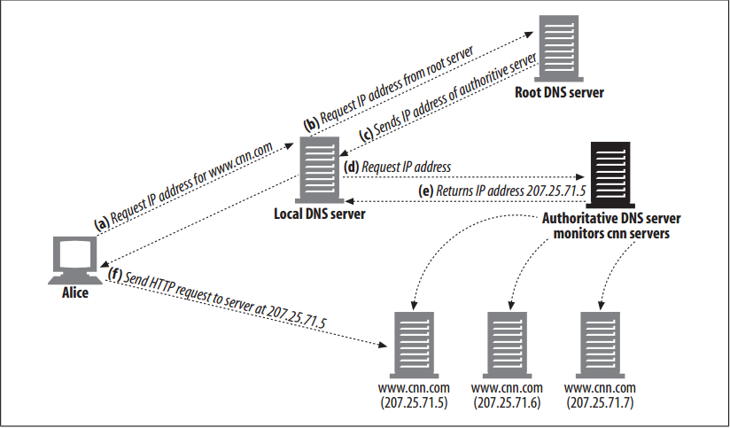
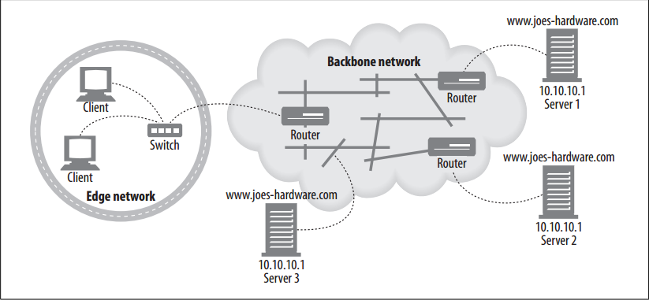
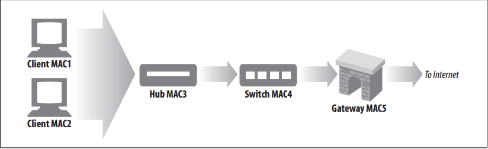

# General Redirection Methods

<!-- TOC -->

- [General Redirection Methods](#general-redirection-methods)
    - [Summary](#summary)
    - [HTTP Redirection](#http-redirection)
        - [原理](#原理)
        - [Disadvantages](#disadvantages)
    - [DNS Redirection](#dns-redirection)
        - [原理](#原理-1)
        - [DNS round robin](#dns-round-robin)
        - [Multiple addresses and round-robin address rotation](#multiple-addresses-and-round-robin-address-rotation)
        - [DNS round robin for load balancing](#dns-round-robin-for-load-balancing)
        - [The impact of DNS caching](#the-impact-of-dns-caching)
        - [Other DNS-based redirection algorithms](#other-dns-based-redirection-algorithms)
    - [Anycast Addressing 不懂](#anycast-addressing-不懂)
    - [IP MAC Forwarding](#ip-mac-forwarding)
    - [IP Address Forwarding](#ip-address-forwarding)
    - [Network Element Control Protocol](#network-element-control-protocol)
    - [References](#references)

<!-- /TOC -->

## Summary
In this section, we will delve deeper into the various redirection methods that are commonly used for both servers and proxies. These techniques can be used to redirect traffic to a different (presumably more optimal) server or to vector traffic through a proxy. Specifically, we’ll cover HTTP redirection, DNS redirection, anycast addressing, IP MAC forwarding, and IP address forwarding.

## HTTP Redirection
### 原理
1. Web servers can send short redirect messages back to clients, telling them to try someplace else. 
2. Some web sites use HTTP redirection as a simple form of load balancing; the server that handles the redirect (the redirecting server) finds the least-loaded content server available and redirects the browser to that server.
3. For widely distributed web sites, determining the “best” available server gets more complicated, taking into account not only the servers’ load but the Internet distance between the browser and the server.
4. One advantage of HTTP redirection over some other forms of redirection is that the redirecting server knows the client’s IP address; in theory, it may be able to make a more informed choice.
5. Here’s how HTTP redirection works
    

### Disadvantages
1. HTTP redirection can vector requests across servers, but it has several disadvantages: 
    * A significant amount of processing power is required from the original server to determine which server to redirect to. Sometimes almost as much server horsepower is required to issue the redirect as would be to serve up the page itself.
    * User delays are increased, because two round trips are required to access pages.
    * If the redirecting server is broken, the site will be broken.
2. Because of these weaknesses, HTTP redirection usually is used in combination with some of the other redirection technique.

## DNS Redirection
### 原理
1. Every time a client tries to access Joe’s Hardware’s web site, the domain name `www.joes-hardware.com` must be resolved to an IP address. 
2. The DNS resolver may be the client’s own operating system, a DNS server in the client’s network, or a more remote DNS server. 
3. DNS allows several IP addresses to be associated to a single domain, and DNS resolvers can be configured or programmed to return varying IP addresses.
4. The basis on which the resolver returns the IP address can run from the simple (round robin) to the complex (such as checking the load on several servers and returning the IP address of the least-loaded server).
5. In figure below, Joe runs four servers for `www.joes-hardware.com`. The DNS server has to decide which of four IP addresses to return for `www.joes-hardware.com`. The easiest DNS decision algorithm is a simple round robin
    

### DNS round robin
1. One of the most common redirection techniques also is one of the simplest. DNS round robin uses a feature of DNS hostname resolution to balance load across a farm of web servers.
2. It is a pure load-balancing strategy, and it does not take into account any factors about the location of the client relative to the server or the current stress on the server.

### Multiple addresses and round-robin address rotation
Most DNS clients just use the first address of the multi-address set. To balance load, most DNS servers rotate the addresses each time a lookup is done. This address rotation often is called DNS round robin.

### DNS round robin for load balancing
1. Because most DNS clients just use the first address, the DNS rotation serves to balance load among servers. 
2. If DNS did not rotate the addresses, most clients would always send load to the first client.

### The impact of DNS caching
1. DNS address rotation spreads the load around, because each DNS lookup to a server gets a different ordering of server addresses. 
2. However, this load balancing isn’t perfect, because the results of the DNS lookup may be memorized and reused by applications, operating systems, and some primitive child DNS servers. Many web browsers perform a DNS lookup for a host but then use the same address over and over again, to eliminate the cost of DNS lookups and because some servers prefer to keep talking to the same client. Furthermore, many operating systems perform the DNS lookup automatically, and cache the result, but don’t rotate the addresses.
3. Consequently, DNS round robin generally doesn’t balance the load of a single client—one client typically will be stuck to one server for a long period of time.
4. But, even though DNS doesn’t deal out the transactions of a single client across server replicas, it does a decent job of spreading the aggregate load of multiple clients. As long as there is a modestly large number of clients with similar demand, the load will be relatively well distributed across servers.

### Other DNS-based redirection algorithms
1. We’ve already discussed how DNS rotates address lists with each request. However, some enhanced DNS servers use other techniques for choosing the order of the ddresses:
    * Load-balancing algorithms: Some DNS servers keep track of the load on the web servers and place the leastloaded web servers at the front of the list.
    * Proximity-routing algorithms: DNS servers can attempt to direct users to nearby web servers, when the farm of web servers is geographically dispersed.
    * Fault-masking algorithms:DNS servers can monitor the health of the network and route requests away from service interruptions or other faults.
2. Typically, the DNS server that runs sophisticated server-tracking algorithms is an authoritative server that is under the control of the content provider
    
3. Several distributed hosting services use this DNS redirection model. One drawback of the model for services that look for nearby servers is that the only information that the authoritative DNS server uses to make its decision is the IP address of the local DNS server, not the IP address of the client.

## Anycast Addressing 不懂
1. In anycast addressing, several geographically dispersed web servers have the exact same IP address and rely on the “shortest-path” routing capabilities of backbone routers to send client requests to the server nearest to the client.
2. One way this method can work is for each web server to advertise itself as a router to a neighboring backbone router. The web server talks to its neighboring backbone router using a router communication protocol. 
3. When the backbone router receives packets aimed at the anycast address, it looks (as it usually would) for the nearest “router” that accepts that IP address. 
4. Because the server will have advertised itself as a router for that address, the backbone router will send the server the packet.
5. In figure below, three servers front the same IP address, `10.10.10.1`. The Los Angeles (LA) server advertises this address to the LA router, the New York (NY) server advertises the same address to the NY router, and so on
    
6. The servers communicate with the routers using a router protocol. The routers automatically route client requests aimed at `10.10.10.1` to the nearest server that advertises the address. In figure above, the request for the IP address `10.10.10.1` will be routed to server 3.
7. Anycast addressing is still an experimental technique. For distributed anycast to work, the servers must “speak router language” and the routers must be able to handle possible address conflicts, because Internet addressing basically assumes one server for one address. (If done improperly, this can lead to serious problems known as “route leaks”). 
8. Distributed anycast is an emerging technology and might be a solution for content providers who control their own backbone networks.

## IP MAC Forwarding
1. In Ethernet networks, HTTP messages are sent in the form of addressed data packets. 
2. Each packet has a layer-4 address, consisting of the source and destination IP ddress and TCP port numbers; this is the address to which layer 4–aware devices pay attention. 
3. Each packet also has a layer-2 address, the Media Access Control(MAC) address, to which layer-2 devices (commonly switches and hubs) pay attention. 
4. The job of layer-2 devices is to receive packets with particular incoming MAC addresses and forward them to particular outgoing MAC addresses.
5. In figure below, for example, the switch is programmed to send all traffic from MAC address “MAC3” to MAC address “MAC4”.
    

TODO 本段后面的内容

## IP Address Forwarding
TODO

## Network Element Control Protocol
TODO

## References
* [*HTTP: the definitive guide*](https://book.douban.com/subject/1440226/)