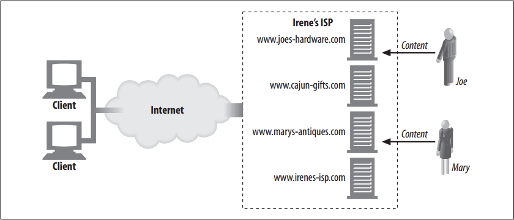

# Hosting Services

<!-- TOC -->

- [Hosting Services](#hosting-services)
    - [设计思想](#设计思想)
    - [抽象本质](#抽象本质)
    - [Summary](#summary)
    - [A Simple Example: Dedicated Hosting](#a-simple-example-dedicated-hosting)
    - [References](#references)

<!-- /TOC -->

## 设计思想

## 抽象本质

## Summary
1. In the early days of the World Wide Web, individual organizations purchased their own computer hardware, built their own computer rooms, acquired their own network connections, and managed their own web server software.
2. As the Web quickly became mainstream, everyone wanted a web site, but few people had the skills or time to build air-conditioned server rooms, register domain names, or purchase network bandwidth. To save the day, many new businesses emerged, offering professionally managed web hosting services.
3. Many levels of service are available, from physical facilities management (providing space, air conditioning, and wiring) to full-service web hosting, where all the customer does is provide the content.
4. Much of what makes a web site work—as well as, for example, its ability to support different languages and its ability to do secure e-commerce transactions—depends on what capabilities the hosting web server supports.

## A Simple Example: Dedicated Hosting
1. Suppose that Joe’s Hardware Online and Mary’s Antique Auction both want fairly high-volume web sites. Irene’s ISP has racks and racks full of identical, highperformance web servers that it can lease to Joe and Mary, instead of having Joe and Mary purchase their own servers and maintain the server software.
2. In figure below, both Joe and Mary sign up for the dedicated web hosting service offered by Irene’s ISP
    
3. Joe leases a dedicated web server that is purchased and maintained by Irene’s ISP. Mary gets a different dedicated server from Irene’s ISP. Irene’s ISP gets to buy server hardware in volume and can select hardware that is reliable, time-tested, and low-cost. If either Joe’s Hardware Online or Mary’s Antique Auction grows in popularity, Irene’s ISP can offer Joe or Mary additional servers immediately.
4. In this example, browsers send HTTP requests for `www.joes-hardware.com` to the IP address of Joe’s server and requests for `www.marys-antiques.com` to the (different) IP address of Mary’s server.

## References
* [*HTTP: the definitive guide*](https://book.douban.com/subject/1440226/)