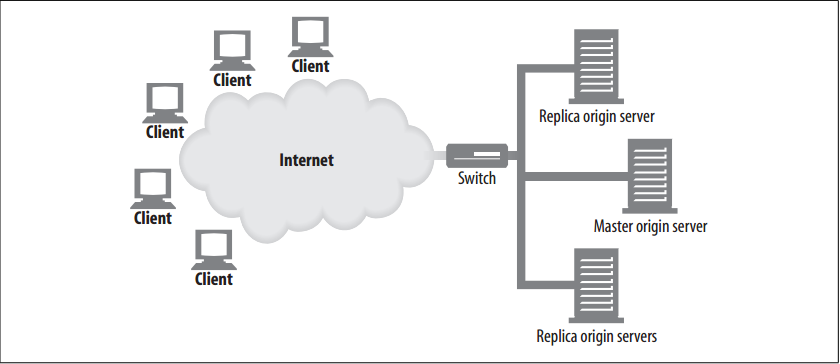
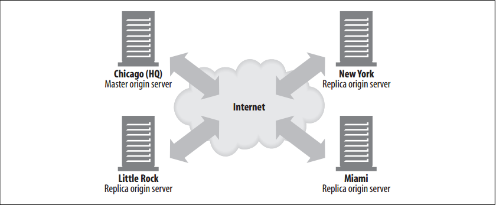
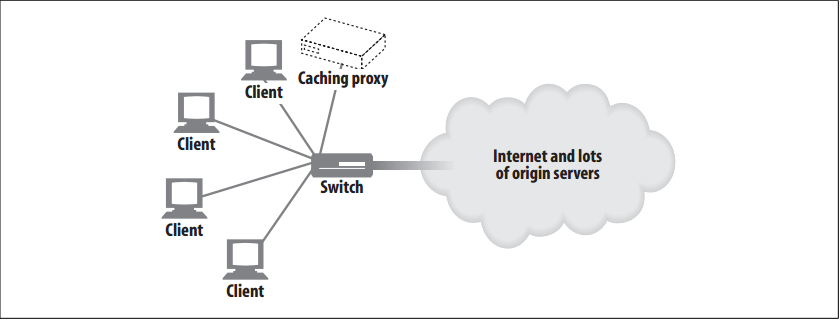

# Making Web Sites Reliable

<!-- TOC -->

- [Making Web Sites Reliable](#making-web-sites-reliable)
    - [设计思想](#设计思想)
    - [抽象本质](#抽象本质)
    - [Summary](#summary)
    - [Mirrored Server Farms](#mirrored-server-farms)
    - [Content Distribution Networks](#content-distribution-networks)
    - [Surrogate Caches in CDNs](#surrogate-caches-in-cdns)
    - [Proxy Caches in CDNs  不懂，没看懂](#proxy-caches-in-cdns--不懂没看懂)
    - [References](#references)

<!-- /TOC -->

## 设计思想

## 抽象本质

## Summary
1. There are several times during which web sites commonly break:
    * Server downtime
    * Traffic spikes: suddenly everyone wants to see a particular news broadcast or rush to a sale. Sudden spikes can overload a web server, slowing it down or stopping it completely.
    * Network outages or losses 
2. This section presents some ways of anticipating and dealing with these common problems.

## Mirrored Server Farms
1. A server farm is a bank of identically configured web servers that can cover for each other. The content on each server in the farm can be mirrored, so that if one has a problem, another can fill in.
2. Often, mirrored servers follow a hierarchical relationship. One server might act as the “content authority”—the server that contains the original content (perhaps a server to which the content authors post). This server is called the **master origin server**. The mirrored servers that receive content from the master origin server are called **replica origin servers**.
3. One simple way to deploy a server farm is to use a network switch to distribute requests to the servers. The IP address for each of the web sites hosted on the servers is the IP address of the switch.
4. In the mirrored server farm shown in figure below, the master origin server is responsible for sending content to the replica origin servers
    
5. To the outside world, the IP address for this content is the IP address of the switch. The switch is responsible for
sending requests to the servers.
6. Mirrored web servers can contain copies of the exact same content at different locations. Figure below illustrates four mirrored servers, with a master server in Chicago and replicas in New York, Miami, and Little Rock. The master server serves clients in the Chicago area and also has the job of propagating its content to the replica servers
    
7. In this scenario, there are a couple of ways that client requests would be directed to a particular server:
    * HTTP redirection: The URL for the content could resolve to the IP address of the master server, which could then send redirects to replica servers.
    * DNS redirection: The URL for the content could resolve to four IP addresses, and the DNS server could choose the IP address that it sends to clients.

## Content Distribution Networks
A content distribution network (CDN) is simply a network whose purpose is the distribution of specific content. The nodes of the network can be web servers, surrogates, or proxy caches.

## Surrogate Caches in CDNs
1. Surrogate caches can be used in place of replica origin servers. Surrogates, also known as reverse proxies, receive server requests for content just as mirrored web servers do.
2. They receive server requests on behalf of a specific set of origin servers (this is possible because of the way IP addresses for content are advertised; there usually is a working relationship between origin server and surrogate, and surrogates expect to receive requests aimed at specific origin servers).
3. The difference between a surrogate and a mirrored server is that surrogates typically are demand-driven. They do not store entire copies of the origin server content; they store whatever content their clients request.
4. The way content is distributed in their caches depends on the requests that they receive; the origin server does not have the responsibility to update their content.
5. For easy access to “hot” content (content that is in high demand), some surrogates have “prefetching” features that enable them to pull content in advance of user requests.
6. An added complexity in CDNs with surrogates is the possibility of cache hierarchies.

## Proxy Caches in CDNs  不懂，没看懂
1. Unlike surrogates, traditional proxy caches can receive requests aimed at any web servers (there need not be any working relationship or IP address agreement between a proxy cache and an origin server). 
2. As with surrogates, however, proxy cache content typically is demand-driven and is not expected to be an exact duplicate of the origin server content. Some proxy caches also can be preloaded with hot content.
3. Demand-driven proxy caches can be deployed in other kinds of configurations—in particular, interception configurations, where a layer-2 or -3 device (switch or router) intercepts web traffic and sends it to a proxy cache. See figure below
    
4. An interception configuration depends on being able to set up the network between clients and servers so that all of the appropriate HTTP requests are physically channeled to the cache. The content is distributed in the cache according to the requests it receives.

## References
* [*HTTP: the definitive guide*](https://book.douban.com/subject/1440226/)