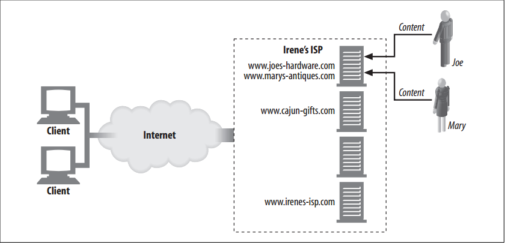
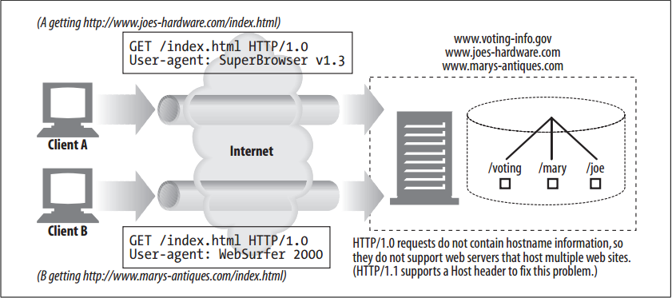
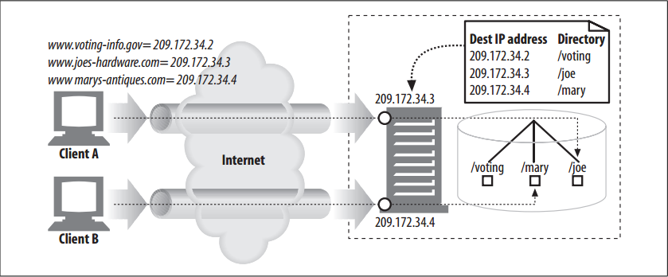
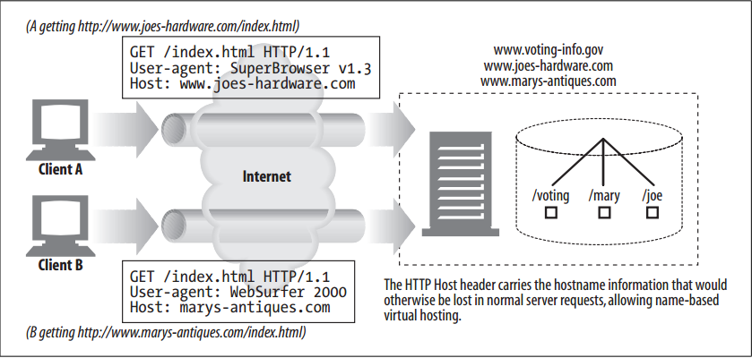

# Virtual Hosting

<!-- TOC -->

- [Virtual Hosting](#virtual-hosting)
    - [设计思想](#设计思想)
    - [抽象本质](#抽象本质)
    - [Summary](#summary)
    - [Virtual Server Request Lacks Host Information](#virtual-server-request-lacks-host-information)
    - [Making Virtual Hosting Work](#making-virtual-hosting-work)
        - [Virtual hosting by URL path](#virtual-hosting-by-url-path)
        - [Virtual hosting by port number](#virtual-hosting-by-port-number)
        - [Virtual hosting by IP address](#virtual-hosting-by-ip-address)
        - [Virtual hosting by `Host` header](#virtual-hosting-by-host-header)
    - [HTTP/1.1 `Host` Headers](#http11-host-headers)
        - [Syntax and usage](#syntax-and-usage)
        - [Missing Host headers](#missing-host-headers)
        - [Interpreting Host headers](#interpreting-host-headers)
    - [References](#references)

<!-- /TOC -->


## 设计思想


## 抽象本质


## Summary
1. Many folks want to have a web presence but don’t have high-traffic web sites. For these people, providing a dedicated web server may be a waste, because they’re paying many hundreds of dollars a month to lease a server that is mostly idle!
2. Many web hosters offer lower-cost web hosting services by sharing one computer between several customers. This is called **shared hosting** or **virtual hosting**. Each web site appears to be hosted by a different server, but they really are hosted on the same physical server.
3. From the end user’s perspective, virtually hosted web sites should be indistinguishable from sites hosted on separate dedicated servers.
4. For cost efficiency, space, and management reasons, a virtual hosting company wants to host tens, hundreds, or thousands of web sites on the same server—but this does not necessarily mean that 1,000 web sites are served from only one PC. Hosters can create banks of replicated servers (called **server farms**) and spread the load across the farm of servers.
5. Because each server in the farm is a clone of the others, and hosts many virtual web sites, administration is much easier.
6. When Joe and Mary started their businesses, they might have chosen virtual hosting to save money until their traffic levels made a dedicated server worthwhile
    


## Virtual Server Request Lacks Host Information
1. Unfortunately, there is a design flaw in HTTP/1.0 that makes virtual hosters pull their hair out. The HTTP/1.0 specification didn’t give any means for shared web servers to identify which of the virtual web sites they’re hosting is being accessed.
2. Recall that HTTP/1.0 requests send only the path component of the URL in the request message. If you try to get `http://www.joes-hardware.com/index.html`, the browser connects to the server `www.joes-hardware.com`, but the HTTP/1.0 request says “GET /index.html”, with no further mention of the hostname.
3. If the server is virtually hosting multiple sites, this isn’t enough information to figure out what virtual web site is being accessed. For example, in figure below:
    
    * If client A tries to access `http://www.joes-hardware.com/index.html`, the request “GET /index.html” will be sent to the shared web server.
    * If client B tries to access `http://www.marys-antiques.com/index.html`, the identical request “GET /index.html” will be sent to the shared web server.
4. As far as the web server is concerned, there is not enough information to determine which web site is being accessed! The two requests look the same, even though they are for totally different documents (from different web sites). The problem is that the web site host information has been stripped from the request.


## Making Virtual Hosting Work
1. The missing host information was an oversight in the original HTTP specification, which mistakenly assumed that each web server would host exactly one web site. HTTP’s designers didn’t provide support for virtually hosted, shared servers. For this reason, the hostname information in the URL was viewed as redundant and stripped away; only the path component was required to be sent.
2. Because the early specifications did not make provisions for virtual hosting, web hosters needed to develop workarounds and conventions to support shared virtual hosting. The problem could have been solved simply by requiring all HTTP request messages to send the full URL instead of just the path component. HTTP/1.1 does require servers to handle full URLs in the request lines of HTTP messages, but it will be a long time before all legacy applications are upgraded to this specification.
3. In the meantime, four techniques have emerged:
    * Virtual hosting by URL path: Adding a special path component to the URL so the server can determine the site.
    * Virtual hosting by port number: Assigning a different port number to each site, so requests are handled by separate instances of the web server.
    * Virtual hosting by IP address: Dedicating different IP addresses for different virtual sites and binding all the IP
    addresses to a single machine. This allows the web server to identify the site name by IP address.
    * Virtual hosting by `Host` header: Many web hosters pressured the HTTP designers to solve this problem. Enhanced versions of HTTP/1.0 and the official version of HTTP/1.1 define a `Host` request header that carries the site name. The web server can identify the virtual site from the `Host` header.

### Virtual hosting by URL path
1. You can use brute force to isolate virtual sites on a shared server by assigning them different URL paths. For example, you could give each logical web site a special path prefix: 
    * Joe’s Hardware store could be `http://www.joes-hardware.com/joe/index.html`. 
    * Mary’s Antiques store could be `http://www.marys-antiques.com/mary/index.html`.
2. When the requests arrive at the server, the hostname information is not present in the request, but the server can tell them apart based on the path: 
    * The request for Joe’s hardware is “GET /joe/index.html”. 
    * The request for Mary’s antiques is “GET /mary/index.html”.
3. This is not a good solution. The “/joe” and “/mary” prefixes are redundant and confusing (we already mentioned “joe” in the hostname). 
4. Worse, the common convention of specifying `http://www.joes-hardware.com` or `http://www.joes-hardware.com/index.html` for the home page won’t work. 
5. In general, URL-based virtual hosting is a poor solution and seldom is used.

### Virtual hosting by port number
1. Instead of changing the pathname, Joe and Mary could each be assigned a different port number on the web server. Instead of port 80, for example, Joe could get 82 and Mary could have 83. 
2. But this solution has the same problem: an end user would expect to find the resources without having to specify a nonstandard port in the URL.

### Virtual hosting by IP address
1. A much better approach (in common use) is virtual IP addressing. Here, each virtual web site gets one or more unique IP addresses. The IP addresses for all of the virtual web sites are attached to the same shared server. The server can look up the destination IP address of the HTTP connection and use that to determine what web site the client thinks it is connected to.
2. Say a hoster assigned the IP address `209.172.34.3` to `www.joes-hardware.com`, assigned `209.172.34.4` to `www.marys-antiques.com`, and tied both IP addresses to the same physical server machine. The web server could then use the destination IP address to identify which virtual site is being requested
    
3. Virtual IP hosting works, but it causes some difficulties, especially for large hosters:
    * Computer systems usually have a limit on how many virtual IP addresses can be bound to a machine. Hosters that want hundreds or thousands of virtual sites to be hosted on a shared server may be out of luck.
    * IP addresses are a scarce commodity. Hosters with many virtual sites might not be able to obtain enough virtual IP addresses for the hosted web sites.
    * The IP address shortage is made worse when hosters replicate their servers for additional capacity. Different virtual IP addresses may be needed on each replicated server, depending on the load-balancing architecture, so the number of IP addresses needed can multiply by the number of replicated servers.
4. Despite the address consumption problems with virtual IP hosting, it is used widely.

### Virtual hosting by `Host` header
1. To avoid excessive address consumption and virtual IP limits, we’d like to share the same IP address among virtual sites, but still be able to tell the sites apart. 
2. But as we’ve seen, because most browsers send just the path component of the URL to servers, the critical virtual hostname information is lost.
3. To solve this problem, browser and server implementors extended HTTP to provide the original hostname to servers. But browsers couldn’t just send a full URL, because that would break many servers that expected to receive only a path component. Instead, the hostname (and port) is passed in a `Host` extension header in all requests.
4. In figure below, client A and client B both send `Host` headers that carry the original hostname being accessed. When the server gets the request for `/index.html`, it can use the `Host` header to decide which resources to use
    
5. `Host` headers are required for HTTP/1.1 compliance.


## HTTP/1.1 `Host` Headers
The `Host` header is an HTTP/1.1 request header, defined in RFC 2068. Virtual servers are so common that most HTTP clients, even if they are not HTTP/1.1-compliant, implement the `Host` header.

### Syntax and usage
1. The `Host` header specifies the Internet host and port number for the resource being requested, as obtained from the original URL:
    ```
    Host = "Host" ":" host [ ":" port ]
    ```
2. In particular:
    * If the `Host` header does not contain a port, the default port for the scheme is assumed.
    * If the URL contains an IP address, the `Host` header should contain the same address.
    * If the URL contains a hostname, the `Host` header must contain the same name.
    * If the URL contains a hostname, the `Host` header should not contain the IP address equivalent to the URL’s hostname, because this will break virtually hosted servers, which layer multiple virtual sites over a single IP address.
    * If the URL contains a hostname, the `Host` header should not contain another alias for this hostname, because this also will break virtually hosted servers.
    * If the client is using an explicit proxy server, the client must include the name and port of the origin server in the `Host` header, not the proxy server. In the past, several web clients had bugs where the outgoing `Host` header was set to the hostname of the proxy, when the client’s proxy setting was enabled. This incorrect behavior causes proxies and origin servers to misbehave.
    * Web clients must include a `Host` header field in all request messages.
    * Web proxies must add `Host` headers to request messages before forwarding them.
    * HTTP/1.1 web servers must respond with a 400 status code to any HTTP/1.1 request message that lacks a `Host` header field.

### Missing Host headers
1. A small percentage of old browsers in use do not send `Host` headers. If a virtual hosting server is using `Host` headers to determine which web site to serve, and no `Host` header is present, it probably will either direct the user to a default web page (such as the web page of the ISP) or return an error page suggesting that the user upgrade her
browser.

### Interpreting Host headers
1. An origin server that isn’t virtually hosted, and doesn’t allow resources to differ by the requested host, may ignore the `Host` header field value. But any origin server that does differentiate resources based on the host must use the following rules for determining the requested resource on an HTTP/1.1 request:
    1. If the URL in the HTTP request message is absolute (i.e., contains a scheme and host component), the value in the `Host` header is ignored in favor of the URL.
    2. If the URL in the HTTP request message doesn’t have a host, and the request contains a `Host` header, the value of the host/port is obtained from the `Host` header.
    3. If no valid host can be determined through Steps 1 or 2, a `400 Bad Response` response is returned to the client.


## References
* [*HTTP: the definitive guide*](https://book.douban.com/subject/1440226/)