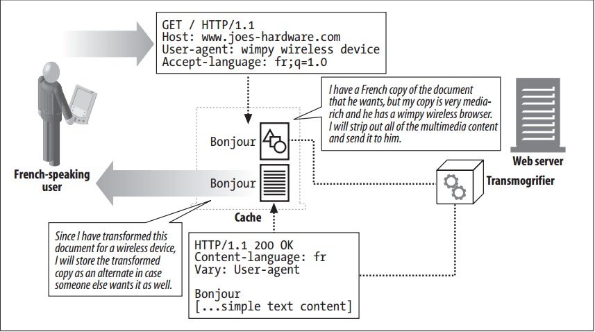

# Transcoding

<!-- TOC -->

- [Transcoding](#transcoding)
    - [设计思想](#设计思想)
    - [抽象本质](#抽象本质)
    - [Summary](#summary)
    - [Format Conversion](#format-conversion)
    - [Information Synthesis](#information-synthesis)
    - [Content Injection](#content-injection)
    - [Transcoding Versus Static Pregeneration](#transcoding-versus-static-pregeneration)
    - [References](#references)

<!-- /TOC -->

## 设计思想

## 抽象本质

## Summary
1. We have discussed in some detail the mechanism by which clients and servers can choose between a set of documents for a URL and send the one that best matches the client’s needs. These mechanisms rely on the presence of documents that match the client’s needs—whether they match the needs perfectly or not so well.
2. What happens, however, when a server does not have a document that matches the client’s needs at all? The server may have to respond with an error, but theoretically, the server may be able to transform one of its existing documents into something that the client can use.
3. Table below lists some hypothetical transcodings
    Before | After
    --|--
    HTML document | WML document
    High-resolution image | Low-resolution image
    Image in 64K colors | Black-and-white image
    Complex page with frames | Simple text page without frames or images
    HTML page with Java applets | HTML page without Java applets
    Page with ads | Page with ads removed
4. There are three categories of transcoding: format conversion, information synthesis, and content injection.

## Format Conversion
1. Format conversion is the transformation of data from one format to another to make it viewable by a client. A wireless device seeking to access a document typically viewed by a desktop client may be able do so with an HTML-to-WML conversion. A client accessing a web page over a slow link that is not very interested in high-resolution images may be able to view an image-rich page more easily if the images are reduced in size and resolution by converting them from color to black and white and shrinking them. 
2. Format conversion is driven by the content-negotiation headers, although it may also be driven by the `User-Agent` header. 
3. Note that content transformation or transcoding is different from content encoding or transfer encoding, in that the latter two typically are used for more efficient or safe transport of content, whereas the former is used to make content viewable on the access device.

## Information Synthesis
1. The extraction of key pieces of information from a document—known as information synthesis—can be a useful transcoding process. A simple example of this is the generation of an outline of a document based on section headings, or the removal of advertisements and logos from a page.
2. More sophisticated technologies that categorize pages based on keywords in content also are useful in summarizing the essence of a document. This technology often is used by automatic web page–classification systems, such as web-page directories at portal sites.

## Content Injection
1. The two categories of transcodings described so far typically reduce the amount of content in web documents, but there is another category of transformations that increases the amount of content: content-injection transcodings. Examples of content-injection transcodings are automatic ad generators and user-tracking systems. 
2. Imagine the appeal (and offence) of an ad-insertion transcoder that automatically adds advertisements to each HTML page as it goes by. Transcoding of this type has to be dynamic—it must be done on the fly in order to be effective in adding ads that currently are relevant or somehow have been targeted for a particular user. 
3. User-tracking systems also can be built to add content to pages dynamically, for the purpose of collecting statistics about how the page is viewed and how clients surf the Web.

## Transcoding Versus Static Pregeneration
1. An alternative to transcodings is to build different copies of web pages at the web server—for example, one with HTML, one with WML, one with high-resolution images, one with low-resolution images, one with multimedia content, and one without.
2. This, however, is not a very practical technique, for many reasons: any small change in a page requires multiple pages to be modified, more space is necessary to store all the different versions of each page, and it’s harder to catalog pages and program web servers to serve the right ones. Some transcodings, such as ad insertion (especially targeted ad insertion), cannot be done statically—the ad inserted will depend upon the user requesting the page.
3. An on-the-fly transformation of a single root page can be an easier solution than static pregeneration. It can come, however, at the cost of increased latency in serving the content. 
4. Some of this computation can, however, be done by a third party, thereby offloading the computation from the web server—the transformation can be done by an external agent at a proxy or cache
    

## References
* [*HTTP: the definitive guide*](https://book.douban.com/subject/1440226/)