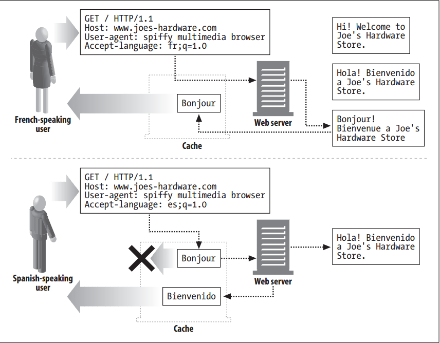
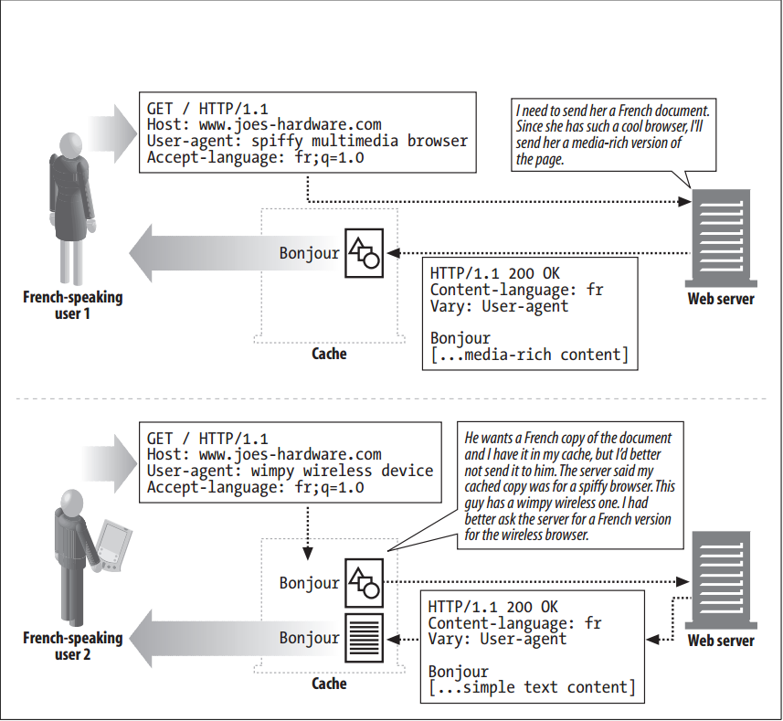

# Transparent Negotiation


<!-- TOC -->

- [Transparent Negotiation](#transparent-negotiation)
    - [设计思想](#设计思想)
    - [抽象本质](#抽象本质)
    - [Summary](#summary)
    - [Caching and Alternates](#caching-and-alternates)
    - [The Vary Header](#the-vary-header)
    - [References](#references)

<!-- /TOC -->


## 设计思想


## 抽象本质


## Summary
1. Transparent negotiation seeks to move the load of server-driven negotiation away from the server, while minimizing message exchanges with the client by having an intermediary proxy negotiate on behalf of the client. 
2. The proxy is assumed to have knowledge of the client’s expectations and be capable of performing the negotiations on its behalf (the proxy has received the client’s expectations in the request for content). 
3. To support transparent content negotiation, the server must be able to tell proxies what request headers the server examines to determine the best match for the client’s request. 
4. The HTTP/1.1 specification does not define any mechanisms for transparent negotiation, but it does define the `Vary` header. Servers send `Vary` headers in their responses to tell intermediaries what request headers they use for content negotiation.
5. Caching proxies can store different copies of documents accessed via a single URL. If servers communicate their decision-making processes to caches, the caches can negotiate with clients on behalf of the servers.
6. Caches also are great places to transcode content, because a general-purpose transcoder deployed in a cache can transcode content from any server, not just one. 


## Caching and Alternates
1. Caching of content assumes that the content can be reused later. However, caches must employ much of the decision-making logic that servers do when sending back a response, to ensure that they send back the correct cached response to a client request. 
2. The previous section described the Accept headers sent by clients and the corresponding entity headers that servers match them up against in order to choose the best response to each request. Caches must use these same headers to decide which cached response to send back.
3. Figure below illustrates both a correct and incorrect sequence of operations involving a cache
    
4. The first request results in the cache forwarding the request to the server and storing the response. The second response is looked up by the cache, and a document matching the URL is found. This document, however, is in French, and the requestor wants a Spanish document. If the cache just sends back the French document to the requestor, it will be behaving incorrectly.
5. The cache must therefore forward the second request to the server as well, and store both the response and an “alternate” response for that URL. The cache now has two different documents for the same URL, just as the server does. 6. These different versions are called **variants** or **alternates**. Content negotiation can be thought of as the process of selecting, from the variants, the best match for a client request.


## The Vary Header
1. Here’s a typical set of request and response headers from a browser and server:
    ```
    GET http://www.joes-hardware.com/ HTTP/1.0
    Proxy-Connection: Keep-Alive
    User-Agent: Mozilla/4.73 [en] (WinNT; U)
    Host: www.joes-hardware.com
    Accept: image/gif, image/x-xbitmap, image/jpeg, image/pjpeg, image/png, */*
    Accept-Encoding: gzip
    Accept-Language: en, pdf
    Accept-Charset: iso-8859-1, *, utf-8
    
    HTTP/1.1 200 OK
    Date: Sun, 10 Dec 2000 22:13:40 GMT
    Server: Apache/1.3.12 OpenSSL/0.9.5a (Unix) FrontPage/4.0.4.3
    Last-Modified: Fri, 05 May 2000 04:42:52 GMT
    Etag: "1b7ddf-48-3912514c"
    Accept-Ranges: Bytes
    Content-Length: 72
    Connection: close
    Content-Type: text/html
    ```
2. What happens, however, if the server’s decision was based on headers other than the Accept headers, such as the `User-Agent` header? 
3. This is not as radical as it may sound. Servers may know that old versions of a browser do not support JavaScript, for example, and may therefore send back a version of the page that does not have JavaScript in it. If servers are using other headers to make their decisions about which pages to send back, caches must know what those headers are, so that they can perform parallel logic in choosing which cached page to send back.
4. The HTTP `Vary` response header lists all of the client request headers that the server considers to select the document or generate custom content (in addition to the regular content-negotiation headers). For example, if the served document depends on the `User-Agent` header, the `Vary` header must include “User-Agent”.
5. When a new request arrives, the cache finds the best match using the content-negotiation headers. Before it can serve this document to the client, however, it must see whether the server sent a `Vary` header in the cached response. 
6. If a `Vary` header is present, the header values for the headers in the new request must match the header values in the old, cached request. Because servers may `vary` their responses based on client request headers, caches must store both the client request headers and the corresponding server response headers with each cached varaint, in order to implement transparent negotiation. This is illustrated in figure below
    
7. If a server’s Vary header looked like this, the huge number of different `User-Agent` and `Cookie` values could generate many variants:
    ```
    Vary: User-Agent, Cookie
    ```
8. A cache would have to store each document version corresponding to each variant. When the cache does a lookup, it first does content matching with the content-negotiation headers, then matches the request’s variant with cached variants. If there is no match, the cache fetches the document from the origin server.    


## References
* [*HTTP: the definitive guide*](https://book.douban.com/subject/1440226/)