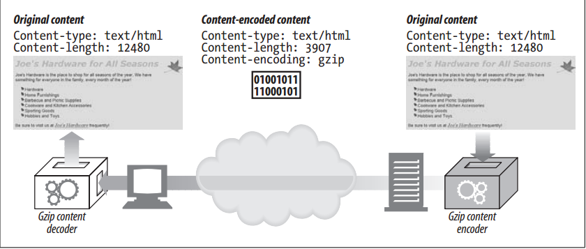
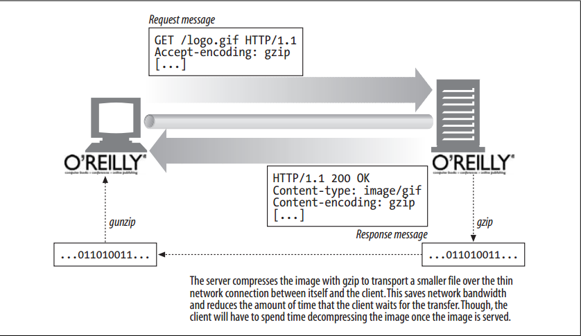

# Content Encoding


<!-- TOC -->

- [Content Encoding](#content-encoding)
    - [设计思想](#设计思想)
    - [抽象本质](#抽象本质)
    - [Summary](#summary)
    - [The Content-Encoding Process](#the-content-encoding-process)
    - [Content-Encoding Types](#content-encoding-types)
    - [Accept-Encoding Headers](#accept-encoding-headers)
    - [References](#references)

<!-- /TOC -->


## 设计思想


## 抽象本质


## Summary
1. HTTP applications sometimes want to encode content before sending it. For example, a server might compress a large HTML document before sending it to a client that is connected over a slow connection, to help lessen the time it takes to transmit the entity. A server might scramble or encrypt the contents in a way that prevents unauthorized third parties from viewing the contents of the document.
2. These types of encodings are applied to the content at the sender. Once the content is content-encoded, the encoded data is sent to the receiver in the entity body as usual.


## The Content-Encoding Process
1. The content-encoding process is:
    1. A web server generates an original response message, with original `Content-Type` and `Content-Length` headers.
    2. A content-encoding server (perhaps the origin server or a downstream proxy) creates an encoded message. The encoded message has the same `Content-Type` but (if, for example, the body is compressed) a different `Content-Length`. The
    content-encoding server adds a `Content-Encoding` header to the encoded message, so that a receiving application can decode it.
    3. A receiving program gets the encoded message, decodes it, and obtains the original.
2. Here, an HTML page is encoded by a gzip content-encoding function, to produce a smaller, compressed body. The compressed body is sent across the network, flagged with the gzip encoding. The receiving client decompresses the entity using the gzip decoder
    
3. Note that the `Content-Type` header can and should still be present in the message. It describes the original format of the entity—information that may be necessary for displaying the entity once it has been decoded. 
4. Remember that the `Content-Length` header now represents the length of the *encoded* body.


## Content-Encoding Types
1. HTTP defines a few standard content-encoding types and allows for additional encodings to be added as extension encodings. Encodings are standardized through the IANA, which assigns a unique token to each content-encoding algorithm. 
2. The `Content-Encoding` header uses these standardized token values to describe the algorithm used in the encoding.
3. Some of the common content-encoding tokens are listed in table below
    `Content-encoding` value | Description
    --|--
    gzip | Indicates that the GNU zip encoding was applied to the entity. (RFC 1952 describes the gzip encoding.)
    compress | Indicates that the Unix file compression program has been run on the entity.
    deflate | Indicates that the entity has been compressed into the zlib format. (RFCs 1950 and 1951 describe the zlib format and deflate compression.)
    identity | Indicates that no encoding has been performed on the entity. When a `Content-Encoding` header is not present, this can be assumed.


## Accept-Encoding Headers
1. Of course, we don’t want servers encoding content in ways that the client can’t decipher. To prevent servers from using encodings that the client doesn’t support, the client passes along a list of supported content encodings in the `Accept-Encoding` request header
    
2. If the HTTP request does not contain an `Accept-Encoding` header, a server can assume that the client will accept any encoding (equivalent to passing `Accept-Encoding: *`).
3. The Accept-Encoding field contains a comma-separated list of supported encodings. Here are a few examples:
    ```
    Accept-Encoding: compress, gzip
    Accept-Encoding:
    Accept-Encoding: *
    Accept-Encoding: compress;q=0.5, gzip;q=1.0
    Accept-Encoding: gzip;q=1.0, identity; q=0.5, *;q=0
    ```
4. Clients can indicate preferred encodings by attaching Q (quality) values as parameters to each encoding. Q values can range from 0.0, indicating that the client does not want the associated encoding, to 1.0, indicating the preferred encoding. The token `*` means “anything else”. The process of selecting which content encoding to apply is part of a more general process of deciding which content to send back to a client in a response. 
5. The identity encoding token can be present only in the `Accept-Encoding` header and is used by clients to specify relative preference over other content-encoding algorithms.


## References
* [*HTTP: the definitive guide*](https://book.douban.com/subject/1440226/)