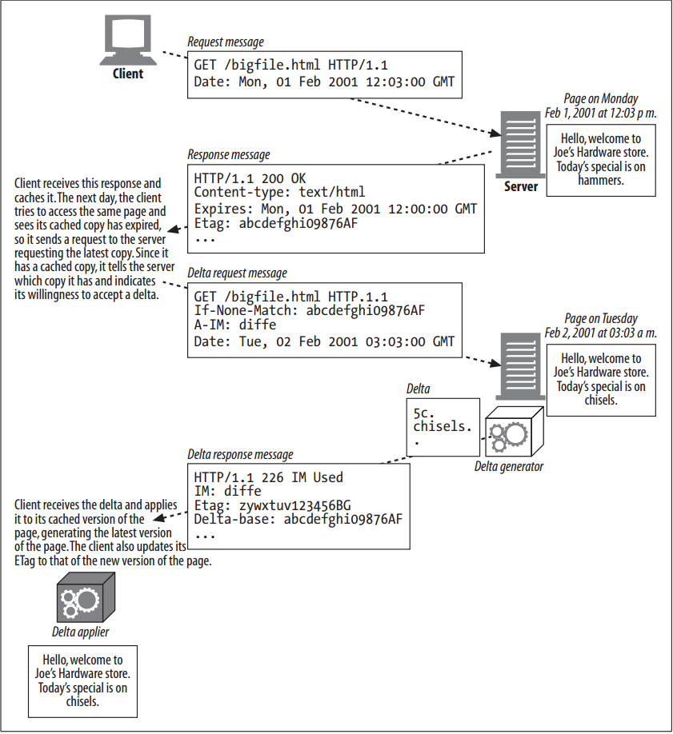

# Delta Encoding

<!-- TOC -->

- [Delta Encoding](#delta-encoding)
    - [设计思想](#设计思想)
    - [抽象本质](#抽象本质)
    - [Summary](#summary)
    - [Mechanism](#mechanism)
    - [相关 header](#相关-header)
    - [Instance Manipulations, Delta Generators, and Delta Appliers](#instance-manipulations-delta-generators-and-delta-appliers)
    - [References](#references)

<!-- /TOC -->

## 设计思想

## 抽象本质

## Summary
1. We have described different versions of a web page as different instances of a page. If a client has an expired copy of a page, it requests the latest instance of the page. 
2. If the server has a newer instance of the page, it will send it to the client, and it will send the full new instance of the page even if only a small portion of the page actually has changed. Rather than sending it the entire new page, the client would get the page faster if the server sent just the changes to the client’s copy of the page (provided that the number of changes is small). 
3. Delta encoding is an extension to the HTTP protocol that optimizes transfers by communicating changes instead of entire objects. 
4. Delta encoding is a type of instance manipulation, because it relies on clients and servers exchanging information about particular instances of an object. RFC 3229 describes delta encoding.

## Mechanism 
1. Figure below illustrates more clearly the mechanism of requesting, generating, receiving, and applying a delta-encoded document
    
2. The client has to tell the server which version of the page it has, that it is willing to accept a delta from the latest version of page, and which algorithms it knows for applying those deltas to its current version. 
3. The server has to check if it has the client’s version of the page and how to compute deltas from the latest version and the client’s version (there are several algorithms for computing the difference between two objects). 
4. It then has to compute the delta, send it to the client, let the client know that it’s sending a delta, and specify the new identifier for the latest version of the page (because this is the version that the client will end up with after it applies the delta to its old version).

## 相关 header
1. The client uses the unique identifier for its version of the page (sent by the server in its previous response to the client in the `ETag` header) in an `If-None-Match` header. This is the client’s way of telling the server, “if the latest version of the page you have does not have this same `ETag`, send me the latest version of the page”. Just the `If-None-Match` header, then, would cause the server to send the client the full latest version of the page (if it was different from the client’s version). 
2. The client can tell the server, however, that it is willing to accept a delta of the page by also sending an `A-IM` header. `A-IM` is short for Accept-Instance-Manipulation (“Oh, by the way, I do accept some forms of instance manipulation, so if you apply one of those you will not have to send me the full document.”). 
3. In the `A-IM` header, the client specifies the algorithms it knows how to apply in order to generate the latest version of a page given an old version and a delta. 
4. The server sends back the following: a special response code (`226 IM Used`) telling the client that it is sending it an instance manipulation of the requested object, not the full object itself; an `IM` (short for Instance-Manipulation) header, which specifies the algorithm used to compute the delta; the new `ETag` header; and a `Delta-Base` header, which specifies the `ETag` of the document used as the base for computing the delta (ideally, the same as the `ETag` in the client’s `If-None-Match` request!).
    

## Instance Manipulations, Delta Generators, and Delta Appliers

## References
* [*HTTP: the definitive guide*](https://book.douban.com/subject/1440226/)