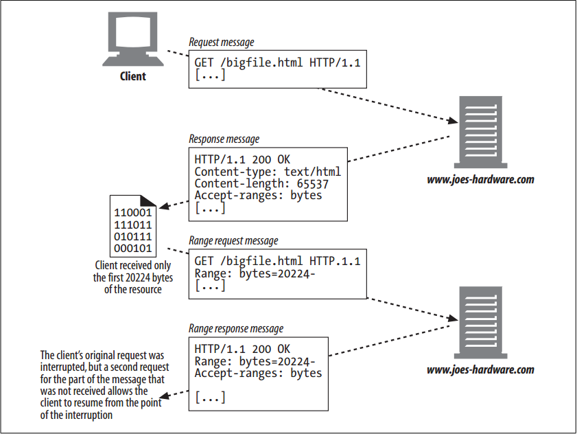

# Range Requests


<!-- TOC -->

- [Range Requests](#range-requests)
    - [设计思想](#设计思想)
    - [抽象本质](#抽象本质)
    - [Summary](#summary)
    - [References](#references)

<!-- /TOC -->


## 设计思想


## 抽象本质


## Summary
1. We now understand how a client can ask a server to send it a resource only if the client’s copy of the resource is no longer valid. HTTP goes further: it allows clients to actually request just part or a range of a document.
2. Imagine if you were three-fourths of the way through downloading the latest hot software across a slow modem link, and a network glitch interrupted your connection. You would have been waiting for a while for the download to complete, and now you would have to start all over again, hoping the same thing does not happen again.
3. With range requests, an HTTP client can resume downloading an entity by asking for the range or part of the entity it failed to get (provided that the object did not change at the origin server between the time the client first requested it and its subsequent range request). For example:
    ```
    GET /bigfile.html HTTP/1.1
    Host: www.joes-hardware.com
    Range: bytes=4000-
    User-Agent: Mozilla/4.61 [en] (WinNT; I)
    ...
    ```
4. In this example, the client is requesting the remainder of the document after the first 4,000 bytes (the end bytes do not have to be specified, because the size of the document may not be known to the requestor). Range requests of this form can be used for a failed request where the client received the first 4,000 bytes before the failure.
5. The `Range` header also can be used to request multiple ranges (the ranges can be specified in any order and may overlap)—for example, imagine a client connecting to multiple servers simultaneously, requesting different ranges of the same document from different servers in order to speed up overall download time for the document.
6. In the case where clients request multiple ranges in a single request, responses come back as a single entity, with a multipart body and a `Content-Type: multipart/byteranges` header.
7. Not all servers accept range requests, but many do. Servers can advertise to clients that they accept ranges by including the header `Accept-Ranges` in their responses. The value of this header is the unit of measure, usually bytes. For example:
    ```
    HTTP/1.1 200 OK
    Date: Fri, 05 Nov 1999 22:35:15 GMT
    Server: Apache/1.2.4
    Accept-Ranges: bytes
    ...
    ```
8. The HTTP/1.1 specification defines only the bytes token, but server and client implementors could come up
with their own units to measure or chop up an entity.
9. Figure below shows an example of a set of HTTP transactions involving ranges
    
10. Range headers are used extensively by popular peer-to-peer file-sharing client software to download different parts of multimedia files simultaneously, from different peers. 
11. Note that range requests are a class of instance manipulations, because they are exchanges between a client and a server for a particular instance of an object. That is, a client’s range request makes sense only if the client and server have the same version of a document.


## References
* [*HTTP: the definitive guide*](https://book.douban.com/subject/1440226/)