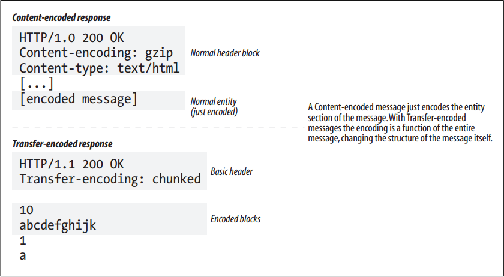
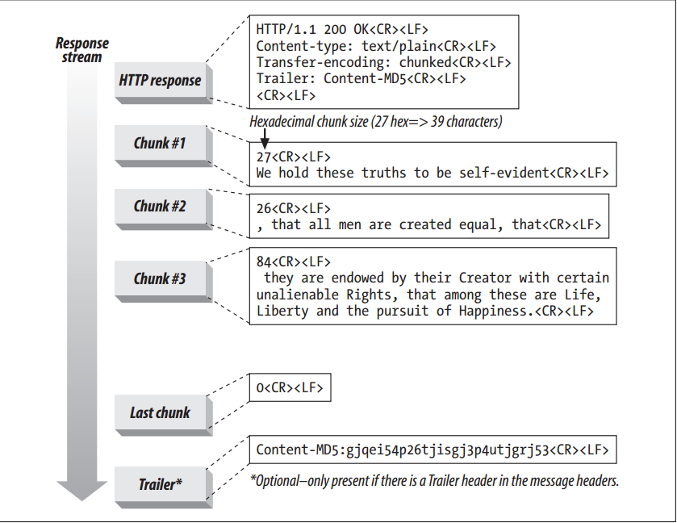
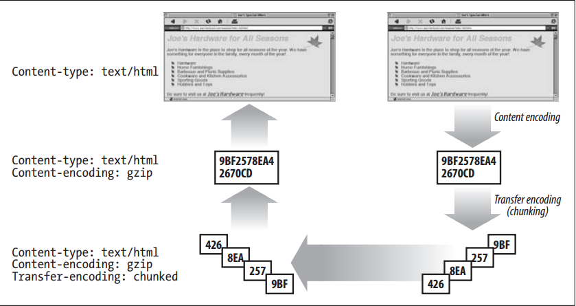

# Transfer Encoding and Chunked Encoding


<!-- TOC -->

- [Transfer Encoding and Chunked Encoding](#transfer-encoding-and-chunked-encoding)
    - [设计思想](#设计思想)
    - [抽象本质](#抽象本质)
    - [Summary](#summary)
    - [Safe Transport](#safe-transport)
        - [Unknown size](#unknown-size)
        - [Security](#security)
    - [Transfer-Encoding Headers](#transfer-encoding-headers)
    - [Chunked Encoding](#chunked-encoding)
        - [Chunk 结构](#chunk-结构)
        - [Chunking and persistent connections](#chunking-and-persistent-connections)
        - [Trailers in chunked messages](#trailers-in-chunked-messages)
    - [Combining Content and Transfer Encodings](#combining-content-and-transfer-encodings)
    - [Transfer-Encoding Rules](#transfer-encoding-rules)
    - [References](#references)

<!-- /TOC -->


## 设计思想


## 抽象本质


## Summary
1. The previous section discussed content encodings—reversible transformations applied to the body of the message. Content encodings are tightly associated with the details of the particular content format. For example, you might compress a text file with gzip, but not a JPEG file, because JPEGs don’t compress well with gzip. 
2. This section discusses transfer encodings. Transfer encodings also are reversible transformations performed on the entity body, but they are applied for architectural reasons and are independent of the format of the content. You apply a transfer encoding to a message to change the way message data is transferred across the network
    


## Safe Transport
1. Historically, transfer encodings exist in other protocols to provide “safe transport” of messages across a network. 
2. The concept of safe transport has a different focus for HTTP, where the transport infrastructure is standardized and more forgiving. 
3. In HTTP, there are only a few reasons why transporting message bodies can cause trouble. Two of these are:

### Unknown size
1. Some gateway applications and content encoders are unable to determine the final size of a message body without generating the content first. Often, these servers would like to start sending the data before the size is known.
2. Because HTTP requires the `Content-Length` header to precede the data, some servers apply a transfer encoding to send the data with a special terminating footer that indicates the end of data. 不懂

### Security
1. You might use a transfer encoding to scramble the message content before sending it across a shared transport network. 
2. However, because of the popularity of transport layer security schemes like SSL, transfer-encoding security isn’t very common.


## Transfer-Encoding Headers
1. There are just two defined headers to describe and control transfer encoding:
    * `Transfer-Encoding`: Tells the receiver what encoding has been performed on the message in order for it to be safely transported. 
    * `TE`: Used in the request header to tell the server what extension transfer encodings are okay to use. The meaning of the `TE` header would be more intuitive if it were called the Accept-Transfer-Encoding header.
2. In the following example, the request uses the `TE` header to tell the server that it accepts the chunked encoding (which it must if it’s an HTTP 1.1 application) and is willing to accept trailers on the end of chunk-encoded messages:
    ```
    GET /new_products.html HTTP/1.1
    Host: www.joes-hardware.com
    User-Agent: Mozilla/4.61 [en] (WinNT; I)
    TE: trailers, chunked
    ...
    ```
    The response includes a `Transfer-Encoding` header to tell the receiver that the message has been transfer-encoded with the chunked encoding:
    ```
    HTTP/1.1 200 OK
    Transfer-Encoding: chunked
    Server: Apache/3.0
    ...
    ```
    After this initial header, the structure of the message will change.
3. All transfer-encoding values are case-insensitive. HTTP/1.1 uses transfer-encoding values in the TE header field and in the Transfer-Encoding header field. 
4. The latest HTTP specification defines only one transfer encoding, chunked encoding. 
5. The TE header, like the `Accept-Encoding` header, can have Q values to describe preferred forms of transfer encoding. The HTTP/1.1 specification, however, forbids the association of a Q value of 0.0 to chunked encoding. 
6. Future extensions to HTTP may drive the need for additional transfer encodings. If and when this happens, the chunked transfer encoding should always be applied on top of the extension transfer encodings. This guarantees that the data will get “tunneled” through HTTP/1.1 applications that understand chunked encoding but not other transfer encodings.


## Chunked Encoding
1. Chunked encoding breaks messages into chunks of known size. Each chunk is sent one after another, eliminating the need for the size of the full message to be known before it is sent.
2. Note that chunked encoding is a form of transfer encoding and therefore is an attribute of the message, not the body. Multipart encoding, described earlier in this chapter, is an attribute of the body and is completely separate from chunked encoding.

### Chunk 结构
1. Chunked encoding is fairly simple. figure below shows the basic anatomy of a chunked message
    
2. It begins with an initial HTTP response header block, followed by a stream of chunks. 
3. Each chunk contains a length value and the data for that chunk. 
4. The length value is in hexadecimal form and is separated from the chunk data with a CRLF. The size of the chunk data is measured in bytes and includes neither the CRLF sequence between the length value and the data nor the CRLF sequence at the end of the chunk. 
4. The last chunk is special—it has a length of zero, which signifies “end of body”.

### Chunking and persistent connections
1. When the connection between the client and server is not persistent, clients do not need to know the size of the body they are reading—they expect to read the body until the server closes the connection.
2. With persistent connections, the size of the body must be known and sent in the `Content-Length` header before the body can be written.
3.  When content is dynamically created at a server, it may not be possible to know the length of the body before sending it.
4. Chunked encoding provides a solution for this dilemma, by allowing servers to send the body in chunks, specifying only the size of each chunk. As the body is dynamically generated, a server can buffer up a portion of it, send its size and the chunk, and then repeat the process until the full body has been sent. The server can signal the end of the body with a chunk of size 0 and still keep the connection open and ready for the next response.
5. A client also may send chunked data to a server. Because the client does not know beforehand whether the server accepts chunked encoding (servers do not send `TE` headers in responses to clients), it must be prepared for the server to reject the chunked request with a `411 Length Required` response.

### Trailers in chunked messages
1. A trailer can be added to a chunked message if the client’s TE header indicates that it accepts trailers, or if the trailer is added by the server that created the original response and the contents of the trailer are optional metadata that it is not necessary for the client to understand and use (it is okay for the client to ignore and discard the contents of the trailer).
2. The trailer can contain additional header fields whose values might not have been known at the start of the message (e.g., because the contents of the body had to be generated first). An example of a header that can be sent in the trailer is the `Content-MD5` header—it would be difficult to calculate the MD5 of a document before the document has been generated. 
3. 在上面 Chunk 结构 中的图中展示了 `Trailer` 首部的使用. The message headers contain a `Trailer` header listing the headers that will follow the chunked message. The last chunk is followed by the headers listed in the `Trailer` header. 
4. Any of the HTTP headers can be sent as trailers, except for the `Transfer-Encoding`, `Trailer`, and `Content-Length` headers.


## Combining Content and Transfer Encodings
Content encoding and transfer encoding can be used simultaneously. For example, figure below illustrates how a sender can compress an HTML file using a content encoding and send the data chunked using a transfer encoding. The process to “reconstruct” the body is reversed on the receiver.



## Transfer-Encoding Rules
1. When a transfer encoding is applied to a message body, a few rules must be followed:
    * The set of transfer encodings must include “chunked”. The only exception is if the message is terminated by closing the connection.
    * When the chunked transfer encoding is used, it is required to be the last transfer encoding applied to the message body.
    * The chunked transfer encoding must not be applied to a message body more than once.
2. These rules allow the recipient to determine the transfer length of the message.


## References
* [*HTTP: the definitive guide*](https://book.douban.com/subject/1440226/)