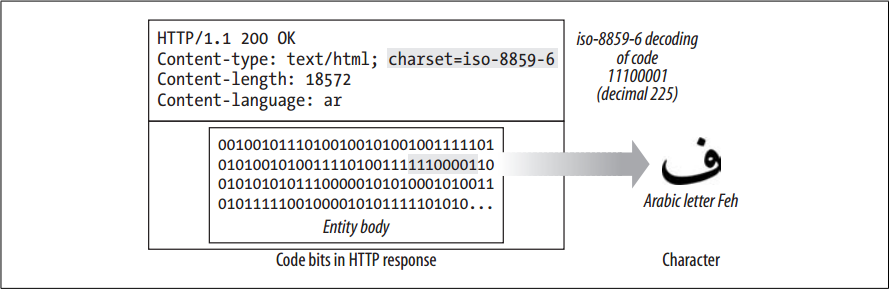
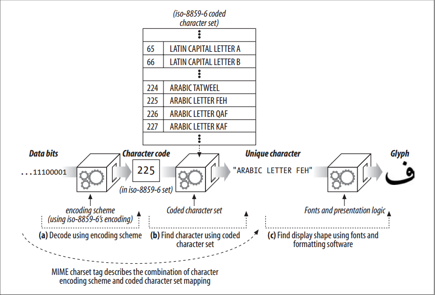

# Character Sets and HTTP


<!-- TOC -->

- [Character Sets and HTTP](#character-sets-and-http)
    - [设计思想](#%E8%AE%BE%E8%AE%A1%E6%80%9D%E6%83%B3)
    - [抽象本质](#%E6%8A%BD%E8%B1%A1%E6%9C%AC%E8%B4%A8)
    - [Summary](#summary)
    - [Charset Is a Character-to-Bits Encoding](#charset-is-a-character-to-bits-encoding)
    - [How Character Sets and Encodings Work](#how-character-sets-and-encodings-work)
    - [Standardized MIME Charset Values](#standardized-mime-charset-values)
    - [Content-Type Charset Header and META Tags](#content-type-charset-header-and-meta-tags)
    - [The Accept-Charset Header](#the-accept-charset-header)
    - [References](#references)

<!-- /TOC -->


## 设计思想


## 抽象本质


## Summary
1. So, let’s jump right into the most important (and confusing) aspects of web internationalization—international alphabetic scripts and their character set encodings.
2. Web character set standards can be pretty confusing. Lots of people get frustrated when they first try to write international web software, because of complex and inconsistent terminology, standards documents that you have to pay to read, and unfamiliarity with foreign languages. 
3. This section and the next section should make it easier for you to use character sets with HTTP.


## Charset Is a Character-to-Bits Encoding
1. The HTTP charset values tell you how to convert from entity content bits into characters in a particular alphabet. Each charset tag names an algorithm to translate bits to characters (and vice versa).
2.  The charset tags are standardized in the MIME character set registry, maintained by the IANA (see http://www.iana.org/assignments/ character-sets). 
3. The following `Content-Type` header tells the receiver that the content is an HTML file, and the `charset` parameter tells the receiver to use the iso-8859-6 Arabic character set decoding scheme to decode the content bits into characters: 
    ```
    Content-Type: text/html; charset=iso-8859-6
    ```
4. The iso-8859-6 encoding scheme maps 8-bit values into both the Latin and Arabic alphabets, including numerals, punctuation and other symbols.
5. For example, in figure below, the highlighted bit pattern has code value 225, which (under iso-8859-6) maps into the Arabic letter “FEH” (a sound like the English letter “F”)
    
6. Some character encodings (e.g., UTF-8 and iso-2022-jp) are more complicated, variable-length codes, where the number of bits per character varies. This type of coding lets you use extra bits to support alphabets with large numbers of characters (such as Chinese and Japanese), while using fewer bits to support standard Latin characters.


## How Character Sets and Encodings Work
1. We want to convert from bits in a document into characters that we can display onscreen. But because there are many different alphabets, and many different ways of encoding characters into bits (each with advantages and disadvantages), we need a standard way to describe and apply the bits-to-character decoding algorithm. 
2. Bits-to-character conversions happen in two steps, as shown in figure below: 
    
    
    1. In (a), bits from a document are converted into a character code that identifies a particular numbered character in a particular coded character set. In the example, the decoded character code is numbered 225. 
    2. In (b), the character code is used to select a particular element of the coded character set. In iso-8859-6, the value 225 corresponds to “ARABIC LETTER FEH”. The algorithms used in Steps a and b are determined from the MIME charset tag.
3. A key goal of internationalized character systems is the isolation of the semantics (letters) from the presentation (graphical presentation forms). HTTP concerns itself only with transporting the character data and the associated language and charset labels. The presentation of the character shapes is handled by the user’s graphics display software (browser, operating system, fonts), as shown in (c).


## Standardized MIME Charset Values
1. The combination of a particular character encoding and a particular coded character set is called a **MIME charset**. 
2. HTTP uses standardized MIME charset tags in the `Content-Type` and `Accept-Charset` headers. MIME charset values are registered with the IANA.


## Content-Type Charset Header and META Tags
1. Web servers send the client the MIME charset tag in the `Content-Type` header, using the charset parameter: 
    ```
    Content-Type: text/html; charset=iso-2022-jp 
    ```
2. If no charset is explicitly listed, the receiver may try to infer the character set from the document contents. For HTML content, character sets might be found in `<META HTTP-EQUIV="Content-Type">` tags that describe the charset. Example below shows how HTML `META` tags set the charset to the Japanese encoding iso-2022-jp
    ```html
    <HEAD>
    <META HTTP-EQUIV="Content-Type" CONTENT="text/html; charset=iso-2022-jp">
    <META LANG="jp">
    <TITLE>A Japanese Document</TITLE>
    </HEAD>
    <BODY>
    ...
    ```
3. If the document is not HTML, or there is no META `Content-Type` tag, software may attempt to infer the character encoding by scanning the actual text for common patterns indicative of languages and encodings.
4. If a client cannot infer a character encoding, it assumes iso-8859-1.


## The Accept-Charset Header
1. There are thousands of defined character encoding and decoding methods, developed over the past several decades. Most clients do not support all the various character coding and mapping systems. 
2. HTTP clients can tell servers precisely which character systems they support, using the `Accept-Charset` request header. The `Accept-Charset` header value provides a list of character encoding schemes that the client supports. 
3. For example, the following HTTP request header indicates that a client accepts the Western European iso-8859-1 character system as well as the UTF-8 variable-length Unicode compatibility system. A server is free to return content in either of these character encoding schemes
    ```
    Accept-Charset: iso-8859-1, utf-8
    ```
4. Note that there is no Content-Charset response header to match the `Accept-Charset` request header. The response character set is carried back from the server by the `charset` parameter of the `Content-Type` response header, to be compatible with MIME. It’s too bad this isn’t symmetric, but all the information still is there.


## References
* [*HTTP: the definitive guide*](https://book.douban.com/subject/1440226/)