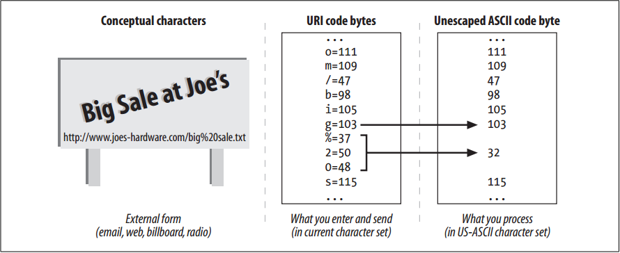

# Internationalized URIs

<!-- TOC -->

- [Internationalized URIs](#internationalized-uris)
    - [设计思想](#设计思想)
    - [抽象本质](#抽象本质)
    - [Summary](#summary)
    - [Global Transcribability Versus Meaningful Characters](#global-transcribability-versus-meaningful-characters)
    - [URI Character Repertoire](#uri-character-repertoire)
    - [Escaping and Unescaping](#escaping-and-unescaping)
    - [Escaping International Characters](#escaping-international-characters)
    - [Modal Switches in URIs](#modal-switches-in-uris)
    - [References](#references)

<!-- /TOC -->

## 设计思想

## 抽象本质

## Summary
Today, URIs don’t provide much support for internationalization. With a few (poorly defined) exceptions, today’s URIs are comprised of a subset of US-ASCII characters. There are efforts underway that might let us include a richer set of characters in the hostnames and paths of URLs, but right now, these standards have not been widely accepted or deployed. Let’s review today’s practice.

## Global Transcribability Versus Meaningful Characters
1. The URI designers wanted everyone around the world to be able to share URIs with each other—by email, by phone, by billboard, even over the radio. And they wanted URIs to be easy to use and remember. These two goals are in conflict. 
2. To make it easy for folks around the globe to enter, manipulate, and share URIs, the designers chose a very limited set of common characters for URIs (basic Latin alphabet letters, digits, and a few special characters). This small repertoire of characters is supported by most software and keyboards around the world. 
3. Unfortunately, by restricting the character set, the URI designers made it much harder for people around the globe to create URIs that are easy to use and remember. The majority of world citizens don’t even recognize the Latin alphabet, making it nearly impossible to remember URIs as abstract patterns.
4. The URI authors felt it was more important to ensure transcribability and sharability of resource identifiers than to have them consist of the most meaningful characters. So we have URIs that (today) essentially consist of a restricted subset of ASCII characters.

## URI Character Repertoire
1. The subset of US-ASCII characters permitted in URIs can be divided into **reserved**, **unreserved**, and **escape** character classes. 
2. The unreserved character classes can be used generally within any component of URIs that allow them. The reserved characters have special meanings in many URIs, so they shouldn’t be used in general. 
3. See table below for a list of the unreserved, reserved, and escape characters.
    <table>
        <thead>
            <tr>
                <th>Character class</th>
                <th>Character repertoire</th>
            </tr>
        </thead>
        <tbody>
            <tr>
                <td>Unreserved</td>
                <td>[A-Za-z0-9] | <code>-</code> | <code>_</code> | <code>.</code> | <code>!</code> | <code>~</code> | <code>*</code> | <code>'</code> | <code>(</code> | <code>)</code></td>
            </tr>
            <tr>
                <td>Reserved</td>
                <td><code>;</code> | <code>/</code> | <code>?</code> | <code>:</code> | <code>@</code> | <code>&</code> | <code>=</code> | <code>+</code> | <code>$</code> | <code>,</code></td>
            </tr>
            <tr>
                <td>Escape</td>
                <td><code>%</code> <HEX> <HEX></td>
            </tr>
        </tbody>
    </table>

## Escaping and Unescaping
1. URI “escapes” provide a way to safely insert reserved characters and other unsupported characters (such as spaces) inside URIs. An escape is a three-character sequence, consisting of a percent character (`%`) followed by two hexadecimal digit characters. 
2. The two hex digits represent the code for a US-ASCII character. For example, to insert a space (ASCII 32) in a URL, you could use the escape “`%20`”, because 20 is the hexadecimal representation of 32. Similarly, if you wanted to include a percent sign and have it not be treated as an escape, you could enter “`%25`”, where 25 is the hexadecimal value of the ASCII code for percent.
3. Figure below shows how the conceptual characters for a URI are turned into code bytes for the characters, in the current character set
    
4. When the URI is needed for processing, the escapes are undone, yielding the underlying ASCII code bytes. 
5. Internally, HTTP applications should transport and forward URIs with the escapes in place. HTTP applications should unescape the URIs only when the data is needed. 
6. And, more importantly, the applications should ensure that no URI ever is unescaped twice, because percent signs that might have been encoded in an escape will themselves be unescaped, leading to loss of data.

## Escaping International Characters
1. Note that escape values should be in the range of US-ASCII codes (0–127). 
2. Some applications attempt to use escape values to represent iso-8859-1 extended characters (128–255)—for example, web servers might erroneously use escapes to code filenames that contain international characters. This is incorrect and may cause problems with some applications. 
3. For example, the filename Sven `Ölssen.html` (containing an umlaut) might be encoded by a web server as `Sven%20%D6lssen.html`. It’s fine to encode the space with `%20`, but is technically illegal to encode the `Ö` with `%D6`, because the code `D6` (decimal 214) falls outside the range of ASCII. ASCII defines only codes up to 0x7F (decimal 127).

## Modal Switches in URIs
TODO

## References
* [*HTTP: the definitive guide*](https://book.douban.com/subject/1440226/)