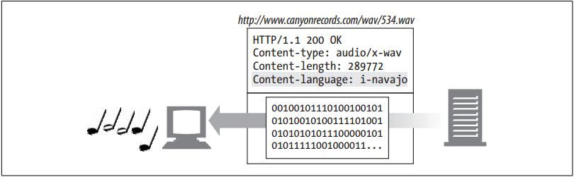

# Language Tags and HTTP


<!-- TOC -->

- [Language Tags and HTTP](#language-tags-and-http)
    - [设计思想](#%E8%AE%BE%E8%AE%A1%E6%80%9D%E6%83%B3)
    - [抽象本质](#%E6%8A%BD%E8%B1%A1%E6%9C%AC%E8%B4%A8)
    - [Summary](#summary)
    - [The Content-Language Header](#the-content-language-header)
    - [The Accept-Language Header](#the-accept-language-header)
    - [没看](#%E6%B2%A1%E7%9C%8B)
    - [References](#references)

<!-- /TOC -->


## 设计思想


## 抽象本质


## Summary
1. Language tags are short, standardized strings that name spoken languages.
2. We need standardized names, or some people will tag French documents as “French”, others will use “Français”, others still might use “France”, and lazy people might just use “Fra” or “F”. Standardized language tags avoid this confusion.
3. There are language tags for English (en), German (de), Korean (ko), and many other languages. 
4. Language tags can describe regional variants and dialects of languages, such as Brazilian Portuguese (pt-BR), U.S. English (en-US), and Hunan Chinese (zh-xiang). There is even a standard language tag for Klingon (i-klingon)!


## The Content-Language Header
1. The `Content-Language` entity header field describes the target audience languages for the entity. 
2. If the content is intended primarily for a French audience, the ContentLanguage header field would contain:
    ```
    Content-Language: fr
    ```
3. The `Content-Language` header isn’t limited to text documents. Audio clips, movies, and applications might all be intended for a particular language audience. Any media type that is targeted to particular language audiences can have a `Content-Language` header. In figure below, the audio file is tagged for a Navajo audience
    
4. 注意和 `charset` 的区别，`Content-Language` 并不是说明内容使用什么语言，例如说文档用什么语言显示，这显然是字符编码应该做的事情。而是说内容是为什么语言用户提供的。例如一篇简单的法语文章，如果它是为了中国的法语初学者准备的，`Content-Language` 就应该设置为 `zh`，而不是 `fr`。
5. If the content is intended for multiple audiences, you can list multiple languages. As suggested in the HTTP specification, a rendition of the “Treaty of Waitangi,” presented simultaneously in the original Maori and English versions, would call for:
    ```
    Content-Language: mi, en
    ```


## The Accept-Language Header
1. Most of us know at least one language. HTTP lets us pass our language restrictions and preferences along to web servers. 
2. If the web server has multiple versions of a resource, in different languages, it can give us content in our preferred language. Servers also can use the Accept-Language header to generate dynamic content in the language of the user or to select images or target language-appropriate merchandising promotions. Here, a client requests Spanish content:
    ```
    Accept-Language: es
    ```
3. You can place multiple language tags in the `Accept-Language` header to enumerate all supported languages and the order of preference (left to right). Here, the client prefers English but will accept Swiss German (de-CH) or other variants of German (de):
    ```
    Accept-Language: en, de-CH, de
    ```


## 没看
该节剩余内容


## References
* [*HTTP: the definitive guide*](https://book.douban.com/subject/1440226/)