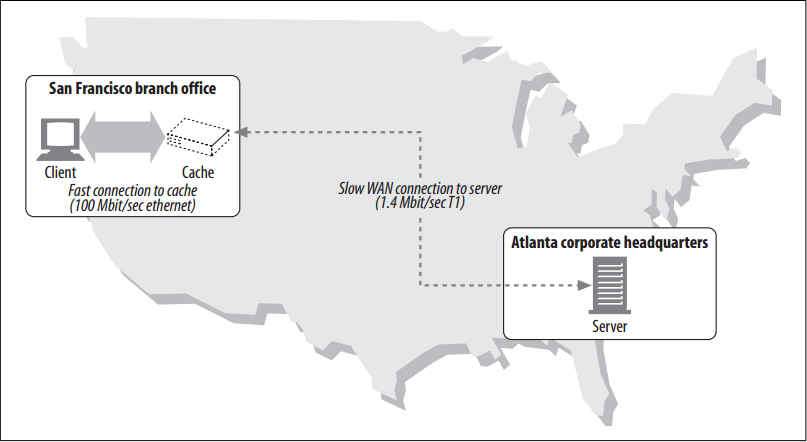

# Benefits

<!-- TOC -->

- [Benefits](#benefits)
    - [设计思想](#设计思想)
    - [抽象本质](#抽象本质)
    - [Summary](#summary)
    - [Redundant Data Transfers](#redundant-data-transfers)
    - [Bandwidth Bottlenecks](#bandwidth-bottlenecks)
    - [Flash Crowds](#flash-crowds)
    - [Distance Delays](#distance-delays)
    - [References](#references)

<!-- /TOC -->

## 设计思想

## 抽象本质

## Summary
1. Web caches are HTTP devices that automatically keep copies of popular documents. 
2. When a web request arrives at a cache, if a local “cached” copy is available, the document is served from the local storage instead of from the origin server.
3. Caches have the following benefits:
    * Caches **reduce redundant data transfers**, saving you money in network charges.
    * Caches **reduce network bottlenecks**. Pages load faster without more bandwidth.
    * Caches **reduce demand on origin servers**. Servers reply faster and avoid overload.
    * Caches **reduce distance delays**, because pages load slower from farther away.

## Redundant Data Transfers
1. When multiple clients access a popular origin server page, the server transmits the same document multiple times, once to each client. 
2. The same bytes travel across the network over and over again. These redundant data transfers eat up expensive network bandwidth, slow down transfers, and overload web servers. 
3. With caches, the cache keeps a copy of the first server response. Subsequent requests can be fulfilled from the cached copy, reducing wasteful, duplicate traffic to and from origin servers.

## Bandwidth Bottlenecks
1. Caches also can reduce network bottlenecks. 
2. Many networks provide more bandwidth to local network clients than to remote servers. Clients access servers at the speed of the slowest network on the way. 
3. If a client gets a copy from a cache on a fast LAN, caching can boost performance—especially for larger documents
    
4. In figure above, it might take 30 seconds for a user in the San Francisco branch of Joe’s Hardware, Inc. to download a 5-MB inventory file from the Atlanta headquarters, across the 1.4-Mbps T1 Internet connection. If the document was cached in the San Francisco office, a local user might be able to get the same document in less than a second across the Ethernet connection.

## Flash Crowds
1. Caching is especially important to break up flash crowds. 
2. Flash crowds occur when a sudden event (such as breaking news, a bulk email announcement, or a celebrity event) causes many people to access a web document at nearly the same time. 
3. The resulting redundant traffic spike can cause a catastrophic collapse of networks and web servers.

## Distance Delays
1. Even if bandwidth isn’t a problem, distance might be. 
2. Every network router adds delays to Internet traffic. And even if there are not many routers between client and
server, the speed of light alone can cause a significant delay.
4. The direct distance from Boston to San Francisco is about 2,700 miles. In the very best case, at the speed of light (186,000 miles/sec), a signal could travel from Boston to San Francisco in about 15 milliseconds and complete a round trip in 30 milliseconds. In reality, signals travel at somewhat less than the speed of light, so distance delays are even worse.
5. Say a web page contains 20 small images, all located on a server in San Francisco. If a client in Boston opens four parallel connections to the server, and keeps the connections alive, the speed of light alone contributes almost 1/4 second (240 msec) to the download time. If the server is in Tokyo (6,700 miles from Boston), the delay grows to 600 msec. Moderately complicated web pages can incur several seconds of speed-of-light delays.
6. Placing caches in nearby machine rooms can shrink document travel distance from thousands of miles to tens of yards.

## References
* [*HTTP: the definitive guide*](https://book.douban.com/subject/1440226/)