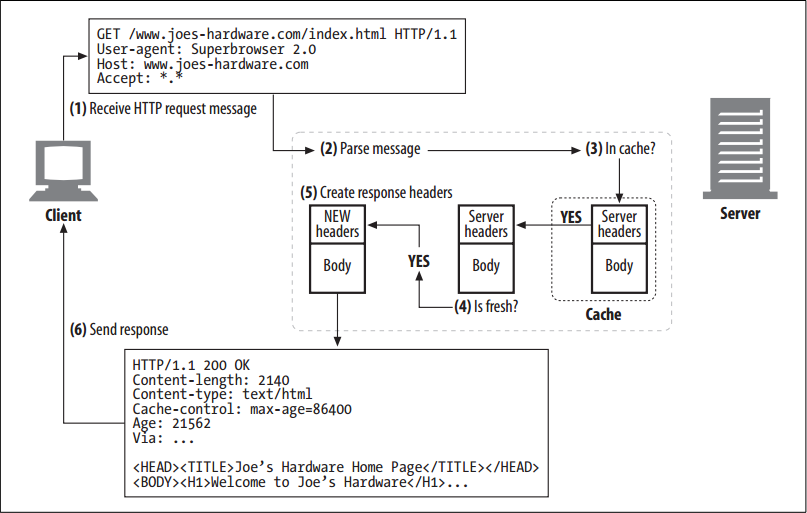
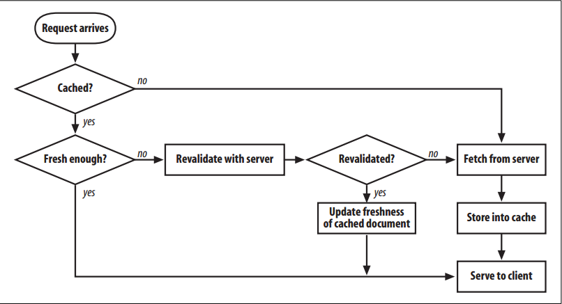

# Cache Processing Steps

<!-- TOC -->

- [Cache Processing Steps](#cache-processing-steps)
    - [设计思想](#%E8%AE%BE%E8%AE%A1%E6%80%9D%E6%83%B3)
    - [抽象本质](#%E6%8A%BD%E8%B1%A1%E6%9C%AC%E8%B4%A8)
    - [Summary](#summary)
    - [Step 1: Receiving](#step-1-receiving)
    - [Step 2: Parsing](#step-2-parsing)
    - [Step 3: Lookup](#step-3-lookup)
    - [Step 4: Freshness Check](#step-4-freshness-check)
    - [Step 5: Response Creation](#step-5-response-creation)
    - [Step 6: Sending](#step-6-sending)
    - [Step 7: Logging](#step-7-logging)
    - [Cache Processing Flowchart](#cache-processing-flowchart)
    - [References](#references)

<!-- /TOC -->

## 设计思想

## 抽象本质

## Summary
1. Modern commercial proxy caches are quite complicated. They are built to be very high-performance and to support advanced features of HTTP and other technologies.
2. But, despite some subtle details, the basic workings of a web cache are mostly simple. A basic cache-processing sequence for an HTTP `GET` message consists of seven steps
    
    
    1. Receiving — Cache reads the arriving request message from the network.
    2. Parsing — Cache parses the message, extracting the URL and headers.
    3. Lookup — Cache checks if a local copy is available and, if not, fetches a copy (and stores it locally).
    4. Freshness check — Cache checks if cached copy is fresh enough and, if not, asks server for any updates.
    5. Response creation — Cache makes a response message with the new headers and cached body.
    6. Sending — Cache sends the response back to the client over the network.
    7. Logging — Optionally, cache creates a log file entry describing the transaction.

## Step 1: Receiving
1. In Step 1, the cache detects activity on a network connection and reads the incoming data. 
2. High-performance caches read data simultaneously from multiple incoming connections and begin processing the transaction before the entire message has arrived.

## Step 2: Parsing
1. Next, the cache parses the request message into pieces and places the header parts in easy-to-manipulate data structures. 
2. This makes it easier for the caching software to process the header fields and fiddle with them.
3. The parser also is responsible for normalizing the parts of the header so that unimportant differences, like capitalization or alternate date formats, all are viewed equivalently. Also, because some request messages contain a full absolute URL and other request messages contain a relative URL and Host header, the parser typically hides these details.

## Step 3: Lookup
1. In Step 3, the cache takes the URL and checks for a local copy. 
2. The local copy might be stored in memory, on a local disk, or even in another nearby computer.
3. Professional-grade caches use fast algorithms to determine whether an object is available in the local cache. If the document is not available locally, it can be fetched from the origin server or a parent proxy, or return a failure, based on the situation and configuration.
4. The cached object contains the server response body and the original server response headers, so the correct server headers can be returned during a cache hit. 
5. The cached object also includes some metadata, used for bookkeeping how long the object has been sitting in the cache, how many times it was used, etc.
6. Sophisticated caches also keep a copy of the original client response headers that yielded the server response,
for use in HTTP/1.1 content negotiation.

## Step 4: Freshness Check
1. HTTP lets caches keep copies of server documents for a period of time. During this time, the document is considered “fresh” and the cache can serve the document without contacting the server. 
2. But once the cached copy has sat around for too long, past the document’s freshness limit, the object is considered “stale”, and the cache needs to revalidate with the server to check for any document changes before serving it. 
3. Complicating things further are any request headers that a client sends to a cache, which themselves can force the cache to either revalidate or avoid validation altogether.
4. HTTP has a set of very complicated rules for freshness checking, made worse by the large number of configuration options cache products support and by the need to interoperate with non-HTTP freshness standards.

## Step 5: Response Creation
1. Because we want the cached response to look like it came from the origin server, the cache uses the cached server response headers as the starting point for the response headers. These base headers are then modified and augmented by the cache.
2. The cache is responsible for adapting the headers to match the client. For example, the server may return an HTTP/1.0 response (or even an HTTP/0.9 response), while the client expects an HTTP/1.1 response, in which case the cache must translate the headers accordingly. 
3. Caches also insert cache freshness information (`Cache-Control`, `Age`, and `Expires` headers) and often include a `Via` header to note that a proxy cache served the request.
4. Note that the cache should not adjust the `Date` header. The `Date` header represents the date of the object when it was originally generated at the origin server.

## Step 6: Sending
1. Once the response headers are ready, the cache sends the response back to the client. 
2. Like all proxy servers, a proxy cache needs to manage the connection with the client. High-performance caches work hard to send the data efficiently, often avoiding copying the document content between the local storage and the network I/O buffers.

## Step 7: Logging
Most caches keep log files and statistics about cache usage. After each cache transaction is complete, the cache updates statistics counting the number of cache hits and misses (and other relevant metrics) and inserts an entry into a log file showing the request type, URL, and what happened.

## Cache Processing Flowchart
1. Figure below shows, in simplified form, how a cache processes a request to `GET` a URL.

## References
* [*HTTP: the definitive guide*](https://book.douban.com/subject/1440226/)