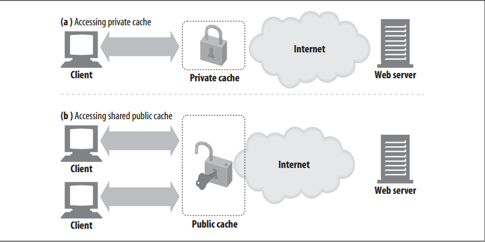
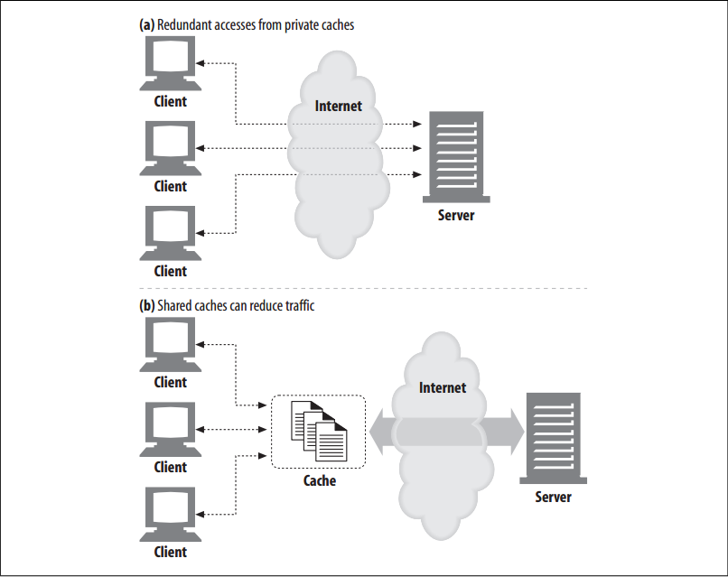
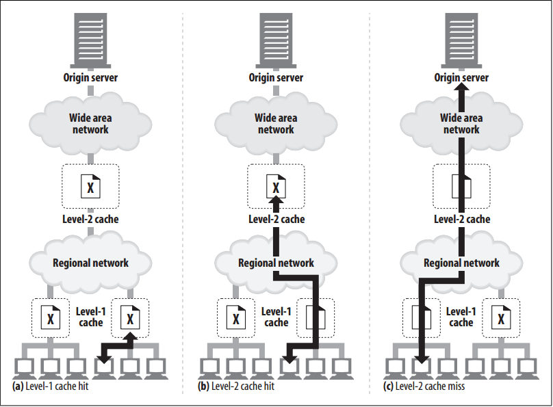
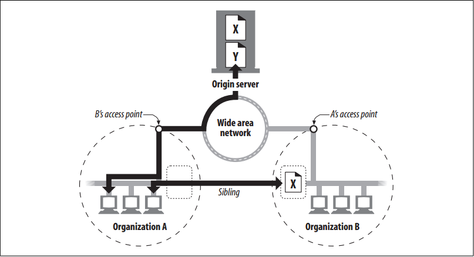

# Cache Topologies

<!-- TOC -->

- [Cache Topologies](#cache-topologies)
    - [设计思想](#设计思想)
    - [抽象本质](#抽象本质)
    - [Summary](#summary)
    - [Private Caches](#private-caches)
    - [Public Proxy Caches](#public-proxy-caches)
    - [Proxy Cache Hierarchies](#proxy-cache-hierarchies)
    - [Cache Meshes, Content Routing, and Peering](#cache-meshes-content-routing-and-peering)
    - [References](#references)

<!-- /TOC -->

## 设计思想

## 抽象本质

## Summary
1. Caches can be dedicated to a single user or shared between thousands of users
    
2. Dedicated caches are called **private caches**. Private caches are personal caches, containing popular pages for a single user. 
3. Shared caches are called **public caches**. Public caches contain the pages popular in the user community.

## Private Caches
1. Private caches don’t need much horsepower or storage space, so they can be made small and cheap. 
2. Web browsers have private caches built right in—most browsers cache popular documents in the disk and memory of your personal computer and allow you to configure the cache size and settings. You also can peek inside the browser caches to see what they contain. 

## Public Proxy Caches
1. Public caches are special, shared proxy servers called **caching proxy servers** or, more commonly, **proxy caches**. 
2. Proxy caches serve documents from the local cache or contact the server on the user’s behalf. 
3. Because a public cache receives accesses from multiple users, it has more opportunity to eliminate redundant traffic
    
4. Because a public cache caches the diverse interests of the user community, it needs to be large enough to hold a set of popular documents, without being swept clean by individual user interests.
5. In figure above (a), each client redundantly accesses a new, “hot” document (not yet in the private cache). Each private cache fetches the same document, crossing the network multiple times. 
6. With a shared, public cache, as in figure above (b), the cache needs to fetch the popular object only once, and it uses the shared copy to service all requests, reducing network traffic.

## Proxy Cache Hierarchies
1. In practice, it often makes sense to deploy hierarchies of caches, where cache misses in smaller caches are funneled to larger parent caches that service the leftover “distilled” traffic. 
2. Figure below shows a two-level cache hierarchy 
    
3. The idea is to use small, inexpensive caches near the clients and progressively larger, more powerful caches up the
hierarchy to hold documents shared by many users.
4. Hopefully, most users will get cache hits on the nearby, level-1 caches. If not, larger parent caches may be able to handle their requests. 
5. For deep cache hierarchies it’s possible to go through long chains of caches, but each intervening proxy does impose some performance penalty that can become noticeable as the proxy chain becomes long.
6. In practice, network architects try to limit themselves to two or three proxies in a row. However, a new generation of high-performance proxy servers may make proxy-chain length less of an issue.

## Cache Meshes, Content Routing, and Peering
1. Some network architects build complex **cache meshes** instead of simple cache hierarchies. 
2. Proxy caches in cache meshes talk to each other in more sophisticated ways, and make dynamic cache communication decisions, deciding which parent caches to talk to, or deciding to bypass caches entirely and direct themselves to the origin server. 
3. Such proxy caches can be described as **content routers**, because they make routing decisions about how to access, manage, and deliver content.
4. Caches designed for content routing within cache meshes may do all of the following (among other things):
    * Select between a parent cache or origin server dynamically, based on the URL.
    * Select a particular parent cache dynamically, based on the URL.
    * Search caches in the local area for a cached copy before going to a parent cache.
    * Allow other caches to access portions of their cached content, but do not permit Internet transit through their cache.
5. These more complex relationships between caches allow different organizations to peer with each other, connecting their caches for mutual benefit. Caches that provide selective peering support are called **sibling caches**
    
6. Because HTTP doesn’t provide sibling cache support, people have extended HTTP with protocols, such as the Internet Cache Protocol (ICP) and the HyperText Caching Protocol (HTCP). 

## References
* [*HTTP: the definitive guide*](https://book.douban.com/subject/1440226/)