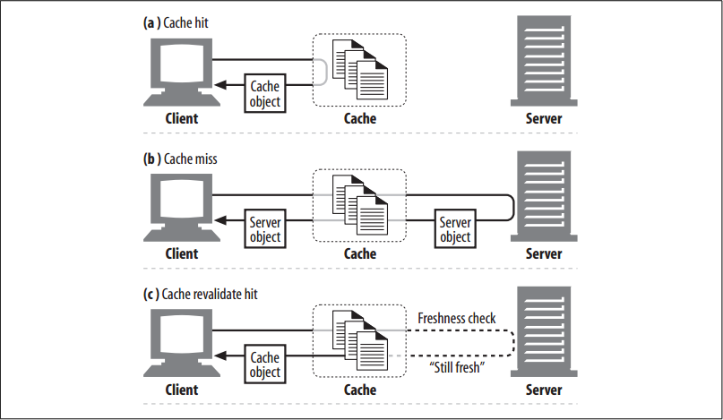
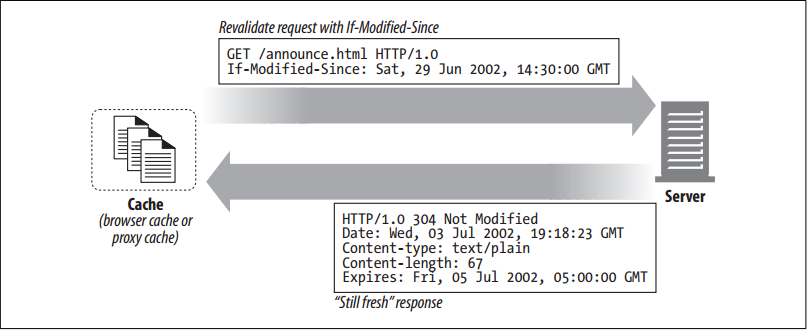

# Hits and Misses

<!-- TOC -->

- [Hits and Misses](#hits-and-misses)
    - [设计思想](#设计思想)
    - [抽象本质](#抽象本质)
    - [Summary](#summary)
    - [再验证](#再验证)
        - [再验证命中](#再验证命中)
        - [`If-Modified-Since`](#if-modified-since)
            - [Revalidate hit](#revalidate-hit)
            - [Revalidate miss](#revalidate-miss)
            - [Object deleted](#object-deleted)
    - [Hit Rate](#hit-rate)
    - [Byte Hit Rate](#byte-hit-rate)
    - [Distinguishing Hits and Misses](#distinguishing-hits-and-misses)
    - [References](#references)

<!-- /TOC -->

## 设计思想

## 抽象本质

## Summary
如果请求到达缓存时发现有可用副本，这被称为 **缓存命中**（cache hit）；如果没有的话，缓存就会把请求转发到原始服务器，这被称为 **缓存为命中**（cache miss）；如果缓存不确定副本是否还能用，则需要向原始服务器确认，这被称为 **再验证**（revalidation）

## 再验证
1. 因为服务器的内容可能会发生改变，所以缓存需要时不时的检查自己的副本是否是最新的。
2. 为了能高效的验证，HTTP 定义了一些特殊的请求，不用从服务器获取完整的对象就能进行验证。

### 再验证命中
1. 缓存需要验证某个副本时，会向原始服务器发送一个小的再验证请求。如果服务器端的资源没有变化，则会返回一个小的响应，状态为 `304 Not Modified`。
2. 缓存因此会将自己的副本标记为暂时新鲜的，然后把副本返回给客户端。
3. 这被称为再验证命中或慢命中。下图 a
    

### `If-Modified-Since`
1. HTTP gives us a few tools to revalidate cached objects, but the most popular is the `If-Modified-Since` header. 
2. When added to a `GET` request, this header tells the server to send the object only if it has been modified since the time the copy was cached.
3. Here is what happens when a `GET` `If-Modified-Since` request arrives at the server in three circumstances:
    * when the server content is not modified
    * when the server content has been changed
    * when the object on the server is deleted

#### Revalidate hit
If the server object isn’t modified, the server sends the client a small `HTTP 304 Not Modified` response

#### Revalidate miss
If the server object is different from the cached copy, the server sends the client a normal `HTTP 200 OK` response, with the full content.

#### Object deleted
If the server object has been deleted, the server sends back a `404 Not Found` response, and the cache deletes its copy.

## Hit Rate
1. The fraction of requests that are served from cache is called the **cache hit rate** (or cache hit ratio), or sometimes the document hit rate (or document hit ratio). 
2. The hit rate ranges from 0 to 1 but is often described as a percentage, where 0% means that every request was a miss (had to get the document across the network), and 100% means every request was a hit (had a copy in the cache).
3. Sometimes people include revalidate hits in the hit rate, but other times hit rate and revalidate hit rate are measured separately. When you are examining hit rates, be sure you know what counts as a “hit”.
4. Cache administrators would like the cache hit rate to approach 100%. The actual hit rate you get depends on how big your cache is, how similar the interests of the cache users are, how frequently the cached data is changing or personalized, and how the caches are configured. 
5. Hit rate is notoriously difficult to predict, but a hit rate of 40% is decent for a modest web cache today. The nice thing about caches is that even a modest-sized cache may contain enough popular documents to significantly improve performance and reduce traffic. Caches work hard to ensure that useful content stays in the cache.

## Byte Hit Rate
1. Document hit rate doesn’t tell the whole story, though, because documents are not all the same size. Some large objects might be accessed less often but contribute more to overall data traffic, because of their size. 
2. For this reason, some people prefer the **byte hit rate** metric (especially those folks who are billed for each byte of traffic!).
3. The byte hit rate represents the fraction of all bytes transferred that were served from cache. This metric captures the degree of traffic savings. A byte hit rate of 100% means every byte came from the cache, and no traffic went out across the Internet.
3. Document hit rate and byte hit rate are both useful gauges of cache performance. 
4. Document hit rate describes how many web transactions are kept off the outgoing network. Because transactions have a fixed time component that can often be large (setting up a TCP connection to a server, for example), improving the document hit rate will optimize for overall latency (delay) reduction. 
5. Byte hit rate describes how many bytes are kept off the Internet. Improving the byte hit rate will optimize for
bandwidth savings.

## Distinguishing Hits and Misses
1. Unfortunately, HTTP provides no way for a client to tell if a response was a cache hit or an origin server access. In both cases, the response code will be `200 OK`, indicating that the response has a body. Some commercial proxy caches attach additional information to `Via` headers to describe what happened in the cache.
2. One way that a client can usually detect if the response came from a cache is to use the `Date` header. By comparing the value of the `Date` header in the response to the current time, a client can often detect a cached response by its older date value.
3. Another way a client can detect a cached response is the `Age` header, which tells how old the response is.

## References
* [*HTTP: the definitive guide*](https://book.douban.com/subject/1440226/)