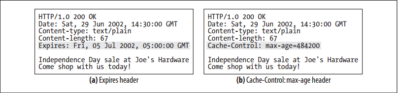
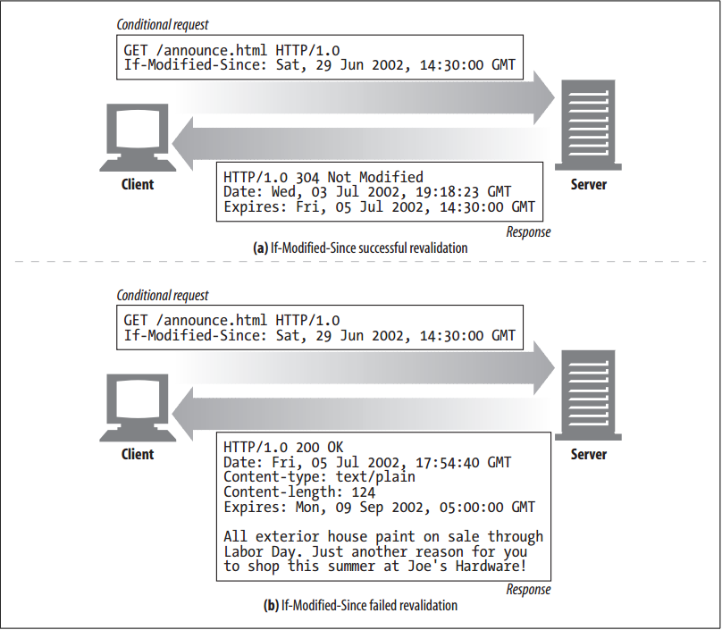
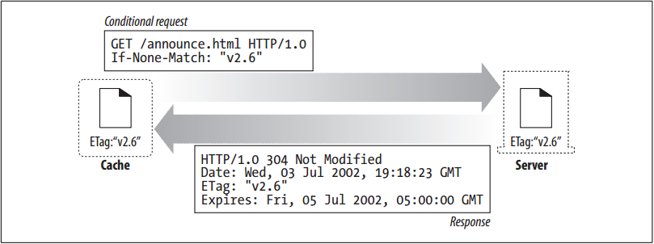

# Keeping Copies Fresh


<!-- TOC -->

- [Keeping Copies Fresh](#keeping-copies-fresh)
    - [设计思想](#设计思想)
    - [抽象本质](#抽象本质)
    - [Summary](#summary)
    - [Document Expiration](#document-expiration)
        - [Expiration Dates and Ages](#expiration-dates-and-ages)
    - [Server Revalidation](#server-revalidation)
        - [Revalidation with Conditional Methods](#revalidation-with-conditional-methods)
        - [`If-Modified-Since`: Date Revalidation](#if-modified-since-date-revalidation)
        - [`If-None-Match`: Entity Tag Revalidation](#if-none-match-entity-tag-revalidation)
        - [Weak and Strong Validators](#weak-and-strong-validators)
        - [When to Use Entity Tags and Last-Modified Dates](#when-to-use-entity-tags-and-last-modified-dates)
    - [References](#references)

<!-- /TOC -->


## 设计思想


## 抽象本质


## Summary
1. Cached copies might not all be consistent with the documents on the server. After all, documents do change over time. Reports might change monthly. Online newspapers change daily. Financial data may change every few seconds. Caches would be useless if they always served old data. Cached data needs to maintain some consistency with the server data.
2. HTTP includes simple mechanisms to keep cached data sufficiently consistent with servers, without requiring servers to remember which caches have copies of their documents. HTTP calls these simple mechanisms **document expiration** and **server revalidation**.


## Document Expiration
1. HTTP lets an origin server attach an “expiration date” to each document, using special HTTP `Cache-Control` and `Expires` headers
    
2. Like an expiration date on a quart of milk, these headers dictate how long content should be viewed as fresh.
3. Until a cache document expires, the cache can serve the copy as often as it wants, without ever contacting the server—unless, of course, a client request includes headers that prevent serving a cached or unvalidated resource. 
4. But, once the cached document expires, the cache must check with the server to ask if the document has changed and, if so, get a fresh copy (with a new expiration date).


### Expiration Dates and Ages
1. Servers specify expiration dates using the HTTP/1.0+ `Expires` or the HTTP/1.1 `Cache-Control: max-age` response headers, which accompany a response body. 
2. The `Expires` and `Cache-Control: max-age` headers do basically the same thing, but the newer `Cache-Control` header is preferred, because it uses a relative time instead of an absolute date. Absolute dates depend on computer clocks being set correctly.


## Server Revalidation
1. Just because a cached document has expired doesn’t mean it is actually different from what’s living on the origin server; it just means that it’s time to check. 
2. This is called “server revalidation”, meaning the cache needs to ask the origin server whether the document has changed:
    * If revalidation shows the content has changed, the cache gets a new copy of the document, stores it in place of the old data, and sends the document to the client.
    * If revalidation shows the content has not changed, the cache only gets new headers, including a new expiration date, and updates the headers in the cache.
3. This is a nice system. The cache doesn’t have to verify a document’s freshness for every request—it has to revalidate with the server only once the document has expired. This saves server traffic and provides better user response time, without serving stale content.
4. The HTTP protocol requires a correctly behaving cache to return one of the following:
    * A cached copy that is “fresh enough”
    * A cached copy that has been revalidated with the server to ensure it’s still fresh
    * An error message, if the origin server to revalidate with is down. If the origin server is not accessible, but 
    the cache needs to revalidate, the cache must return an error or a warning describing the communication failure. Otherwise, pages from a removed server may live in network caches for an arbitrary time into the future.
    * A cached copy, with an attached warning that it might be incorrect


### Revalidation with Conditional Methods
1. HTTP’s conditional methods make revalidation efficient. HTTP allows a cache to send a “conditional GET” to the origin server, asking the server to send back an object body only if the document is different from the copy currently in the cache. 
2. In this manner, the freshness check and the object fetch are combined into a single conditional GET. Conditional GETs are initiated by adding special conditional headers to GET request messages. The web server returns the object only if the condition is true.
3. HTTP defines five conditional request headers. The two that are most useful for cache revalidation are `If-Modified-Since` and `If-None-Match`:
    * `If-Modified-Since: <date>`: Perform the requested method if the document has been modified since the specified date. This is used in conjunction with the `Last-Modified` server response header, to fetch content only if the content has been modified from the cached version.
    * `If-None-Match: <tags>`: Instead of matching on last-modified date, the server may provide special tags (“ETag”) on the document that act like serial numbers. The `If-None-Match` header performs the requested method if the cached tags differ from the tags in the server’s document.
4. All conditional headers begin with the prefix “If-”. Other conditional headers include `If-Unmodified-Since` (useful for partial document transfers, when you need to ensure the document is unchanged before you fetch another piece of it), `If-Range` (to support caching of incomplete documents), and `If-Match` (useful for concurrency control when dealing with web servers).


### `If-Modified-Since`: Date Revalidation
1. `If-Modified-Since` revalidation requests often are called “IMS” requests. IMS requests instruct a server to perform the request only if the resource has changed since a certain date:
    * If the document was modified since the specified date, the `If-Modified-Since` condition is true, and the `GET` succeeds normally. The new document is returned to the cache, along with new headers containing, among other information, a new expiration date.
    * If the document was not modified since the specified date, the condition is false, and a small `304 Not Modified` response message is returned to the client, without a document body, for efficiency. Headers are returned in the response; however, only the headers that need updating from the original need to be returned. For example, the `Content-Type` header does not usually need to be sent, since it usually has not changed. A new expiration date typically is sent.
2. The `If-Modified-Since` header works in conjunction with the `Last-Modified` server response header. The origin server attaches the last modification date to served documents. When a cache wants to revalidate a cached document, it includes an `If-Modified-Since` header with the date the cached copy was last modified:
    ```
    If-Modified-Since: <cached last-modified date>
    ```
3. If the content has changed in the meantime, the last modification date will be different, and the origin server will send back the new document. Otherwise, the server will note that the cache’s last-modified date matches the server document’s current last-modified date, and it will return a `304 Not Modified` response.
4. For example, as shown in figure below, if your cache revalidates Joe’s Hardware’s Fourth of July sale announcement on July 3, you will receive back a `Not Modified` response. But if your cache revalidates the document after the sale
ends at midnight on July 5, the cache will receive a new document, because the server content has changed
    


### `If-None-Match`: Entity Tag Revalidation
1. There are some situations when the last-modified date revalidation isn’t adequate:
    * Some documents may be rewritten periodically (e.g., from a background process) but actually often contain the same data. The modification dates will change, even though the content hasn’t.
    * Some documents may have changed, but only in ways that aren’t important enough to warrant caches worldwide to reload the data (e.g., spelling or comment changes).
    * Some servers cannot accurately determine the last modification dates of their pages.
    * For servers that serve documents that change in sub-second intervals (e.g. realtime monitors), the one-second granularity of modification dates might not be adequate.
2. To get around these problems, HTTP allows you to compare document “version identifiers” called **entity tags** (ETags). Entity tags are arbitrary labels (quoted strings) attached to the document. They might contain a serial number or version name for the document, or a checksum or other fingerprint of the document content.
3. When the publisher makes a document change, he can change the document’s entity tag to represent this new version. Caches can then use the `If-None-Match` conditional header to `GET` a new copy of the document if the entity tags have changed.
4. In figure below, the cache has a document with entity tag “v2.6”. It revalidates with the origin server asking for a new object only if the tag “v2.6” no longer matches
    
5. If the entity tag on the server had changed (perhaps to “v3.0”), the server would return the new content in a `200 OK` response, along with the content and new ETag. 
6. Several entity tags can be included in an `If-None-Match` header, to tell the server that the cache already has copies of objects with those entity tags:
    ```
    If-None-Match: "v2.6"
    If-None-Match: "v2.4","v2.5","v2.6"
    If-None-Match: "foobar","A34FAC0095","Profiles in Courage"
    ```

### Weak and Strong Validators
1. Caches use entity tags to determine whether the cached version is up-to-date with respect to the server (much like they use last-modified dates). In this way, entity tags and last-modified dates both are cache validators.
2. Servers may sometimes want to allow cosmetic or insignificant changes to documents without invalidating all cached copies. HTTP/1.1 supports “weak validators”, which allow the server to claim “good enough” equivalence even if the contents have changed slightly.
3. Strong validators change any time the content changes. Weak validators allow some content change but generally change when the significant meaning of the content changes. 
4. Some operations cannot be performed using weak validators (such as conditional partial-range fetches), so servers identify validators that are weak with a “W/” prefix:
    ```
    ETag: W/"v2.6"
    If-None-Match: W/"v2.6"
    ```
5. A strog entity tag must change whenever the associated entity value changes in any way. A weak entity tag should change whenever the associated entity changes in a semantically significant way.
6. Note that an origin server must avoid reusing a specific strong entity tag value for two different entities, or reusing a specific weak entity tag value for two semantically different entities. Cache entries might persist for arbitrarily long periods, regardless of expiration times, so it might be inappropriate to expect that a cache will never again attempt to validate an entry using a validator that it obtained at some point in the past.


### When to Use Entity Tags and Last-Modified Dates
1. HTTP/1.1 clients must use an entity tag validator if a server sends back an entity tag. If the server sends back only a `Last-Modified` value, the client can use `If-Modified-Since` validation. If both an entity tag and a last-modified date are available, the client should use both revalidation schemes, allowing both HTTP/1.0 and HTTP/1.1 caches to respond appropriately.
2. HTTP/1.1 origin servers should send an entity tag validator unless it is not feasible to generate one, and it may be a weak entity tag instead of a strong entity tag, if there are benefits to weak validators. Also, it’s preferred to also send a last-modified value.
3. If an HTTP/1.1 cache or server receives a request with both `If-Modified-Since` and entity tag conditional headers, it must not return a `304 Not Modified` response unless doing so is consistent with all of the conditional header fields in the request. 只有两个都满足继续使用缓存的条件才能返回 304。


## References
* [*HTTP: the definitive guide*](https://book.douban.com/subject/1440226/)