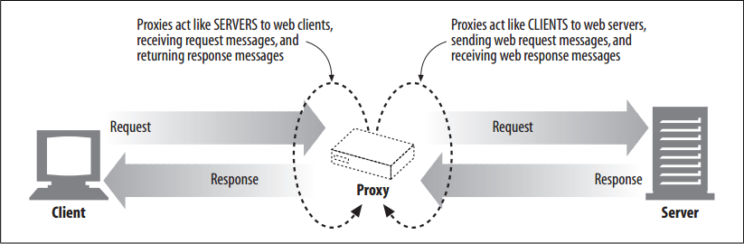
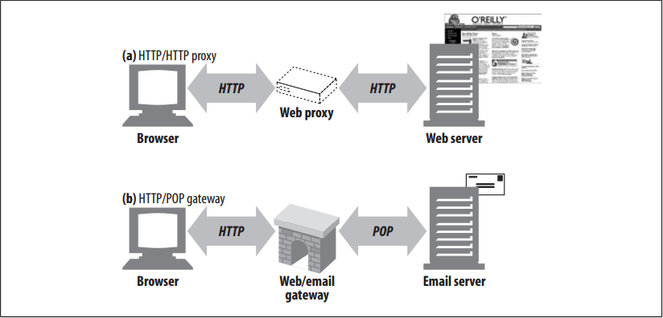

# Web Intermediaries

<!-- TOC -->

- [Web Intermediaries](#web-intermediaries)
    - [设计思想](#设计思想)
    - [抽象本质](#抽象本质)
    - [Summary](#summary)
    - [Private and Shared Proxies](#private-and-shared-proxies)
        - [Public proxies](#public-proxies)
        - [Private proxies](#private-proxies)
    - [Proxies Versus Gateways](#proxies-versus-gateways)
    - [References](#references)

<!-- /TOC -->

## 设计思想

## 抽象本质

## Summary
1. Web proxy servers are middlemen that fulfill transactions on the client’s behalf.
2. Without a web proxy, HTTP clients talk directly to HTTP servers. With a web proxy, the client instead talks to the proxy, which itself communicates with the server on the client’s behalf. 
3. The client still completes the transaction, but through the good services of the proxy server.
4. HTTP proxy servers are both web servers and web clients. Because HTTP clients send request messages to proxies, the proxy server must properly handle the requests and the connections and return responses, just like a web server. At the same time, the proxy itself sends requests to servers, so it must also behave like a correct HTTP client, sending requests and receiving responses 
    
5. If you are creating your own HTTP proxy, you’ll need to carefully follow the rules for both HTTP clients and HTTP servers.

## Private and Shared Proxies
1. A proxy server can be dedicated to a single client or shared among many clients.
2. Proxies dedicated to a single client are called **private proxies**. Proxies shared among numerous clients are called **public proxies**.

### Public proxies
1. Most proxies are public, shared proxies. It’s more cost effective and easier to administer a centralized proxy. 
2. And some proxy applications, such as caching proxy servers, become more useful as more users are funneled into the same proxy server, because they can take advantage of common requests between users.

### Private proxies
1. Dedicated private proxies are not as common, but they do have a place, especially when run directly on the client computer. 
2. Some browser assistant products, as well as some ISP services, run small proxies directly on the user’s PC in order to extend browser features, improve performance, or host advertising for free ISP services.
        

## Proxies Versus Gateways
1. Strictly speaking, proxies connect two or more applications that speak the same protocol, while gateways hook up two or more parties that speak different protocols. 
2. A gateway acts as a “protocol converter”, allowing a client to complete a transaction with a server, even when the client and server speak different protocols.
3. Figure below illustrates the difference between proxies and gateways:
    
    * The intermediary device in (a) is an HTTP proxy, because the proxy speaks HTTP to both the client and server.
    * The intermediary device in (b) is an HTTP/POP gateway, because it ties an HTTP frontend to a POP email backend. The gateway converts web transactions into the appropriate POP transactions, to allow the user to read email through HTTP. Web-based email programs such as Yahoo! Mail and MSN Hotmail are HTTP email gateways.
4. In practice, the difference between proxies and gateways is blurry. Because browsers and servers implement different versions of HTTP, proxies often do some amount of protocol conversion. And commercial proxy servers implement gateway functionality to support SSL security protocols, SOCKS firewalls, FTP access, and web-based applications. 

## References
* [*HTTP: the definitive guide*](https://book.douban.com/subject/1440226/)