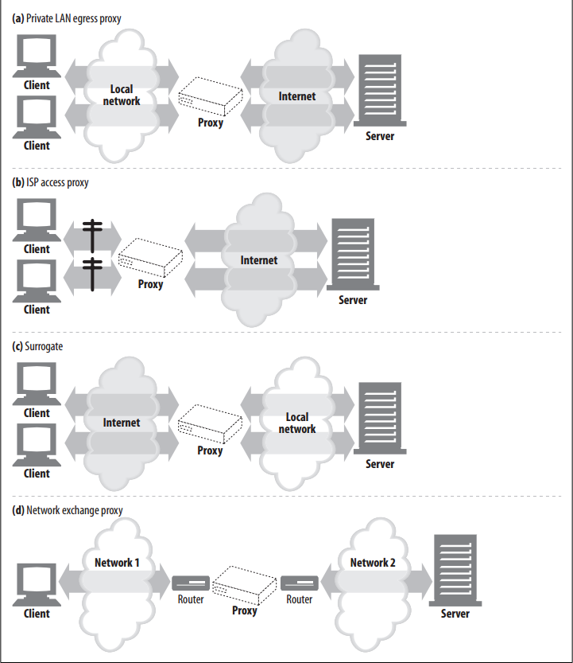
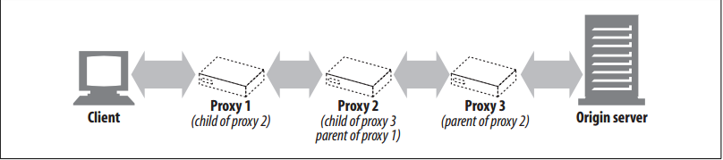
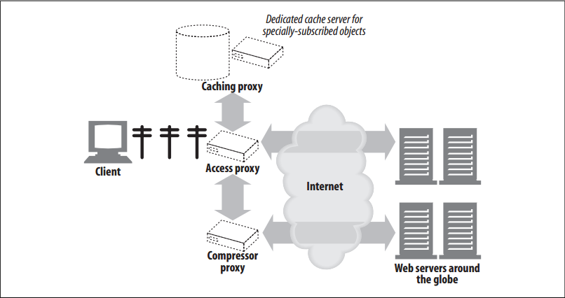
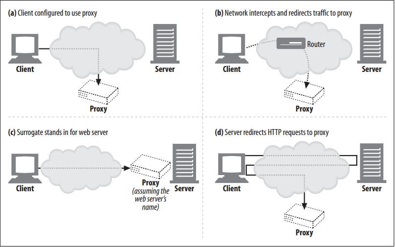

# Where Do Proxies Go

The previous section explained what proxies do. Now let’s talk about where proxies sit when they are deployed into a network architecture. 

<!-- TOC -->

- [Where Do Proxies Go](#where-do-proxies-go)
    - [设计思想](#%E8%AE%BE%E8%AE%A1%E6%80%9D%E6%83%B3)
    - [抽象本质](#%E6%8A%BD%E8%B1%A1%E6%9C%AC%E8%B4%A8)
    - [Proxy Server Deployment](#proxy-server-deployment)
        - [Egress proxy 上图 a](#egress-proxy-%E4%B8%8A%E5%9B%BE-a)
        - [Access ingress proxy 上图 b](#access-ingress-proxy-%E4%B8%8A%E5%9B%BE-b)
        - [Surrogates 上图 c](#surrogates-%E4%B8%8A%E5%9B%BE-c)
        - [Network exchange proxy 上图 d](#network-exchange-proxy-%E4%B8%8A%E5%9B%BE-d)
    - [Proxy Hierarchies](#proxy-hierarchies)
        - [Proxy hierarchy content routing](#proxy-hierarchy-content-routing)
    - [How Proxies Get Traffic](#how-proxies-get-traffic)
        - [Modify the client 上图 a](#modify-the-client-%E4%B8%8A%E5%9B%BE-a)
        - [Modify the network 上图 b](#modify-the-network-%E4%B8%8A%E5%9B%BE-b)
        - [Modify the DNS namespace 上图 c](#modify-the-dns-namespace-%E4%B8%8A%E5%9B%BE-c)
        - [Modify the web server 上图 d](#modify-the-web-server-%E4%B8%8A%E5%9B%BE-d)
    - [References](#references)

<!-- /TOC -->

## 设计思想

## 抽象本质

## Proxy Server Deployment
You can place proxies in all kinds of places, depending on their intended uses.

### Egress proxy (上图 a)
1. You can stick proxies at the exit points of local networks to control the traffic flow between the local network and the greater Internet. 
2. You might use egress proxies in a corporation to offer firewall protection against malicious hackers outside the enterprise or to reduce bandwidth charges and improve performance of Internet traffic. 
3. An elementary school might use a filtering egress proxy to prevent precocious students from browsing inappropriate content.

### Access (ingress) proxy (上图 b)
1. Proxies are often placed at ISP access points, processing the aggregate requests from the customers. 
2. ISPs use caching proxies to store copies of popular documents, to improve the download speed for their users (especially those with high-speed connections) and reduce Internet bandwidth costs.

### Surrogates (上图 c)
1. Proxies frequently are deployed as surrogates (also commonly called reverse proxies) at the edge of the network, in front of web servers, where they can field all of the requests directed at the web server and ask the web server for resources only when necessary. 
2. Surrogates can add security features to web servers or improve performance by placing fast web server caches in front of slower web servers. 
3. Surrogates typically assume the name and IP address of the web server directly, so all requests go to the proxy instead of the server.

### Network exchange proxy (上图 d)
With sufficient horsepower, proxies can be placed in the Internet peering exchange points between networks, to alleviate congestion at Internet junctions through caching and to monitor traffic flows.

## Proxy Hierarchies
1. Proxies can be cascaded in chains called proxy hierarchies. In a proxy hierarchy, messages are passed from proxy to proxy until they eventually reach the origin server (and then are passed back through the proxies to the client), as shown in figure below
    
2. Proxy servers in a proxy hierarchy are assigned parent and child relationships. The next inbound proxy (closer to the server) is called the parent, and the next outbound proxy (closer to the client) is called the child. 
3. In figure above, proxy 1 is the child proxy of proxy 2. Likewise, proxy 2 is the child proxy of proxy 3, and proxy 3 is the parent proxy of proxy 2.

### Proxy hierarchy content routing
1. The proxy hierarchy in figure above is static—proxy 1 always forwards messages to proxy 2, and proxy 2 always forwards messages to proxy 3. 
2. However, hierarchies do not have to be static. A proxy server can forward messages to a varied and changing set of proxy servers and origin servers, based on many factors.
3. For example, in figure below, the access proxy routes to parent proxies or origin servers in different circumstances:
    
    
    * If the requested object belongs to a web server that has paid for content distribution, the proxy could route the request to a nearby cache server that would either return the cached object or fetch it if it wasn’t available.
    * If the request was for a particular type of image, the access proxy might route the request to a dedicated compression proxy that would fetch the image and then compress it, so it would download faster across a slow modem to the client.
4. Here are a few other examples of dynamic parent selection:
    * Load balancing: A child proxy might pick a parent proxy based on the current level of workload on the parents, to spread the load around.
    * Geographic proximity routing: A child proxy might select a parent responsible for the origin server’s geographic region.
    * Protocol/type routing: A child proxy might route to different parents and origin servers based on the URI. Certain types of URIs might cause the requests to be transported through special proxy servers, for special protocol handling.
    * Subscription-based routing: If publishers have paid extra money for high-performance service, their URIs might be routed to large caches or compression engines to improve performance.

## How Proxies Get Traffic
Because clients normally talk directly to web servers, we need to explain how HTTP traffic finds its way to a proxy in the first place. There are four common ways to cause client traffic to get to a proxy:

### Modify the client (上图 a)
1. Many web clients, including Netscape and Microsoft browsers, support both manual and automated proxy configuration. 
2. If a client is configured to use a proxy server, the client sends HTTP requests directly and intentionally to the
proxy, instead of to the origin server.

### Modify the network (上图 b)
1. There are several techniques where the network infrastructure intercepts and steers web traffic into a proxy, without the client’s knowledge or participation.
2. This interception typically relies on switching and routing devices that watch for HTTP traffic, intercept it, and shunt the traffic into a proxy, without the client’s knowledge. This is called an **intercepting proxy**.
3. Intercepting proxies commonly are called “transparent proxies”, because you connect to them without being aware of their presence. Because the term “transparency” already is used in the HTTP specifications to indicate functions that don’t change semantic behavior, the standards community suggests using the term “interception” for traffic capture. We adopt this nomenclature here.

### Modify the DNS namespace (上图 c)
1. Surrogates, which are proxy servers placed in front of web servers, assume the name and IP address of the web server directly, so all requests go to them instead of to the server. 
2. This can be arranged by manually editing the DNS naming tables or by using special dynamic DNS servers that compute the appropriate proxy or server to use on-demand. （大概是把域名映射到代理服务器的 IP 上而不是源服务器上）
3. In some installations, the IP address and name of the real server is changed and the surrogate is given the former address and name.

### Modify the web server (上图 d)
1. Some web servers also can be configured to redirect client requests to a proxy by sending an HTTP redirection command back to the client.
2. Upon receiving the redirect, the client transacts with the proxy.

## References
* [*HTTP: the definitive guide*](https://book.douban.com/subject/1440226/)