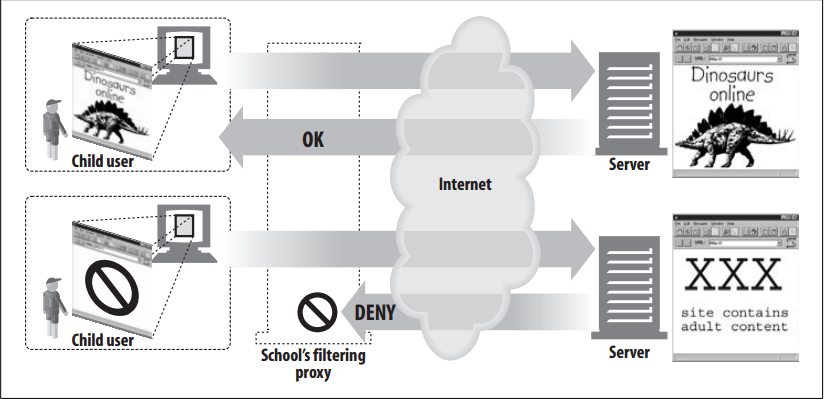
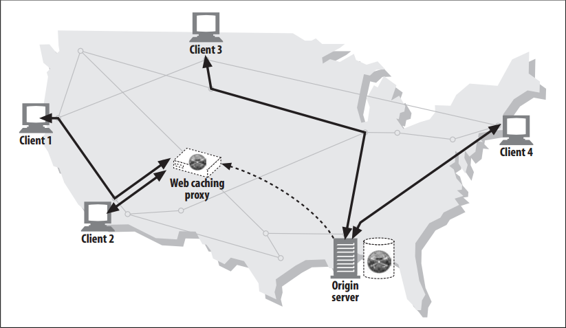

# Why Use Proxies

Proxy servers can do all kinds of nifty and useful things. They can improve security, enhance performance, and save money. And because proxy servers can see and touch all the passing HTTP traffic, proxies can monitor and modify the traffic to implement many useful value-added web services.

<!-- TOC -->

- [Why Use Proxies](#why-use-proxies)
    - [设计思想](#设计思想)
    - [抽象本质](#抽象本质)
    - [Child filter](#child-filter)
    - [Document access controller](#document-access-controller)
    - [Security firewall](#security-firewall)
    - [Web cache](#web-cache)
    - [Surrogate](#surrogate)
    - [Content router](#content-router)
    - [Transcoder](#transcoder)
    - [Anonymizer](#anonymizer)
    - [References](#references)

<!-- /TOC -->

## 设计思想

## 抽象本质

## Child filter
1. Elementary schools use filtering proxies to block access to adult content, while providing unhindered access to educational sites. 
2. As shown in figure below, the proxy might permit unrestricted access to educational content but forcibly deny access to sites that are inappropriate for children
    

## Document access controller
1. Proxy servers can be used to implement a uniform access-control strategy across a large set of web servers and web resources and to create an audit trail. This is useful in large corporate settings or other distributed bureaucracies.
2. All the access controls can be configured on the centralized proxy server, without requiring the access controls to be updated frequently on numerous web servers, of different makes and models, administered by different organizations.
    
3. In figure above, the centralized access-control proxy:
    * Permits client 1 to access news pages from server A without restriction
    * Gives client 2 unrestricted access to Internet content
    * Requires a password from client 3 before allowing access to server B

## Security firewall
1. Network security engineers often use proxy servers to enhance security. 
2. Proxy servers restrict which application-level protocols flow in and out of an organization, at a single secure point in the network. 
3. They also can provide hooks to scrutinize that traffic, as used by virus-eliminating web and email proxies
    

## Web cache
1. Proxy caches maintain local copies of popular documents and serve them on demand, reducing slow and costly Internet communication.
2. In figure below, clients 1 and 2 access object A from a nearby web cache, while clients 3 and 4 access the document from the origin server
    
    

## Surrogate
1. Proxies can masquerade as web servers. These so-called `surrogates` or `reverse proxies` receive real web server requests, but, unlike web servers, they may initiate communication with other servers to locate the requested content on demand.
2. Surrogates may be used to improve the performance of slow web servers for common content. In this configuration, the surrogates often are called **server accelerators**
    
3. Surrogates also can be used in conjunction with content-routing functionality to create distributed networks of on-demand replicated content.

## Content router
1. Proxy servers can act as “content routers”, vectoring requests to particular web servers based on Internet traffic conditions and type of content.
2. Content routers also can be used to implement various service-level offerings. For example, content routers can forward requests to nearby replica caches if the user or content provider has paid for higher performance, or route
HTTP requests through filtering proxies if the user has signed up for a filtering service. Many interesting services can be constructed using adaptive content-routing proxies
    

## Transcoder
1. Proxy servers can modify the body format of content before delivering it to clients. This transparent translation between data representations is called **transcoding**.
2. Some people distinguish “transcoding” and “translation”, defining “transcoding” as relatively simple conversions of the encoding of the data (e.g., lossless compression) and translation as more significant reformatting or semantic changes of the data. We use the term “transcoding” to mean any intermediary-based modification of the content..
3. Transcoding proxies can convert GIF images into JPEG images as they fly by, to reduce size. Images also can be shrunk and reduced in color intensity to be viewable on television sets. Likewise, text files can be compressed, and small text summaries of web pages can be generated for Internet-enabled pagers and smart phones. It’s even possible for proxies to convert documents into foreign languages on the fly!
4. Figure below shows a transcoding proxy that converts English text into Spanish text and also reformats HTML pages into simpler text that can displayed on the small screen of a mobile phone
    

## Anonymizer
1. Anonymizer proxies provide heightened privacy and anonymity, by actively removing identifying characteristics from HTTP messages (e.g., client IP address, `From` header, `Referer` header, cookies, URI session IDs).
2. In figure below, the anonymizing proxy makes the following changes to the user’s messages to increase privacy:
    * The user’s computer and OS type is removed from the `User-Agent` header.
    * The `From` header is removed to protect the user’s email address.
    * The `Referer` header is removed to obscure other sites the user has visited.
    * The `Cookie` headers are removed to eliminate profiling and identity data.
    

## References
* [*HTTP: the definitive guide*](https://book.douban.com/subject/1440226/)