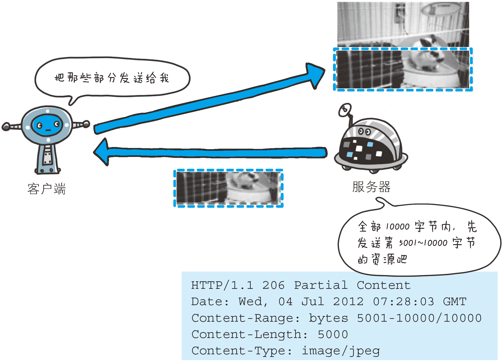

# Entity headers
Entity headers refer to headers that deal with the entity body. For instance,
entity headers can tell the type of the data in the entity body. For example,
the following `Content-Type` header lets the application know that the data is
an HTML document in the iso-latin-1 character set:
```
Content-Type: text/html; charset=iso-latin-1
```


## Allow
```
Allow: GET, HEAD
```
1. 用于通知客户端能够支持 Request-URI 指定资源的所有 HTTP 方法。
2. 当服务器接收到不支持的 HTTP 方法时，会以状态码`405 Method Not Allowed`作为响应返回
。与此同时，还会把所有能支持的 HTTP 方法写入首部字段 `Allow` 后返回。

```js
require('http').createServer((req, res)=>{
    if (req.method !== 'GET' && req.method !== 'HEAD'){
        res.writeHead(405, {
            'Allow': 'GET, HEAD',
        });
        res.end('Method Not Allowed');
    }
    else {
        res.writeHead(200);
        res.end();
    }

}).listen(3000);
```


## Content-Encoding
```
Content-Encoding: gzip
```
1. 告知客户端服务器对实体的主体部分选用的内容编码方式。
2. 内容编码是指在不丢失实体信息的前提下所进行的压缩。


## Content-Language
```
Content-Language: zh-CN
```
首部字段 Content-Language 会告知客户端，实体主体使用的自然语言（指中文或英文等语言）。


## Content-Length
```
Content-Length: 15000
```
1. 表明了实体主体部分的大小（单位是字节）。
2. 对实体主体进行内容编码传输时，不能再使用`Content-Length`首部字段。


## Content-Location
```
Content-Location: http://www.hackr.jp/index-ja.html
```
1. 给出与报文主体部分相对应的 URI。
2. 和首部字段`Location`不同，`Content-Location`表示的是报文主体返回资源对应的 URI。
3. 比如，对于使用首部字段`Accept-Language`的服务器驱动型请求，当返回的页面内容与实际请
求的对象不同时，首部字段`Content-Location`内会写明 URI。（访问 http://www.hackr.jp/
返回的对象却是 http://www.hackr.jp/index-ja.html 等类似情况）


## Content-MD5
```
Content-MD5: OGFkZDUwNGVhNGY3N2MxMDIwZmQ4NTBmY2IyTY==
```
1. 是一串由 MD5 算法生成的值，其目的在于检查报文主体在传输过程中是否保持完整，以及确认
传输到达。
2. 对报文主体执行 MD5 算法获得的 128 位二进制数，再通过 Base64 编码后将结果写入
`Content-MD5`字段值。由于 HTTP 首部无法记录二进制值，所以要通过 Base64 编码处理。
3. 为确保报文的有效性，作为接收方的客户端会对报文主体再执行一次相同的 MD5 算法。计算出
的值与字段值作比较后，即可判断出报文主体的准确性。
4. 采用这种方法，对内容上的偶发性改变是无从查证的，也无法检测出恶意篡改。其中一个原因在
于，内容如果能够被篡改，那么同时意味着`Content-MD5`也可重新计算然后被篡改。所以处在接
收阶段的客户端是无法意识到报文主体以及首部字段`Content-MD5`是已经被篡改过的。


## Content-Range
```
Content-Range: bytes 5001-10000/10000
```
1. 针对范围请求，返回响应时使用的首部字段`Content-Range`，能告知客户端作为响应返回的实
体的哪个部分符合范围请求。
2. 字段值以字节为单位，表示当前发送部分及整个实体大小。




## Content-Type
```
Content-Type: text/html; charset=UTF-8
```
1. 说明了实体主体内对象的媒体类型。和首部字段`Accept`一样，字段值用 type/subtype 形式
赋值。
2. 参数`charset`使用 iso-8859-1 或 euc-jp 等字符集进行赋值。


## References
* [HTTP: The Definitive Guide](https://book.douban.com/subject/1440226/)
