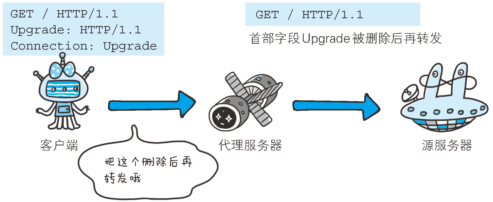
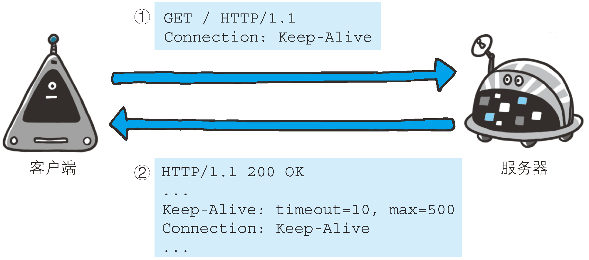
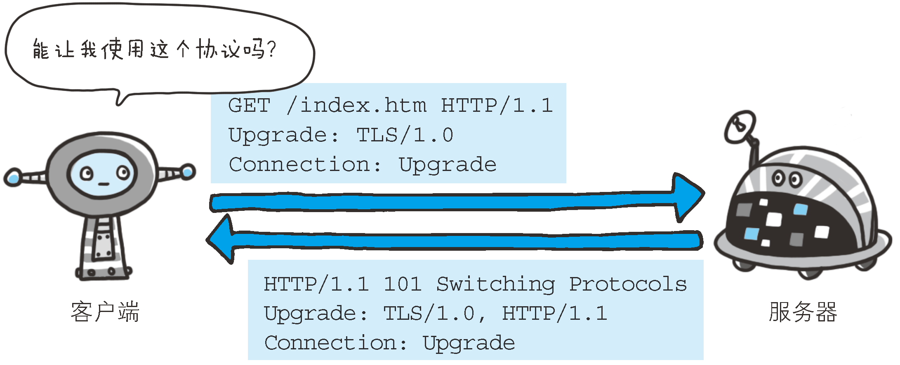
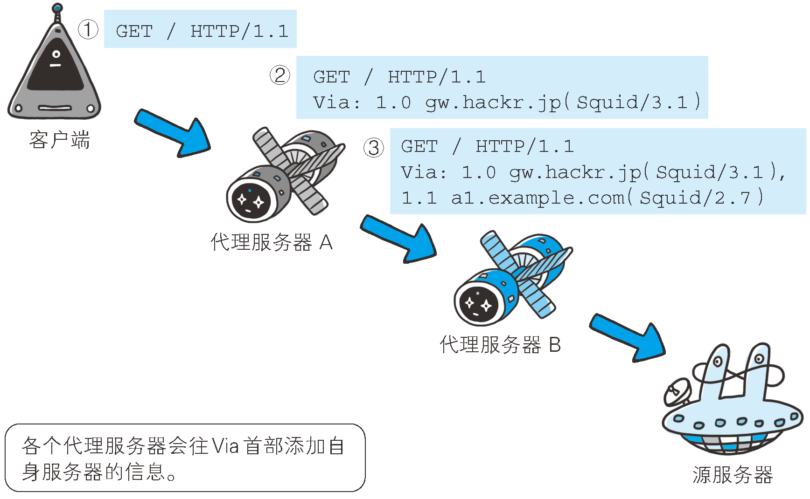

# General headers
These are generic headers used by both clients and servers. They serve general
purposes that are useful for clients, servers, and other applications to supply
to one another. For example, the `Date` header is a general-purpose header that
allows both sides to indicate the time and date at which the message was
constructed:
```
Date: Tue, 3 Oct 1974 02:16:00 GMT
```


## Cache-Control
详见`Theories\Protocal&Standard\InternetProtocolSuite\ApplicationLayer\HTTP\Cache\Cache.md`


## Connection
Connection 首部字段具备如下两个作用。
* 控制代理不再转发的首部字段
* 管理持久连接

### 控制代理不再转发的首部字段
在客户端发送请求和服务器返回响应内，使用`Connection`首部字段，可控制代理不再转发的首部
字段（即 Hop-by-hop 首部）：
```
Connection: 不再转发的首部字段名
```



### 管理持久连接
* HTTP/1.1 版本的默认连接都是持久连接。为此，客户端会在持久连接上连续发送请求。当服务器
端想明确断开连接时，则指定`Connection`首部字段的值为`Close`：
    ```
    Connection: close
    ```
* HTTP/1.1 之前的 HTTP 版本的默认连接都是非持久连接。为此，如果想在旧版本的 HTTP 协议
上维持持续连接，则需要指定`Connection`首部字段的值为`Keep-Alive`：
    ```
    Connection: Keep-Alive
    ```



## Date
首部字段`Date`表明创建 HTTP 报文的日期和时间。
```
Date: Tue, 03 Jul 2012 04:40:59 GMT
```


## Trailer
首部字段 Trailer 会事先说明在报文主体后记录了哪些首部字段。该首部字段可应用在 HTTP/1.1
版本[分块传输编码](https://en.wikipedia.org/wiki/Chunked_transfer_encoding)时。


## Transfer-Encoding
* 规定了传输报文主体时采用的编码方式。
* Specifies the form of encoding used to safely transfer the entity to the user.
* `Transfer-Encoding` is a hop-by-hop header, that is applied to a message
between two nodes, not to a resource itself. Each segment of a multi-node
connection can use different `Transfer-Encoding` values.


## Upgrade
1. The `Upgrade` general-header allows the client to specify what additional
communication protocols it supports and would like to use if the server finds it
appropriate to switch protocols.
2. The server MUST use the `Upgrade` header field within a `101` (Switching
Protocols) response to indicate which protocol(s) are being switched.
3. The `Upgrade` header field is intended to provide a simple mechanism for
transition from HTTP/1.1 to some other, incompatible protocol. It does so by
allowing the client to advertise its desire to use another protocol, such as a
later version of HTTP with a higher major version number, even though the
current request has been made using HTTP/1.1.
4. This eases the difficult transition between incompatible protocols by
allowing the client to initiate a request in the more commonly supported
protocol while indicating to the server that it would like to use a "better"
protocol if available (where "better" is determined by the server, possibly
according to the nature of the method and/or resource being requested).
5. The `Upgrade` header field only applies to switching application-layer
protocols upon the existing transport-layer connection. Upgrade cannot be used
to insist on a protocol change; its acceptance and use by the server is optional
. The capabilities and nature of the application-layer communication after the
protocol change is entirely dependent upon the new protocol chosen, although the
 first action after changing the protocol MUST be a response to the initial HTTP
 request containing the Upgrade header field.
6. The `Upgrade` header field only applies to the immediate connection.
Therefore, the upgrade keyword MUST be supplied within a `Connection` header
field whenever `Upgrade` is present in an HTTP/1.1 message.




## Via
1. 使用首部字段`Via`是为了追踪客户端与服务器之间的请求和响应报文的传输路径。
2. 报文经过代理或网关时，会先在首部字段`Via`中附加该服务器的信息，然后再进行转发。这个
做法和 traceroute 及电子邮件的 Received 首部的工作机制很类似。
3. 首部字段`Via`不仅用于追踪报文的转发，还可避免请求回环的发生。所以必须在经过代理时附
加该首部字段内容。



* 上图用例中，在经过代理服务器 A 时，`Via`首部附加了`1.0 gw.hackr.jp (Squid/3.1)`这
样的字符串值。行头的`1.0`是指接收请求的服务器上应用的 HTTP 协议版本。接下来经过代理服务
器 B 时亦是如此，在`Via`首部附加服务器信息，也可增加 1 个新的 `Via` 首部写入服务器信息。
* `Via`首部是为了追踪传输路径，所以经常会和`TRACE`方法一起使用。比如，代理服务器接收到
由`TRACE`方法发送过来的请求（其中` Max-Forwards: 0`）时，代理服务器就不能再转发该请求
了。这种情况下，代理服务器会将自身的信息附加到`Via`首部后，返回该请求的响应。


## References
* [RFC 2616](https://www.w3.org/Protocols/rfc2616/rfc2616-sec14.html)
* [MDN](https://developer.mozilla.org/en-US/docs/Web/HTTP/Headers)
* [HTTP: The Definitive Guide](https://book.douban.com/subject/1440226/)
