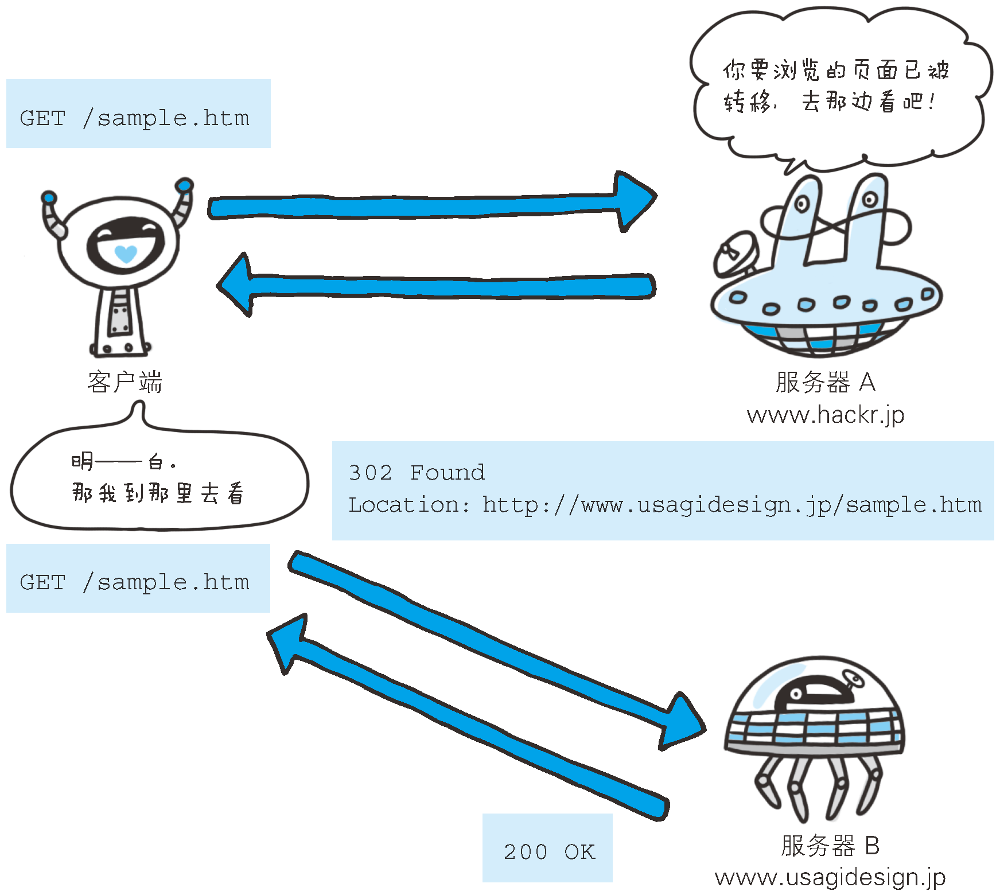

# Response headers
Response messages have their own set of headers that provide information to the
client (e.g., what type of server the client is talking to). For example, the
following Server header tells the client that it is talking to a Version 1.0
Tiki-Hut server:
```
Server: Tiki-Hut/1.0
```


## Accept-Ranges
1. 首部字段`Accept-Ranges`是用来告知客户端服务器是否能处理范围请求，以指定获取服务器端
某个部分的资源。
2. 可指定的字段值有两种，可处理范围请求时指定其为`bytes`，反之则指定其为`none`。


## Age
```
Age: 600
```
1. 告知客户端，源服务器在多久前创建了响应。字段值的单位为秒。
2. A cached response is "fresh" if its age does not exceed its freshness
lifetime.


## Location
```
Location: http://www.usagidesign.jp/sample.html
```
1. 使用首部字段`Location`可以将响应接收方引导至某个与请求 URI 位置不同的资源。
2. 基本上，该字段会配合`3xx ：Redirection`的响应，提供重定向的 URI。
3. 几乎所有的浏览器在接收到包含首部字段`Location`的响应后，都会强制性地尝试对已提示的重
定向资源的访问。
    ```js
    // 对`http://localhost:3000`的访问将跳转到`http://www.douban.com`
    require('http').createServer((req, res)=>{
        if (req.url !== '/favicon.ico'){
            res.writeHead(302, {
                'Location': 'http://www.douban.com',
            });
        }
        res.end();
    }).listen(3000);
    ```




## Retry-After
```
Retry-After: 120
```
1. 告知客户端应该在多久之后再次发送请求。主要配合状态码`503 Service Unavailabl`响应，
 或`3xx Redirect`响应一起使用。
2. 字段值可以指定为具体的日期时间（Wed, 04 Jul 2012 06：34：24 GMT 等格式），也可以是
创建响应后的秒数。至少对于浏览器来说，并不会在指定的时间到达后重新访问。

```js
require('http').createServer((req, res)=>{
    if (req.url !== '/favicon.ico'){
        res.writeHead(503, 'Service Unavailabl', {
            'Retry-After': 3600,
            'Content-Type': 'text/plain; charset=utf-8',
        });
    }
    res.end('服务器暂时无法访问，请一小时后再试');
}).listen(3000);
```


## Server
```
Server: Apache/2.2.6 (Unix) PHP/5.2.5
```
1. 首部字段`Server`告知客户端当前服务器上安装的 HTTP 服务器应用程序的信息。
2. 不单单会标出服务器上的软件应用名称，还有可能包括版本号和安装时启用的可选项。


## References
* [HTTP: The Definitive Guide](https://book.douban.com/subject/1440226/)
