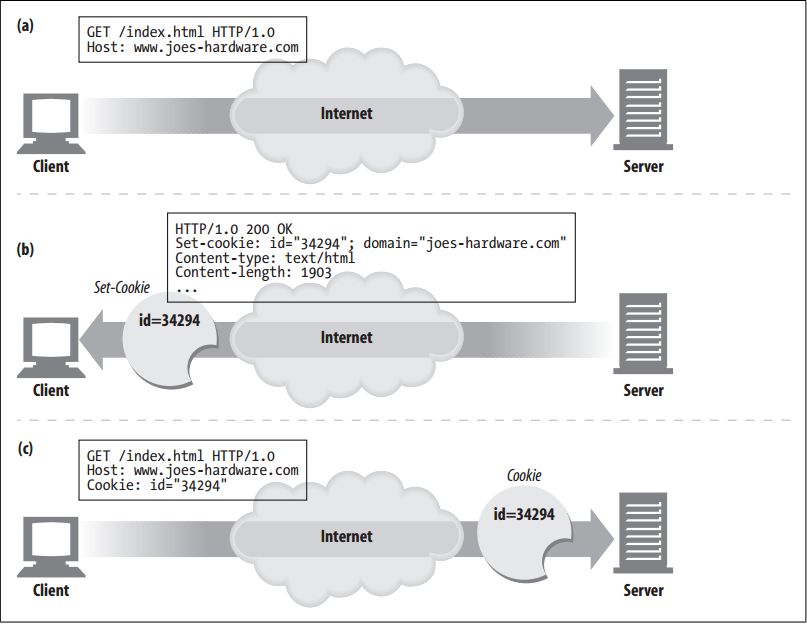
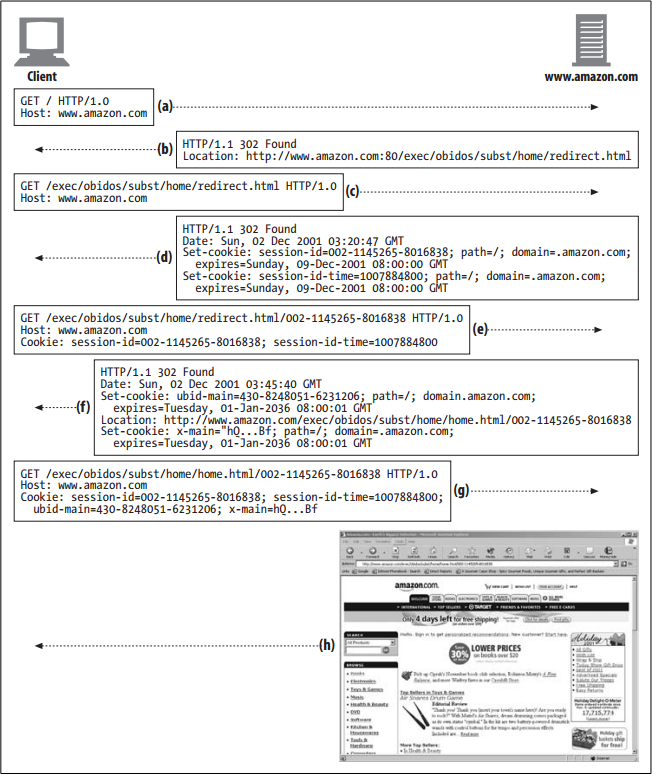

# Cookies


<!-- TOC -->

- [Cookies](#cookies)
    - [设计思想](#%E8%AE%BE%E8%AE%A1%E6%80%9D%E6%83%B3)
    - [抽象本质](#%E6%8A%BD%E8%B1%A1%E6%9C%AC%E8%B4%A8)
    - [Summary](#summary)
    - [Types of Cookies](#types-of-cookies)
    - [How Cookies Work](#how-cookies-work)
    - [Cookie Jar: Client-Side State](#cookie-jar-client-side-state)
    - [Different Cookies for Different Sites](#different-cookies-for-different-sites)
        - [第三方 cookie](#%E7%AC%AC%E4%B8%89%E6%96%B9-cookie)
        - [Cookie Domain attribute](#cookie-domain-attribute)
        - [Cookie Path attribute](#cookie-path-attribute)
    - [Cookies and Session Tracking](#cookies-and-session-tracking)
    - [Cookies and Caching](#cookies-and-caching)
        - [Mark documents uncacheable if they are](#mark-documents-uncacheable-if-they-are)
        - [Be cautious about caching Set-Cookie headers](#be-cautious-about-caching-set-cookie-headers)
        - [Be cautious about requests with Cookie headers](#be-cautious-about-requests-with-cookie-headers)
    - [References](#references)

<!-- /TOC -->


## 设计思想


## 抽象本质


## Summary


## Types of Cookies
1. You can classify cookies broadly into two types: session cookies and persistent cookies. 
2. A session cookie is a temporary cookie that keeps track of settings and preferences as a user navigates a site. A session cookie is deleted when the user exits the browser. 
3. Persistent cookies can live longer; they are stored on disk and survive browser exits and computer restarts. Persistent cookies often are used to retain a configuration profile or login name for a site that a user visits periodically.
4. The only difference between session cookies and persistent cookies is when they expire. As we will see later, a cookie is a session cookie if its `Discard` parameter is set, or if there is no `Expires` or `Max-Age` parameter indicating an extended expiration time.


## How Cookies Work
1. Cookies are like “Hello, My Name Is” stickers stuck onto users by servers. When a user visits a web site, the web site can read all the stickers attached to the user by that server.
2. The first time the user visits a web site, the web server doesn’t know anything about the user. The web server expects that this same user will return again, so it wants to “slap” a unique cookie onto the user so it can identify this user in the future. 
    
3. The cookie contains an arbitrary list of `name=value` information, and it is attached to the user using the `Set-Cookie` HTTP response (extension) headers.
4. Cookies can contain any information, but they often contain just a unique identification number, generated by the server for tracking purposes. 
5. For example, in figure above (b), the server slaps onto the user a cookie that says `id="34294"`. The server can use this number to look up database information that the server accumulates for its visitors (purchase history, address information, etc.).
6. However, cookies are not restricted to just ID numbers. Many web servers choose to keep information directly in the cookies. For example: `Cookie: name="Brian Totty"; phone="555-1212"`. The browser remembers the cookie contents sent back from the server in `Set-Cookie` headers, storing the set of cookies in a browser cookie database. 
7. When the user returns to the same site in the future (igure above (c)), the browser will select those cookies
slapped onto the user by that server and pass them back in a `Cookie` request header.


## Cookie Jar: Client-Side State
1. The basic idea of cookies is to let the browser accumulate a set of server-specific information, and provide this information back to the server each time you visit. 
2. Because the browser is responsible for storing the cookie information, this system is called **client-side state**. The official name for the cookie specification is the HTTP State Management Mechanism.
3. Different browsers store cookies in different ways. 


## Different Cookies for Different Sites
1. A browser can have hundreds or thousands of cookies in its internal cookie jar, but browsers don’t send every cookie to every site. In fact, they typically send only two or three cookies to each site. Here’s why:
    * Moving all those cookie bytes would dramatically slow performance. Browsers would actually be moving more cookie bytes than real content bytes!
    * Most of these cookies would just be unrecognizable gibberish for most sites, because they contain server-specific name/value pairs.
    * Sending all cookies to all sites would create a potential privacy concern, with sites you don’t trust getting information you intended only for another site.
2. In general, a browser sends to a server only those cookies that the server generated. Cookies generated by `joes-hardware.com` are sent to `joes-hardware.com` and not to `bobs-books.com` or `marys-movies.com`.

### 第三方 cookie
1. Many web sites contract with third-party vendors to manage advertisements. These advertisements are made to look like they are integral parts of the web site and do push persistent cookies. 
2. When the user goes to a different web site serviced by the same advertisement company, the persistent cookie set earlier is sent back again by the browser (because the domains match). 
3. A marketing company could use this technique, combined with the `Referer` header, to potentially build an exhaustive data set of user profiles and browsing habits. 
4. Modern browsers allow you to configure privacy settings to restrict third-party cookies.

### Cookie `Domain` attribute
1. A server generating a cookie can control which sites get to see that cookie by adding a `Domain` attribute to the `Set-Cookie` response header. 
2. For example, the following HTTP response header tells the browser to send the cookie `user=“mary17”` to any site in the domain `.airtravelbargains.com`:
    ```
    Set-cookie: user="mary17"; domain="airtravelbargains.com"
    ```
3. If the user visits `www.airtravelbargains.com`, `specials.airtravelbargains.com`, or any site ending in `.airtravelbargains.com`, the following `Cookie` header will be issued:
    ```
    Cookie: user="mary17"
    ```

### Cookie `Path` attribute
1. The cookie specification even lets you associate cookies with portions of web sites. This is done using the `Path` attribute, which indicates the URL path prefix where each cookie is valid.
2. For example, one web server might be shared between two organizations, each having separate cookies. The site `www.airtravelbargains.com` might devote part of its web site to auto rentals—say, `http://www.airtravelbargains.com/autos/`—using a separate cookie to keep track of a user’s preferred car size. 
3. A special auto-rental cookie might be generated like this:
    ```
    Set-cookie: pref=compact; domain="airtravelbargains.com"; path=/autos/
    ```
4. If the user goes to `http://www.airtravelbargains.com/specials.html`, she will get only this cookie:
    ```
    Cookie: user="mary17"
    ```
5. But if she goes to `http://www.airtravelbargains.com/autos/cheapo/index.html`, she will get both of these cookies:
    ```
    Cookie: user="mary17"
    Cookie: pref=compact
    ```
6. So, cookies are pieces of state, slapped onto the client by the servers, maintained by the clients, and sent back to only those sites that are appropriate.


## Cookies and Session Tracking
1. Cookies can be used to track users as they make multiple transactions to a web site. 
2. E-commerce web sites use session cookies to keep track of users’ shopping carts as they browse. Let’s take the example of the popular shopping site `Amazon.com`.
3. When you type `http://www.amazon.com` into your browser, you start a chain of transactions where the web server attaches identification information through a series of redirects, URL rewrites, and cookie setting.
4. Figure below shows a transaction sequence captured from an `Amazon.com` visit:
    
    
    1. (a)—Browser requests `Amazon.com` root page for the first time.
    2. (b)—Server redirects the client to a URL for the e-commerce software.
    3. (c)—Client makes a request to the redirected URL.
    4. (d)—Server slaps two session cookies on the response and redirects the user to another URL, so the client will request again with these cookies attached. This new URL is a fat URL, meaning that some state is embedded into the URL. If the client has cookies disabled, some basic identification can still be done as long as the user follows the `Amazon.com`-generated fat URL links and doesn’t leave the site.
    5. (e)—Client requests the new URL, but now passes the two attached cookies.
    6. (f)—Server redirects to the `home.html` page and attaches two more cookies.
    7. (g)—Client fetches the `home.html` page and passes all four cookies.
    8. (h)—Server serves back the content.


## Cookies and Caching
1. You have to be careful when caching documents that are involved with cookie transactions. You don’t want to assign one user some past user’s cookie or, worse, show one user the contents of someone else’s personalized document.
2. The rules for cookies and caching are not well established. Here are some guiding principles for dealing with caches:

### Mark documents uncacheable if they are
1. The document owner knows best if a document is uncacheable. Explicitly mark documents uncacheable if they are — specifically, use `Cache-Control: no-cache=“Set-Cookie”` if the document is cacheable except for the `Set-Cookie`
header. 
2. The other, more general practice of using `Cache-Control: public` for documents that are cacheable promotes bandwidth savings in the Web.

### Be cautious about caching `Set-Cookie` headers
1. If a response has a `Set-Cookie` header, you can cache the body (unless told otherwise), but you should be extra cautious about caching the `Set-Cookie` header. If you send the same `Set-Cookie` header to multiple users, you may be defeating user targeting.
2. Some caches delete the `Set-Cookie` header before storing a response in the cache, but that also can cause problems, because clients served from the cache will no longer get cookies slapped on them that they normally would without the cache.
3. This situation can be improved by forcing the cache to revalidate every request with the origin server and merging any returned `Set-Cookie` headers with the client response. 
4. The origin server can dictate such revalidations by adding this header to the cached copy:
    ```
    Cache-Control: must-revalidate, max-age=0
    ```
5. More conservative caches may refuse to cache any response that has a `Set-Cookie` header, even though the content may actually be cacheable. Some caches allow modes when Set-Cookied images are cached, but not text.

### Be cautious about requests with `Cookie` headers
1. When a request arrives with a `Cookie` header, it provides a hint that the resulting content might be personalized. 
2. Personalized content must be flagged uncacheable, but some servers may erroneously not mark this content as uncacheable.
3. Conservative caches may choose not to cache any document that comes in response to a request with a `Cookie` header. 
4. And again, some caches allow modes when Cookied images are cached, but not text. 
5. The more accepted policy is to cache images with `Cookie` headers, with the expiration time set to zero, thus forcing a revalidate every time.


## References
* [*HTTP: the definitive guide*](https://book.douban.com/subject/1440226/)