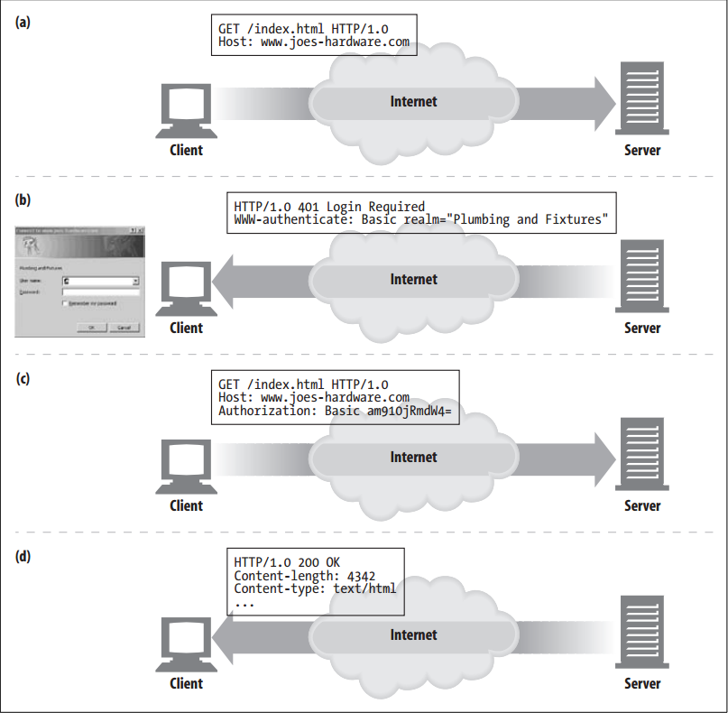

# User Login

<!-- TOC -->

- [User Login](#user-login)
    - [设计思想](#设计思想)
    - [抽象本质](#抽象本质)
    - [Summary](#summary)
    - [机制](#机制)
    - [Weaknesses](#weaknesses)
    - [References](#references)

<!-- /TOC -->

## 设计思想

## 抽象本质

## Summary
1. Rather than passively trying to guess the identity of a user from his IP address, a web server can explicitly ask the user who he is by requiring him to authenticate (log in) with a username and password.
2. To help make web site logins easier, HTTP includes a built-in mechanism to pass username information to web sites, using the `WWW-Authenticate` and `Authorization` headers. 
3. Once logged in, the browsers continually send this login information with each request to the site, so the information is always available. 

## 机制
1. If a server wants a user to register before providing access to the site, it can send back an HTTP `401 Login Required` response code to the browser. 
2. The browser will then display a login dialog box and supply the information in the next request to the browser, using the `Authorization` header
    
3. Here’s what’s happening in this figure:
    1. In (a), a browser makes a request from the `www.joes-hardware.com` site.
    2. The site doesn’t know the identity of the user, so in (b), the server requests a login by returning the `401 Login Required` HTTP response code and adds the `WWW-Authenticate` header. This causes the browser to pop up a login dialog box.
    3. Once the user enters a username and a password (to sanity check his identity), the browser repeats the original request. This time it adds an `Authorization` header, specifying the username and password. The username and password are scrambled, to hide them from casual or accidental network observers. The exchange must happen over an HTTPS (TLS) connection to be secure.
    4. Now, the server is aware of the user’s identity.
    5. For future requests, the browser will automatically issue the stored username and password when asked and will often even send it to the site when not asked. This makes it possible to log in once to a site and have your identity maintained through the session, by having the browser send the `Authorization` header as a token of your identity on each request to the server.

## Weaknesses
1. However, logging in to web sites is tedious. As Fred browses from site to site, he’ll need to log in for each site. 
2. To make matters worse, it is likely that poor Fred will need to remember different usernames and passwords for different sites. His favorite username, “fred”, will already have been chosen by someone else by the time he visits many sites, and some sites will have different rules about the length and composition of usernames and passwords.

## References
* [*HTTP: the definitive guide*](https://book.douban.com/subject/1440226/)